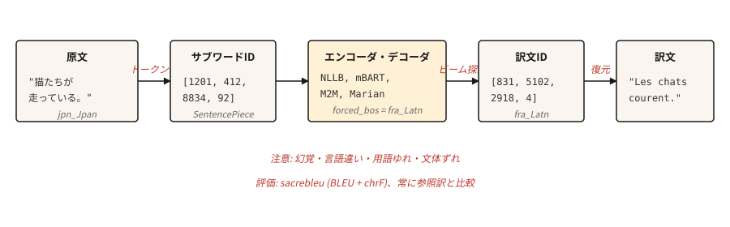

# Makine Çevirisi

> Çeviri, NLP araştırmalarının otuz yıldır bedelini ödeyen bir görevdir ve şimdi de ödemeye devam etmektedir.

**Tür:** Yapım
**Diller:** Python
**Önkoşullar:** Aşama 5 · 10 (Attention Mechanism), Aşama 5 · 04 (GloVe, FastText, Alt Kelime)
**Süre:** ~75 dakika

## Sorun

Bir model, bir dildeki cümleyi okur ve başka bir dildeki cümleyi üretir. Uzunluk değişir. Kelime sırası değişir. Bazı kaynak kelimeler birden fazla hedef kelimeyle eşleşir ve bunun tersi de geçerlidir. Deyimler birebir eşlemeyi reddeder. Fransızca'da "seni özledim" "tu me manques" anlamına gelir - kelimenin tam anlamıyla "benim için eksiksin." Hiçbir kelime düzeyinde hizalama bundan sağ çıkamaz.

Makine çevirisi, NLP'yi kodlayıcı-kod çözücüleri, dikkati, transformer'leri ve sonunda tüm Yüksek Lisans paradigmasını icat etmeye zorlayan görevdir. İleriye doğru atılan her adım, çeviri kalitesinin ölçülebilir olması ve insan ile makine arasındaki uçurumun inatçı olması nedeniyle gerçekleşti.

Bu ders tarih dersini atlar ve 2026'nın çalışma hattını öğretir: önceden eğitilmiş çok dilli kodlayıcı-kod çözücü (NLLB-200 veya mBART), tokenizasyon alt kelimesi, ışın arama, BLEU ve chrF değerlendirmesi ve hala üretime yakalanmadan gönderilen bir avuç arıza modu.

## Konsept



Modern MT, paralel metin üzerinde eğitilmiş bir transformer kodlayıcı-kod çözücüdür. Kodlayıcı, kaynağı kendi dilinin tokenizasyonunda okur. Kod çözücü, kodlayıcının çapraz dikkat yoluyla çıktısını kullanarak her seferinde bir alt kelime olmak üzere hedefi üretir (ders 10). Kod çözme, açgözlü kod çözme tuzağından kaçınmak için ışın aramayı kullanır. Çıktı detoken'ye dönüştürülür, gerçek dışı hale getirilir ve bir referansa göre puanlanır.

Üç operasyonel seçenek, gerçek dünyadaki MT kalitesini artırır.

- **Tokenizer.** Karma dilli bir külliyatla eğitilmiş SentencePiece BPE. Diller arasında paylaşılan kelime dağarcığı, NLLB'de sıfır atış çiftlerini mümkün kılan şeydir.
- **Model boyutu.** NLLB-200 damıtılmış 600M, dizüstü bilgisayara sığar. NLLB-200 3.3B, yayınlanan üretim varsayılanıdır. 54.5B araştırma tavanıdır.
- **Kod çözme.** Genel içerik için ışın genişliği 4-5. Çıkışın çok kısa olmasını önlemek için uzunluk cezası. Terminoloji tutarlılığına ihtiyaç duyduğunuzda kısıtlı kod çözme.

```figure
seq2seq-alignment
```

## İnşa Et

### Adım 1: önceden eğitilmiş bir MT çağrısı

```python
from transformers import AutoTokenizer, AutoModelForSeq2SeqLM

model_id = "facebook/nllb-200-distilled-600M"
tok = AutoTokenizer.from_pretrained(model_id, src_lang="eng_Latn")
model = AutoModelForSeq2SeqLM.from_pretrained(model_id)

src = "The cats are running."
inputs = tok(src, return_tensors="pt")

out = model.generate(
    **inputs,
    forced_bos_token_id=tok.convert_tokens_to_ids("fra_Latn"),
    num_beams=5,
    length_penalty=1.0,
    max_new_tokens=64,
)
print(tok.batch_decode(out, skip_special_tokens=True)[0])
```

```text
Les chats courent.
```

Burada üç şey önemli. `src_lang`, tokenizer'ye hangi komut dosyasının ve segmentasyonun uygulanacağını söyler. `forced_bos_token_id` kod çözücüye hangi dili oluşturacağını söyler. Her ikisi de NLLB'ye özgü hilelerdir; mBART ve M2M-100 kendi kurallarını kullanır ve birbirlerinin yerine kullanılamazlar.

### Adım 2: BLEU ve chrF

BLEU, çıktı ve referans arasındaki n-gram örtüşmeyi ölçer. Dört referans n-gram boyutu (1-4), hassasiyetin geometrik ortalaması, çok kısa çıktı için kısalık cezası. Skor [0, 100] cinsindendir. Yaygın olarak kullanılır. Yorumlaması sinir bozucu: 30 BLEU "kullanılabilir"; 40 "iyi"dir; 50 "istisnai"dir; 1 BLEU'nun altındaki farklar gürültüdür.

chrF, karakter düzeyinde F puanını ölçer. BLEU'nun eşleşmeleri eksik saydığı morfolojik açıdan zengin dillere karşı daha duyarlıdır. Genellikle BLEU ile birlikte rapor edilir.

```python
import sacrebleu

hypotheses = ["Les chats courent."]
references = [["Les chats courent."]]

bleu = sacrebleu.corpus_bleu(hypotheses, references)
chrf = sacrebleu.corpus_chrf(hypotheses, references)
print(f"BLEU: {bleu.score:.1f}  chrF: {chrf.score:.1f}")
```

Her zaman `sacrebleu` kullanın. Puanların makaleler arasında karşılaştırılabilir olması için tokenizasyonunu normalleştirir. Kendi BLEU hesaplamanızı yuvarlamak, benchmark'lerin ne kadar yanıltıcı olduğunu gösterir.

### Üç aşamalı değerlendirme hiyerarşisi (2026)

Modern makine çevirisi değerlendirmesi üç tamamlayıcı metrik ailesini kullanır. En az iki tane ile gönderin.

- **Sezgisel** (BLEU, chrF). Hızlıdır, referansa dayalıdır, yorumlanabilirdir, ifadelere duyarsızdır. Eski karşılaştırma ve regresyon tespiti için kullanın.
- **Öğrenildi** (COMET, BLEURT, BERTScore). İnsan muhakemesi üzerine eğitilmiş sinir modelleri; Çevirinin anlamsal benzerliğini kaynak ve referansla karşılaştırır. COMET, 2023'ten bu yana MT araştırmalarıyla en yüksek ilişkiye sahiptir ve kalitenin önemli olduğu 2026 üretim varsayılanıdır.
- **Yargıç olarak yüksek lisans** (referanssız). Prompt Çevirileri akıcılık, yeterlilik, üslup ve kültürel uygunluk açısından puanlayan geniş bir model. Yargıç olarak GPT-4, değerlendirme listesi iyi tasarlandığında ~%80 oranında insan mutabakatına uyuyor. Referansın bulunmadığı açık uçlu içerik için kullanın.

Pratik 2026 yığını: BLEU ve chrF için `sacrebleu`, COMET için `unbabel-comet` ve insana dönük son sinyal için bir prompted LLM. Üretim verilerine güvenmeden önce her ölçümü 50-100 insan etiketli örneğe göre kalibre edin.

Referanssız metrikler (COMET-QE, BLEURT-QE, LLM-yargıç), referanssız çevirileri değerlendirmenize olanak tanır; bu, referans çevirilerin bulunmadığı uzun kuyruklu dil çiftleri için önemlidir.

### 3. Adım: Üretimde ne bozulur?

Yukarıdaki çalışma hattı, zamanın %80'inde akıcı bir şekilde çeviri yapacak ve geri kalan %20'sinde sessizce başarısız olacaktır. Adlandırılmış arıza modları:

- **Halüsinasyon.** Model, kaynakta olmayan içeriği icat eder. Alışılmadık alan sözlüğünde yaygındır. Belirti: Çıktı akıcı ancak kaynağın belirtmediği gerçekleri iddia ediyor. Azaltma: etki alanı terimlerinde kısıtlı kod çözme, düzenlenmiş içerik üzerinde insan incelemesi, çıktının girdiden çok daha uzun süre izlenmesi.
- **Hedef dışı nesil.** Model yanlış dile çevriliyor. NLLB, nadir dil çiftlerinde şaşırtıcı bir şekilde buna eğilimlidir. Azaltma: `forced_bos_token_id`'yi doğrulayın ve her zaman çıktıda bir dil kimliği modeli kontrolüyle kodu çözün.
- **Terminoloji sapması.** "Kaydol", belge 1'de "s'inscrire" ve belge 2'de "creer un compte" haline gelir. Kullanıcı arayüzü metni ve kullanıcıya yönelik dizeler için tutarlılık, ham kaliteden daha önemlidir. Azaltma: sözlükle sınırlandırılmış kod çözme veya sözlük sonrası düzenleme.
- **Biçimsel uyumsuzluk.** Fransızca "tu" ve "vous", Japonca nezaket düzeyleri. Model, eğitimde hangisi daha yaygınsa onu seçer. Müşteriye yönelik içerik için bu genellikle yanlıştır. Azaltma: Model destekliyorsa token formalitesine sahip prompt öneki veya yalnızca resmi korpora üzerinde küçük bir modele ince ayar yapın.
- **Kısa girişte uzunluk patlaması.** Çok kısa giriş cümleleri genellikle aşırı uzun çevirilere neden olur çünkü uzunluk cezası ~5 kaynak token'nin altına düşer. Azaltma: kaynak uzunluğuyla orantılı kesin maksimum uzunluk sınırı.

### Adım 4: Bir alan adı için fine-tuning

Önceden eğitilmiş modeller geneldir. Yasal, tıbbi veya oyun diyalogu çevirisi, alan paralel verileri üzerinde fine-tuning'den ölçülebilir şekilde faydalanır. Tarif egzotik değil:

```python
from transformers import Trainer, TrainingArguments
from datasets import Dataset

pairs = [
    {"src": "The defendant pleaded guilty.", "tgt": "L'accusé a plaidé coupable."},
]

ds = Dataset.from_list(pairs)


def preprocess(ex):
    return tok(
        ex["src"],
        text_target=ex["tgt"],
        truncation=True,
        max_length=128,
        padding="max_length",
    )


ds = ds.map(preprocess, remove_columns=["src", "tgt"])

args = TrainingArguments(output_dir="out", per_device_train_batch_size=4, num_train_epochs=3, learning_rate=3e-5)
Trainer(model=model, args=args, train_dataset=ds).train()
```

Birkaç bin yüksek kaliteli paralel örnek, birkaç yüz bin gürültülü ağdan kazınmış örneği yener. Eğitim verilerinin kalitesi, üretimin en büyük kaldıracıdır.

## Kullan onu

MT için 2026 üretim yığını:

| Kullanım örneği | Önerilen başlangıç ​​noktası |
|---------|---------------------------|
| Herhangi birinden herhangi birine, 200 dil | `facebook/nllb-200-distilled-600M` (dizüstü bilgisayar) veya `nllb-200-3.3B` (üretim) |
| İngilizce merkezli, yüksek kaliteli, 50 dil | `facebook/mbart-large-50-many-to-many-mmt` |
| Kısa vadede, ucuz inference, İngilizce-Fransızca/Almanca/İspanyolca | Helsinki-NLP / Marian modelleri |
| Gecikme açısından kritik tarayıcı tarafı | ONNX-kuantumlanmış Marian (~50 MB) |
| Maksimum kalite, ödemeye hazır | GPT-4 / Claude / Gemini prompts çevirisiyle |

Yüksek Lisans'lar artık 2026 itibarıyla çeşitli dil çiftlerinde, özellikle de deyimsel içerik ve uzun bağlam konusunda uzmanlaşmış makine çevirisi modellerinden daha iyi performans gösteriyor. Takas token maliyet ve gecikme başına yapılır. Bağlam uzunluğu, biçimsel tutarlılık veya prompting aracılığıyla etki alanı uyarlaması, verimden daha önemli olduğunda bir Yüksek Lisans (LLM) seçin.

## Gönderin

`outputs/skill-mt-evaluator.md` olarak kaydet:

```markdown
---
name: mt-evaluator
description: Evaluate a machine translation output for shipping.
version: 1.0.0
phase: 5
lesson: 11
tags: [nlp, translation, evaluation]
---

Given a source text and a candidate translation, output:

1. Automatic score estimate. BLEU and chrF ranges you would expect. State whether a reference is available.
2. Five-point human-verifiable check list: (a) content preservation (no hallucinations), (b) correct language, (c) register / formality match, (d) terminology consistency with glossary if provided, (e) no truncation or length explosion.
3. One domain-specific issue to probe. E.g., for legal: named entities and statute citations. For medical: drug names and dosages. For UI: placeholder variables `{name}`.
4. Confidence flag. "Ship" / "Ship with review" / "Do not ship". Tie to the severity of issues found in step 2.

Refuse to ship a translation without a language-ID check on output. Refuse to evaluate without a reference unless the user explicitly opts in to reference-free scoring (COMET-QE, BLEURT-QE). Flag any content over 1000 tokens as likely needing chunked translation.
```

## Egzersizler

1. **Kolay.** `nllb-200-distilled-600M` kullanarak 5 cümlelik İngilizce paragrafı Fransızcaya ve tekrar İngilizceye çevirin. Gidiş-dönüş yolculuğunun orijinaline ne kadar yakın olduğunu ölçün. Kelime seçimi kaymasıyla anlamsal korumayı görmelisiniz.
2. **Orta.** `fasttext lid.176` veya `langdetect` kullanarak çeviri çıktılarına dil kimliği denetimi uygulayın. Hedef dışı nesillerin geri dönmeden yakalanması için MT çağrısına entegre edin.
3. **Zor.** `nllb-200-distilled-600M`'de seçtiğiniz 5.000 çift alan adı kümesinde ince ayar yapın. fine-tuning öncesinde ve sonrasında uzatılmış bir sette BLEU'yu ölçün. Hangi tür cümlelerin geliştiğini, hangilerinin gerilediğini bildirin.

## Anahtar Terimler

| Dönem | İnsanlar ne diyor | Aslında ne anlama geliyor |
|------|-----------------|-----------------------|
| BLEU | Çeviri puanı | Kısalık cezasıyla birlikte N gram hassasiyeti. [0, 100]. |
| chrF | Karakter F-puanı | Karakter düzeyinde F puanı. Morfolojik açıdan zengin diller için daha duyarlıdır. |
| NMT | Sinirsel MT | Transformer paralel metin üzerinde eğitilmiş kodlayıcı-kod çözücü. 2017+ varsayılanı. |
| NLLB | Geride Dil Kalmadı | Meta'nın 200 dilli MT model ailesi. |
| Kısıtlı kod çözme | Kontrollü çıktı | Belirli token'leri veya n-gramları çıktıda görünmeye/görünmemeye zorlayın. |
| Halüsinasyon | İçerik icat edildi | Kaynak tarafından desteklenmeyen model çıktısı. |

## Daha Fazla Okuma

- [Costa-jussà ve ark. (2022). Geride Dil Kalmadı: İnsan Odaklı Makine Çevirisini Ölçeklendirmek](https://arxiv.org/abs/2207.04672) — NLLB makalesi.
- [Post (2018). BLEU Puanlarının Raporlanmasında Netlik Çağrısı](https://aclanthology.org/W18-6319/) — `sacrebleu` neden BLEU'yu raporlamanın tek doğru yoludur.
- [Popović (2015). chrF: otomatik MT değerlendirmesi için karakter n-gram F puanı](https://aclanthology.org/W15-3049/) — chrF kağıdı.
- [Sarılma Yüzü MT kılavuzu](https://huggingface.co/docs/transformers/tasks/translation) — pratik fine-tuning izlenecek yol.
