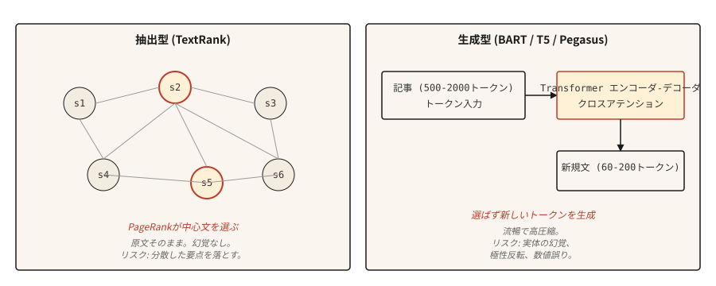

# Metin Özetleme

> Çıkarım sistemleri size belgenin ne söylediğini söyler. Soyut sistemler size yazarın ne demek istediğini söyler. Farklı görevler, farklı tuzaklar.

**Tür:** Yapım
**Diller:** Python
**Önkoşullar:** Aşama 5 · 02 (BoW + TF-IDF), Aşama 5 · 11 (Makine Çevirisi)
**Süre:** ~75 dakika

## Sorun

Feed'inize 2.000 kelimelik bir haber makalesi düşüyor. Onu yakalamak için 120 kelimeye ihtiyacınız var. Makaleden en önemli üç cümleyi seçebilir (özetleyici) veya içeriği kendi kelimelerinizle yeniden yazabilirsiniz (soyutlayıcı). Her ikisine de özetleme denir. Bunlar tamamen farklı problemlerdir.

Çıkarımsal özetleme bir sıralama problemidir. Her cümleyi puanlayın, en üstteki `k`'yi döndürün. Çıktı her zaman dilbilgiseldir çünkü kelimesi kelimesine kaldırılmıştır. Risk, makale boyunca dağıtılan içeriğin eksik olmasıdır.

Soyut özetleme bir nesil sorunudur. Bir transformer, girişe göre koşullandırılan yeni metin üretir. Çıktı akıcı ve sıkıştırıcıdır ancak kaynakta olmayan gerçekleri halüsinasyona uğratabilir. Risk kendinden emin bir imalattır.

Bu ders her ikisini de, her birinin sahip olduğu başarısızlık moduyla birlikte inşa eder.

## Konsept



**Çıkartıcı.** Makaleyi, düğümlerin cümleler ve kenarların benzerlikler olduğu bir grafik olarak ele alın. Cümleleri diğer her şeyle ne kadar bağlantılı olduklarına göre puanlamak için grafik üzerinde PageRank'i (veya buna benzer bir şeyi) çalıştırın. En yüksek puanı alan cümleler özettir. Kanonik uygulama **TextRank**'tir (Mihalcea ve Tarau, 2004).

**Soyut.** Belge özeti çiftlerinde transformer kodlayıcı-kod çözücüye (BART, T5, Pegasus) ince ayar yapın. inference'de model belgeyi okur ve çapraz dikkat yoluyla token-by-token özetini oluşturur. Pegasus özellikle, çok fazla fine-tuning gerektirmeden özetleme konusunda mükemmel kılan bir boşluk cümlesi ön eğitim hedefi kullanıyor.

**ROUGE** (Gisting Evaluation için Geri Çağırma Odaklı Yedek Çalışma) ile değerlendirme. ROUGE-1 ve ROUGE-2 puanları unigram ve bigram örtüşüyor. ROUGE-L en uzun ortak alt diziyi puanlar. Daha yüksek daha iyidir ancak 40 ROUGE-L "iyi" ve 50 "olağanüstü"dür. Her gazete üçünü de rapor ediyor. `rouge-score` paketini kullanın.

## İnşa Et

### Adım 1: TextRank (çıkarıcı)

```python
import math
import re
from collections import Counter


def sentence_split(text):
    return re.split(r"(?<=[.!?])\s+", text.strip())


def similarity(s1, s2):
    w1 = Counter(s1.lower().split())
    w2 = Counter(s2.lower().split())
    intersection = sum((w1 & w2).values())
    denom = math.log(len(w1) + 1) + math.log(len(w2) + 1)
    if denom == 0:
        return 0.0
    return intersection / denom


def textrank(text, top_k=3, damping=0.85, iterations=50, epsilon=1e-4):
    sentences = sentence_split(text)
    n = len(sentences)
    if n <= top_k:
        return sentences

    sim = [[0.0] * n for _ in range(n)]
    for i in range(n):
        for j in range(n):
            if i != j:
                sim[i][j] = similarity(sentences[i], sentences[j])

    scores = [1.0] * n
    for _ in range(iterations):
        new_scores = [1 - damping] * n
        for i in range(n):
            total_out = sum(sim[i]) or 1e-9
            for j in range(n):
                if sim[i][j] > 0:
                    new_scores[j] += damping * sim[i][j] / total_out * scores[i]
        if max(abs(s - ns) for s, ns in zip(scores, new_scores)) < epsilon:
            scores = new_scores
            break
        scores = new_scores

    ranked = sorted(range(n), key=lambda k: scores[k], reverse=True)[:top_k]
    ranked.sort()
    return [sentences[i] for i in ranked]
```

Adlandırmaya değer iki şey. Benzerlik işlevi, orijinal TextRank değişkeni olan log-normalize edilmiş sözcük örtüşmesini kullanır. TF-IDF vektörlerinin kosinüsü de işe yarar. Sönümleme faktörü 0,85 ve yineleme sayısı PageRank varsayılanlarıdır.

### Adım 2: BART ile soyutlama

```python
from transformers import pipeline

summarizer = pipeline("summarization", model="facebook/bart-large-cnn")

article = """(long news article text)"""

summary = summarizer(article, max_length=120, min_length=60, do_sample=False)
print(summary[0]["summary_text"])
```

BART-large-CNN, CNN/DailyMail külliyatında hassas bir şekilde ayarlanmıştır. Kutudan çıktığı gibi haber tarzı özetler üretir. Diğer alanlar için (bilimsel makaleler, diyalog, hukuki), ilgili Pegasus kontrol noktasını kullanın veya hedef verilerinize ince ayar yapın.

### Adım 3: ROUGE değerlendirmesi

```python
from rouge_score import rouge_scorer

scorer = rouge_scorer.RougeScorer(["rouge1", "rouge2", "rougeL"], use_stemmer=True)
scores = scorer.score(reference_summary, generated_summary)
print({k: round(v.fmeasure, 3) for k, v in scores.items()})
```

Daima köklendirmeyi kullanın. Bu olmadan, "koşmak" ve "koşmak" farklı kelimeler olarak sayılır ve ROUGE eksik sayılır.

### ROUGE'un Ötesinde (2026 özetleme değerlendirmesi)

ROUGE yirmi yıldır baskın özetleme ölçütü olmuştur ve 2026'da tek başına yetersizdir. NLG makalelerinin büyük ölçekli bir meta-analizi şunu göstermiştir:

- **BERTScore** (bağlamsal embedding benzerliği) 2023 boyunca ilerleme kaydetti ve artık çoğu özet makalesinde ROUGE ile birlikte rapor ediliyor.
- **BARTScore** değerlendirmeyi oluşturma olarak ele alır: özeti, önceden eğitilmiş bir BART'ın kaynağa göre atama olasılığına göre puanlayın.
- **MoverScore** (Earth Mover's Distance over bağlamsal embedding), anlamsal örtüşmeyi ROUGE'den daha iyi yakaladığı için 2025 benchmark özetlemesinde en üst noktaya ulaştı.
- **FactCC** ve **QA temelli sadakat** 2021-2023 arasında yaygındı ve artık yerini sıklıkla **G-Eval** (tutarlılık, tutarlılık, akıcılık ve düşünce zinciri mantığıyla alaka düzeyini puanlayan bir GPT-4 prompt zinciri) aldı.
- **G-Eval** ve benzeri yüksek lisans değerlendirme yaklaşımları, değerlendirme listeleri iyi tasarlandığında ~%80 oranında insan yargılarıyla örtüşmektedir.

Üretim önerisi: eski karşılaştırma için ROUGE-L'yi, anlamsal örtüşme için BERTScore'u, tutarlılık ve gerçekçilik için G-Eval'i rapor edin. 50-100 insan etiketli özete göre kalibre edin.

### Adım 4: Gerçeklik sorunu

Soyut özetler halüsinasyona eğilimlidir. Çıkarımsal özetler çok daha düşük bir halüsinasyon riski taşıyor çünkü çıktı kelimesi kelimesine kaynaktan kaldırılıyor, ancak kaynak cümleler bağlamdan arındırılmış, güncelliğini kaybetmiş veya sıra dışı alıntılanmışsa yine de yanıltıcı olabilir. Üretim sistemlerinin hâlâ uyumluluğa bitişik içerik için çıkarım yöntemlerini tercih etmesinin en büyük nedeni budur.

Adlandırılacak halüsinasyon türleri:

- **Varlık takası.** Kaynakta "John Smith" yazıyor. Özette "John Brown" yazıyor.
- **Sayı kayması.** Kaynak "25.000" diyor. Özette "25 milyon" yazıyor.
- **Kutup değişimi.** Kaynak "teklifi reddetti" diyor. Özette "teklifi kabul edildi" yazıyor.
- **Gerçek uydurma.** Kaynak, CEO'dan bahsetmiyor. Özet, CEO'nun onayladığını söylüyor.

İşe yarayan değerlendirme yaklaşımları:

- **FactCC.** Kaynak cümle ile özet cümle arasındaki gereklilik konusunda eğitilmiş bir ikili sınıflandırıcı. Gerçek/gerçek olmayan tahminlerde bulunur.
- **Kaliteye dayalı gerçeklik.** Yanıtları kaynakta bulunan bir Kalite Güvence modeli soruları sorun. Özet farklı yanıtları destekliyorsa işaretleyin.
- **Varlık düzeyinde F1.** Kaynakta ve özette adlandırılmış varlıkları karşılaştırın. Yalnızca özette yer alan varlıklar şüphelidir.

Gerçekliğin önemli olduğu, kullanıcının karşılaştığı herhangi bir şey için (haber, tıbbi, hukuki, finansal), çıkarımsal daha güvenli bir varsayılandır. Soyutlamanın döngüde bir gerçeklik kontrolüne ihtiyacı vardır.

## Kullan onu

2026 yığını:

| Kullanım örneği | Önerilen |
|---------|-------------|
| Haberler, 3-5 cümlelik özet, İngilizce | `facebook/bart-large-cnn` |
| Bilimsel makaleler | `google/pegasus-pubmed` veya ayarlanmış bir T5 |
| Çoklu belge, uzun biçim | 32k+ bağlamına sahip herhangi bir Yüksek Lisans, prompted |
| Diyalog özeti | `philschmid/bart-large-cnn-samsum` |
| Ekstraktif, inşaat nedeniyle düşük halüsinasyon riski | TextRank veya `sumy`'nin LSA'sı / LexRank |

Uzun bağlama sahip Yüksek Lisans'lar, 2026'da bilgi işlemin bir kısıtlama olmadığı durumlarda genellikle uzmanlaşmış modelleri geride bırakıyor. Buradaki ödünleşim maliyet ve tekrarlanabilirliktir; özel modeller daha tutarlı çıktılar verir.

## Gönderin

`outputs/skill-summary-picker.md` olarak kaydet:

```markdown
---
name: summary-picker
description: Pick extractive or abstractive, named library, factuality check.
version: 1.0.0
phase: 5
lesson: 12
tags: [nlp, summarization]
---

Given a task (document type, compliance requirement, length, compute budget), output:

1. Approach. Extractive or abstractive. Explain in one sentence why.
2. Starting model / library. Name it. `sumy.TextRankSummarizer`, `facebook/bart-large-cnn`, `google/pegasus-pubmed`, or an LLM prompt.
3. Evaluation plan. ROUGE-1, ROUGE-2, ROUGE-L (use rouge-score with stemming). Plus factuality check if abstractive.
4. One failure mode to probe. Entity swap is the most common in abstractive news summarization; flag samples where source entities do not appear in summary.

Refuse abstractive summarization for medical, legal, financial, or regulated content without a factuality gate. Flag input over the model's context window as needing chunked map-reduce summarization (not just truncation).
```

## Egzersizler

1. **Kolay.** TextRank'i 5 haber makalesinde çalıştırın. İlk 3 cümleyi bir referans özetiyle karşılaştırın. ROUGE-L'yi ölçün. CNN/DailyMail tarzı makalelerde 30-45 ROUGE-L'yi görmelisiniz.
2. **Orta.** Varlık düzeyinde gerçekçilik uygulayın: adlandırılmış varlıkları kaynaktan ve özetten çıkarın (spaCy), özette kaynak varlıkların geri çağrılmasını ve özet varlıkların kaynağa göre kesinliğini hesaplayın. Yüksek hassasiyet ve düşük geri çağırma, güvenli ancak kısa ve öz anlamına gelir; düşük hassasiyet, halüsinasyon görmüş varlıklar anlamına gelir.
3. **Zor.** 50 CNN/DailyMail makalesinde BART-large-CNN'yi bir LLM (Claude veya GPT-4) ile karşılaştırın. ROUGE-L'yi, gerçekliği (F1 kuruluşuna göre) ve özet başına maliyeti rapor edin. Her birinin kazandığı yeri belgeleyin.

## Anahtar Terimler

| Dönem | İnsanlar ne diyor | Aslında ne anlama geliyor |
|------|-----------------|-----------------------|
| Çıkarıcı | Cümle seç | Cümleleri kelimesi kelimesine kaynaktan döndürün. Asla halüsinasyon görmez. |
| Soyut | Yeniden Yaz | Kaynağa göre koşullandırılmış yeni metin oluşturun. Halüsinasyon görebilir. |
| ROTA | Özet metrik | Sistem çıkışı ve referans arasında N gram / LCS çakışması. |
| TextRank | Grafik tabanlı çıkarıcı | Cümle benzerliği grafiğine göre PageRank. |
| Gerçeklik | Doğru mu | Özet iddiaların kaynak tarafından desteklenip desteklenmediği. |
| Halüsinasyon | Uydurma içerik | Özetteki kaynağın desteklemediği içerik. |

## Daha Fazla Okuma

- [Mihalcea ve Tarau (2004). TextRank: Metinlere Düzen Getirmek](https://aclanthology.org/W04-3252/) — çıkarımsal kanonik kağıt.
- [Lewis ve ark. (2019). BART: Sıradan Sıraya Gürültü Giderme Ön Eğitimi](https://arxiv.org/abs/1910.13461) — BART makalesi.
- [Zhang ve ark. (2019). PEGASUS: Çıkartılmış Boşluk Cümleleriyle Ön Eğitim](https://arxiv.org/abs/1912.08777) — Pegasus ve boşluk cümlesi hedefi.
- [Lin (2004). ROUGE: Özetlerin Otomatik Olarak Değerlendirilmesine Yönelik Bir Paket](https://aclanthology.org/W04-1013/) — ROUGE kağıdı.
- [Maynez ve ark. (2020). Soyutlayıcı Özetlemede Sadakat ve Gerçeklik Üzerine](https://arxiv.org/abs/2005.00661) — olgusallık genel makalesi.
