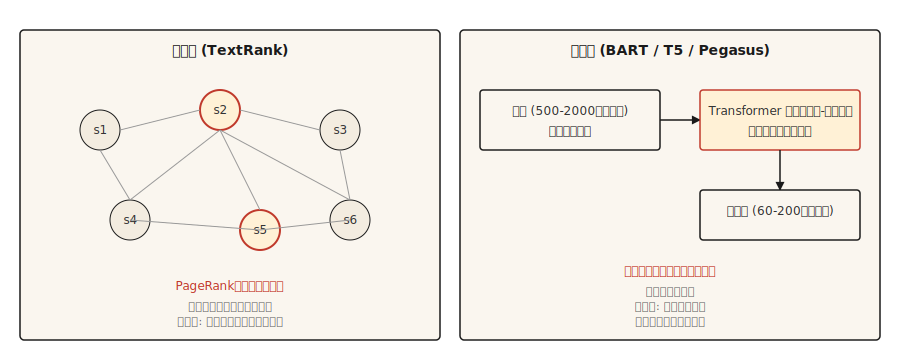

# 文本摘要（Text Summarization）

> 译注：本文译自同目录 [`en.md`](./en.md)。术语遵循仓根 [TRANSLATION_GUIDE.md](../../../../TRANSLATION_GUIDE.md)。

> 抽取式系统告诉你文档说了什么。生成式系统告诉你作者想表达什么。两个任务，两套坑。

**Type:** Build
**Languages:** Python
**Prerequisites:** Phase 5 · 02 (BoW + TF-IDF), Phase 5 · 11 (Machine Translation)
**Time:** ~75 minutes

## 问题（The Problem）

一篇 2,000 词的新闻文章出现在你的信息流里。你需要 120 词的版本来概括它。你可以从原文中挑出最重要的三句话（抽取式 extractive），也可以用自己的话重写内容（生成式 abstractive）。两者都叫摘要，但它们是完全不同的问题。

抽取式摘要是一个排序问题。给每个句子打分，返回前 `k` 个。输出永远是合乎语法的，因为是从原文逐字搬过来的。风险在于错过那些分散在全文中的内容。

生成式摘要是一个生成问题。一个 transformer 以输入为条件产出新文本。输出流畅且压缩度高，但可能 hallucinate（幻觉）出原文里根本不存在的事实。风险在于自信的捏造。

本课会同时实现两者，并讲清楚各自的失败模式。

## 概念（The Concept）



**Extractive（抽取式）。** 把文章看作一张图：节点是句子，边是相似度。在图上跑 PageRank（或类似算法），按句子与其它所有句子的连通程度打分。得分最高的几句就是摘要。经典实现是 **TextRank**（Mihalcea 和 Tarau，2004）。

**Abstractive（生成式）。** 在「文档—摘要」对上微调一个 transformer encoder-decoder（BART、T5、Pegasus）。推理时，模型读完文档，通过 cross-attention 一个 token 一个 token 地生成摘要。其中 Pegasus 的 gap-sentence 预训练目标特别贴合摘要任务，几乎不微调就能用得很好。

评估靠 **ROUGE**（Recall-Oriented Understudy for Gisting Evaluation）。ROUGE-1 和 ROUGE-2 计算 unigram 和 bigram 的重叠。ROUGE-L 计算最长公共子序列。越高越好，但 40 ROUGE-L 算「不错」，50 算「极佳」。每篇论文都要把三项都报。用 `rouge-score` 包就行。

## 动手实现（Build It）

### Step 1: TextRank（抽取式）

```python
import math
import re
from collections import Counter


def sentence_split(text):
    return re.split(r"(?<=[.!?])\s+", text.strip())


def similarity(s1, s2):
    w1 = Counter(s1.lower().split())
    w2 = Counter(s2.lower().split())
    intersection = sum((w1 & w2).values())
    denom = math.log(len(w1) + 1) + math.log(len(w2) + 1)
    if denom == 0:
        return 0.0
    return intersection / denom


def textrank(text, top_k=3, damping=0.85, iterations=50, epsilon=1e-4):
    sentences = sentence_split(text)
    n = len(sentences)
    if n <= top_k:
        return sentences

    sim = [[0.0] * n for _ in range(n)]
    for i in range(n):
        for j in range(n):
            if i != j:
                sim[i][j] = similarity(sentences[i], sentences[j])

    scores = [1.0] * n
    for _ in range(iterations):
        new_scores = [1 - damping] * n
        for i in range(n):
            total_out = sum(sim[i]) or 1e-9
            for j in range(n):
                if sim[i][j] > 0:
                    new_scores[j] += damping * sim[i][j] / total_out * scores[i]
        if max(abs(s - ns) for s, ns in zip(scores, new_scores)) < epsilon:
            scores = new_scores
            break
        scores = new_scores

    ranked = sorted(range(n), key=lambda k: scores[k], reverse=True)[:top_k]
    ranked.sort()
    return [sentences[i] for i in ranked]
```

有两点值得点名。相似度函数用的是对数归一化的词重叠，这是 TextRank 原版的做法。换成 TF-IDF 向量的 cosine 也可以。damping 系数 0.85 和迭代次数都是 PageRank 的默认值。

### Step 2: 用 BART 做生成式摘要

```python
from transformers import pipeline

summarizer = pipeline("summarization", model="facebook/bart-large-cnn")

article = """(long news article text)"""

summary = summarizer(article, max_length=120, min_length=60, do_sample=False)
print(summary[0]["summary_text"])
```

BART-large-CNN 是在 CNN/DailyMail 语料上微调过的，开箱即用就能产出新闻风格的摘要。如果是别的领域（科研论文、对话、法律），就用对应的 Pegasus checkpoint，或者在你的目标数据上微调。

### Step 3: ROUGE 评估

```python
from rouge_score import rouge_scorer

scorer = rouge_scorer.RougeScorer(["rouge1", "rouge2", "rougeL"], use_stemmer=True)
scores = scorer.score(reference_summary, generated_summary)
print({k: round(v.fmeasure, 3) for k, v in scores.items()})
```

永远开启词干提取（stemming）。不开的话，"running" 和 "run" 算两个词，ROUGE 会被低估。

### 超越 ROUGE（2026 年的摘要评估）

ROUGE 主导摘要评估二十年了，但到 2026 年仅靠它已经不够。一项关于 NLG 论文的大规模 meta 分析表明：

- **BERTScore**（基于上下文 embedding 的相似度）在 2023 年前后逐步普及，如今大多数摘要论文都会和 ROUGE 一起报。
- **BARTScore** 把评估当作生成任务来做：用一个预训练的 BART 来打分，看它在给定原文的条件下生成该摘要的概率有多大。
- **MoverScore**（在上下文 embedding 上做 Earth Mover's Distance）在 2025 年的摘要 benchmark 上登顶，因为它比 ROUGE 更能捕捉语义重叠。
- **FactCC** 和 **QA-based faithfulness** 在 2021—2023 年间很常见，如今多被 **G-Eval**（一条 GPT-4 的 prompt 链，用 chain-of-thought 推理给连贯性、一致性、流畅性、相关性打分）取代。
- **G-Eval** 这类 LLM-judge 方案，只要评分细则设计得好，与人类判断的吻合度大约在 80% 左右。

生产环境建议：报 ROUGE-L 用于跟历史结果对齐，报 BERTScore 衡量语义重叠，报 G-Eval 衡量连贯性和事实性。用 50—100 条人工标注的摘要做校准。

### Step 4: 事实性问题

生成式摘要容易 hallucinate。抽取式摘要的 hallucination 风险要低得多，因为输出是从原文逐字搬过来的——不过如果原文句子被脱离上下文、过时，或被乱序引用，依然可能误导。这也是为什么在合规相关的内容场景里，生产系统至今仍偏好抽取式。

要点名的几种 hallucination：

- **Entity swap（实体互换）。** 原文是 "John Smith"，摘要变成 "John Brown"。
- **Number drift（数字漂移）。** 原文是 "25,000"，摘要变成 "25 million"。
- **Polarity flip（极性翻转）。** 原文是 "rejected the offer"，摘要变成 "accepted the offer"。
- **Fact invention（事实捏造）。** 原文根本没提 CEO，摘要却说 CEO 批准了。

可行的评估手段：

- **FactCC。** 一个二分类器，训练目标是判断原文句子和摘要句子之间的蕴含关系，输出 factual/not-factual。
- **QA-based factuality。** 让一个 QA 模型回答那些答案在原文中的问题。如果摘要会让模型给出不同答案，就标记。
- **Entity-level F1。** 比较原文与摘要中的命名实体。只在摘要里出现的实体可疑。

任何对终端用户暴露、且事实性重要的场景（新闻、医疗、法律、金融），抽取式都是更安全的默认选择。生成式则需要在流程中加一道事实性检查。

## 用起来（Use It）

2026 年的技术栈：

| 场景 | 推荐方案 |
|---------|-------------|
| 新闻，3—5 句摘要，英文 | `facebook/bart-large-cnn` |
| 科研论文 | `google/pegasus-pubmed` 或微调过的 T5 |
| 多文档、长篇 | 任何 32k+ context 的 LLM，靠 prompt |
| 对话摘要 | `philschmid/bart-large-cnn-samsum` |
| 抽取式，结构上就低 hallucination 风险 | TextRank 或 `sumy` 的 LSA / LexRank |

到 2026 年，只要算力不是约束，长 context 的 LLM 经常能打过专门模型。代价是成本和复现性；专门模型的输出更稳定一致。

## 上线部署（Ship It）

存为 `outputs/skill-summary-picker.md`：

```markdown
---
name: summary-picker
description: Pick extractive or abstractive, named library, factuality check.
version: 1.0.0
phase: 5
lesson: 12
tags: [nlp, summarization]
---

Given a task (document type, compliance requirement, length, compute budget), output:

1. Approach. Extractive or abstractive. Explain in one sentence why.
2. Starting model / library. Name it. `sumy.TextRankSummarizer`, `facebook/bart-large-cnn`, `google/pegasus-pubmed`, or an LLM prompt.
3. Evaluation plan. ROUGE-1, ROUGE-2, ROUGE-L (use rouge-score with stemming). Plus factuality check if abstractive.
4. One failure mode to probe. Entity swap is the most common in abstractive news summarization; flag samples where source entities do not appear in summary.

Refuse abstractive summarization for medical, legal, financial, or regulated content without a factuality gate. Flag input over the model's context window as needing chunked map-reduce summarization (not just truncation).
```

## 练习（Exercises）

1. **简单。** 在 5 篇新闻文章上跑 TextRank。把 top-3 句子和参考摘要比对，测 ROUGE-L。在 CNN/DailyMail 风格的文章上你应当看到 30—45 的 ROUGE-L。
2. **中等。** 实现 entity 级的事实性检查：用 spaCy 从原文和摘要里抽取命名实体，计算原文实体在摘要中的召回，以及摘要实体相对于原文的精确率。高精确率、低召回意味着安全但过简；低精确率意味着摘要里有捏造的实体。
3. **困难。** 在 50 篇 CNN/DailyMail 文章上比较 BART-large-CNN 与一个 LLM（Claude 或 GPT-4）。报告 ROUGE-L、事实性（用 entity F1 衡量）和单条摘要的成本。记录各自的强项场景。

## 关键术语（Key Terms）

| 术语 | 大家通常的说法 | 它真正的意思 |
|------|-----------------|-----------------------|
| Extractive | 挑句子 | 从原文逐字返回句子，永不 hallucinate。 |
| Abstractive | 重写 | 以原文为条件生成新文本，可能 hallucinate。 |
| ROUGE | 摘要指标 | 系统输出与参考之间的 n-gram / LCS 重叠。 |
| TextRank | 基于图的抽取式 | 在句子相似度图上跑 PageRank。 |
| Factuality | 是否正确 | 摘要的论断是否被原文支持。 |
| Hallucination | 编造的内容 | 摘要中出现而原文不支持的内容。 |

## 延伸阅读（Further Reading）

- [Mihalcea and Tarau (2004). TextRank: Bringing Order into Texts](https://aclanthology.org/W04-3252/) — 抽取式的经典论文。
- [Lewis et al. (2019). BART: Denoising Sequence-to-Sequence Pre-training](https://arxiv.org/abs/1910.13461) — BART 论文。
- [Zhang et al. (2019). PEGASUS: Pre-training with Extracted Gap-sentences](https://arxiv.org/abs/1912.08777) — Pegasus 与 gap-sentence 目标。
- [Lin (2004). ROUGE: A Package for Automatic Evaluation of Summaries](https://aclanthology.org/W04-1013/) — ROUGE 论文。
- [Maynez et al. (2020). On Faithfulness and Factuality in Abstractive Summarization](https://arxiv.org/abs/2005.00661) — 事实性研究全景论文。
