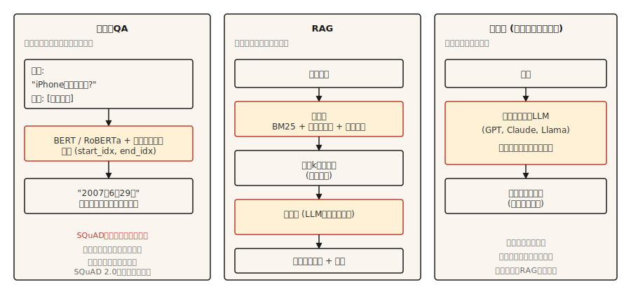

# Sistemas de Question-Answering

> Três sistemas moldaram QA moderno. Extrativos encontraram spans. Retrieval-augmented fundamentou em documentos. Generativos produziram respostas. Todo assistente de IA moderno é uma mistura dos três.

**Tipo:** Construção
**Linguagens:** Python
**Pré-requisitos:** Fase 5 · 11 (Tradução Automatizada), Fase 5 · 10 (Mecanismo de Attention)
**Tempo:** ~75 minutos

## O Problema

Um usuário digita "When did the first iPhone launch?" e espera "June 29, 2007." Não "Apple's history is long and varied." Não "2007" solto sem frase. Uma resposta direta, fundamentada, correta.

Três arquiteturas dominaram QA na última década.

- **QA Extrativo.** Dada uma pergunta e um trecho que se sabe conter a resposta, encontra os índices inicial e final do span da resposta no trecho. SQuAD é o benchmark canônico.
- **QA de domínio aberto.** O trecho não é dado. Recupera o trecho relevante primeiro, depois extrai ou gera uma resposta. Esse é o alicerce de toda pipeline RAG hoje.
- **QA Generativo / Closed-book.** Um grande modelo de linguagem responde de sua memória paramétrica. Sem recuperação. Mais rápido em inferência, menos confiável em fatos.

A tendência em 2026 é híbrida: recupera os melhores poucos trechos, depois prompta um modelo generativo pra responder fundamentado nesses trechos. Isso é RAG, e a lição 14 cobre a metade de recuperação em profundidade. Essa lição constrói a metade de QA.

## O Conceito



**Extrativo.** Codifica pergunta e trecho juntos com um transformer (família BERT). Treina duas cabeças que prevêem índices de token inicial e final da resposta. Loss é entropia cruzada sobre posições válidas. Saída é um span do trecho. Nunca alucina (por construção), nunca lida com perguntas que o trecho não pode responder (por construção).

**Retrieval-augmented (RAG).** Dois estágios. Primeiro, um recuperador encontra os top-`k` trechos de um corpus. Segundo, um leitor (extrativo ou generativo) produz a resposta usando esses trechos. A separação recuperador-leitor permite que cada um seja treinado e avaliado independentemente. RAG moderno frequentemente adiciona um reranker entre eles.

**Generativo.** Um LLM decoder-only (GPT, Claude, Llama) responde de pesos aprendidos. Sem etapa de recuperação. Excelente em conhecimento comum, catastrófico em fatos raros ou recentes. A taxa de alucinação é inversamente correlacionada com a frequência do fato nos dados de pre-treinamento.

## Construindo

### Passo 1: QA extrativo com modelo pré-treinado

```python
from transformers import pipeline

qa = pipeline("question-answering", model="deepset/roberta-base-squad2")

passage = (
    "Apple Inc. released the first iPhone on June 29, 2007. "
    "The device was announced by Steve Jobs at Macworld in January 2007."
)
question = "When was the first iPhone released?"

answer = qa(question=question, context=passage)
print(answer)
```

```python
{'score': 0.98, 'start': 57, 'end': 70, 'answer': 'June 29, 2007'}
```

`deepset/roberta-base-squad2` é treinado no SQuAD 2.0, que inclui perguntas sem resposta. Por padrão, a pipeline `question-answering` retorna o span de maior pontuação mesmo quando o score nulo do modelo ganha — não retorna *automaticamente* resposta vazia. Pra obter comportamento explícito de "sem resposta", passe `handle_impossible_answer=True` na chamada da pipeline: a pipeline então retorna resposta vazia só quando o score nulo excede cada score de span. Sempre verifique o campo `score` de qualquer jeito.

### Passo 2: uma pipeline retrieval-augmented (esboço)

```python
from sentence_transformers import SentenceTransformer
import numpy as np

encoder = SentenceTransformer("sentence-transformers/all-MiniLM-L6-v2")

corpus = [
    "Apple Inc. released the first iPhone on June 29, 2007.",
    "Macworld 2007 featured the iPhone announcement by Steve Jobs.",
    "Android launched in 2008 as Google's mobile operating system.",
    "The first iPod was released in 2001.",
]
corpus_embeddings = encoder.encode(corpus, normalize_embeddings=True)


def retrieve(question, top_k=2):
    q_emb = encoder.encode([question], normalize_embeddings=True)
    sims = (corpus_embeddings @ q_emb.T).squeeze()
    order = np.argsort(-sims)[:top_k]
    return [corpus[i] for i in order]


def answer(question):
    passages = retrieve(question, top_k=2)
    combined = " ".join(passages)
    return qa(question=question, context=combined)


print(answer("When was the first iPhone released?"))
```

Pipeline de dois estágios. Recuperador denso (Sentence-BERT) encontra trechos relevantes por similaridade semântica. Leitor extrativo (RoBERTa-SQuAD) puxa o span de resposta dos trechos top combinados. Funciona em corpora pequenos. Pra corpus de milhões de documentos, use FAISS ou banco de dados vetorial.

### Passo 3: generativo com RAG

```python
def rag_generate(question, llm):
    passages = retrieve(question, top_k=3)
    prompt = f"""Context:
{chr(10).join('- ' + p for p in passages)}

Question: {question}

Answer using only the context above. If the context does not contain the answer, say "I don't know."
"""
    return llm(prompt)
```

O padrão do prompt importa. Dizer explicitamente ao modelo pra se fundamentar no contexto e retornar "I don't know" quando o contexto é insuficiente reduz taxas de alucinação em 40-60% comparado com prompt ingênuo. Padrões mais elaborados adicionam citações, scores de confiança e extração estruturada.

### Passo 4: avaliação que reflete o mundo real

SQuAD usa **Exact Match (EM)** e **F1 no nível de token**. É uma correspondência estrita após normalização (lowercase, remover pontuação, remover artigos) — ou a previsão combina exatamente ou pontua 0. F1 é computado sobre sobreposição de tokens entre previsão e referência e dá crédito parcial. Ambos subcréditam paráfrases: "June 29, 2007" vs "June 29th, 2007" geralmente ganha 0 EM (o ordinal quebra a normalização) mas ainda ganha F1 substancial dos tokens sobrepostos.

Pra QA em produção:

- **Acurácia da resposta** (julgada por LLM ou humano, já que métricas não capturam equivalência semântica).
- **Acurácia de citação.** O trecho citado realmente suporta a resposta? Fácil de verificar automaticamente com correspondência de strings entre citações geradas e trechos recuperados.
- **Calibração de recusa.** Quando a resposta não está nos trechos recuperados, o sistema diz corretamente "I don't know"? Meça a taxa de confiança falsa.
- **Recall de recuperação.** Antes de avaliar o leitor, meça se o recuperador colocou o trecho certo no top-`k`. Um leitor não conserta um trecho faltando.

### RAGAS: o framework de avaliação de produção de 2026

`RAGAS` é construído especificamente pra sistemas RAG e é o padrão de envio em 2026. Pontua quatro dimensões sem exigir referências douradas:

- **Fidelidade.** Cada afirmação na resposta vem do contexto recuperado? Medido por implicação baseada em NLI. Sua métrica principal de alucinação.
- **Relevância da resposta.** A resposta endereça a pergunta? Medido gerando perguntas hipotéticas da resposta e comparando com a pergunta real.
- **Precisão do contexto.** Dos trechos recuperados, qual fração era realmente relevante? Baixa precisão = ruído no prompt.
- **Recall do contexto.** O conjunto recuperado continha toda informação necessária? Baixo recall = leitor não pode ter sucesso.

Pontuação sem referência permite avaliar em tráfego de produção ao vivo sem respostas douradas curadas. Adicione LLM-como-julgador no topo pra perguntas abertas onde métricas de exact-match são inúteis.

`pip install ragas`. Pluga seu recuperador + leitor. Ganha quatro escalares por consulta. Avisa em regressões.

## Usando

Stack de 2026.

| Caso de uso | Recomendado |
|---------|-------------|
| Dado trecho, encontrar span de resposta | `deepset/roberta-base-squad2` |
| Sobre corpus fixo, closed-book não aceitável | RAG: recuperador denso + leitor LLM |
| Em tempo real sobre armazenamento de documentos | RAG com recuperador híbrido (BM25 + denso) + reranker (lição 14) |
| QA conversacional (perguntas de acompanhamento) | LLM com histórico de conversação + RAG a cada turno |
| Altamente factual, domínios regulados | Extrativo sobre corpus autoritativo; nunca generativo sozinho |

QA extrativo está fora de moda em 2026 porque RAG com LLMs lida com mais casos. Ainda é usado em contextos onde ciação literal é necessária: pesquisa jurídica, compliance regulatória, ferramentas de auditoria.

## Entregando

Salve como `outputs/skill-qa-architect.md`:

```markdown
---
name: qa-architect
description: Choose QA architecture, retrieval strategy, and evaluation plan.
version: 1.0.0
phase: 5
lesson: 13
tags: [nlp, qa, rag]
---

Given requirements (corpus size, question type, factuality constraint, latency budget), output:

1. Architecture. Extractive, RAG with extractive reader, RAG with generative reader, or closed-book LLM. One-sentence reason.
2. Retriever. None, BM25, dense (name the encoder), or hybrid.
3. Reader. SQuAD-tuned model, LLM by name, or "domain-fine-tuned DistilBERT."
4. Evaluation. EM + F1 for extractive benchmarks; answer accuracy + citation accuracy + refusal calibration for production. Name what you are measuring and how you are measuring it.

Refuse closed-book LLM answers for regulatory or compliance-sensitive questions. Refuse any QA system without a retrieval-recall baseline (you cannot evaluate the reader without knowing the retriever surfaced the right passage). Flag questions that require multi-hop reasoning as needing specialized multi-hop retrievers like HotpotQA-trained systems.
```

## Exercícios

1. **Fácil.** Configure a pipeline extrativa SQuAD acima em 10 trechos da Wikipedia. Faça 10 perguntas manualmente. Meça quão frequentemente a resposta está correta. Você deve ver 7-9 corretas se trechos e perguntas estiverem limpos.
2. **Médio.** Adicione um classificador de recusa. Quando o score de recuperação top estiver abaixo de um limiar (digamos 0.3 de cosseno), retorne "I don't know" em vez de chamar o reader. Ajuste o limiar num conjunto de teste.
3. **Difícil.** Construa uma pipeline RAG sobre um corpus de 10.000 documentos da sua escolha. Implemente recuperação híbrida (BM25 + denso) com fusão RRF (ver lição 14). Meça acurácia de resposta com e sem o passo híbrido. Documente quais tipos de perguntas se beneficiam mais.

## Termos Chave

| Termo | O que a gente diz | O que realmente significa |
|------|-----------------|-----------------------|
| QA Extrativo | Encontrar o span da resposta | Prevê índices inicial e final da resposta dentro de um trecho dado. |
| QA de domínio aberto | QA sobre corpus | Sem trecho dado; deve recuperar depois responder. |
| RAG | Recuperar depois gerar | Geração retrieval-augmented. Pipeline recuperador + leitor. |
| SQuAD | Benchmark canônico | Stanford Question Answering Dataset. Métricas EM + F1. |
| Alucinação | Resposta inventada | Saída do leitor não suportada pelo contexto recuperado. |
| Calibração de recusa | Saber quando ficar calado | Sistema diz corretamente "I don't know" quando não consegue responder. |

## Leitura Complementar

- [Rajpurkar et al. (2016). SQuAD: 100,000+ Questions for Machine Comprehension of Text](https://arxiv.org/abs/1606.05250) — o paper do benchmark.
- [Karpukhin et al. (2020). Dense Passage Retrieval for Open-Domain QA](https://arxiv.org/abs/2004.04906) — DPR, o recuperador denso canônico pra QA.
- [Lewis et al. (2020). Retrieval-Augmented Generation for Knowledge-Intensive NLP Tasks](https://arxiv.org/abs/2005.11401) — o paper que nomeou RAG.
- [Gao et al. (2023). Retrieval-Augmented Generation for Large Language Models: A Survey](https://arxiv.org/abs/2312.10997) — levantamento abrangente de RAG.
