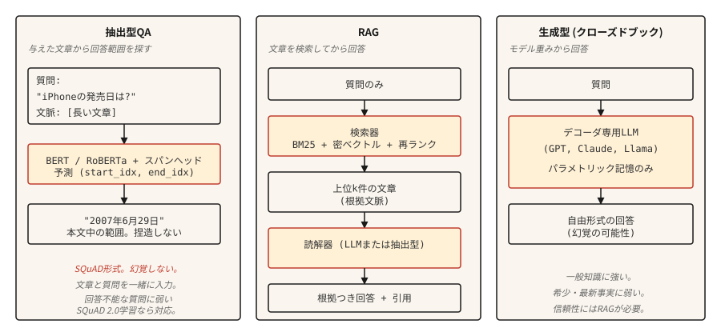

# Soru Cevap Sistemleri

> Modern QA'yı üç sistem şekillendirdi. Çıkarıcı bulunan açıklıklar. Geri alma-artırılmış belgelere dayandırıldı. Üretken cevaplar üretti. Her modern yapay zeka asistanı bu üçünün bir karışımıdır.

**Tür:** Yapım
**Diller:** Python
**Önkoşullar:** Aşama 5 · 11 (Makine Çevirisi), Aşama 5 · 10 (Attention Mechanism)
**Süre:** ~75 dakika

## Sorun

Bir kullanıcı "İlk iPhone ne zaman piyasaya sürüldü?" ve "29 Haziran 2007"yi bekliyor. "Apple'ın geçmişi uzun ve çeşitlidir" değil. Hiçbir cümle olmadan tek başına oturan "2007" değil. Doğrudan, temelli ve doğru bir cevap.

Son on yılda QA'ya üç mimari hakim oldu.

- **Çıkartmalı KG.** Bir soru ve cevabını içerdiği bilinen bir pasaj verildiğinde, pasajdaki cevap aralığının başlangıç ​​ve bitiş indekslerini bulun. SQuAD standart benchmark'dır.
- **Açık alan KG'si.** Pasaj verilmemiştir. Önce ilgili pasajı alın, ardından bir cevap çıkarın veya oluşturun. Bu, günümüzün her RAG boru hattının temelidir.
- **Üretici / Kapalı Kitap QA.** Büyük bir dil modeli, parametrik belleğinden yanıt verir. Geri alma yok. inference ile en hızlı, gerçekler konusunda en az güvenilir.

2026'daki trend hibrit: En iyi birkaç pasajı alın, ardından prompt bu pasajlara dayalı olarak yanıt verecek üretken bir model. Bu RAG'dır ve 14. ders, geri almanın yarısını derinlemesine kapsamaktadır. Bu ders QA'nın yarısını oluşturur.

## Konsept



**Çıkartmalı.** Soruyu ve pasajı bir transformer (BERT ailesi) ile birlikte kodlayın. Cevabın başlangıç ​​ve bitiş token indeksini tahmin eden iki kafayı eğitin. Kayıp, geçerli konumlar üzerinden çapraz entropidir. Çıkış geçitten bir açıklıktır. Asla halüsinasyon görmez (yapısal olarak), pasajın cevaplayamayacağı soruları asla ele almaz (yapısal olarak).

**Geri almayla artırılmış (RAG).** İki aşamalı. İlk olarak, bir avcı bir külliyatın en üstteki`k` pasajlarını bulur. İkincisi, okuyucu (çıkarıcı veya üretken) bu pasajları kullanarak cevabı üretir. Alıcı-okuyucu ayrımı, her birinin bağımsız olarak eğitilmesine ve değerlendirilmesine olanak tanır. Modern RAG genellikle aralarına bir yeniden sıralama ekler.

**Üretken.** Yalnızca kod çözücüye yönelik bir LLM (GPT, Claude, Llama), öğrenilen ağırlıklardan yanıt verir. Geri alma adımı yok. Yaygın bilgi konusunda mükemmel, nadir veya güncel gerçekler konusunda ise felaket. Halüsinasyon oranı, eğitim öncesi verilerdeki gerçek sıklığıyla ters orantılıdır.

## İnşa Et

### Adım 1: önceden eğitilmiş bir modelle çıkarımsal QA

```python
from transformers import pipeline

qa = pipeline("question-answering", model="deepset/roberta-base-squad2")

passage = (
    "Apple Inc. released the first iPhone on June 29, 2007. "
    "The device was announced by Steve Jobs at Macworld in January 2007."
)
question = "When was the first iPhone released?"

answer = qa(question=question, context=passage)
print(answer)
```

```python
{'score': 0.98, 'start': 57, 'end': 70, 'answer': 'June 29, 2007'}
```

`deepset/roberta-base-squad2`, cevaplanamayan soruları içeren SQuAD 2.0 konusunda eğitilmiştir. Varsayılan olarak, `question-answering` ardışık düzeni, modelin boş puanı kazansa bile en yüksek puan aralığını döndürür; otomatik olarak boş bir yanıt *döndürmez*. Açık bir "cevap yok" davranışı elde etmek için, ardışık düzen çağrısına `handle_impossible_answer=True` iletin: ardışık düzen, yalnızca boş puan her yayılma puanını aştığında boş bir yanıt döndürür. Her iki durumda da daima `score` alanını kontrol edin.

### Adım 2: almayla zenginleştirilmiş bir işlem hattı (taslak)

```python
from sentence_transformers import SentenceTransformer
import numpy as np

encoder = SentenceTransformer("sentence-transformers/all-MiniLM-L6-v2")

corpus = [
    "Apple Inc. released the first iPhone on June 29, 2007.",
    "Macworld 2007 featured the iPhone announcement by Steve Jobs.",
    "Android launched in 2008 as Google's mobile operating system.",
    "The first iPod was released in 2001.",
]
corpus_embeddings = encoder.encode(corpus, normalize_embeddings=True)


def retrieve(question, top_k=2):
    q_emb = encoder.encode([question], normalize_embeddings=True)
    sims = (corpus_embeddings @ q_emb.T).squeeze()
    order = np.argsort(-sims)[:top_k]
    return [corpus[i] for i in order]


def answer(question):
    passages = retrieve(question, top_k=2)
    combined = " ".join(passages)
    return qa(question=question, context=combined)


print(answer("When was the first iPhone released?"))
```

İki aşamalı boru hattı. Yoğun alıcı (Cümle-BERT), anlamsal benzerliğe göre ilgili pasajları bulur. Çıkarıcı okuyucu (RoBERTa-SQuAD), cevap aralığını birleştirilmiş üst geçitlerden alır. Küçük cisimler üzerinde çalışır. Milyonlarca belgelik bir külliyat için FAISS veya vector database kullanın.

### Adım 3: RAG ile üretken

```python
def rag_generate(question, llm):
    passages = retrieve(question, top_k=3)
    prompt = f"""Context:
{chr(10).join('- ' + p for p in passages)}

Question: {question}

Answer using only the context above. If the context does not contain the answer, say "I don't know."
"""
    return llm(prompt)
```

prompt modeli önemlidir. Modele açıkça bağlamı temel almasını ve bağlam yetersiz olduğunda "Bilmiyorum" demesini söylemek, saf prompting ile karşılaştırıldığında halüsinasyon oranlarını %40-60 oranında azaltır. Daha ayrıntılı modeller alıntıları, güven puanlarını ve yapılandırılmış çıkarımları ekler.

### Adım 4: gerçek dünyayı yansıtan değerlendirme

SQuAD **Tam Eşleşme (EM)** ve **token düzeyinde F1** kullanır. EM, normalleştirmeden sonra katı bir eşleşmedir (küçük harf, noktalama işareti, makaleleri kaldır) - ya tahmin tam olarak eşleşir ya da 0 puan alır. F1, tahmin ve referans arasındaki token örtüşmesi üzerinden hesaplanır ve kısmi kredi verir. Her iki yetersiz kredi yorumu: "29 Haziran 2007" ve "29 Haziran 2007" tipik olarak 0 EM alır (sıralı normalleştirmeyi kırar), ancak yine de çakışan token'lerden önemli miktarda F1 kazanır.

Üretim QA'sı için:

- **Cevap doğruluğu** (Metrikler anlamsal eşdeğerliği yakalayamadığından Yüksek Lisans veya insan değerlendirmesine göre değerlendirilir).
- **Alıntı doğruluğu.** Alıntılanan pasaj aslında cevabı destekliyor mu? Oluşturulan alıntılar ve alınan pasajlar arasındaki dize eşleşmesiyle otomatik olarak kontrol edilmesi önemsizdir.
- **Kalibrasyon reddi.** Cevap alınan pasajlarda olmadığında sistem doğru şekilde "Bilmiyorum" diyor mu? Yanlış güven oranını ölçün.
- **Geri çağırma.** Okuyucuyu değerlendirmeden önce, toplayıcının yukarıya doğru geçiş yapıp yapmadığını ölçün-`k`. Okuyucu eksik bir pasajı düzeltemez.

### RAGAS: 2026 üretim değerlendirmesi framework

`RAGAS`, RAG sistemleri için özel olarak üretilmiştir ve 2026'da varsayılan gönderimdir. Altın referanslara ihtiyaç duymadan dört boyuta puan verir:

- **Sadakat.** Yanıttaki her iddia, alınan bağlamdan mı geliyor? NLI tabanlı gereklilik ile ölçülür. Birincil halüsinasyon ölçümünüz.
- **Cevap alaka düzeyi.** Cevap soruyu ele alıyor mu? Cevaptan varsayımsal sorular üretilerek ve gerçek soruyla karşılaştırılarak ölçülür.
- **Bağlam kesinliği.** Alınan parçaların hangi kısmı gerçekten alakalıydı? Düşük hassasiyet = prompt'da gürültü.
- **Bağlam hatırlama.** Alınan set gerekli tüm bilgileri içeriyor mu? Düşük hatırlama = okuyucu başarılı olamaz.

Referanssız puanlama, seçilmiş altın yanıtlar olmadan canlı prodüksiyon trafiğini değerlendirmenize olanak tanır. Tam eşleşme metriklerinin işe yaramadığı açık uçlu sorular için yüksek lisansı jüri olarak en üst sıraya koyun.

`pip install ragas`. Retriever'ınızı + okuyucunuzu takın. Sorgu başına dört skaler alın. Gerilemelerle ilgili uyarı.

## Kullan onu

2026 yığını.

| Kullanım örneği | Önerilen |
|---------|-------------|
| Verilen pasajda cevap aralığını bulun | `deepset/roberta-base-squad2` |
| Sabit bir külliyat üzerinden kapalı kitap kabul edilemez | RAG: yoğun avcı + LLM okuyucu |
| Bir belge deposu üzerinden gerçek zamanlı | Hibrit (BM25 + yoğun) avcı + yeniden sıralayıcılı RAG (ders 14) |
| Konuşmalı QA (takip soruları) | Konuşma geçmişini içeren Yüksek Lisans + Her fırsatta RAG |
| Son derece gerçekçi, denetime tabi alanlar | Yetkili bir külliyat üzerinden çıkarıcı; asla tek başına üretken değildir |

Çıkarımsal QA'nın 2026'da modası geçmiş çünkü LLM'li RAG daha fazla vakayı ele alıyor. Hala gerçek anlamda alıntı yapılmasının gerekli olduğu bağlamlarda gönderilir: yasal araştırma, mevzuata uygunluk, denetim araçları.

## Gönderin

`outputs/skill-qa-architect.md` olarak kaydet:

```markdown
---
name: qa-architect
description: Choose QA architecture, retrieval strategy, and evaluation plan.
version: 1.0.0
phase: 5
lesson: 13
tags: [nlp, qa, rag]
---

Given requirements (corpus size, question type, factuality constraint, latency budget), output:

1. Architecture. Extractive, RAG with extractive reader, RAG with generative reader, or closed-book LLM. One-sentence reason.
2. Retriever. None, BM25, dense (name the encoder), or hybrid.
3. Reader. SQuAD-tuned model, LLM by name, or "domain-fine-tuned DistilBERT."
4. Evaluation. EM + F1 for extractive benchmarks; answer accuracy + citation accuracy + refusal calibration for production. Name what you are measuring and how you are measuring it.

Refuse closed-book LLM answers for regulatory or compliance-sensitive questions. Refuse any QA system without a retrieval-recall baseline (you cannot evaluate the reader without knowing the retriever surfaced the right passage). Flag questions that require multi-hop reasoning as needing specialized multi-hop retrievers like HotpotQA-trained systems.
```

## Egzersizler

1. **Kolay.** Yukarıdaki 10 Wikipedia pasajına göre SQuAD çıkarım hattını kurun. El işi 10 soru. Cevabın ne sıklıkla doğru olduğunu ölçün. Pasajlar ve sorular temizse 7-9'un doğru olduğunu görmelisiniz.
2. **Orta.** Bir ret sınıflandırıcısı ekleyin. En yüksek erişim puanı bir eşiğin altında olduğunda (örneğin 0,3 kosinüs), okuyucuyu aramak yerine "Bilmiyorum" yanıtını verin. Uzatılmış bir sette eşiği ayarlayın.
3. **Zor.** Seçtiğiniz 10.000 belgelik bir derleme üzerinden bir RAG işlem hattı oluşturun. RRF füzyonu ile hibrit alımı (BM25 + yoğun) uygulayın (bkz. ders 14). Hibrit adımla ve hibrit adım olmadan yanıt doğruluğunu ölçün. Hangi soru türlerinin en çok fayda sağladığını belgeleyin.

## Anahtar Terimler

| Dönem | İnsanlar ne diyor | Aslında ne anlama geliyor |
|------|-----------------|-----------------------|
| Çıkarıcı QA | Cevap aralığını bulun | Belirli bir pasajdaki cevabın başlangıç ​​ve bitiş indekslerini tahmin edin. |
| Açık alan adı QA | Bir derleme üzerinde QA | Belirli bir geçiş yok; geri almalı ve sonra cevap vermelisiniz. |
| RAG | Al ve oluştur | Alma-artırılmış nesil. Alıcı + okuyucu hattı. |
| TAKIM | Kanonik benchmark | Stanford Soru Yanıtı Dataset. EM + F1 metrikleri. |
| Halüsinasyon | Uydurma cevap | Okuyucu çıktısı, alınan içerik tarafından desteklenmiyor. |
| Kalibrasyonun reddedilmesi | Ne zaman susmanız gerektiğini bilin | Cevap veremediğimde sistem doğru bir şekilde "Bilmiyorum" diyor. |

## Daha Fazla Okuma

- [Rajpurkar ve ark. (2016). SQuAD: Metnin Makine Tarafından Anlaşılmasına Yönelik 100.000+ Soru](https://arxiv.org/abs/1606.05250) — benchmark makalesi.
- [Karpukhin ve ark. (2020). Açık Alan QA için Yoğun Geçiş Erişimi](https://arxiv.org/abs/2004.04906) — DPR, QA için standart yoğun alıcı.
- [Lewis ve ark. (2020). Bilgi Yoğun NLP Görevleri için Erişimle Artırılmış Üretim](https://arxiv.org/abs/2005.11401) — RAG adını veren makale.
- [Gao ve ark. (2023). Büyük Dil Modelleri için Erişimle Artırılmış Üretim: Bir Anket](https://arxiv.org/abs/2312.10997) — kapsamlı RAG anketi.
