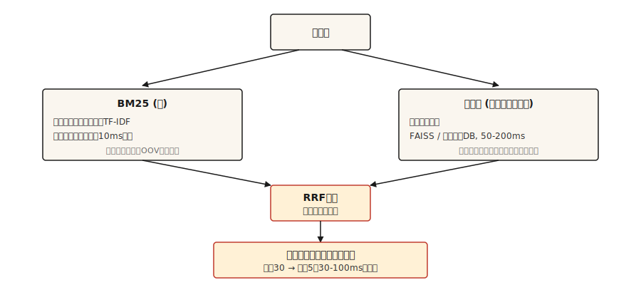

# 情報検索とサーチ

> BM25は正確ですが脆いです。denseは広く拾えますがキーワードを落とします。hybridが2026年のデフォルトです。それ以外はチューニングです。

**種類:** 構築
**言語:** Python
**前提:** Phase 5 · 02 (BoW + TF-IDF), Phase 5 · 04 (GloVe, FastText, Subword)
**所要時間:** 約75分

## 問題

ユーザーが "what happens if someone lies to get money" と入力したとき、本当に見つけたいのはその行為を扱う条文、つまり "Section 420 IPC" です。キーワード検索では語彙が共有されていないため完全に見逃します。意味検索も、埋め込みが法律文書で訓練されていなければ見逃します。現実の検索では、両方に対応する必要があります。

IRは、あらゆるRAGシステム、検索バー、ドキュメントサイトのあいまい検索の下にあるパイプラインです。2026年に本番で機能するアーキテクチャは、単一の手法ではありません。相補的な手法の連鎖であり、それぞれが前段の失敗を拾います。

このレッスンでは各部品を構築し、それぞれがどの失敗を捕まえるのかに名前を付けます。

## コンセプト



4つの層があります。必要なものを選びます。

1. **スパース検索 (BM25)。** 高速で、完全一致には精密ですが、意味には弱いです。転置インデックス上で実行します。数百万文書でもクエリあたり10ms未満です。条文参照、製品コード、エラーメッセージ、固有表現を正しく拾えます。
2. **Dense retrieval。** クエリと文書をベクトルにエンコードします。近傍探索です。言い換えや意味的類似性を捉えます。1文字違いの完全一致キーワードを見逃すことがあります。FAISSまたはベクトルDBを使うと、クエリあたり50-200msです。
3. **Fusion。** スパースとdenseのランキングリストを統合します。Reciprocal Rank Fusion (RRF) は、扱うスコアの尺度が異なるため生スコアを無視し、順位だけを使う簡単なデフォルトです。特定ドメインで片方の信号が支配的だと分かっている場合は、重み付きfusionも選択肢です。
4. **Cross-encoder rerank。** fusionの上位30件を取り、cross-encoder (クエリ + 文書を一緒に入力し、各ペアを採点するモデル) に通します。上位5件を残します。cross-encoderはペアごとの処理がbi-encoderより遅い一方、はるかに高精度です。上位30件にだけ実行することでコストをならします。

3方式検索 (BM25 + dense + SPLADEのようなlearned-sparse) は、2026年のベンチマークで2方式を上回りますが、learned-sparseインデックスのインフラが必要です。多くのチームにとっては、2方式 + cross-encoder rerankがちょうどよい落としどころです。

## 構築

### Step 1: BM25をスクラッチで実装する

```python
import math
import re
from collections import Counter

TOKEN_RE = re.compile(r"[a-z0-9]+")


def tokenize(text):
    return TOKEN_RE.findall(text.lower())


class BM25:
    def __init__(self, corpus, k1=1.5, b=0.75):
        if not corpus:
            raise ValueError("corpus must not be empty")
        self.corpus = [tokenize(d) for d in corpus]
        self.k1 = k1
        self.b = b
        self.n_docs = len(self.corpus)
        self.avg_dl = sum(len(d) for d in self.corpus) / self.n_docs
        self.df = Counter()
        for doc in self.corpus:
            for term in set(doc):
                self.df[term] += 1

    def idf(self, term):
        n = self.df.get(term, 0)
        return math.log(1 + (self.n_docs - n + 0.5) / (n + 0.5))

    def score(self, query, doc_idx):
        q_tokens = tokenize(query)
        doc = self.corpus[doc_idx]
        dl = len(doc)
        freq = Counter(doc)
        score = 0.0
        for term in q_tokens:
            f = freq.get(term, 0)
            if f == 0:
                continue
            numerator = f * (self.k1 + 1)
            denominator = f + self.k1 * (1 - self.b + self.b * dl / self.avg_dl)
            score += self.idf(term) * numerator / denominator
        return score

    def rank(self, query, top_k=10):
        scored = [(self.score(query, i), i) for i in range(self.n_docs)]
        scored.sort(reverse=True)
        return scored[:top_k]
```

知っておく価値のあるパラメータは2つです。`k1=1.5` は語頻度の飽和を制御します。高いほど、用語の反復に重みが乗ります。`b=0.75` は長さ正規化を制御します。0は文書長を無視し、1は完全に正規化します。デフォルト値は元論文におけるRobertsonの推奨であり、調整が必要になることはめったにありません。

### Step 2: bi-encoderによるdense retrieval

```python
from sentence_transformers import SentenceTransformer
import numpy as np


def build_dense_index(corpus, model_id="sentence-transformers/all-MiniLM-L6-v2"):
    encoder = SentenceTransformer(model_id)
    embeddings = encoder.encode(corpus, normalize_embeddings=True)
    return encoder, embeddings


def dense_search(encoder, embeddings, query, top_k=10):
    q_emb = encoder.encode([query], normalize_embeddings=True)
    sims = (embeddings @ q_emb.T).flatten()
    order = np.argsort(-sims)[:top_k]
    return [(float(sims[i]), int(i)) for i in order]
```

埋め込みをL2正規化すると、ドット積がcosineと等しくなります。`all-MiniLM-L6-v2` は384次元で高速であり、ほとんどの英語検索には十分な性能があります。多言語では `paraphrase-multilingual-MiniLM-L12-v2` を使います。最高精度を狙うなら `bge-large-en-v1.5` または `e5-large-v2` です。

### Step 3: Reciprocal Rank Fusion

```python
def reciprocal_rank_fusion(rankings, k=60):
    scores = {}
    for ranking in rankings:
        for rank, (_, doc_idx) in enumerate(ranking):
            scores[doc_idx] = scores.get(doc_idx, 0.0) + 1.0 / (k + rank + 1)
    fused = sorted(scores.items(), key=lambda x: x[1], reverse=True)
    return [(score, doc_idx) for doc_idx, score in fused]
```

`k=60` という定数は元のRRF論文に由来します。`k` が大きいほど順位差の寄与が平坦になり、小さいほど上位順位が支配的になります。60は公開されたデフォルトであり、調整が必要になることはめったにありません。

### Step 4: hybrid search + rerank

```python
from sentence_transformers import CrossEncoder

reranker = CrossEncoder("cross-encoder/ms-marco-MiniLM-L-6-v2")


def hybrid_search(query, bm25, encoder, dense_embeddings, corpus, top_k=5, pool_size=30, reranker=reranker):
    sparse_ranking = bm25.rank(query, top_k=pool_size)
    dense_ranking = dense_search(encoder, dense_embeddings, query, top_k=pool_size)
    fused = reciprocal_rank_fusion([sparse_ranking, dense_ranking])[:pool_size]

    pairs = [(query, corpus[doc_idx]) for _, doc_idx in fused]
    scores = reranker.predict(pairs)
    reranked = sorted(zip(scores, [doc_idx for _, doc_idx in fused]), reverse=True)
    return reranked[:top_k]
```

3段階を組み合わせています。BM25は語彙的一致を見つけます。denseは意味的一致を見つけます。RRFはスコア較正なしで2つのランキングを統合します。Cross-encoderはクエリと文書のペアを一緒に見て上位30件を再採点し、bi-encoderが見逃した細かな関連性を捉えます。上位5件を残します。

### Step 5: 評価

| メトリクス | 意味 |
|--------|---------|
| Recall@k | 正しい文書が存在するクエリのうち、top-kにそれが入る割合。 |
| MRR (Mean Reciprocal Rank) | 最初の関連文書の `1/rank` の平均。 |
| nDCG@k | 関連 / 非関連の二値だけでなく、関連度の段階も考慮する。 |

RAGでは特に、retrieverの **Recall@k** が最重要です。正しい文章が検索結果に入っていなければ、readerは答えられません。

デバッグのコツ: 失敗したクエリでは、スパースとdenseのランキングをdiffします。片方だけが正しい文書を見つけているなら、語彙ミスマッチ (修正: 欠けている側を追加する) または意味的曖昧性 (修正: より良い埋め込みまたはreranker) があります。

## 使いどころ

2026年のスタックです。

| 規模 | スタック |
|-------|-------|
| 1k-100k docs | インメモリBM25 + `all-MiniLM-L6-v2` embeddings + RRF。別DBなし。 |
| 100k-10M docs | denseにはFAISSまたはpgvector、BM25にはElasticsearch / OpenSearch。並列実行。 |
| 10M+ docs | hybrid対応のQdrant / Weaviate / Vespa / Milvus。top-30にcross-encoder rerank。 |
| 最高品質のfrontier | 3方式 (BM25 + dense + SPLADE) + ColBERT late-interaction reranking |

何を選ぶにしても、評価の予算を確保してください。end-to-endのRAG精度をベンチマークする前に、検索recallをベンチマークします。readerはretrieverが見逃したものを修正できません。

### 2026年の本番RAGから得られた苦い教訓

- **RAG失敗の80%はモデルではなく、ingestionとchunkingに由来します。** チームはLLMを差し替えたりプロンプトを調整したりするのに何週間も費やしますが、その間も検索は3クエリに1回、静かに誤った文脈を返します。まずchunkingを直してください。
- **Chunking strategyはchunk sizeより重要です。** 固定長分割は、表、コード、入れ子になった見出しを壊します。文認識がデフォルトです。技術文書や製品マニュアルでは、意味ベースまたはLLMベースのchunkingが効きます。
- **Parent-doc pattern。** 精度のために小さな「child」チャンクを検索します。同じ親セクションから複数のchildが出てきたら、文脈を保つためにparentブロックへ差し替えます。これは再訓練なしで一貫して回答品質を上げます。
- **k_rerank=3 はたいてい最適です。** それを超えるチャンクは、回答品質を上げずにトークンコストと生成レイテンシを増やします。もしk=8がk=3よりまだ良いなら、rerankerの性能が不足しています。
- **HyDE / query expansion。** クエリから仮想的な答えを生成し、それを埋め込んで検索します。短い質問と長い文書の表現差を埋めます。訓練なしでprecisionを上げられます。
- **Context budgetは8K tokens未満。** その上限に頻繁に当たるなら、rerankerの閾値が緩すぎます。
- **すべてをバージョン管理してください。** プロンプト、chunkingルール、embedding model、reranker。どれかがずれると回答品質が静かに壊れます。faithfulness、context precision、未回答質問率に対するCIゲートで、ユーザーに見える前に回帰を止めます。
- **3方式検索 (BM25 + dense + SPLADEのようなlearned-sparse) は2方式を上回ります。** 2026年のベンチマークでは、特に固有名詞と意味的意図が混ざるクエリで強みがあります。インフラがSPLADEインデックスを支えられるなら出荷してください。

2026年の業界測定では、適切な検索設計により幻覚を70-90%削減できます。RAGの性能向上の大半は、モデルのファインチューニングではなく、より良い検索から生まれます。

## 出荷

`outputs/skill-retrieval-picker.md` として保存します。

```markdown
---
name: retrieval-picker
description: 与えられたコーパスとクエリパターンに合う検索スタックを選ぶ。
version: 1.0.0
phase: 5
lesson: 14
tags: [nlp, retrieval, rag, search]
---

要件 (コーパスサイズ、クエリパターン、レイテンシ予算、品質基準、インフラ制約) が与えられたら、次を出力する。

1. スタック。BM25のみ、denseのみ、hybrid (BM25 + dense + RRF)、hybrid + cross-encoder rerank、または3方式 (BM25 + dense + learned-sparse)。
2. Dense encoder。具体的なモデル名を挙げる。言語、ドメイン、コンテキスト長に合わせる。
3. Reranker。使う場合は具体的なcross-encoderモデル名を挙げる。top-30に対するrerankは30-100msのレイテンシを追加することを明記する。
4. 評価計画。Recall@10を主要なretrieverメトリクスにする。複数答えにはMRR。まずベースラインを作り、増分改善をそれと比較して測る。

固有表現、エラーコード、製品SKUを含むコーパスでは、denseが完全一致を扱える証拠がない限り、dense-onlyの推奨を拒否する。法務や医療のように最終top-5がユーザーの答えを決める高リスク検索では、rerankingの省略を拒否する。
```

## 演習

1. **Easy。** 500文書コーパスで上の `hybrid_search` を実装してください。20個のクエリでテストします。BM25-only、dense-only、hybridのrecall at 5を比較してください。
2. **Medium。** MRR計算を追加してください。正しい文書が分かっている各テストクエリについて、BM25、dense、hybridランキングでの正しい文書の順位を見つけます。それぞれのMRRを報告してください。
3. **Hard。** MultipleNegativesRankingLoss (Sentence Transformers) を使い、自分のドメインでdense encoderをファインチューニングしてください。500件のクエリ文書ペアから訓練セットを作ります。ファインチューニング前後のrecallを比較してください。

## 重要用語

| 用語 | よく言われること | 実際の意味 |
|------|-----------------|-----------------------|
| BM25 | キーワード検索 | Okapi BM25。語頻度、IDF、文書長で文書を採点する。 |
| Dense retrieval | ベクトル検索 | クエリと文書をベクトルにエンコードし、近傍を見つける。 |
| Bi-encoder | 埋め込みモデル | クエリと文書を独立にエンコードする。クエリ時に高速。 |
| Cross-encoder | Rerankerモデル | クエリと文書を一緒にエンコードする。遅いが高精度。 |
| RRF | Rank fusion | `1/(k + rank)` を足し合わせて2つのランキングを統合する。 |
| Recall@k | 検索メトリクス | 関連文書がtop-kに入っているクエリの割合。 |

## 参考資料

- [Robertson and Zaragoza (2009). The Probabilistic Relevance Framework: BM25 and Beyond](https://www.staff.city.ac.uk/~sbrp622/papers/foundations_bm25_review.pdf) — BM25の決定版解説。
- [Karpukhin et al. (2020). Dense Passage Retrieval for Open-Domain QA](https://arxiv.org/abs/2004.04906) — 代表的なbi-encoderであるDPR。
- [Formal et al. (2021). SPLADE: Sparse Lexical and Expansion Model](https://arxiv.org/abs/2107.05720) — denseとの差を埋めるlearned-sparse retriever。
- [Cormack, Clarke, Büttcher (2009). Reciprocal Rank Fusion outperforms Condorcet and individual Rank Learning Methods](https://plg.uwaterloo.ca/~gvcormac/cormacksigir09-rrf.pdf) — RRF論文。
- [Khattab and Zaharia (2020). ColBERT: Efficient and Effective Passage Search](https://arxiv.org/abs/2004.12832) — late-interaction retrieval。
