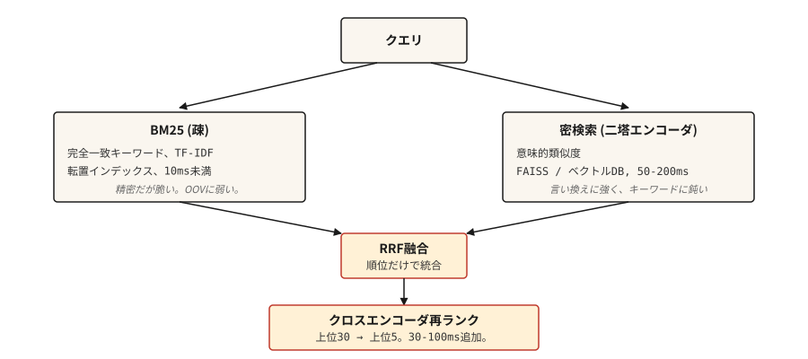

# Bilgi Erişimi ve Arama

> BM25 hassas ancak kırılgandır. Yoğun geniş bir ağ oluşturur ancak anahtar kelimeleri kaçırır. Hibrit 2026'nın varsayılanıdır. Geriye kalan her şey ayarlanıyor.

**Tür:** Yapım
**Diller:** Python
**Önkoşullar:** Aşama 5 · 02 (BoW + TF-IDF), Aşama 5 · 04 (GloVe, FastText, Subword)
**Süre:** ~75 dakika

## Sorun

Kullanıcı "biri para almak için yalan söylerse ne olur" yazar ve bunu gerçekten kapsayan yasayı bulmayı bekler: "Bölüm 420 IPC." Bir anahtar kelime araması onu tamamen gözden kaçırır (paylaşılan kelime dağarcığı yoktur). embedding'ler yasal metin konusunda eğitilmemişse anlamsal arama bunu kaçırır. Gerçek aramanın her ikisini de ele alması gerekir.

IR, her RAG sisteminin, her arama çubuğunun, her doküman sitesinin belirsiz aramasının altındaki boru hattıdır. Üretimde çalışan 2026 mimarisi tek bir yöntem değildir. Her biri bir öncekinin başarısızlıklarını yakalayan tamamlayıcı yöntemler zinciridir.

Bu ders her bir parçayı ve her birinde başarısız olan isimleri oluşturur.

## Konsept



Dört katman. İhtiyacınız olanları seçin.

1. **Seyrek erişim (BM25).** Hızlı, tam eşleşmelerde hassas, anlambilim açısından berbat. Ters çevrilmiş bir indeksin üzerinden geçin. Milyonlarca belgede sorgu başına 10 ms'nin altında. Mevzuat referanslarını, ürün kodlarını, hata mesajlarını, adlandırılmış varlıkları size doğru şekilde ulaştırır.
2. **Yoğun erişim.** Sorguyu ve belgeleri vektörler halinde kodlayın. En yakın komşu araması. Açıklamaları ve anlamsal benzerliği yakalar. Bir karakter farklılık gösteren tam anahtar kelime eşleşmelerini kaçırır. FAISS veya vektör DB ile sorgu başına 50-200 ms.
3. **Füzyon.** Seyrek ve yoğundan sıralanmış listeleri birleştirin. Karşılıklı Sıralama Füzyonu (RRF), ham puanları (farklı ölçeklerde yaşayan) göz ardı etmesi ve yalnızca sıralama konumlarını kullanması nedeniyle kolay varsayılandır. Ağırlıklı füzyon, alanınız için bir sinyalin baskın olduğunu bildiğiniz durumlarda bir seçenektir.
4. **Çapraz kodlayıcı yeniden sıralaması.** Füzyondan ilk 30'u alın. Çapraz kodlayıcı çalıştırın (sorgu + belge birlikte, her çifti puanlayın). İlk 5'i koruyun. Çapraz kodlayıcılar çift kodlayıcılara göre çift başına daha yavaştır ancak çok daha doğrudur. Bunları yalnızca ilk 30'da çalıştırarak amorti edersiniz.

Üç yönlü erişim (BM25 + yoğun + SPLADE gibi öğrenilmiş-seyrek), 2026 benchmark'de iki yoldan daha iyi performans gösterir ancak öğrenilmiş-seyrek dizinler için altyapıya ihtiyaç duyar. Çoğu takım için iki yönlü artı çapraz kodlayıcı yeniden sıralaması en uygun noktadır.

## İnşa Et

### Adım 1: Sıfırdan BM25

```python
import math
import re
from collections import Counter

TOKEN_RE = re.compile(r"[a-z0-9]+")


def tokenize(text):
    return TOKEN_RE.findall(text.lower())


class BM25:
    def __init__(self, corpus, k1=1.5, b=0.75):
        if not corpus:
            raise ValueError("corpus must not be empty")
        self.corpus = [tokenize(d) for d in corpus]
        self.k1 = k1
        self.b = b
        self.n_docs = len(self.corpus)
        self.avg_dl = sum(len(d) for d in self.corpus) / self.n_docs
        self.df = Counter()
        for doc in self.corpus:
            for term in set(doc):
                self.df[term] += 1

    def idf(self, term):
        n = self.df.get(term, 0)
        return math.log(1 + (self.n_docs - n + 0.5) / (n + 0.5))

    def score(self, query, doc_idx):
        q_tokens = tokenize(query)
        doc = self.corpus[doc_idx]
        dl = len(doc)
        freq = Counter(doc)
        score = 0.0
        for term in q_tokens:
            f = freq.get(term, 0)
            if f == 0:
                continue
            numerator = f * (self.k1 + 1)
            denominator = f + self.k1 * (1 - self.b + self.b * dl / self.avg_dl)
            score += self.idf(term) * numerator / denominator
        return score

    def rank(self, query, top_k=10):
        scored = [(self.score(query, i), i) for i in range(self.n_docs)]
        scored.sort(reverse=True)
        return scored[:top_k]
```

Bilmeye değer iki parametre. `k1=1.5` terim frekansı doygunluğunu kontrol eder; daha yüksek, terim tekrarına daha fazla ağırlık verilmesi anlamına gelir. `b=0.75` uzunluk normalizasyonunu kontrol eder; 0 belge uzunluğunu yok sayar, 1 tamamen normalleştirir. Varsayılanlar, Robertson'un orijinal makaledeki tavsiyeleridir ve nadiren ayarlamaya ihtiyaç duyarlar.

### Adım 2: çift kodlayıcıyla yoğun erişim

```python
from sentence_transformers import SentenceTransformer
import numpy as np


def build_dense_index(corpus, model_id="sentence-transformers/all-MiniLM-L6-v2"):
    encoder = SentenceTransformer(model_id)
    embeddings = encoder.encode(corpus, normalize_embeddings=True)
    return encoder, embeddings


def dense_search(encoder, embeddings, query, top_k=10):
    q_emb = encoder.encode([query], normalize_embeddings=True)
    sims = (embeddings @ q_emb.T).flatten()
    order = np.argsort(-sims)[:top_k]
    return [(float(sims[i]), int(i)) for i in order]
```

Nokta çarpımı kosinüse eşit olacak şekilde embedding'leri L2-normalize edin. `all-MiniLM-L6-v2` 384-dim'dir, hızlıdır ve çoğu İngilizce bilgi alımı için yeterince güçlüdür. Çok dilli çalışmalar için `paraphrase-multilingual-MiniLM-L12-v2` kullanın. En yüksek doğruluk için `bge-large-en-v1.5` veya `e5-large-v2`.

### Adım 3: Karşılıklı Sıra Füzyonu

```python
def reciprocal_rank_fusion(rankings, k=60):
    scores = {}
    for ranking in rankings:
        for rank, (_, doc_idx) in enumerate(ranking):
            scores[doc_idx] = scores.get(doc_idx, 0.0) + 1.0 / (k + rank + 1)
    fused = sorted(scores.items(), key=lambda x: x[1], reverse=True)
    return [(score, doc_idx) for doc_idx, score in fused]
```

`k=60` sabiti orijinal RRF kağıdından gelir. Daha yüksek `k`, sıralama farklılıklarının katkısını düzleştirir; daha düşük `k`, üst sıraların hakim olmasını sağlar. 60, yayınlanan varsayılan değerdir ve nadiren ayar gerektirir.

### Adım 4: karma arama + yeniden sıralama

```python
from sentence_transformers import CrossEncoder

reranker = CrossEncoder("cross-encoder/ms-marco-MiniLM-L-6-v2")


def hybrid_search(query, bm25, encoder, dense_embeddings, corpus, top_k=5, pool_size=30, reranker=reranker):
    sparse_ranking = bm25.rank(query, top_k=pool_size)
    dense_ranking = dense_search(encoder, dense_embeddings, query, top_k=pool_size)
    fused = reciprocal_rank_fusion([sparse_ranking, dense_ranking])[:pool_size]

    pairs = [(query, corpus[doc_idx]) for _, doc_idx in fused]
    scores = reranker.predict(pairs)
    reranked = sorted(zip(scores, [doc_idx for _, doc_idx in fused]), reverse=True)
    return reranked[:top_k]
```

Üç aşama oluşturuldu. BM25 sözcüksel eşleşmeleri bulur. Yoğun anlamsal eşleşmeleri bulur. RRF, puan kalibrasyonuna ihtiyaç duymadan iki sıralamayı birleştirir. Çapraz kodlayıcı, sorgu-belge çiftlerini birlikte kullanarak ilk 30'u yeniden puanlar; bu, iki kodlayıcının kaçırdığı ayrıntılı alaka düzeyini yakalar. İlk 5'i koru.

### Adım 5: değerlendirme

| Metrik | Anlamı |
|--------|---------|
| Geri çağırma@k | Doğru belgenin bulunduğu sorgular arasında ne sıklıkta ilk k'de yer alıyor? |
| MRR (Ortalama Karşılıklı Sıra) | İlgili ilk belgenin ortalaması 1/sıra. |
| nDCG@k | Yalnızca ikili alakalı/değil değil, alaka derecelerini de hesaba katar. |

Özellikle RAG için, av köpeğinin **Recall@k**'si en önemli sayıdır. Alınan sette doğru pasaj yoksa okuyucunuz cevap veremez.

Hata ayıklama ipucu: Başarısız sorgular için seyrek ve yoğun sıralamaları farklılaştırın. Biri doğru belgeyi bulurken diğeri bulamazsa, kelime dağarcığı uyumsuzluğu (düzeltme: eksik yarıyı ekleyin) veya anlamsal belirsizlik (düzeltme: daha iyi embedding'ler veya yeniden sıralama) var demektir.

## Kullan onu

2026 yığını:

| Ölçek | Yığın |
|-------|-------|
| 1k-100k belge | Bellek içi BM25 + `all-MiniLM-L6-v2` embeddings + RRF. Ayrı bir DB yok. |
| 100 bin-10 milyon belge | Yoğun için FAISS veya pgvector + BM25 için Elasticsearch / OpenSearch. Paralel olarak çalıştırın. |
| 10 milyondan fazla belge | Hibrit destekli Qdrant / Weaviate / Vespa / Milvus. Çapraz kodlayıcı yeniden sıralamada ilk 30'da yer aldı. |
| En iyi kalitede sınır | Üç yollu (BM25 + yoğun + SPLADE) + ColBERT geç etkileşim yeniden sıralaması |

Neyi seçerseniz seçin, değerlendirme için bütçe ayırın. benchmark'nin uçtan uca RAG doğruluğundan önce Benchmark geri çağırma. Bir okuyucu, av köpeğinin kaçırdığı şeyi düzeltemez.

### 2026 yapımı RAG'dan zorlukla kazanılan dersler

- **RAG hatalarının %80'i modelden değil, alım ve parçalamadan kaynaklanır.** Ekipler, LLM'leri değiştirmek ve prompt'leri ayarlamak için haftalar harcarken, alma işlemi her üç sorguda bir sessizce yanlış bağlam döndürür. Önce parçalamayı düzeltin.
- **Parçalama stratejisi parça boyutundan daha önemlidir.** Sabit boyutlu bölmeler, kesme tablolarını, kodu ve iç içe geçmiş başlıkları ayırır. Cümle uyumlu varsayılandır; Anlamsal veya LLM tabanlı parçalama, teknik belgeler ve ürün kılavuzları için karşılığını verir.
- **Ebeveyn-doc modeli.** Hassasiyet için küçük "çocuk" parçalarını alın. Aynı ana bölümden birden fazla alt öğe göründüğünde, bağlamı korumak için üst bloğun yerini değiştirin. Bu, yeniden eğitim gerektirmeden yanıt kalitesini sürekli olarak artırır.
- **k_rerank=3 genellikle en uygunudur.** Yanıt kalitesini yükseltmeden token maliyetini ve oluşturma gecikmesini artıran her ekstra parça geçilir. Sizin için k=8 hala k=3'ten daha iyiyse, yeniden sıralama düşük performans gösteriyor demektir.
- **HyDE / sorgu genişletme.** Sorgudan varsayımsal bir yanıt oluşturun, bunu yerleştirin ve alın. Kısa sorularla uzun belgeler arasındaki ifade boşluğunu kapatır. Eğitim gerektirmeyen ücretsiz hassas kaldırma.
- **Bağlam bütçesi 8K token'nin altında.** Bu sınırdaki tutarlı isabetler, yeniden sıralama eşiğinin çok gevşek olduğu anlamına gelir.
- **Sürüm her şeyi.** Prompt'ler, parçalama kuralları, embedding modeli, yeniden sıralama. Herhangi bir sapma sessizce yanıt kalitesini bozar. Güvenilirlik, bağlam hassasiyeti ve yanıtlanmamış soru oranı blok regresyonlarını kullanıcılar görmeden önce CI kapıları.
- **Üç yönlü erişim (BM25 + yoğun + SPLADE gibi öğrenilmiş-seyrek), özellikle özel isimleri anlambilimle karıştıran sorgular için 2026 benchmark'de iki yoldan daha iyi performans gösterir**. Altyapı SPLADE dizinlerini desteklediğinde gönderin.

Doğru geri getirme tasarımı, 2026 endüstri ölçümlerine göre halüsinasyonları %70-90 oranında azaltıyor. RAG performans kazanımlarının çoğu, fine-tuning modelinden değil, daha iyi erişimden kaynaklanır.

## Gönderin

`outputs/skill-retrieval-picker.md` olarak kaydet:

```markdown
---
name: retrieval-picker
description: Pick a retrieval stack for a given corpus and query pattern.
version: 1.0.0
phase: 5
lesson: 14
tags: [nlp, retrieval, rag, search]
---

Given requirements (corpus size, query pattern, latency budget, quality bar, infra constraints), output:

1. Stack. BM25 only, dense only, hybrid (BM25 + dense + RRF), hybrid + cross-encoder rerank, or three-way (BM25 + dense + learned-sparse).
2. Dense encoder. Name the specific model. Match to language(s), domain, and context length.
3. Reranker. Name the specific cross-encoder model if used. Flag that rerank adds 30-100ms latency on top-30.
4. Evaluation plan. Recall@10 is the primary retriever metric. MRR for multi-answer. Baseline first, incremental improvements measured against it.

Refuse to recommend dense-only for corpora with named entities, error codes, or product SKUs unless the user has evidence dense handles exact matches. Refuse to skip reranking for high-stakes retrieval (legal, medical) where the final top-5 decides the user's answer.
```

## Egzersizler

1. **Kolay.** Yukarıdaki `hybrid_search`'yi 500 belgelik bir derlem üzerinde uygulayın. 20 sorguyu test edin. Geri çağırmayı 5'te yalnızca BM25, yalnızca yoğun ve hibrit arasında karşılaştırın.
2. **Orta.** MRR hesaplamasını ekleyin. Doğru olduğu bilinen bir belgeye sahip her test sorgusu için, BM25, yoğun ve karma sıralamalarda doğru belgenin sıralamasını bulun. Her biri için MRR'yi rapor edin.
3. **Zor.** MultipleNegativesRankingLoss (Cümle Transformer'ler) kullanarak etki alanınızdaki yoğun bir kodlayıcıya ince ayar yapın. 500 sorgu-belge çiftinden oluşan bir eğitim seti oluşturun. İnce ayar öncesi ve sonrası geri çağırmayı karşılaştırın.

## Anahtar Terimler

| Dönem | İnsanlar ne diyor | Aslında ne anlama geliyor |
|------|-----------------|-----------------------|
| BM25 | Anahtar kelime arama | Okapi BM25. Belgeleri terim sıklığına, IDF'ye ve uzunluğa göre puanlar. |
| Yoğun alım | Vektör arama | Sorguyu + belgeyi vektörlere kodlayın, en yakın komşuları bulun. |
| Çift kodlayıcı | Embedding modeli | Sorguyu ve belgeyi bağımsız olarak kodlar. Sorgu zamanında hızlı. |
| Çapraz kodlayıcı | Yeniden sıralama modeli | Sorgu + belgeyi birlikte kodlar. Yavaş ama doğru. |
| RRF | Sıra füzyonu | `1/(k + rank)`'yi toplayarak iki sıralamayı birleştirin. |
| Geri çağırma@k | Alma metriği | İlgili bir dokümanın ilk k'de yer aldığı sorguların oranı. |

## Daha Fazla Okuma

- [Robertson ve Zaragoza (2009). Olasılıksal Uygunluk Framework: BM25 ve Ötesi](https://www.staff.city.ac.uk/~sbrp622/papers/foundations_bm25_review.pdf) — kesin BM25 tedavisi.
- [Karpukhin ve ark. (2020). Açık Alan QA için Yoğun Geçiş Erişimi](https://arxiv.org/abs/2004.04906) — DPR, standart çift kodlayıcı.
- [Formal ve diğerleri. (2021). SPLADE: Seyrek Sözcük ve Genişletme Modeli](https://arxiv.org/abs/2107.05720) — yoğun ile boşluğu kapatan öğrenilmiş seyrek av köpeği.
- [Cormack, Clarke, Büttcher (2009). Karşılıklı Sıralama Füzyonu, Condorcet ve bireysel Sıralama Öğrenme Yöntemlerinden daha iyi performans gösterir](https://plg.uwaterloo.ca/~gvcormac/cormacksigir09-rrf.pdf) — RRF kağıdı.
- [Hattab ve Zaharia (2020). ColBERT: Verimli ve Etkili Geçiş Araması](https://arxiv.org/abs/2004.12832) — geç etkileşim erişimi.
