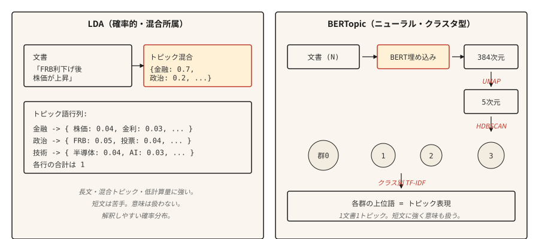

# Konu Modelleme — LDA ve BERTopic

> LDA: belgeler konuların karışımıdır, konular kelimelere göre dağılımlardır. BERTopic: embedding alanındaki belgeler kümesi, kümeler konulardır. Aynı amaç, farklı ayrıştırmalar.

**Tür:** Öğren
**Diller:** Python
**Önkoşullar:** Aşama 5 · 02 (BoW + TF-IDF), Aşama 5 · 03 (Word2Vec)
**Süre:** ~45 dakika

## Sorun

10.000 müşteri destek bildiriminiz, 50.000 haber makaleniz veya 200.000 tweet'iniz var. Koleksiyonun neyle ilgili olduğunu okumadan bilmeniz gerekiyor. Etiketli kategorileriniz yok. Kaç kategorinin var olduğunu bile bilmiyorsun.

Konu modelleme, denetim olmadan buna yanıt verir. Ona bir külliyat verin, küçük bir dizi tutarlı konu alın ve her belge için bu konuların dağıtımını yapın.

İki algoritmik aile hakimdir. LDA (2003) her belgeyi gizli konuların bir karışımı olarak ve her konuyu kelimelere göre bir dağılım olarak ele alır. Inference Bayesian'dır. Karma üyelikli konu atamalarına ve açıklanabilir kelime düzeyinde olasılık dağılımlarına ihtiyaç duyduğunuz durumlarda hâlâ üretimde gönderilir.

BERTopic (2020), belgeleri BERT ile kodlar, UMAP ile boyutluluğu azaltır, HDBSCAN ile kümeler ve sınıf tabanlı TF-IDF aracılığıyla konu sözcüklerini çıkarır. Kısa metinlerde, sosyal medyada ve anlamsal benzerliğin sözcük örtüşmesinden daha önemli olduğu her yerde kazanır. Bir belge bir konuyu alır; bu da uzun biçimli içerik için bir sınırlamadır.

Bu ders her ikisi için de sezgi geliştirir ve belirli bir derleme için hangisinin seçileceğinin isimlerini verir.

## Konsept



**LDA üretken hikayesi.** Her konu kelimeler üzerinden bir dağılımdır. Her belge konuların bir karışımıdır. Bir belgede bir sözcük oluşturmak için belgenin karışımından bir konuyu örnekleyin, ardından o konunun dağılımından bir sözcüğü örnekleyin. Inference bunu tersine çevirir: Gözlemlenen sözcüklere göre, belge başına konu dağılımını ve konu başına sözcük dağılımını çıkarın. Çökmüş Gibbs örneklemesi veya değişken Bayes hesaplamayı yapar.

Anahtar LDA çıkışı:

- `doc_topic`: `(n_docs, n_topics)` matrisi, her satırın toplamı 1'dir (belgenin konu karışımı).
- `topic_word`: `(n_topics, vocab_size)` matrisi, her satırın toplamı 1'dir (konunun kelime dağılımı).

**BERTopic boru hattı.**

1. Her belgeyi transformer (e.g., `all-MiniLM-L6-v2`) cümlesiyle kodlayın. 384 loş vektörler.
2. UMAP ile boyutsallığı ~5 boyuta düşürün. BERT embedding'ler kümeleme için fazla loş.
3. HDBSCAN ile kümeleyin. Yoğunluğa dayalı, değişken boyutlu kümeler ve "aykırı değer" etiketi üretir.
4. Her küme için, en önemli kelimeleri çıkarmak üzere kümenin belgeleri üzerinde sınıf tabanlı TF-IDF'yi hesaplayın.

Çıktı, belge başına bir konudur (artı -1 aykırı değer etiketi). İsteğe bağlı olarak HDBSCAN'ın olasılık vektörü aracılığıyla yumuşak üyelik.

## İnşa Et

### Adım 1: Scikit-learn aracılığıyla LDA

```python
from sklearn.feature_extraction.text import CountVectorizer
from sklearn.decomposition import LatentDirichletAllocation
import numpy as np


def fit_lda(documents, n_topics=5, max_features=1000):
    cv = CountVectorizer(
        max_features=max_features,
        stop_words="english",
        min_df=2,
        max_df=0.9,
    )
    X = cv.fit_transform(documents)
    lda = LatentDirichletAllocation(
        n_components=n_topics,
        random_state=42,
        max_iter=50,
        learning_method="online",
    )
    doc_topic = lda.fit_transform(X)
    feature_names = cv.get_feature_names_out()
    return lda, cv, doc_topic, feature_names


def print_top_words(lda, feature_names, n_top=10):
    for idx, topic in enumerate(lda.components_):
        top_idx = np.argsort(-topic)[:n_top]
        words = [feature_names[i] for i in top_idx]
        print(f"topic {idx}: {' '.join(words)}")
```

Uyarı: engellenecek kelimeler kaldırıldı, min_df ve max_df nadir ve her yerde bulunan terimleri filtreler, CountVectorizer (TfidfVectorizer değil), çünkü LDA ham sayımlar bekler.

### Adım 2: BERTopic (üretim)

```python
from bertopic import BERTopic

topic_model = BERTopic(
    embedding_model="sentence-transformers/all-MiniLM-L6-v2",
    min_topic_size=15,
    verbose=True,
)

topics, probs = topic_model.fit_transform(documents)
info = topic_model.get_topic_info()
print(info.head(20))
valid_topics = info[info["Topic"] != -1]["Topic"].tolist()
for topic_id in valid_topics[:5]:
    print(f"topic {topic_id}: {topic_model.get_topic(topic_id)[:10]}")
```

`Topic != -1` üzerindeki filtre BERTopic'in aykırı değer kümesini düşürür (HDBSCAN belgeleri kümelenemez). `min_topic_size`, HDBSCAN'ın minimum küme boyutunu kontrol eder; BERTopic'in kütüphane varsayılanı 10'dur. Bu örnek, dersin ölçeği için bunu açıkça 15'e ayarlar. 10.000'den fazla belge içeren derlemeler için sayıyı 50'ye veya 100'e yükseltin.

### 3. Adım: değerlendirme

Her iki yöntem de konu sözcüklerinin çıktısını verir. Sorun bu sözlerin tutarlı olup olmadığıdır.

- **Konu tutarlılığı (c_v).** Kayan pencere bağlamlarında en iyi kelime çiftlerinin NPMI'sini (normalleştirilmiş noktasal karşılıklı bilgi) birleştirir, puanları konu vektörleri halinde toplar ve bu vektörleri kosinüs benzerliği yoluyla karşılaştırır. Daha yüksek daha iyidir. `gensim.models.CoherenceModel`'yi `coherence="c_v"` ile kullanın.
- **Konu çeşitliliği.** Tüm konuların en çok kullanılan kelimeleri arasındaki benzersiz kelimelerin oranı. Daha yüksek daha iyidir (konular örtüşmez).
- **Niteliksel inceleme.** Her konunun en önemli sözcüklerini okuyun. Gerçek bir şeyin adını veriyorlar mı? İnsan yargısı hala son savunma hattıdır.

## Hangisini ne zaman seçmeli

| Durum | Seç |
|-----------|------|
| Kısa metin (tweetler, incelemeler, başlıklar) | BER Konusu |
| Konu karışımları içeren uzun belgeler | LDA |
| GPU yok / sınırlı işlem | LDA veya NMF |
| Belge düzeyinde çok konulu dağıtımlara ihtiyacınız var | LDA |
| Konu etiketleme için Yüksek Lisans entegrasyonu | BERTopic (doğrudan destek) |
| Kaynak kısıtlı uç deployment | LDA |
| Maksimum anlamsal tutarlılık | BER Konusu |

En büyük pratik husus belge uzunluğudur. BERT embedding'ler kesilir; LDA, uzunluğu ne olursa olsun çalışmayı sayar. embedding modelinin bağlamından daha uzun belgeler için yığın + toplama veya LDA kullanın.

## Kullan onu

2026 yığını:

- **BERTopic.** Kısa metin ve anlambilimin önemli olduğu her şey için varsayılandır.
- **`gensim.models.LdaModel`.** Üretim için klasik LDA, olgun, savaşta test edilmiş.
- **`sklearn.decomposition.LatentDirichletAllocation`.** Deneyler için kolay LDA.
- **NMF.** Negatif olmayan matris çarpanlarına ayırma. LDA'ya hızlı bir alternatif, kısa metinde karşılaştırılabilir kalite.
- **Top2Vec.** BERTopic'e benzer tasarım. Daha küçük bir topluluk ama bazı benchmark'lerde iyi.
- **FASTopic.** Çok büyük şirketlerde BERTopic'ten daha yeni ve daha hızlı.
- **LLM tabanlı etiketleme.** Herhangi bir kümelemeyi çalıştırın, ardından her kümeyi adlandırmak için prompt bir model kullanın.

## Gönderin

`outputs/skill-topic-picker.md` olarak kaydet:

```markdown
---
name: topic-picker
description: Pick LDA or BERTopic for a corpus. Specify library, knobs, evaluation.
version: 1.0.0
phase: 5
lesson: 15
tags: [nlp, topic-modeling]
---

Given a corpus description (document count, avg length, domain, language, compute budget), output:

1. Algorithm. LDA / NMF / BERTopic / Top2Vec / FASTopic. One-sentence reason.
2. Configuration. Number of topics: `recommended = max(5, round(sqrt(n_docs)))`, clamped to 200 for corpora under 40,000 docs; permit >200 only when the corpus is genuinely large (>40k) and note the increased compute cost. `min_df` / `max_df` filters and embedding model for neural approaches also belong here.
3. Evaluation. Topic coherence (c_v) via `gensim.models.CoherenceModel`, topic diversity, and a 20-sample human read.
4. Failure mode to probe. For LDA, "junk topics" absorbing stopwords and frequent terms. For BERTopic, the -1 outlier cluster swallowing ambiguous documents.

Refuse BERTopic on documents longer than the embedding model's context window without a chunking strategy. Refuse LDA on very short text (tweets, reviews under 10 tokens) as coherence collapses. Flag any n_topics choice below 5 as likely wrong; flag >200 on corpora under 40k docs as likely over-splitting.
```

## Egzersizler

1. **Kolay.** LDA'yı 20 Haber Grubu dataset'deki 5 konuya sığdırın. Konu başına en iyi 10 kelimeyi yazdırın. Her konuyu elle etiketleyin. Algoritma gerçek kategorileri buldu mu?
2. **Orta.** BERTopic'i aynı 20 Haber Grubu alt kümesine sığdırın. Bulunan konu sayısını, en çok kullanılan kelimeleri ve niteliksel tutarlılığı LDA'ya göre karşılaştırın. Hangisi gerçek kategorileri daha temiz bir şekilde ortaya çıkarır?
3. **Zor.** Derleminizde hem LDA hem de BERTopic için c_v tutarlılığını hesaplayın. Her birini 5, 10, 20, 50 konu ile çalıştırın. Konu tutarlılığı ve konu sayısı. Konu sayımlarında hangi yöntemin daha kararlı olduğunu bildirin.

## Anahtar Terimler

| Dönem | İnsanlar ne diyor | Aslında ne anlama geliyor |
|------|-----------------|-----------------------|
| Konu | Derlemenin ilgili olduğu bir şey | Kelimeler (LDA) veya benzer belgeler kümesi (BERTopic) üzerinden olasılık dağılımı. |
| Karma üyelik | Belge birden fazla konudur | LDA her belgeye tüm konulara ilişkin bir dağıtım atar. |
| UMAP | Boyut azaltma | Yerel yapıyı koruyan çoklu öğrenme; BERTopic'te kullanılır. |
| HDBSCAN | Yoğunluk kümeleme | Değişken boyutlu kümeleri bulur; aykırı değerler için "gürültü" etiketi (-1) üretir. |
| c_v tutarlılık | Konu kalitesi ölçüsü | Kayan pencerelerde en çok konuşulan konu kelimelerinin ortalama noktasal karşılıklı bilgisi. |

## Daha Fazla Okuma

- [Blei, Ng, Ürdün (2003). Gizli Dirichlet Tahsisi](https://www.jmlr.org/papers/volume3/blei03a/blei03a.pdf) — LDA belgesi.
- [Grootendorst (2022). BERTopic: Sınıf tabanlı TF-IDF prosedürüyle sinirsel konu modellemesi](https://arxiv.org/abs/2203.05794) — BERTopic makalesi.
- [Röder, İkisi de, Hinneburg (2015). Konu Tutarlılığı Ölçütlerinin Uzayını Keşfetmek](https://svn.aksw.org/papers/2015/WSDM_Topic_Evaluation/public.pdf) — c_v ve arkadaşlarını tanıtan makale.
- [BERTopic belgeleri](https://maartengr.github.io/BERTopic/) — üretim referansı. Mükemmel örnekler.
