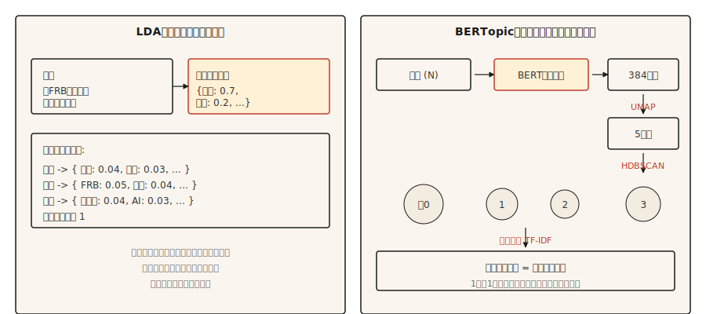

# 主题建模 —— LDA 与 BERTopic

> 译注：本文译自同目录 [`en.md`](./en.md)。术语遵循仓根 [TRANSLATION_GUIDE.md](../../../../TRANSLATION_GUIDE.md)。

> LDA：文档是主题的混合，主题是词的分布。BERTopic：文档在 embedding 空间中聚成簇，簇就是主题。目标相同，分解方式不同。

**Type:** Learn
**Languages:** Python
**Prerequisites:** Phase 5 · 02 (BoW + TF-IDF), Phase 5 · 03 (Word2Vec)
**Time:** ~45 minutes

## 问题（The Problem）

你手上有 10,000 条客服工单、50,000 篇新闻文章，或者 200,000 条推文。你需要在不通读的前提下知道这堆内容到底在讲什么。你没有标注好的类别。你甚至不知道总共有几个类别。

主题建模在无监督下回答这个问题。给它一份语料，它返回一小组连贯的主题，并为每篇文档给出一个在这些主题上的分布。

主流的算法分两大家族。LDA（2003）把每篇文档当成潜在主题的混合，把每个主题当成词上的分布。推断采用贝叶斯方法。在需要混合归属（mixed-membership）的主题分配、以及可解释的词级概率分布的生产场景中，它至今仍在用。

BERTopic（2020）用 BERT 编码文档，用 UMAP 降维，用 HDBSCAN 聚类，再通过基于类别的 TF-IDF 抽取主题词。它在短文本、社交媒体，以及任何「语义相似度比词面重叠更重要」的场景上占优。代价是一篇文档只能归到一个主题，对长文内容是个限制。

本节为两者建立直觉，并说清楚什么样的语料应该选哪一种。

## 概念（The Concept）



**LDA 的生成故事。** 每个主题是词上的一个分布。每篇文档是主题的混合。要在某篇文档里生成一个词，先从该文档的主题混合中采样一个主题，再从该主题的词分布中采样一个词。推断（inference）反过来做：给定观测到的词，反推每篇文档的主题分布、以及每个主题的词分布。具体数学由 collapsed Gibbs 采样或变分贝叶斯（variational Bayes）完成。

LDA 的关键输出：

- `doc_topic`：形状 `(n_docs, n_topics)` 的矩阵，每行求和为 1（一篇文档的主题混合）。
- `topic_word`：形状 `(n_topics, vocab_size)` 的矩阵，每行求和为 1（一个主题的词分布）。

**BERTopic 流水线。**

1. 用 sentence transformer（如 `all-MiniLM-L6-v2`）对每篇文档做 embedding，得到 384 维向量。
2. 用 UMAP 把维度降到约 5 维。BERT embedding 维度太高，不利于聚类。
3. 用 HDBSCAN 聚类。基于密度，生成大小可变的簇，并产生一个「离群」标签。
4. 对每个簇，在簇内文档上计算基于类别的 TF-IDF，抽取顶部词。

输出是「每篇文档一个主题」（外加一个 -1 离群标签）。可选地，通过 HDBSCAN 的概率向量得到一个软归属。

## 动手实现（Build It）

### Step 1: LDA via scikit-learn

```python
from sklearn.feature_extraction.text import CountVectorizer
from sklearn.decomposition import LatentDirichletAllocation
import numpy as np


def fit_lda(documents, n_topics=5, max_features=1000):
    cv = CountVectorizer(
        max_features=max_features,
        stop_words="english",
        min_df=2,
        max_df=0.9,
    )
    X = cv.fit_transform(documents)
    lda = LatentDirichletAllocation(
        n_components=n_topics,
        random_state=42,
        max_iter=50,
        learning_method="online",
    )
    doc_topic = lda.fit_transform(X)
    feature_names = cv.get_feature_names_out()
    return lda, cv, doc_topic, feature_names


def print_top_words(lda, feature_names, n_top=10):
    for idx, topic in enumerate(lda.components_):
        top_idx = np.argsort(-topic)[:n_top]
        words = [feature_names[i] for i in top_idx]
        print(f"topic {idx}: {' '.join(words)}")
```

注意几点：去停用词；用 min_df 与 max_df 过滤掉过稀少和过普遍的词；用 CountVectorizer（不是 TfidfVectorizer），因为 LDA 期待原始计数。

### Step 2: BERTopic (production)

```python
from bertopic import BERTopic

topic_model = BERTopic(
    embedding_model="sentence-transformers/all-MiniLM-L6-v2",
    min_topic_size=15,
    verbose=True,
)

topics, probs = topic_model.fit_transform(documents)
info = topic_model.get_topic_info()
print(info.head(20))
valid_topics = info[info["Topic"] != -1]["Topic"].tolist()
for topic_id in valid_topics[:5]:
    print(f"topic {topic_id}: {topic_model.get_topic(topic_id)[:10]}")
```

`Topic != -1` 这个过滤把 BERTopic 的离群桶（HDBSCAN 没能聚起来的文档）丢掉。`min_topic_size` 控制 HDBSCAN 的最小簇大小；BERTopic 库默认是 10。本例为本节的语料规模显式设成 15。语料超过 10,000 篇时，调到 50 或 100。

### Step 3: evaluation

两种方法都会输出主题词。问题在于这些词到底是否连贯。

- **主题连贯度（c_v）。** 把顶部词两两组合在滑动窗口上下文里算 NPMI（normalized pointwise mutual information，归一化点互信息），把分数聚合成主题向量，再用余弦相似度比较这些向量。越高越好。用 `gensim.models.CoherenceModel`，参数 `coherence="c_v"`。
- **主题多样性（topic diversity）。** 所有主题顶部词集合中唯一词的占比。越高越好（主题之间不互相重叠）。
- **定性检查。** 读一遍每个主题的顶部词。它们能不能命名一个真实的事物？人类判断仍然是最后一道防线。

## 何时选哪一个（When to pick which）

| Situation | Pick |
|-----------|------|
| Short text (tweets, reviews, headlines) | BERTopic |
| Long documents with topic mixtures | LDA |
| No GPU / limited compute | LDA or NMF |
| Need document-level multi-topic distributions | LDA |
| LLM integration for topic labeling | BERTopic (direct support) |
| Resource-constrained edge deployment | LDA |
| Max semantic coherence | BERTopic |

实践中最大的考量是文档长度。BERT embedding 会截断；LDA 的计数对任意长度都成立。对于超过 embedding 模型 context window 的文档，要么切片（chunk）后聚合，要么直接用 LDA。

## 用起来（Use It）

2026 年的栈：

- **BERTopic。** 短文本与「语义重要」的场景默认选它。
- **`gensim.models.LdaModel`。** 经典 LDA，生产成熟、久经考验。
- **`sklearn.decomposition.LatentDirichletAllocation`。** 做实验时方便上手的 LDA。
- **NMF。** 非负矩阵分解。LDA 的快速替代品，在短文本上质量相当。
- **Top2Vec。** 设计与 BERTopic 类似。社区更小，但在某些基准上表现不错。
- **FASTopic。** 较新，在超大语料上比 BERTopic 更快。
- **基于 LLM 的标注。** 任意聚类跑完之后，prompt 一个模型来给每个簇命名。

## 上线部署（Ship It）

保存为 `outputs/skill-topic-picker.md`：

```markdown
---
name: topic-picker
description: Pick LDA or BERTopic for a corpus. Specify library, knobs, evaluation.
version: 1.0.0
phase: 5
lesson: 15
tags: [nlp, topic-modeling]
---

Given a corpus description (document count, avg length, domain, language, compute budget), output:

1. Algorithm. LDA / NMF / BERTopic / Top2Vec / FASTopic. One-sentence reason.
2. Configuration. Number of topics: `recommended = max(5, round(sqrt(n_docs)))`, clamped to 200 for corpora under 40,000 docs; permit >200 only when the corpus is genuinely large (>40k) and note the increased compute cost. `min_df` / `max_df` filters and embedding model for neural approaches also belong here.
3. Evaluation. Topic coherence (c_v) via `gensim.models.CoherenceModel`, topic diversity, and a 20-sample human read.
4. Failure mode to probe. For LDA, "junk topics" absorbing stopwords and frequent terms. For BERTopic, the -1 outlier cluster swallowing ambiguous documents.

Refuse BERTopic on documents longer than the embedding model's context window without a chunking strategy. Refuse LDA on very short text (tweets, reviews under 10 tokens) as coherence collapses. Flag any n_topics choice below 5 as likely wrong; flag >200 on corpora under 40k docs as likely over-splitting.
```

## 练习（Exercises）

1. **简单。** 在 20 Newsgroups 数据集上用 5 个主题拟合 LDA。打印每个主题的前 10 个词。手工给每个主题打标签。算法找到的是不是真实类别？
2. **中等。** 在同样的 20 Newsgroups 子集上拟合 BERTopic。把找到的主题数、顶部词、定性连贯度与 LDA 做比较。哪种方法更干净地浮现了真实类别？
3. **困难。** 在你自己的语料上分别为 LDA 和 BERTopic 计算 c_v 连贯度。分别用 5、10、20、50 个主题各跑一遍。画连贯度对主题数的曲线。报告哪种方法在不同主题数下更稳定。

## 关键术语（Key Terms）

| Term | What people say | What it actually means |
|------|-----------------|-----------------------|
| Topic | A thing the corpus is about | A probability distribution over words (LDA) or a cluster of similar documents (BERTopic). |
| Mixed membership | Doc is multiple topics | LDA assigns each document a distribution over all topics. |
| UMAP | Dimensionality reduction | Manifold learning that preserves local structure; used in BERTopic. |
| HDBSCAN | Density clustering | Finds variable-size clusters; produces "noise" label (-1) for outliers. |
| c_v coherence | Topic quality metric | Average pointwise mutual information of top topic words within sliding windows. |

## 延伸阅读（Further Reading）

- [Blei, Ng, Jordan (2003). Latent Dirichlet Allocation](https://www.jmlr.org/papers/volume3/blei03a/blei03a.pdf) — LDA 原论文。
- [Grootendorst (2022). BERTopic: Neural topic modeling with a class-based TF-IDF procedure](https://arxiv.org/abs/2203.05794) — BERTopic 原论文。
- [Röder, Both, Hinneburg (2015). Exploring the Space of Topic Coherence Measures](https://svn.aksw.org/papers/2015/WSDM_Topic_Evaluation/public.pdf) — 提出 c_v 及其相关指标的论文。
- [BERTopic documentation](https://maartengr.github.io/BERTopic/) — 生产参考文档，示例非常充实。
