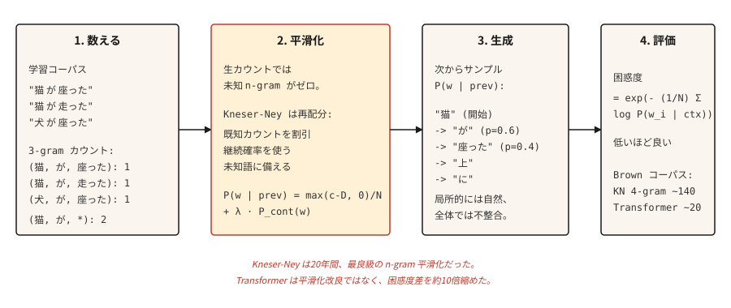

# Transformer'lardan Önce Metin Oluşturma — N-gram Dil Modelleri

> Bir kelime şaşırtıcıysa model kötüdür. Şaşkınlık sürprizi bir sayı haline getirir. Pürüzsüzleştirme onu sonlu tutar.

**Tür:** Yapım
**Diller:** Python
**Önkoşullar:** Aşama 5 · 01 (Metin İşleme), Aşama 2 · 14 (Naive Bayes)
**Süre:** ~45 dakika

## Sorun

transformer'lardan önce, RNN'lerden önce, embedding kelimelerinden önce, bir dil modeli, önceki `n-1` kelimeyi ne sıklıkta takip ettiğini sayarak bir sonraki kelimeyi tahmin ediyordu. "Kedi" → "oturdu" 47 kez sayın, "kedi" → 12 kez "atladı", "kedi" → "buzdolabı" 0 kez sayın. Bir olasılık dağılımı elde etmek için normalleştirin.

Bu bir n-gram dil modelidir. 1980'den 2015'e kadar her konuşma tanıyıcıyı, her yazım denetleyiciyi ve tüm ifadeye dayalı makine çeviri sistemini çalıştırdı. Ucuz cihaz içi dil modellemeye ihtiyaç duyduğunuzda hala çalışıyor.

İlginç olan sorun, görülmeyen n-gramlar hakkında ne yapılacağıdır. Ham sayıma dayalı bir model, görmediği herhangi bir şeye sıfır olasılık atar; bu felakettir çünkü cümleler uzundur ve neredeyse her uzun cümle en az bir görünmeyen dizi içerir. Elli yıllık yumuşatma araştırması bunu düzeltti. Sonuç olarak Kneser-Ney düzgünleştirmesi elde edildi ve modern deep learning onun ampirik geleneğini miras aldı.

## Konsept



### Tahmin oyunu

Bu mekanizmalardan herhangi biri var olmadan önce, bir deney dil modelinin ne olduğunu tanımladı. İngilizce bir cümlenin sonraki harfini örtün. Birinden doğru tahminde bulununcaya kadar her seferinde bir tahminde bulunmasını isteyin. Tahmin sayısını yazın. Birkaç yüz harf için tekrarlayın.

Tahmin sayıları önemsiz değildir. Bunlar metnin kayıpsız yeniden kodlanmasıdır: sayma sırasını ikinci, aynı tahminciye verin ve her harfi yeniden oluşturabilirler, çünkü her konumda tam olarak hangi tahminin önce geldiğini bilirler. Daha az sembolle yeniden kodlayabileceğiniz bir mesaj, sembol başına daha az bilgi taşır, dolayısıyla tahmin sayımı istatistikleri İngilizcenin entropisine bir tavan koyar.

Shannon bunu 1951'de yürüttü ve hala bu alanda geçerli olan bir sayı elde etti. 27 sembollü bir alfabe (26 harf artı boşluk), harf başına `log2(27) ≈ 4.75` bit taşıyabilir. 100 harf bağlamına sahip insan tahminciler, harf başına 0,6 ila 1,3 bit arasında bir sonuç elde etti. İngilizce kabaca dörtte üçü zorunlu hareketlerden oluşur. Bir modelin öğrenmesi gereken yapı, herhangi bir modelin öğrenmesinden önce ölçüldü.

O zamandan beri her dil modeli bu oyunun mekanik bir oyuncusudur ve bu dersteki her değerlendirme numarası oyunun puanlandırıldığı yerdir:

- **Çapraz entropi kaybı**, modelin sembol başına ihtiyaç duyduğu ortalama bit sayısıdır. Bir LM'yi eğitmek, kelimenin tam anlamıyla tahmin oyunundaki puanını en aza indirmektir.
- **Şaşkınlık** `2^bits` (veya `e^nats`)'dır: tahminden sonra modelin hâlâ karşılaştığı dallanma faktörü. 27 sembolün üzerinde tek tip tahmin yapmak şaşkınlıktır 27; Harf başına 1 bitlik bir oyuncunun şaşkınlığı 2'dir.
- **Bağlam uzunluğu oyuncunun hafızasıdır.** Bir trigram modeli iki token hafızayla oynatılır. Bir transformer aynı oyunu 100K tokens ile oynuyor. Kurallar hiçbir zaman değişmedi; oyuncu daha iyi hale geldi.

İzlemeye bir birim geçiş: oyun, bit cinsinden (`log2`) harf başına puan alırken, aşağıdaki n-gram formülleri nats'ta (doğal log) kelime başına token puan alır - ve nats'taki şaşkınlık `e^H`, bit cinsinden `2^H`'ye eşit olduğundan, iki görünüm farklı birimlerde aynı ölçümdür.

```figure
prediction-game
```

**N-gram olasılığı:** `P(w_i | w_{i-n+1}, ..., w_{i-1})`. `n`'i düzeltin (tipik olarak trigramlar için 3, 4 gram için 4). Sayımlardan hesaplayın:

```text
P(w | context) = count(context, w) / count(context)
```

**Sıfır sayım problemi.** Eğitimde görülmeyen herhangi bir n-gramın olasılığı sıfır olur. Brown külliyatı üzerine 2007 yılında yapılan bir araştırma, 4 gramlık bir modelin bile eğitimde görülmeyen 4 gramlık ağırlığın %30'una sahip olduğunu buldu. Herhangi bir gerçek metin üzerinde düzeltme yapmadan değerlendirme yapamazsınız.

**Gelişmişlik sırasına göre yumuşatma yaklaşımları:**

1. **Laplace (bir ekle).** Her sayıma 1 ekleyin. Basit, nadir olaylarda berbat.
2. **Good-Turing.** Olasılık kütlesini, frekansların sıklığına dayalı olarak yüksek frekanslı olaylardan görünmeyen olaylara doğru yeniden tahsis edin.
3. **İnterpolasyon.** N-gram, (n-1)-gram vb. tahminleri ayarlanabilir ağırlıklarla birleştirin.
4. **Geri çekilme.** Eğer n-gramın sıfır sayımı varsa, (n-1)-gram'a geri dönün. Katz'ın geri çekilmesi bunu normalleştiriyor.
5. **Mutlak indirim.** Tüm sayılardan sabit bir indirimi `D` çıkarın, görülmeyenlere yeniden dağıtın.
6. **Kneser-Ney.** Mutlak indirim artı daha düşük dereceli model için akıllıca bir seçim: ham frekans yerine *devam olasılığını* (bir kelimenin kaç bağlamda göründüğünü) kullanın.

Kneser-Ney'in içgörüsü derindir. "San Francisco" yaygın bir bigramdır. Unigram "Francisco" çoğunlukla "San"dan sonra görünür. Naif mutlak indirim "Francisco"ya yüksek unigram olasılığı verir (çünkü sayı yüksektir). Kneser-Ney, "Francisco"nun yalnızca tek bir bağlamda göründüğünü fark ediyor ve buna göre devam etme olasılığını düşürüyor. Sonuç: "Francisco" ile biten yeni bir bigram uygun düşük olasılığı alır.

**Değerlendirme: şaşkınlık.** Uzatılmış bir test setinde kelime başına ortalama negatif log olasılığının üssü. Daha düşük olması daha iyidir. 100'lük bir şaşkınlık, modelin 100 kelime arasından tekdüze bir seçim yapacak kadar karışık olduğu anlamına gelir.

```text
perplexity = exp(- (1/N) * Σ log P(w_i | context_i))
```

```figure
ngram-backoff
```

## İnşa Et

### Adım 1: trigram sayımları

```python
from collections import Counter, defaultdict


def train_ngram(corpus_tokens, n=3):
    ngrams = Counter()
    contexts = Counter()
    for sentence in corpus_tokens:
        padded = ["<s>"] * (n - 1) + sentence + ["</s>"]
        for i in range(len(padded) - n + 1):
            ctx = tuple(padded[i:i + n - 1])
            word = padded[i + n - 1]
            ngrams[ctx + (word,)] += 1
            contexts[ctx] += 1
    return ngrams, contexts


def raw_probability(ngrams, contexts, context, word):
    ctx = tuple(context)
    if contexts.get(ctx, 0) == 0:
        return 0.0
    return ngrams.get(ctx + (word,), 0) / contexts[ctx]
```

Giriş, tokenözelleştirilmiş cümlelerin bir listesidir. Çıktı n gram sayımları ve bağlam sayımlarıdır. `<s>` ve `</s>` cümle sınırlarıdır.

### Adım 2: Laplace yumuşatma

```python
def laplace_probability(ngrams, contexts, vocab_size, context, word):
    ctx = tuple(context)
    numerator = ngrams.get(ctx + (word,), 0) + 1
    denominator = contexts.get(ctx, 0) + vocab_size
    return numerator / denominator
```

Her sayıya 1 ekleyin. Düzleştirir ancak görünmeyen olaylara gereğinden fazla kütle tahsis eder ve nadir bilinen olaylara da zarar verir.

### Adım 3: Kneser-Ney (bigram, enterpolasyonlu)

```python
def kneser_ney_bigram_model(corpus_tokens, discount=0.75):
    unigrams = Counter()
    bigrams = Counter()
    unigram_contexts = defaultdict(set)

    for sentence in corpus_tokens:
        padded = ["<s>"] + sentence + ["</s>"]
        for i, w in enumerate(padded):
            unigrams[w] += 1
            if i > 0:
                prev = padded[i - 1]
                bigrams[(prev, w)] += 1
                unigram_contexts[w].add(prev)

    total_unique_bigrams = sum(len(ctx_set) for ctx_set in unigram_contexts.values())
    continuation_prob = {
        w: len(ctx_set) / total_unique_bigrams for w, ctx_set in unigram_contexts.items()
    }

    context_totals = Counter()
    for (prev, w), count in bigrams.items():
        context_totals[prev] += count

    unique_follow = defaultdict(set)
    for (prev, w) in bigrams:
        unique_follow[prev].add(w)

    def prob(prev, w):
        count = bigrams.get((prev, w), 0)
        denom = context_totals.get(prev, 0)
        if denom == 0:
            return continuation_prob.get(w, 1e-9)
        first_term = max(count - discount, 0) / denom
        lambda_prev = discount * len(unique_follow[prev]) / denom
        return first_term + lambda_prev * continuation_prob.get(w, 1e-9)

    return prob
```

Üç hareketli parça. `continuation_prob` "bu kelimenin kaç farklı bağlamda göründüğünü" yakalar. (Kneser-Ney yeniliği). `lambda_prev`, geri çekilmeyi ağırlıklandırmak için kullanılan, indirimle serbest bırakılan kütledir. Nihai olasılık, indirgenmiş ana terim artı ağırlıklı devam terimidir.

### Adım 4: örneklemeyle metin oluşturma

```python
import random


def generate(prob_fn, vocab, prefix, max_len=30, seed=0):
    rng = random.Random(seed)
    tokens = list(prefix)
    for _ in range(max_len):
        candidates = [(w, prob_fn(tokens[-1], w)) for w in vocab]
        total = sum(p for _, p in candidates)
        r = rng.random() * total
        acc = 0.0
        for w, p in candidates:
            acc += p
            if r <= acc:
                tokens.append(w)
                break
        if tokens[-1] == "</s>":
            break
    return tokens
```

Olasılıkla orantılı örnekleme. Tohum başına her zaman farklı çıktı verir. Işın arama benzeri çıktı için, her adımda argmax'ı seçin (açgözlü) ve küçük bir rastgelelik düğmesi (sıcaklık) ekleyin.

### Adım 5: şaşkınlık

```python
import math


def perplexity(prob_fn, sentences):
    total_log_prob = 0.0
    total_tokens = 0
    for sentence in sentences:
        padded = ["<s>"] + sentence + ["</s>"]
        for i in range(1, len(padded)):
            p = prob_fn(padded[i - 1], padded[i])
            total_log_prob += math.log(max(p, 1e-12))
            total_tokens += 1
    return math.exp(-total_log_prob / total_tokens)
```

Daha düşük olması daha iyidir. Brown korpusu için iyi ayarlanmış 4 gramlık KN modeli 140 civarında şaşkınlığa ulaşır. Bir transformer LM aynı test setinde 15-30'a ulaşır. Aradaki fark yaklaşık 10x. Bu boşluk, alanın ilerlemesinin nedenidir.

## Kullan onu

- **Klasik NLP öğretimi.** Alabileceğiniz yumuşatma, MLE ve şaşkınlık konularına en net şekilde maruz kalma.
- **KenLM.** Üretim n-gram kitaplığı. Düşük gecikmenin önemli olduğu konuşma ve makine çevirisi sistemlerinde yeniden puanlayıcı olarak kullanılır.
- **Cihazda otomatik tamamlama.** Klavyelerdeki Trigram modelleri. Hala.
- **Temel çizgiler.** Sinirsel LM'nizin iyi olduğunu bildirmeden önce daima bir n-gram LM şaşkınlığını hesaplayın. Eğer transformer'ınız KN'yi geniş bir farkla geçemezse bir şeyler ters gidiyor demektir.

## Gönderin

`outputs/prompt-lm-baseline.md` olarak kaydet:

```markdown
---
name: lm-baseline
description: Build a reproducible n-gram language model baseline before training a neural LM.
phase: 5
lesson: 16
---

Given a corpus and target use (next-word prediction, rescoring, perplexity baseline), output:

1. N-gram order. Trigram for general English, 4-gram if corpus is large, 5-gram for speech rescoring.
2. Smoothing. Modified Kneser-Ney is the default; Laplace only for teaching.
3. Library. `kenlm` for production, `nltk.lm` for teaching, roll your own only to learn.
4. Evaluation. Held-out perplexity with consistent tokenization between train and test sets.

Refuse to report perplexity computed with different tokenization between systems being compared — perplexity numbers are comparable only under identical tokenization. Flag OOV rate in test set; KN handles OOV poorly unless you reserve a special <UNK> token during training.
```

## Egzersizler

1. **Kolay.** 1000 cümlelik Shakespeare külliyatı üzerinde trigram LM'yi eğitin. 20 cümle oluşturun. Yerel olarak makul ancak küresel olarak tutarsız olacaklar. Bu kanonik demodur.
2. **Orta.** Uzatılmış bir Shakespeare ayrımında KN modelinize karmaşıklık uygulayın. Laplace'la karşılaştırın. KN'nin şaşkınlığının %30-50 oranında azaldığını görmelisiniz.
3. **Zor.** Bir trigram yazım düzeltici oluşturun: yanlış yazılan bir kelime ve bağlamı göz önüne alındığında, düzeltmeler oluşturun ve LM altında bağlam olasılığına göre sıralayın. Birkbeck yazım külliyatını değerlendirin (halka açık).

## Anahtar Terimler

| Dönem | İnsanlar ne diyor | Aslında ne anlama geliyor |
|------|-----------------|-----------------------|
| N-gram | Kelime dizisi | `n` ardışık token dizisi. |
| Pürüzsüzleştirme | Sıfırlardan kaçınmak | Görünmeyen olayların sıfır olmayan olasılık elde etmesi için olasılık kütlesini yeniden tahsis etmek. |
| Şaşkınlık | LM kalite ölçüsü | Bekletilen verilerde `exp(-average log-prob)`. Daha düşük olması daha iyidir. |
| Geri çekilme | Daha kısa bağlama geri dönüş | Trigram sayısı sıfır ise bigram kullanın. Katz'ın geri çekilmesi bunu resmileştiriyor. |
| Kneser-Ney | N-gram için en iyi yumuşatma | Alt düzey model için mutlak indirim + devam olasılığı. |
| Devam olasılığı | KN'ye özgü | `P(w)`, ham sayıya göre değil `w` öğesinin göründüğü bağlam sayısına göre ağırlıklandırılır. |
| Metnin entropisi | Sembol başına bilgi | Bağlam dikkate alındığında bir sonraki sembolü kodlamak için gereken ortalama bit sayısı. Shannon'ın 100'e kadar bağlam harfi içeren basılı İngilizce için 1951 tahmini: 0,6-1,3 bit/harf, herhangi bir modelin ortaya çıkmasından önce ölçülmüştür. |

## Daha Fazla Okuma

-[Shannon (1951). Basılı İngilizcenin Tahmini ve Entropisi](https://www.princeton.edu/~wbialek/rome/refs/shannon_51.pdf) — her dil modelinin hâlâ optimize ettiği hedefi tanımlayan tahmin oyunu deneyi.
- [Jurafsky ve Martin — Konuşma ve Dil İşleme, Bölüm 3 (2026 taslağı)](https://web.stanford.edu/~jurafsky/slp3/3.pdf) — n-gram LM'lerin kanonik tedavisi ve yumuşatma.
- [Chen ve Goodman (1998). Dil Modellemesi için Pürüzsüzleştirme Teknikleri Üzerine Ampirik Bir Çalışma](https://dash.harvard.edu/handle/1/25104739) — Kneser-Ney'in en iyi n-gram pürüzsüzleştirici olduğunu kanıtlayan makale.
- [Kneser ve Ney (1995). M-gram Dil Modellemesi için Geliştirilmiş Yedekleme](https://ieeexplore.ieee.org/document/479394) — orijinal KN makalesi.
- [KenLM](https://kheafield.com/code/kenlm/) — hızlı üretim n-gram LM, 2026'da gecikmeye duyarlı uygulamalar için hâlâ kullanılıyor.
