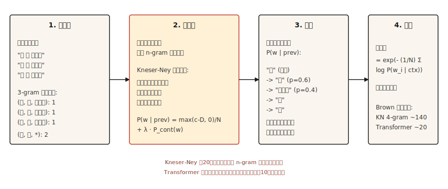

# Transformer之前 Text Generation — N-gram 语言模型

> 如果一个词令人惊讶，那么模型就是糟糕的。困惑度（Perplexity）将惊讶转化为数字。平滑（Smoothing）使其保持有限。

**类型：** 构建
**语言：** Python
**前置要求：** 阶段5·01（文本处理），阶段2·14（朴素贝叶斯）
**时间：** ~45分钟

## 问题

在Transformer之前，在RNN之前，在词嵌入之前，语言模型通过统计一个词出现在前 `n-1` 个词之后的频率来预测下一个词。统计 "the cat" → "sat" 47次，"the cat" → "jumped" 12次，"the cat" → "refrigerator" 0次。归一化得到一个概率分布。

这就是一个N元语法（N-gram）语言模型。从1980年到2015年，它支撑着每一个语音识别器、每一个拼写检查器和每一个基于短语的机器翻译系统。当你需要廉价的设备端语言建模时，它仍然在运行。

有趣的问题是如何处理未见过的N元语法。原始的基于计数的模型会给任何未见过的内容分配零概率，这是灾难性的，因为句子很长，几乎每个长句子都包含至少一个未见过的序列。五十年的平滑研究解决了这个问题。Kneser-Ney平滑是研究成果，现代深度学习继承了它的经验传统。

## 概念



**N元语法概率：** `P(w_i | w_{i-n+1}, ..., w_{i-1})`。固定 `n`（通常三元组取3，四元组取4）。根据计数计算：

```text
P(w | context) = count(context, w) / count(context)
```

**零计数问题。** 任何在训练中未出现的N元语法都会得到零概率。2007年一项关于Brown语料库的研究发现，即使是一个4-gram模型，也有30%的留出4-gram在训练中未见。如果不进行平滑，你无法在任何真实文本上进行评估。

**平滑方法，按复杂程度排序：**

1. **拉普拉斯平滑（Laplace，加一平滑）。** 给每个计数加1。简单，但对罕见事件效果极差。
2. **Good-Turing平滑。** 根据“频率的频数”，将概率质量从高频事件重新分配给未见事件。
3. **插值（Interpolation）。** 结合n-gram、(n-1)-gram等估计量，使用可调权重。
4. **后退（Backoff）。** 如果n-gram计数为零，则回退到(n-1)-gram。Katz后退法对此进行了归一化。
5. **绝对折扣（Absolute discounting）。** 从所有计数中减去一个固定的折扣 `D`，重新分配给未见事件。
6. **Kneser-Ney平滑。** 绝对折扣加上对低阶模型的巧妙选择：使用*延续概率（continuation probability）*（一个词出现在多少个不同的上下文中）而不是原始频率。

Kneser-Ney的洞察很深刻。"San Francisco"是一个常见的二元组。一元组"Francisco"大多出现在"San"之后。朴素的绝对折扣会给"Francisco"一个高的一元概率（因为计数高）。Kneser-Ney注意到"Francisco"只出现在一个上下文中，因此相应降低了它的延续概率。结果：一个以"Francisco"结尾的新二元组会得到合适的低概率。

**评估：困惑度（Perplexity）。** 在留出测试集上每个词的平均负对数似然的指数。越低越好。困惑度100意味着模型像从100个词中均匀选择一样困惑。

```text
perplexity = exp(- (1/N) * Σ log P(w_i | context_i))
```

## 构建它

### 步骤1：三元组计数

```python
from collections import Counter, defaultdict


def train_ngram(corpus_tokens, n=3):
    ngrams = Counter()
    contexts = Counter()
    for sentence in corpus_tokens:
        padded = ["<s>"] * (n - 1) + sentence + ["</s>"]
        for i in range(len(padded) - n + 1):
            ctx = tuple(padded[i:i + n - 1])
            word = padded[i + n - 1]
            ngrams[ctx + (word,)] += 1
            contexts[ctx] += 1
    return ngrams, contexts


def raw_probability(ngrams, contexts, context, word):
    ctx = tuple(context)
    if contexts.get(ctx, 0) == 0:
        return 0.0
    return ngrams.get(ctx + (word,), 0) / contexts[ctx]
```

输入是一个分词后的句子列表。输出是n-gram计数和上下文计数。`<s>` 和 `</s>` 是句子边界标记。

### 步骤2：拉普拉斯平滑

```python
def laplace_probability(ngrams, contexts, vocab_size, context, word):
    ctx = tuple(context)
    numerator = ngrams.get(ctx + (word,), 0) + 1
    denominator = contexts.get(ctx, 0) + vocab_size
    return numerator / denominator
```

给每个计数加1。进行了平滑，但过度分配质量给未见事件，也损害了罕见已知事件。

### 步骤3：Kneser-Ney（二元组，插值）

```python
def kneser_ney_bigram_model(corpus_tokens, discount=0.75):
    unigrams = Counter()
    bigrams = Counter()
    unigram_contexts = defaultdict(set)

    for sentence in corpus_tokens:
        padded = ["<s>"] + sentence + ["</s>"]
        for i, w in enumerate(padded):
            unigrams[w] += 1
            if i > 0:
                prev = padded[i - 1]
                bigrams[(prev, w)] += 1
                unigram_contexts[w].add(prev)

    total_unique_bigrams = sum(len(ctx_set) for ctx_set in unigram_contexts.values())
    continuation_prob = {
        w: len(ctx_set) / total_unique_bigrams for w, ctx_set in unigram_contexts.items()
    }

    context_totals = Counter()
    for (prev, w), count in bigrams.items():
        context_totals[prev] += count

    unique_follow = defaultdict(set)
    for (prev, w) in bigrams:
        unique_follow[prev].add(w)

    def prob(prev, w):
        count = bigrams.get((prev, w), 0)
        denom = context_totals.get(prev, 0)
        if denom == 0:
            return continuation_prob.get(w, 1e-9)
        first_term = max(count - discount, 0) / denom
        lambda_prev = discount * len(unique_follow[prev]) / denom
        return first_term + lambda_prev * continuation_prob.get(w, 1e-9)

    return prob
```

三个可动部分。`continuation_prob` 捕获“这个词出现在多少个不同的上下文中？”（Kneser-Ney的创新）。`lambda_prev` 是通过折扣释放的质量，用于加权后退项。最终概率是折扣后的主项与加权的延续项之和。

### 步骤4：通过采样生成文本

```python
import random


def generate(prob_fn, vocab, prefix, max_len=30, seed=0):
    rng = random.Random(seed)
    tokens = list(prefix)
    for _ in range(max_len):
        candidates = [(w, prob_fn(tokens[-1], w)) for w in vocab]
        total = sum(p for _, p in candidates)
        r = rng.random() * total
        acc = 0.0
        for w, p in candidates:
            acc += p
            if r <= acc:
                tokens.append(w)
                break
        if tokens[-1] == "</s>":
            break
    return tokens
```

按概率比例采样。不同种子输出不同。对于类似束搜索的输出，每一步选择 argmax（贪婪），并添加一个小随机旋钮（temperature）。

### 步骤5：困惑度

```python
import math


def perplexity(prob_fn, sentences):
    total_log_prob = 0.0
    total_tokens = 0
    for sentence in sentences:
        padded = ["<s>"] + sentence + ["</s>"]
        for i in range(1, len(padded)):
            p = prob_fn(padded[i - 1], padded[i])
            total_log_prob += math.log(max(p, 1e-12))
            total_tokens += 1
    return math.exp(-total_log_prob / total_tokens)
```

越低越好。对于Brown语料库，一个调优良好的4-gram KN模型困惑度大约140。一个Transformer语言模型在相同测试集上达到15-30。差距约为10倍。这个差距就是该领域前进的原因。

## 使用它

- **经典NLP教学。** 对平滑、最大似然估计（MLE）和困惑度最清晰的呈现。
- **KenLM。** 生产级N元语法库。用于对延迟敏感的语言系统和机器翻译系统中的重评分。
- **设备端自动补全。** 键盘中的三元组模型。至今仍在使用。
- **基线。** 在宣称你的神经语言模型很好之前，总是先计算一个N元语法语言模型的困惑度。如果你的Transformer没有大幅超过KN，就有问题。

## 交付它

保存为 `outputs/prompt-lm-baseline.md`：

```markdown
---
name: lm-baseline
description: 在训练神经语言模型之前建立一个可复现的N元语法语言模型基线。
phase: 5
lesson: 16
---

给定语料库和目标用途（下一个词预测、重评分、困惑度基线），输出：

1. N元语法阶数。通用英语用三元组，语料库大用4-gram，语音重评分用5-gram。
2. 平滑。默认使用修改后的Kneser-Ney；拉普拉斯只用于教学。
3. 库。生产环境用`kenlm`，教学环境用`nltk.lm`，只有为了学习才自己实现。
4. 评估。留出集困惑度，确保训练集和测试集的分词方式一致。

拒绝报告使用不同分词方式计算的两个系统之间的困惑度——困惑度数值只有在完全相同分词下才可比。标记测试集中的集外词（OOV）率；除非在训练期间保留一个特殊的<UNK>标记，否则KN处理OOV效果很差。
```

## 练习

1. **简单。** 在1000句莎士比亚语料库上训练一个三元组语言模型。生成20个句子。它们在局部是合理的，但全局不连贯。这是经典的演示。
2. **中等。** 对你的KN模型在莎士比亚留出集上实现困惑度计算。与拉普拉斯平滑比较。你应该看到KN困惑度降低30-50%。
3. **困难。** 构建一个三元组拼写纠正器：给定一个拼写错误的词及其上下文，生成纠正候选，并按语言模型下的上下文概率排序。在Birkbeck拼写语料库（公开）上评估。

## 关键术语

| 术语 | 人们所说的 | 实际含义 |
|------|------------|----------|
| N-gram | 词序列 | 由 `n` 个连续词元组成的序列。 |
| 平滑 | 避免零概率 | 重新分配概率质量，使未见事件获得非零概率。 |
| 困惑度 | 语言模型质量指标 | `exp(-平均对数概率)` 在留出数据上。越低越好。 |
| 后退 | 回退到更短的上下文 | 如果三元组计数为零，则使用二元组。Katz后退法将其形式化。 |
| Kneser-Ney | 最佳的N元语法平滑 | 绝对折扣 + 低阶模型的延续概率。 |
| 延续概率 | Kneser-Ney特有 | 根据词 `w` 出现的不同上下文数量加权的 `P(w)`，而不是原始计数。 |

## 进一步阅读

- [Jurafsky and Martin — Speech and Language Processing, Chapter 3 (2026 draft)](https://web.stanford.edu/~jurafsky/slp3/3.pdf) — 关于N元语法语言模型和平滑的权威论述。
- [Chen and Goodman (1998). An Empirical Study of Smoothing Techniques for Language Modeling](https://dash.harvard.edu/handle/1/25104739) — 确定Kneser-Ney为最佳N元语法平滑器的论文。
- [Kneser and Ney (1995). Improved Backing-off for M-gram Language Modeling](https://ieeexplore.ieee.org/document/479394) — 原始的KN论文。
- [KenLM](https://kheafield.com/code/kenlm/) — 快速的生产级N元语法LM，在2026年仍用于延迟敏感的应用。