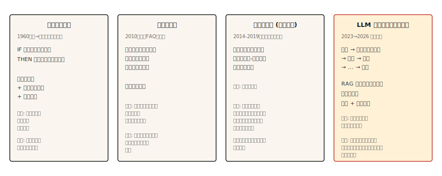

# Chatbots — De Regras pra Neurais pra Agentes LLM

> ELIZA respondeu com correspondência de padrões. DialogFlow mapeou intenções. GPT respondeu de pesos. Claude roda ferramentas e verifica. Cada era resolveu a pior falha da anterior.

**Tipo:** Aprender
**Linguagens:** Python
**Pré-requisitos:** Fase 5 · 13 (Question-Answering), Fase 5 · 14 (Recuperação de Informação)
**Tempo:** ~75 minutos

## O Problema

Um usuário diz "I want to change my flight." O sistema tem que descobrir o que quer, que informação falta, como obtê-la, e como completar a ação. Depois o usuário diz "wait, what if I cancel instead?" e o sistema tem que lembrar o contexto, trocar de tarefa e preservar estado.

Conversa é difícil pra um sistema de ML. A entrada é aberta. A saída tem que ser coerente por muitos turnos. O sistema pode precisar agir no mundo (trocar voo, cobrar cartão). Cada passo errado é visível pro usuário.

Arquiteturas de chatbot ciclaram por quatro paradigmas, cada um introduzido porque o anterior falhou visivelmente demais. Essa lição percorre em ordem. A paisagem de produção de 2026 é híbrida dos dois últimos.

## O Conceito



**Baseado em regras (ELIZA, AIML, DialogFlow).** Padrões manuais combinam entrada do usuário e produzem respostas. Classificadores de intenção rodam pra fluxos pré-definidos. Máquinas de estado de slot-filling coletam informações necessárias. Funciona brilhantemente dentro do escopo estreito pra qual foi projetado. Falha imediatamente fora dele. Ainda é usado em domínios críticos de segurança (autenticação bancária, reserva de passagens) onde alucinação não é tolerada.

**Baseado em recuperação.** Um sistema estilo FAQ. Codifica cada par de (enunciado, resposta). Em tempo de execução, codifica a mensagem do usuário e recupera a resposta armazenada mais próxima. Pense na característica clássica de "artigos similares" do Zendesk. Lida melhor com paráfrases que regras. Sem geração, então sem alucinação.

**Neural (seq2seq).** Encoder-decoder treinado em logs de conversa. Gera respostas do zero. Fluente mas propenso a saídas genéricas ("I don't know") e deriva factual. Nunca confiavelmente no tema. A razão pela qual Google, Facebook e Microsoft todos tiveram chatbots decepcionantes em 2016-2019.

**Agentes LLM.** Um modelo de linguagem envolvido num loop que planeja, chama ferramentas e verifica resultados. Não é um chatbot com prompt longo. Um loop de agente: planejar → chamar ferramenta → observar resultado → decidir próximo passo. Fundamentação retrieval-first (RAG) evita alucinação. Chamadas de ferramenta permitem que realmente faça coisas. Essa é a arquitetura de 2026.

Os quatro paradigmas não são substituições sequenciais. Um chatbot de produção de 2026 rota por todos os quatro: baseado em regras pra autenticação e ações destrutivas, recuperação pra FAQ, geração natural pra formulação natural, agente LLM pra consultas ambíguas abertas.

## Construindo

### Passo 1: correspondência de padrões baseada em regras

```python
import re


class RulePattern:
    def __init__(self, pattern, response_template):
        self.regex = re.compile(pattern, re.IGNORECASE)
        self.template = response_template


PATTERNS = [
    RulePattern(r"my name is (\w+)", "Nice to meet you, {0}."),
    RulePattern(r"i (need|want) (.+)", "Why do you {0} {1}?"),
    RulePattern(r"i feel (.+)", "Why do you feel {0}?"),
    RulePattern(r"(.*)", "Tell me more about that."),
]


def rule_based_respond(user_input):
    for pattern in PATTERNS:
        m = pattern.regex.match(user_input.strip())
        if m:
            return pattern.template.format(*m.groups())
    return "I don't understand."
```

ELIZA em 20 linhas. O truque de reflexão ("I feel sad" → "Why do you feel sad?") é a demonstração canônica de psicoterapeuta de Weizenbaum 1966. Ainda instrutivo.

### Passo 2: baseado em recuperação (FAQ)

Este snippet ilustrativo requer `pip install sentence-transformers` (que puxa torch). O `code/main.py` executável pra essa lição usa similaridade Jaccard da stdlib em vez disso, então a lição roda sem dependências externas.

```python
from sentence_transformers import SentenceTransformer
import numpy as np


FAQ = [
    ("how do i reset my password", "Go to Settings > Security > Reset Password."),
    ("how do i cancel my order", "Go to Orders, find the order, click Cancel."),
    ("what is your return policy", "30-day returns on unused items, original packaging."),
]


encoder = SentenceTransformer("sentence-transformers/all-MiniLM-L6-v2")
faq_questions = [q for q, _ in FAQ]
faq_embeddings = encoder.encode(faq_questions, normalize_embeddings=True)


def faq_respond(user_input, threshold=0.5):
    q_emb = encoder.encode([user_input], normalize_embeddings=True)[0]
    sims = faq_embeddings @ q_emb
    best = int(np.argmax(sims))
    if sims[best] < threshold:
        return None
    return FAQ[best][1]
```

Recusa baseada em limiar é a escolha de design chave. Se a melhor correspondência não é próxima o suficiente, retorna `None` e deixa o sistema escalar.

### Passo 3: geração neural (baseline)

Use um encoder-decoder pequeno instrução-afinado (FLAN-T5) ou um modelo conversacional fine-tunado. Inutilizável sozinho em produção em 2026 (contradição, deriva off-topic, nonsense factual), mas é usado dentro de sistemas híbridos pra formulação natural. Modelos decoder-only estilo DialoGPT precisam de separadores de turno explícitos e tratamento de EOS pra gerar respostas coerentes; uma pipeline text2text FLAN-T5 funciona de cara pra exemplo didático.

```python
from transformers import pipeline

chatbot = pipeline("text2text-generation", model="google/flan-t5-small")

response = chatbot("Respond politely to: Hi there!", max_new_tokens=40)
print(response[0]["generated_text"])
```

### Passo 4: loop de agente LLM

A forma de produção de 2026:

```python
def agent_loop(user_message, tools, llm, max_steps=5):
    history = [{"role": "user", "content": user_message}]
    for _ in range(max_steps):
        response = llm(history, tools=tools)
        tool_call = response.get("tool_call")
        if tool_call:
            tool_name = tool_call.get("name")
            args = tool_call.get("arguments")
            if not isinstance(tool_name, str) or tool_name not in tools:
                history.append({"role": "assistant", "tool_call": tool_call})
                history.append({"role": "tool", "name": str(tool_name), "content": f"error: unknown tool {tool_name!r}"})
                continue
            if not isinstance(args, dict):
                history.append({"role": "assistant", "tool_call": tool_call})
                history.append({"role": "tool", "name": tool_name, "content": f"error: arguments must be a dict, got {type(args).__name__}"})
                continue
            fn = tools[tool_name]
            result = fn(**args)
            history.append({"role": "assistant", "tool_call": tool_call})
            history.append({"role": "tool", "name": tool_name, "content": result})
        else:
            return response["content"]
    return "I could not complete the task in the step budget."
```

Três coisas pra nomear. Ferramentas são funções chamáveis que o LLM pode invocar. O loop termina quando o LLM retorna uma resposta final em vez de uma chamada de ferramenta. O orçamento de passos evita loops infinitos em tarefas ambíguas.

Produção real adiciona: fundamentação retrieval-first (injeta docs relevantes antes de cada chamada de LLM), guardrails (recusa ações destrutivas sem confirmação), observabilidade (loga cada passo) e avaliações (verificações automáticas que o comportamento do agente se mantém dentro da spec).

### Passo 5: roteamento híbrido

```python
def hybrid_chat(user_input):
    if is_destructive_action(user_input):
        return structured_flow(user_input)

    faq_answer = faq_respond(user_input, threshold=0.6)
    if faq_answer:
        return faq_answer

    return agent_loop(user_input, tools, llm)


def is_destructive_action(text):
    danger_words = ["delete", "cancel", "charge", "refund", "transfer"]
    return any(w in text.lower() for w in danger_words)
```

O padrão: regras determinísticas pra qualquer coisa destrutiva, recuperação pra FAQs prontas, agentes LLM pra tudo mais. Isso é o que é usado em sistemas de suporte ao cliente em 2026.

## Usando

Stack de 2026:

| Caso de uso | Arquitetura |
|---------|---------------|
| Reserva, pagamento, autenticação | Máquinas de estado baseadas em regras + slot filling |
| FAQs de suporte ao cliente | Recuperação sobre respostas curadas |
| Chat de ajuda aberto | Agente LLM com RAG + chamadas de ferramenta |
| Ferramentas internas / assistentes de IDE | Agente LLM com chamadas de ferramenta (buscar, ler, escrever) |
| Chatbots de companhia/personagem | LLM ajustado com prompt de persona, recuperação sobre conhecimento |

Sempre use roteamento híbrido em produção. Nenhuma arquitetura sozinha lida bem com cada requisição. A camada de roteamento em si é tipicamente um classificador de intenção pequeno.

## Modos de falha que ainda chegam

- **Fabricação confiante.** Agente LLM afirma completou uma ação que não completou. Mitigação: verifique resultados, logue chamadas de ferramenta, nunca deixe o LLM afirmar ter feito algo sem retorno bem-sucedido de ferramenta.
- **Injeção de prompt.** Usuário insere texto que sobrescreve o prompt do sistema. Ranqueou LLM01 no OWASP Top 10 for LLM Applications 2025. Duas variantes: injeção direta (colada no chat) e injeção indireta (escondida em documentos, emails ou saídas de ferramenta que o agente lê).

  Taxas de ataque variam por cenário. Taxas de sucesso medidas variam ~0.5-8.5% entre modelos de fronteira em benchmarks gerais de uso de ferramentas e código. Configurações específicas de alto risco (ataques adaptativos contra agentes de código AI, orquestração vulnerável) chegaram a ~84%. CVEs de produção incluem EchoLeak (CVE-2025-32711, CVSS 9.3) — falha de exfiltração de dados zero-click no Microsoft 365 Copilot desencadeada por email controlado pelo atacante.

  Mitigações: trate entrada do usuário como não-confiável durante todo o loop; sanitize antes de chamadas de ferramenta; isole saídas de ferramenta do prompt principal; use o padrão Plan-Verify-Execute (PVE) onde o agente planeja primeiro, depois verifica cada ação contra esse plano antes de executar (isso impede que resultados de ferramenta injetem novas ações não planejadas); exija confirmação do usuário pra ações destrutivas; aplique menor-privilegio nos escopos de ferramenta.

  Nenhuma quantidade de engenharia de prompt elimina completamente esse risco. Camadas externas de defesa em tempo de execução (LLM Guard, validação de allowlist, detecção de anomalia semântica) são necessárias.
- **Deriva de escopo.** Agente sai da tarefa porque uma chamada de ferramenta retornou informação tangencialmente relacionada. Mitigação: contratos de ferramenta estreitos; mantenha o prompt do sistema focado; adicione avaliações pra taxa de off-task.
- **Loops infinitos.** Agente continua chamando a mesma ferramenta. Mitigação: orçamento de passos, deduplicação de chamadas de ferramenta, LLM julgador em "estamos progredindo."
- **Esgotamento de janela de contexto.** Conversas longas empurram turnos mais antigos pra fora do contexto. Mitigação: resuma turnos mais antigos, recupere turnos passados relevantes por similaridade, ou use modelo de contexto longo.

## Entregando

Salve como `outputs/skill-chatbot-architect.md`:

```markdown
---
name: chatbot-architect
description: Design a chatbot stack for a given use case.
version: 1.0.0
phase: 5
lesson: 17
tags: [nlp, agents, chatbot]
---

Given a product context (user need, compliance constraints, available tools, data volume), output:

1. Architecture. Rule-based, retrieval, neural, LLM agent, or hybrid (specify which paths go where).
2. LLM choice if applicable. Name the model family (Claude, GPT-4, Llama-3.1, Mixtral). Match to tool-use quality and cost.
3. Grounding strategy. RAG sources, retrieval method (see lesson 14), tool contracts.
4. Evaluation plan. Task success rate, tool-call correctness, off-task rate, hallucination rate on held-out dialogs.

Refuse to recommend a pure-LLM agent for any destructive action (payments, account deletion, data modification) without a structured confirmation flow. Refuse to skip the prompt-injection audit if the agent has write access to anything.
```

## Exercícios

1. **Fácil.** Implemente a resposta baseada em regras acima com 10 padrões pra bot de pedido de café. Teste casos extremos: pedidos duplos, modificações, cancelamento, intenção não clara.
2. **Médio.** Construa um híbrido FAQ + fallback LLM. 50 entradas de FAQ prontas pra produto SaaS, fallback LLM com recuperação sobre o site de docs. Meça taxa de recusa e acurácia em 100 perguntas reais de suporte.
3. **Difícil.** Implemente o loop de agente acima com três ferramentas (buscar, ler-dados-do-usuário, enviar-email). Rode uma avaliação com 50 cenários de teste incluindo tentativas de injeção de prompt. Reporte taxa de off-task, taxa de falha de tarefa e qualquer sucesso de injeção.

## Termos Chave

| Termo | O que a gente diz | O que realmente significa |
|------|-----------------|-----------------------|
| Intenção | O que o usuário quer | Label categórica (book_flight, reset_password). Rota pra um handler. |
| Slot | Uma informação | Parâmetro que o bot precisa (data, destino). Slot filling é a sequência de perguntas. |
| RAG | Recuperação mais geração | Recupera docs relevantes, depois fundamenta a resposta do LLM. |
| Chamada de ferramenta | Invocação de função | LLM emite chamada estruturada com nome + args. Runtime executa, retorna resultado. |
| Loop de agente | Planejar, agir, verificar | Controlador que roda chamadas LLM intercaladas com chamadas de ferramenta até tarefa completa. |
| Injeção de prompt | Usuário ataca o prompt | Entrada maliciosa que tenta sobrescrever o prompt do sistema. |

## Leitura Complementar

- [Weizenbaum (1966). ELIZA — A Computer Program For the Study of Natural Language Communication](https://web.stanford.edu/class/cs124/p36-weizenabaum.pdf) — o paper original de chatbot baseado em regras.
- [Thoppilan et al. (2022). LaMDA: Language Models for Dialog Applications](https://arxiv.org/abs/2201.08239) — o paper tardio de chatbot neural do Google, logo antes dos agentes LLM tomarem conta.
- [Yao et al. (2022). ReAct: Synergizing Reasoning and Acting in Language Models](https://arxiv.org/abs/2210.03629) — o paper que nomeou o padrão de loop de agente.
- [Anthropic's guide on building effective agents](https://www.anthropic.com/research/building-effective-agents) — orientação de produção de 2024 que ainda vale em 2026.
- [Greshake et al. (2023). Not what you've signed up for: Compromising Real-World LLM-Integrated Applications with Indirect Prompt Injection](https://arxiv.org/abs/2302.12173) — o paper de injeção de prompt.
- [OWASP Top 10 for LLM Applications 2025 — LLM01 Prompt Injection](https://genai.owasp.org/llmrisk/llm01-prompt-injection/) — o ranqueado que fez injeção de prompt ser a principal preocupação de segurança.
- [AWS — Securing Amazon Bedrock Agents against Indirect Prompt Injections](https://aws.amazon.com/blogs/machine-learning/securing-amazon-bedrock-agents-a-guide-to-safeguarding-against-indirect-prompt-injections/) — defesas práticas na camada de orquestração incluindo Plan-Verify-Execute e fluxos de confirmação do usuário.
- [EchoLeak (CVE-2025-32711)](https://www.vectra.ai/topics/prompt-injection) — a CVE canônica de exfiltração de dados zero-click de injeção de prompt indireta. Caso de referência de por que agentes com acesso de escrita precisam de defesas em tempo de execução.
