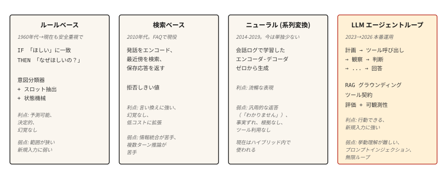

# 聊天机器人——从基于规则到神经网络到 LLM Agent

> ELIZA 用模式匹配来回复。DialogFlow 映射意图。GPT 从权重中回答。Agent 自己规划。

**类型：** 学习
**语言：** Python
**前置要求：** Phase 5 • 13（问答系统），Phase 5 • 14（信息检索）
**时间：** ~75 分钟

## 问题

用户说"我想改签航班"。系统必须弄清楚他们想要什么、正在处理什么事务，以及如何回应。对话是一个移动的目标：每一轮都会建立新的上下文。

对话对 ML 系统来说很难。输入是开放式的。输出必须连贯且符合上下文。而且用户不会以完美的、适合训练集的方式表达自己。

聊天机器人架构经历了四个范式的循环，每个新范式都是因为前一个范式的局限性而引入的。2026 年的系统将它们全部组合在一个路由层后面。

## 概念



**基于规则（ELIZA、AIML、DialogFlow）。** 手工编写的模式匹配用户输入并产生预定义的响应。零训练数据需求。维护成本随规则数量呈指数级增长。

**检索式。** FAQ 风格系统。编码每一对（话语，响应）。运行时，编码用户输入并在知识库中搜索最相似的响应。永远不会有新的回答。

**神经网络（seq2seq）。** 在对话日志上训练的编码器-解码器。从头生成响应。需要大量数据。容易产生平淡或重复的输出。

**LLM Agent。** 在一个循环中封装的语言模型，能够规划、调用工具和验证输出。2026 年生产系统的默认选择。成本高且延迟不可预测。

这四种范式并非顺序替代关系。2026 年的生产聊天机器人会通过一个路由层：基于规则的意图匹配处理 60% 的流量（密码重置、营业时间），检索式系统处理 20%（常见问题解答），LLM 处理剩余 20%（复杂、开放式的查询）。每个层级都充当上一级的护拦。

## 动手构建

### 步骤 1：基于规则的模式匹配

```python
import re


class RulePattern:
    def __init__(self, pattern, response_template):
        self.regex = re.compile(pattern, re.IGNORECASE)
        self.template = response_template


PATTERNS = [
    RulePattern(r"my name is (\w+)", "Nice to meet you, {0}."),
    RulePattern(r"i (need|want) (.+)", "Why do you {0} {1}?"),
    RulePattern(r"i feel (.+)", "Why do you feel {0}?"),
    RulePattern(r"(.*)", "Tell me more about that."),
]


def rule_based_respond(user_input):
    for pattern in PATTERNS:
        m = pattern.regex.match(user_input.strip())
        if m:
            return pattern.template.format(*m.groups())
    return "I don't understand."
```

20 行实现 ELIZA。反射技巧（"I feel sad" → "Why do you feel sad"）是最经典的演示。关键在于分组替换和模式优先级。

### 步骤 2：意图分类器（检索式）

This illustrative snippet requires `pip install sentence-transformers` (which pulls in torch). The runnable `code/main.py` for this lesson uses a stdlib Jaccard similarity instead, so the lesson runs without external dependencies.

```python
from sentence_transformers import SentenceTransformer
import numpy as np


FAQ = [
    ("how do i reset my password", "Go to Settings > Security > Reset Password."),
    ("how do i cancel my order", "Go to Orders, find the order, click Cancel."),
    ("what is your return policy", "30-day returns on unused items, original packaging."),
]


encoder = SentenceTransformer("sentence-transformers/all-MiniLM-L6-v2")
faq_questions = [q for q, _ in FAQ]
faq_embeddings = encoder.encode(faq_questions, normalize_embeddings=True)


def faq_respond(user_input, threshold=0.5):
    q_emb = encoder.encode([user_input], normalize_embeddings=True)[0]
    sims = faq_embeddings @ q_emb
    best = int(np.argmax(sims))
    if sims[best] < threshold:
        return None
    return FAQ[best][1]
```

Threshold-based refusal is the key design choice. If the best match is not close enough, return `None` and let the system escalate.

### Step 3: neural generation (baseline)

Use a small instruction-tuned encoder-decoder (FLAN-T5) or a fine-tuned conversational model. Production-unusable on its own in 2026 (contradiction, off-topic drift, factual nonsense), but ships inside hybrid systems for natural phrasing. DialoGPT-style decoder-only models need explicit turn separators and EOS handling to produce coherent replies; a FLAN-T5 text2text pipeline works out of the box for a teaching example.

```python
from transformers import pipeline

chatbot = pipeline("text2text-generation", model="google/flan-t5-small")

response = chatbot("Respond politely to: Hi there!", max_new_tokens=40)
print(response[0]["generated_text"])
```

### Step 4: LLM agent loop

The 2026 production shape:

```python
def agent_loop(user_message, tools, llm, max_steps=5):
    history = [{"role": "user", "content": user_message}]
    for _ in range(max_steps):
        response = llm(history, tools=tools)
        tool_call = response.get("tool_call")
        if tool_call:
            tool_name = tool_call.get("name")
            args = tool_call.get("arguments")
            if not isinstance(tool_name, str) or tool_name not in tools:
                history.append({"role": "assistant", "tool_call": tool_call})
                history.append({"role": "tool", "name": str(tool_name), "content": f"error: unknown tool {tool_name!r}"})
                continue
            if not isinstance(args, dict):
                history.append({"role": "assistant", "tool_call": tool_call})
                history.append({"role": "tool", "name": tool_name, "content": f"error: arguments must be a dict, got {type(args).__name__}"})
                continue
            fn = tools[tool_name]
            result = fn(**args)
            history.append({"role": "assistant", "tool_call": tool_call})
            history.append({"role": "tool", "name": tool_name, "content": result})
        else:
            return response["content"]
    return "I could not complete the task in the step budget."
```

Three things to name. Tools are callable functions the LLM can invoke. The loop terminates when the LLM returns a final answer instead of a tool call. The step budget prevents infinite loops on ambiguous tasks.

Real production adds: retrieval-first grounding (inject relevant docs before each LLM call), guardrails (refuse destructive actions without confirmation), observability (log every step), and evaluations (automated checks that agent behavior stays on-spec).

### Step 5: hybrid routing

```python
def hybrid_chat(user_input):
    if is_destructive_action(user_input):
        return structured_flow(user_input)

    faq_answer = faq_respond(user_input, threshold=0.6)
    if faq_answer:
        return faq_answer

    return agent_loop(user_input, tools, llm)


def is_destructive_action(text):
    danger_words = ["delete", "cancel", "charge", "refund", "transfer"]
    return any(w in text.lower() for w in danger_words)
```

The pattern: deterministic rules for anything destructive, retrieval for canned FAQs, LLM agents for everything else. This is what ships in 2026 customer-support systems.

## 应用场景

- **内部知识库聊天机器人。** 检索式 + LLM。检索文档片段，LLM 总结答案。RAG 架构。

- **自主 Agent（编码、研究）。** 纯 LLM + 工具。没有规则或检索式回退。高风险、高回报。
|---------|---------------|
1. **简单。** 用 20 行 Python 实现 ELIZA。用模式匹配模拟一个特定领域的对话（如披萨店点餐）。
2. **中等。** 用 TF-IDF 检索（步骤 2）和 GPT-2 生成（步骤 3）在相同查询上进行比较。
3. **困难。** 构建一个三阶段聊天机器人，使用基于规则的分类器在 FAQ 检索和 LLM 生成之间路由，并带有超时回退：如果 LLM 在 2 秒内未响应，则回退到检索。
| Internal tools / IDE assistants | LLM agent with tool calls (search, read, write) |
| Companion / character chatbots | Tuned LLM with persona system prompt, retrieval on knowledge |

Always use hybrid routing in production. No single architecture handles every request well. The routing layer itself is typically a small intent classifier.

| Rule-based | Hand-written patterns | Matches input against patterns, returns template response. |

| Neural (seq2seq) | Encoder-decoder | Generates response token by token from scratch. |
| LLM Agent | Model + tools + loop | LLM plans, calls APIs, observes results, continues. |

  Attack rates vary by scenario. Measured success rates range ~0.5-8.5% across frontier models in general tool-use and coding benchmarks. Specific high-risk setups (adaptive attacks against AI coding agents, vulnerable orchestration) have reached ~84%. Production CVEs include EchoLeak (CVE-2025-32711, CVSS 9.3) — a zero-click data-exfiltration flaw in Microsoft 365 Copilot triggered by an attacker-controlled email.

- [Rasa Open Source](https://rasa.com/) — 2026 年最流行的开源对话 AI 框架。

- [Anthropic Tool Use](https://docs.anthropic.com/en/docs/build-with-claude/tool-use) — Anthropic 的等效方案。
- **Scope creep.** Agent goes off-task because a tool call returned tangentially related info. Mitigation: narrow tool contracts; keep the system prompt focused; add evaluations for off-task rate.
- **Infinite loops.** Agent keeps calling the same tool. Mitigation: step budget, tool-call deduplication, LLM judge on "are we making progress."
- **Context window exhaustion.** Long conversations push the earliest turns out of context. Mitigation: summarize older turns, retrieve relevant past turns by similarity, or use a long-context model.

## 交付检查清单

Save as `outputs/skill-chatbot-architect.md`:

```markdown
---
name: chatbot-architect
description: Design a chatbot stack for a given use case.
version: 1.0.0
phase: 5
lesson: 17
tags: [nlp, agents, chatbot]
---

Given a product context (user need, compliance constraints, available tools, data volume), output:

1. Architecture. Rule-based, retrieval, neural, LLM agent, or hybrid (specify which paths go where).
2. LLM choice if applicable. Name the model family (Claude, GPT-4, Llama-3.1, Mixtral). Match to tool-use quality and cost.
3. Grounding strategy. RAG sources, retrieval method (see lesson 14), tool contracts.
4. Evaluation plan. Task success rate, tool-call correctness, off-task rate, hallucination rate on held-out dialogs.

Refuse to recommend a pure-LLM agent for any destructive action (payments, account deletion, data modification) without a structured confirmation flow. Refuse to skip the prompt-injection audit if the agent has write access to anything.
```

## 练习

1. **Easy.** Implement the rule-based respond above with 10 patterns for a coffee-shop ordering bot. Test edge cases: double orders, modifications, cancellation, unclear intent.
2. **Medium.** Build a hybrid FAQ + LLM fallback. 50 canned FAQ entries for a SaaS product, LLM fallback with retrieval over the docs site. Measure refusal rate and accuracy on 100 real support questions.
3. **Hard.** Implement the agent loop above with three tools (search, read-user-data, send-email). Run an evaluation with 50 test scenarios including prompt injection attempts. Report off-task rate, failed task rate, and any injection success.

## 关键术语

| 术语 | 表面含义 | 实际含义 |
|------|-----------------|-----------------------|
| Intent | What the user wants | Categorical label (book_flight, reset_password). Routed to a handler. |
| Slot | A piece of info | Parameter the bot needs (date, destination). Slot filling is the sequence of asks. |
| RAG | Retrieval plus generation | Retrieve relevant docs, then ground the LLM's response. |
| Tool call | Function invocation | LLM emits a structured call with name + args. Runtime executes, returns result. |
| Agent loop | Plan, act, verify | Controller that runs LLM calls interleaved with tool calls until task complete. |
| Prompt injection | User attacks prompt | Malicious input that tries to override the system prompt. |

## 延伸阅读

- [Weizenbaum (1966). ELIZA — A Computer Program For the Study of Natural Language Communication](https://web.stanford.edu/class/cs124/p36-weizenabaum.pdf) — the original rule-based chatbot paper.
- [Thoppilan et al. (2022). LaMDA: Language Models for Dialog Applications](https://arxiv.org/abs/2201.08239) — Google's late neural-chatbot paper, just before LLM agents took over.
- [Yao et al. (2022). ReAct: Synergizing Reasoning and Acting in Language Models](https://arxiv.org/abs/2210.03629) — the paper that named the agent loop pattern.
- [Anthropic's guide on building effective agents](https://www.anthropic.com/research/building-effective-agents) — 2024 production guidance that still holds in 2026.
- [Greshake et al. (2023). Not what you've signed up for: Compromising Real-World LLM-Integrated Applications with Indirect Prompt Injection](https://arxiv.org/abs/2302.12173) — the prompt-injection paper.
- [OWASP Top 10 for LLM Applications 2025 — LLM01 Prompt Injection](https://genai.owasp.org/llmrisk/llm01-prompt-injection/) — the ranking that made prompt injection the top security concern.
- [AWS — Securing Amazon Bedrock Agents against Indirect Prompt Injections](https://aws.amazon.com/blogs/machine-learning/securing-amazon-bedrock-agents-a-guide-to-safeguarding-against-indirect-prompt-injections/) — practical orchestration-layer defenses including Plan-Verify-Execute and user-confirmation flows.
- [EchoLeak (CVE-2025-32711)](https://www.vectra.ai/topics/prompt-injection) — the canonical zero-click data-exfiltration CVE from indirect prompt injection. Reference case for why write-access agents need runtime defenses.
