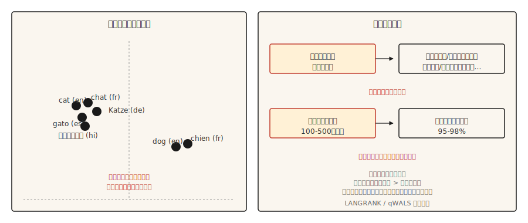

# NLP Multilíngue

> Um modelo, 100+ idiomas, zero dados de treino pra maioria deles. Transferência cross-lingual é o milagre prático dos anos 2020.

**Tipo:** Aprender
**Linguagens:** Python
**Pré-requisitos:** Fase 5 · 04 (GloVe, FastText, Subword), Fase 5 · 11 (Tradução Automática)
**Tempo:** ~45 minutos

## O Problema

Inglês tem bilhões de exemplos rotulados. Urdu tem milhares. Maithili quase nenhum. Qualquer sistema de NLP prático que serve um público global tem que funcionar na cauda longa de idiomas onde dados de treino específicos da tarefa não existem.

Modelos multilíngues resolvem isso treinando um modelo em muitos idiomas ao mesmo tempo. A representação compartilhada permite que o modelo transfira habilidades aprendidas em idiomas com muitos recursos pra idiomas com poucos. Fine-tune o modelo em análise de sentimento em inglês e ele produz previsões de sentimento surpreendentemente boas em Urdu sem nenhum ajuste. Isso é transferência cross-lingual zero-shot, e redefiniu como o NLP chega ao mundo.

Essa lição lista os tradeoffs, os modelos canônicos, e a decisão que confunde equipes novas em trabalho multilíngue: escolher a idioma de origem pra transferência.

## O Conceito



**Vocabulário compartilhado.** Modelos multilíngues usam um tokenizer SentencePiece ou WordPiece treinado em texto de todos os idiomas-alvo. O vocabulário é compartilhado: a mesma unidade subword representa o mesmo morfema entre idiomas relacionados. `anti-` em inglês e italiano recebe o mesmo token.

**Representação compartilhada.** Um transformer pré-treinado em modelagem de linguagem com máscara em muitos idiomas aprende que frases semanticamente similares em idiomas diferentes produzem estados ocultos similares. mBERT, XLM-R e NLLB demonstram isso. Embeddings de "cat" em inglês ficam perto de "chat" em francês e "gato" em espanhol, e o mesmo vale pra embeddings de frases inteiras.

**Transferência zero-shot.** Fine-tune o modelo em dados rotulados de um idioma (geralmente inglês). Em inferência, rode em qualquer outro idioma que o modelo suporte. Sem necessidade de rótulos no idioma-alvo. Resultados são fortes pra idiomas tipologicamente relacionados e mais fracos pra idiomas distantes.

**Fine-tuning few-shot.** Adicione 100-500 exemplos rotulados no idioma-alvo. A acurácia pula pra 95-98% do baseline em inglês em tarefas de classificação. Essa é a alavanca mais custo-efetiva em NLP multilíngue.

## Os modelos

| Modelo | Ano | Cobertura | Notas |
|-------|------|----------|-------|
| mBERT | 2018 | 104 idiomas | Treinado em Wikipedia. Primeiro LM multilíngue prático. Fraco em recursos baixos. |
| XLM-R | 2019 | 100 idiomas | Treinado em CommonCrawl (muito maior que Wikipedia). Define o baseline cross-lingual. Base 270M, Large 550M. |
| XLM-V | 2023 | 100 idiomas | XLM-R com vocabulário de 1M tokens (vs 250k). Melhor em recursos baixos. |
| mT5 | 2020 | 101 idiomas | Arquitetura T5 pra geração multilíngue. |
| NLLB-200 | 2022 | 200 idiomas | Modelo de tradução da Meta; inclui 55 idiomas com recursos baixos. |
| BLOOM | 2022 | 46 idiomas + 13 de programação | LLM aberto 176B treinado multilíngue. |
| Aya-23 | 2024 | 23 idiomas | LLM multilíngue da Cohere. Forte em árabe, hindi, swahili. |

Escolha pelo caso de uso. Classificação funciona bem com XLM-R-base como padrão seguro. Tarefas de geração pedem mT5 ou NLLB dependendo de tradução vs geração aberta. Trabalho estilo LLM combina com A2A-23 ou Claude usando prompting multilíngue explícito.

## A decisão do idioma de origem (pesquisa de 2026)

A maioria das equipes usa inglês como padrão pra fine-tuning. Pesquisa recente (2026) mostra que isso frequentemente está errado.

Similaridade lingüística prevê qualidade de transferência melhor que tamanho bruto do corpus. Pra alvos eslavos, alemão ou russo frequentemente superam inglês. Pra alvos indócios, hindi frequentemente supera inglês. A métrica de similaridade **qWALS** (2026, baseada em recursos do World Atlas of Language Structures) quantifica isso. **LANGRANK** (Lin et al., ACL 2019) é um método anterior e separado que classifica candidatos a idioma de origem a partir de uma combinação de similaridade lingüística, tamanho do corpus e parentesco genético.

Regra prática: se seu idioma-alvo tem um parente com muitos recursos tipologicamente próximo, tente fine-tuning nele primeiro, depois compare com fine-tuning em inglês.

## Construindo

### Passo 1: classificação cross-lingual zero-shot

```python
from transformers import AutoTokenizer, AutoModelForSequenceClassification
import torch

tok = AutoTokenizer.from_pretrained("joeddav/xlm-roberta-large-xnli")
model = AutoModelForSequenceClassification.from_pretrained("joeddav/xlm-roberta-large-xnli")


def classify(text, candidate_labels, hypothesis_template="This text is about {}.")
:
    scores = {}
    for label in candidate_labels:
        hypothesis = hypothesis_template.format(label)
        inputs = tok(text, hypothesis, return_tensors="pt", truncation=True)
        with torch.no_grad():
            logits = model(**inputs).logits[0]
        entail_score = torch.softmax(logits, dim=-1)[2].item()
        scores[label] = entail_score
    return dict(sorted(scores.items(), key=lambda x: -x[1]))


print(classify("I love this product!", ["positive", "negative", "neutral"]))
print(classify("मुझे यह उत्पाद पसंद है!", ["positive", "negative", "neutral"]))
print(classify("J'adore ce produit !", ["positive", "negative", "neutral"]))
```

Um modelo, três idiomas, mesma API. XLM-R treinado em dados de NLI transfere bem pra classificação via o truque da implicação.

### Passo 2: espaço de embedding multilíngue

```python
from sentence_transformers import SentenceTransformer
import numpy as np

model = SentenceTransformer("sentence-transformers/paraphrase-multilingual-MiniLM-L12-v2")

pairs = [
    ("The cat is sleeping.", "Le chat dort."),
    ("The cat is sleeping.", "El gato está durmiendo."),
    ("The cat is sleeping.", "Die Katze schläft."),
    ("The cat is sleeping.", "The dog is barking."),
]

for eng, other in pairs:
    emb_eng = model.encode([eng], normalize_embeddings=True)[0]
    emb_other = model.encode([other], normalize_embeddings=True)[0]
    sim = float(np.dot(emb_eng, emb_other))
    print(f"  {eng!r} <-> {other!r}: cos={sim:.3f}")
```

Traduções ficam próximas no espaço de embedding. Uma frase em inglês diferente fica mais longe. Isso é o que faz retrieval cross-lingual, clustering e similaridade funcionarem.

### Passo 3: estratégia de fine-tuning few-shot

```python
from transformers import TrainingArguments, Trainer
from datasets import Dataset


def few_shot_finetune(base_model, base_tokenizer, examples):
    ds = Dataset.from_list(examples)

    def tokenize_fn(ex):
        out = base_tokenizer(ex["text"], truncation=True, max_length=128)
        out["labels"] = ex["label"]
        return out

    ds = ds.map(tokenize_fn)
    args = TrainingArguments(
        output_dir="out",
        per_device_train_batch_size=8,
        num_train_epochs=5,
        learning_rate=2e-5,
        save_strategy="no",
    )
    trainer = Trainer(model=base_model, args=args, train_dataset=ds)
    trainer.train()
    return base_model
```

Com 100-500 exemplos no idioma-alvo, `num_train_epochs=5` e `learning_rate=2e-5` são os padrões seguros. Taxas de aprendizado mais altas fazem o alinhamento multilíngue colapsar e você acaba com um modelo só pra inglês.

## Avaliação que funciona de verdade

- **Acurácia por idioma em conjuntos de validação.** Não agregada. O agregado esconde a cauda longa.
- **Benchmark contra baseline monolíngue.** Pra idiomas com dados suficientes, um modelo monolíngue treinado do zero às vezes supera o multilíngue. Teste.
- **Testes em nível de entidade.** Entidades nomeadas no idioma-alvo. Modelos multilíngues frequentemente têm tokenização fraca pra escritas longe do alfabeto latino.
- **Consistência cross-lingual.** O mesmo significado em dois idiomas deve produzir a mesma previsão. Meça a diferença.

## Usar

A stack de 2026:

| Tarefa | Recomendado |
|-----|-------------|
| Classificação, 100 idiomas | XLM-R-base (~270M) fine-tuned |
| Classificação de texto zero-shot | `joeddav/xlm-roberta-large-xnli` |
| Embeddings de frases multilíngues | `sentence-transformers/paraphrase-multilingual-MiniLM-L12-v2` |
| Tradução, 200 idiomas | `facebook/nllb-200-distilled-600M` (ver lição 11) |
| Multilíngue generativo | Claude, GPT-4, Aya-23, mT5-XXL |
| NLP de idioma com poucos recursos | XLM-V ou fine-tuning de domínio em idioma relacionado com muitos recursos |

Sempre orçamente fine-tuning no idioma-alvo se performance importa. Zero-shot é ponto de partida, não resposta final.

### O imposto de tokenização (o que dá errado pra idiomas com poucos recursos)

Modelos multilíngues compartilham um tokenizer em todos os idiomas. Esse vocabulário é treinado em corpus dominado por inglês, francês, espanhol, chinês, alemão. Pra qualquer idioma fora do conjunto dominante, três impostos se acumulam silenciosamente:

- **Imposto de fertilidade.** Texto de idioma com poucos tokens em tokenização pra muito mais tokens por palavra que inglês. Uma frase em hindi pode precisar de 3-5x os tokens de uma frase equivalente em inglês. Essa multiplicação de 3-5x come sua janela de contexto, eficiência de treino e latência.
- **Imposto de recuperação de variantes.** Cada erro de digitação, variante diacrítica, divergência de normalização Unicode ou variação de caixa vira uma sequência fria e não relacionada no espaço de embedding. O modelo não consegue aprender correspondências ortográficas que um falante nativo considera óbvias.
- **Imposto de transbordamento de capacidade.** Impostos 1 e 2 consomem posições de contexto, profundidade de camadas e dimensões de embedding. O que sobra pra raciocínio real é sistematicamente menor que o que um idioma com muitos recursos recebe do mesmo modelo.

O sintoma prático: seu modelo treina normalmente em hindi, a curva de perda parece ok, a perplexidade de avaliação parece razoável, e as saídas de produção estão sutilmente erradas. Morfologia colapsa no meio da frase. Inflexões raras ficam irreuperáveis. **Você não consegue resolver um tokenizer quebrado com escala de dados.**

Mitigações: escolha um tokenizer com boa cobertura pro seu idioma-alvo (o vocabulário de 1M tokens do XLM-V é uma correção direta); verifique a fertilidade da tokenização em texto de validação no idioma-alvo antes de treinar; use fallback em nível de byte (SentencePiece `byte_fallback=True`, BPE em nível de byte estilo GPT-2) pra escritas realmente na cauda longa pra que nada fique OOV.

## Entregar

Salve como `outputs/skill-multilingual-picker.md`:

```markdown
---
name: multilingual-picker
description: Pick source language, target model, and evaluation plan for a multilingual NLP task.
version: 1.0.0
phase: 5
lesson: 18
tags: [nlp, multilingual, cross-lingual]
---

Given requirements (target languages, task type, available labeled data per language), output:

1. Source language for fine-tuning. Default English; check LANGRANK or qWALS if target language has a typologically close high-resource language.
2. Base model. XLM-R (classification), mT5 (generation), NLLB (translation), Aya-23 (generative LLM).
3. Few-shot budget. Start with 100-500 target-language examples if available. Zero-shot only if labeling is infeasible.
4. Evaluation plan. Per-language accuracy (not aggregate), cross-lingual consistency, entity-level F1 on non-Latin scripts.

Refuse to ship a multilingual model without per-language evaluation — aggregate metrics hide long-tail failures. Flag scripts with low tokenization coverage (Amharic, Tigrinya, many African languages) as needing a model with byte-fallback (SentencePiece with byte_fallback=True, or byte-level tokenizer like GPT-2).
```

## Exercícios

1. **Fácil.** Rode o pipeline de classificação zero-shot em 10 frases por idioma em inglês, francês, hindi e árabe. Reporte a acurácia em cada. Você deve ver francês forte, hindi decente, árabe variável.
2. **Médio.** Use `paraphrase-multilingual-MiniLM-L12-v2` pra construir um recuperador cross-lingual sobre um pequeno corpus multilíngue. Consulte em inglês, recupere documentos em qualquer idioma. Meça recall@5.
3. **Difícil.** Compare fine-tuning com origem em inglês e com origem em hindi pra uma tarefa de classificação em hindi. Use 500 exemplos no idioma-alvo pra few-shot fine-tuning nos dois regimes. Reporte qual origem produz melhor acurácia em hindi e por quanto. Essa é a tese LANGRANK em miniatura.

## Termos Chave

| Termo | O que as pessoas dizem | O que significa de verdade |
|------|-----------------|-----------------------|
| Modelo multilíngue | Um modelo, muitos idiomas | Vocabulário e parâmetros compartilhados entre idiomas. |
| Transferência cross-lingual | Treina num idioma, roda em outro | Fine-tuning na origem, avaliação no alvo sem rótulos do idioma-alvo. |
| Zero-shot | Sem rótulos no idioma-alvo | Transferência sem fine-tuning no idioma-alvo. |
| Few-shot | Poucos rótulos-alvo | 100-500 exemplos no idioma-alvo usados pra fine-tuning. |
| mBERT | Primeiro LM multilíngue | BERT em 104 idiomas pré-treinado em Wikipedia. |
| XLM-R | Baseline cross-lingual padrão | RoBERTa em 100 idiomas pré-treinado em CommonCrawl. |
| NLLB | 200 idiomas da Meta | No Language Left Behind. Inclui 55 idiomas com recursos baixos. |

## Leitura Complementar

- [Conneau et al. (2019). Unsupervised Cross-lingual Representation Learning at Scale](https://arxiv.org/abs/1911.02116) — o paper do XLM-R.
- [Pires, Schlinger, Garrette (2019). How Multilingual is Multilingual BERT?](https://arxiv.org/abs/1906.01502) — o paper de análise que iniciou a linha de pesquisa em transferência cross-lingual.
- [Costa-jussà et al. (2022). No Language Left Behind](https://arxiv.org/abs/2207.04672) — paper do NLLB-200.
- [Üstün et al. (2024). Aya Model: An Instruction Finetuned Open-Access Multilingual Language Model](https://arxiv.org/abs/2402.07827) — Aya, LLM multilíngue da Cohere.
- [Language Similarity Predicts Cross-Lingual Transfer Learning Performance (2026)](https://www.mdpi.com/2504-4990/8/3/65) — paper de qWALS / LANGRANK sobre idioma de origem.
