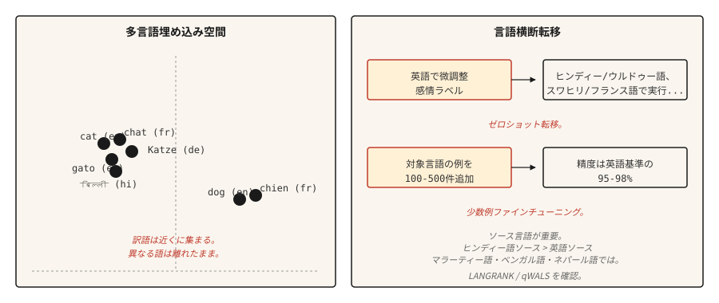

# 多语言 NLP (Multilingual NLP)

> 一个模型，100+ 种语言，其中大多数语言的训练数据为零。跨语言迁移是 2020 年代实用的奇迹。

**类型：** 学习 (Learn)
**语言：** Python
**前置知识：** 阶段 5 · 04（GloVe、FastText、子词），阶段 5 · 11（机器翻译）
**时长：** ~45 分钟

## 问题 (The Problem)

英语拥有数十亿的标注样本。乌尔都语只有数千。迈蒂利语几乎为零。任何服务于全球用户的实际 NLP 系统，都必须能在那些缺乏任务特定训练数据的冷门语言长尾上工作。

多语言模型通过同时在多种语言上训练一个模型来解决这个问题。共享表示让模型能够将高资源语言学到的技能迁移到低资源语言。在英语情感分析上微调模型，它就能在乌尔都语上直接产生令人惊讶的准确情感预测。这就是零样本跨语言迁移，它重塑了 NLP 产品走向世界的方式。

本节课将阐述其中的权衡、经典模型，以及一个让刚接触多语言工作的团队措手不及的关键决策：选择哪种源语言进行迁移。

## 概念 (The Concept)



**共享词汇表。** 多语言模型使用在面向所有目标语言的文本上训练的 SentencePiece 或 WordPiece 分词器。词汇表是共享的：相同的子词单元在相关语言中表示相同的语素。英语和意大利语中的 `anti-` 得到相同的 token。

**共享表示。** 一个在多种语言上通过掩码语言建模预训练的 Transformer 能够学习到，不同语言中语义相似的句子会产生相似的隐藏状态。mBERT、XLM-R 和 NLLB 都展现出这一特性。英语中 "cat" 的嵌入与法语中 "chat"、西班牙语中 "gato" 的嵌入聚在一起，完整句子的嵌入也是如此。

**零样本迁移。** 在一种语言（通常是英语）的标注数据上微调模型。推理时，在模型支持的任何其他语言上运行。不需要目标语言的标注数据。结果在类型学上相近的语言中表现强劲，在差异较大的语言中较弱。

**少样本微调。** 在目标语言中添加 100-500 条标注样本。在分类任务上，准确率能跃升至英语基线的 95-98%。这是多语言 NLP 中性价比最高的杠杆。

## 模型 (The Models)

| 模型 | 年份 | 覆盖语言数 | 说明 |
|-------|------|----------|-------|
| mBERT | 2018 | 104 种语言 | 基于 Wikipedia 训练。首个实用的多语言语言模型。低资源语言表现较弱。 |
| XLM-R | 2019 | 100 种语言 | 基于 CommonCrawl（远大于 Wikipedia）训练。确立了跨语言基线。Base 270M，Large 550M。 |
| XLM-V | 2023 | 100 种语言 | XLM-R 的变体，拥有 100 万 token 的词汇表（对比 25 万）。低资源语言表现更好。 |
| mT5 | 2020 | 101 种语言 | 面向多语言生成的 T5 架构。 |
| NLLB-200 | 2022 | 200 种语言 | Meta 的翻译模型；包含 55 种低资源语言。 |
| BLOOM | 2022 | 46 种语言 + 13 种编程语言 | 开源多语言训练的 176B 大型语言模型。 |
| Aya-23 | 2024 | 23 种语言 | Cohere 的多语言大型语言模型。在阿拉伯语、印地语、斯瓦希里语上表现强劲。 |

根据使用场景选择。分类任务建议使用 XLM-R-base 作为稳妥的默认选择。生成任务根据是翻译还是开放式生成，选择 mT5 或 NLLB。大型语言模型类工作可配合 Aya-23 或 Claude，使用显式的多语言提示。

## 源语言决策 (The Source-Language Decision)（2026 年研究）

大多数团队默认使用英语作为微调源语言。近期研究（2026 年）表明这往往是错误的。

语言相似性比原始语料库大小更能预测迁移质量。对于斯拉夫语族目标语言，德语或俄语通常优于英语。对于印度语族目标语言，印地语通常优于英语。**qWALS** 相似性指标（2026 年，基于《世界语言结构地图集》特征）对此进行了量化。**LANGRANK**（Lin 等人，ACL 2019）是一种更早的独立方法，它结合语言相似性、语料库大小和遗传关系对候选源语言进行排名。

实用规则：如果你的目标语言有一个类型学上相近的高资源相关语言，请先尝试在该语言上微调，然后与英语微调结果进行比较。

## 动手实践 (Build It)

### 步骤 1：零样本跨语言分类

```python
from transformers import AutoTokenizer, AutoModelForSequenceClassification
import torch

tok = AutoTokenizer.from_pretrained("joeddav/xlm-roberta-large-xnli")
model = AutoModelForSequenceClassification.from_pretrained("joeddav/xlm-roberta-large-xnli")


def classify(text, candidate_labels, hypothesis_template="This text is about {}."):
    scores = {}
    for label in candidate_labels:
        hypothesis = hypothesis_template.format(label)
        inputs = tok(text, hypothesis, return_tensors="pt", truncation=True)
        with torch.no_grad():
            logits = model(**inputs).logits[0]
        entail_score = torch.softmax(logits, dim=-1)[2].item()
        scores[label] = entail_score
    return dict(sorted(scores.items(), key=lambda x: -x[1]))


print(classify("I love this product!", ["positive", "negative", "neutral"]))
print(classify("मुझे यह उत्पाद पसंद है!", ["positive", "negative", "neutral"]))
print(classify("J'adore ce produit !", ["positive", "negative", "neutral"]))
```

一个模型，三种语言，同一套 API。在 NLI 数据上训练的 XLM-R 通过蕴涵技巧很好地迁移到了分类任务。

### 步骤 2：多语言嵌入空间

```python
from sentence_transformers import SentenceTransformer
import numpy as np

model = SentenceTransformer("sentence-transformers/paraphrase-multilingual-MiniLM-L12-v2")

pairs = [
    ("The cat is sleeping.", "Le chat dort."),
    ("The cat is sleeping.", "El gato está durmiendo."),
    ("The cat is sleeping.", "Die Katze schläft."),
    ("The cat is sleeping.", "The dog is barking."),
]

for eng, other in pairs:
    emb_eng = model.encode([eng], normalize_embeddings=True)[0]
    emb_other = model.encode([other], normalize_embeddings=True)[0]
    sim = float(np.dot(emb_eng, emb_other))
    print(f"  {eng!r} <-> {other!r}: cos={sim:.3f}")
```

翻译后的句子在嵌入空间中距离很近。不同的英语句子距离更远。这就是跨语言检索、聚类和相似度计算的基础。

### 步骤 3：少样本微调策略

```python
from transformers import TrainingArguments, Trainer
from datasets import Dataset


def few_shot_finetune(base_model, base_tokenizer, examples):
    ds = Dataset.from_list(examples)

    def tokenize_fn(ex):
        out = base_tokenizer(ex["text"], truncation=True, max_length=128)
        out["labels"] = ex["label"]
        return out

    ds = ds.map(tokenize_fn)
    args = TrainingArguments(
        output_dir="out",
        per_device_train_batch_size=8,
        num_train_epochs=5,
        learning_rate=2e-5,
        save_strategy="no",
    )
    trainer = Trainer(model=base_model, args=args, train_dataset=ds)
    trainer.train()
    return base_model
```

对于 100-500 条目标语言样本，`num_train_epochs=5` 和 `learning_rate=2e-5` 是安全默认值。较高的学习率会导致多语言对齐崩溃，最终得到一个仅支持英语的模型。

## 真正有效的评估方法 (Evaluation That Actually Works)

- **每个语言在留出集上的准确率。** 不要聚合。聚合会掩盖长尾问题。
- **与单语言基线对比。** 对于数据充足的语言，从零训练的单语言模型有时能超越多语言模型。请进行测试。
- **实体级测试。** 目标语言中的命名实体。多语言模型对于远离拉丁字母的文字系统通常分词较弱。
- **跨语言一致性。** 两种语言中相同含义的句子应产生相同的预测结果。衡量差距。

## 实际应用 (Use It)

2026 年推荐技术栈：

| 任务 | 推荐方案 |
|-----|-------------|
| 分类，100 种语言 | 微调后的 XLM-R-base（~270M） |
| 零样本文本分类 | `joeddav/xlm-roberta-large-xnli` |
| 多语言句子嵌入 | `sentence-transformers/paraphrase-multilingual-MiniLM-L12-v2` |
| 翻译，200 种语言 | `facebook/nllb-200-distilled-600M`（参见课程 11） |
| 生成式多语言 | Claude、GPT-4、Aya-23、mT5-XXL |
| 低资源语言 NLP | XLM-V 或基于相关高资源语言的领域特定微调 |

如果性能至关重要，务必为目标语言的微调预留预算。零样本只是一个起点，不是最终答案。

### 分词税（低资源语言的问题所在）

多语言模型在所有语言之间共享一个分词器。该词汇表是在以英语、法语、西班牙语、中文、德语为主的语料上训练的。对于主流语言集之外的任何语言，三种税费会悄然叠加：

- **繁殖力税。** 低资源语言的文本每个词分出的 token 数量远多于英语。一句印地语句子所需的 token 可能是同等英语句子的 3-5 倍。这 3-5 倍的差异会消耗你的上下文窗口、训练效率和延迟。
- **变体恢复税。** 每一个拼写错误、变音符号变体、Unicode 归一化不匹配或大小写变体，都会在嵌入空间中变成冷启动的不相关序列。模型无法学习母语者认为显而易见的正字法对应关系。
- **容量溢出税。** 税 1 和税 2 消耗了上下文位置、网络层深度和嵌入维度。留给实际推理的资源，系统性地少于高资源语言从同一模型中获得的资源。

实际表现：你的模型在印地语上训练正常，损失曲线看似合理，评估困惑度看起来可以接受，但生产输出却存在微妙的错误。词法形态在句子中途崩溃。罕见的屈折变化始终无法恢复。**你无法通过扩大数据规模来修复一个损坏的分词器。**

缓解方案：选择一个对目标语言有良好覆盖的分词器（XLM-V 的 100 万 token 词汇表是一个直接的修复方案）；在训练前，在留出的目标文本上验证分词繁殖力；对于真正的长尾文字系统，使用字节级回退（SentencePiece 的 `byte_fallback=True`、GPT-2 风格的字节级 BPE），确保不会出现 OOV。

## 交付方案 (Ship It)

保存为 `outputs/skill-multilingual-picker.md`：

```markdown
---
name: multilingual-picker
description: 为多语言 NLP 任务选择源语言、目标模型和评估方案。
version: 1.0.0
phase: 5
lesson: 18
tags: [nlp, multilingual, cross-lingual]
---

给定需求（目标语言、任务类型、每种语言可用的标注数据），输出：

1. 微调的源语言。默认英语；如果目标语言有类型学上相近的高资源语言，请检查 LANGRANK 或 qWALS。
2. 基础模型。XLM-R（分类）、mT5（生成）、NLLB（翻译）、Aya-23（生成式大型语言模型）。
3. 少样本预算。如果可用，从 100-500 条目标语言样本开始。仅在标注不可行时使用零样本。
4. 评估方案。每种语言的准确率（非聚合）、跨语言一致性、非拉丁文字上的实体级 F1。

拒绝交付一个没有按语言进行评估的多语言模型——聚合指标会掩盖长尾失败。标记那些分词覆盖率低的文字系统（阿姆哈拉语、提格里尼亚语、许多非洲语言）为需要具有字节级回退的模型（SentencePiece 的 byte_fallback=True，或 GPT-2 风格的字节级分词器）。
```

## 练习 (Exercises)

1. **简单。** 在英语、法语、印地语和阿拉伯语中，每种语言运行 10 个句子的零样本分类流程。报告每种语言的准确率。你应该会看到法语表现强劲，印地语表现尚可，阿拉伯语表现不一。
2. **中等。** 使用 `paraphrase-multilingual-MiniLM-L12-v2` 构建一个跨语言检索器，运用于一个小型混合语言语料库。用英语查询，检索任意语言的文档。测量 recall@5。
3. **困难。** 比较英语源和印地语源的微调对印地语分类任务的效果。在两种方案下都使用 500 条目标语言样本进行少样本微调。报告哪种源语言产生的印地语准确率更高以及高出多少。这是 LANGRANK 论文的缩影。

## 关键术语 (Key Terms)

| 术语 | 人们的说法 | 实际含义 |
|------|-----------------|-----------------------|
| 多语言模型 (Multilingual model) | 一个模型，多种语言 | 跨语言共享词汇表和参数。 |
| 跨语言迁移 (Cross-lingual transfer) | 用一种语言训练，用另一种语言运行 | 在源语言上微调，在目标语言上评估，无需目标语言标注数据。 |
| 零样本 (Zero-shot) | 无目标语言标注数据 | 无需在目标语言上微调的迁移。 |
| 少样本 (Few-shot) | 少量目标语言标注数据 | 使用 100-500 条目标语言样本进行微调。 |
| mBERT | 首个多语言语言模型 | 基于 Wikipedia 预训练的 104 语言 BERT。 |
| XLM-R | 标准跨语言基线 | 基于 CommonCrawl 预训练的 100 语言 RoBERTa。 |
| NLLB | Meta 的 200 语言机器翻译模型 | 不让任何语言掉队（No Language Left Behind）。包含 55 种低资源语言。 |

## 延伸阅读 (Further Reading)

- [Conneau et al. (2019). Unsupervised Cross-lingual Representation Learning at Scale](https://arxiv.org/abs/1911.02116) — XLM-R 论文。
- [Pires, Schlinger, Garrette (2019). How Multilingual is Multilingual BERT?](https://arxiv.org/abs/1906.01502) — 开启跨语言迁移研究路线的分析论文。
- [Costa-jussà et al. (2022). No Language Left Behind](https://arxiv.org/abs/2207.04672) — NLLB-200 论文。
- [Üstün et al. (2024). Aya Model: An Instruction Finetuned Open-Access Multilingual Language Model](https://arxiv.org/abs/2402.07827) — Cohere 的多语言大型语言模型 Aya。
- [Language Similarity Predicts Cross-Lingual Transfer Learning Performance (2026)](https://www.mdpi.com/2504-4990/8/3/65) — qWALS / LANGRANK 源语言论文。
