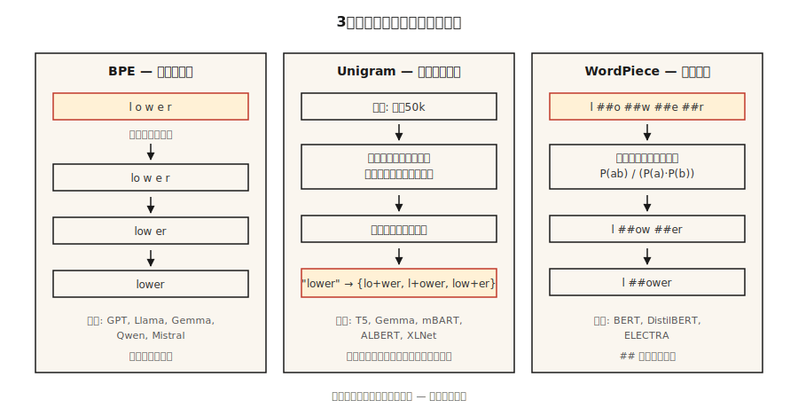

# Tokenização Subword — BPE, WordPiece, Unigram, SentencePiece

> Tokenizers de palavra engasgam com palavras não vistas. Tokenizers de caractere explodem o tamanho da sequência. Tokenizers subword dividem o meio do caminho. Todo LLM moderno roda em um deles.

**Tipo:** Aprender
**Linguagens:** Python
**Pré-requisitos:** Fase 5 · 01 (Processamento de Texto), Fase 5 · 04 (GloVe / FastText / Subword)
**Tempo:** ~60 minutos

## O Problema

Seu vocabulário tem 50.000 palavras. Um usuário digita "untokenizable". Seu tokenizer retorna `[UNK]`. Agora o modelo não tem sinal nenhum sobre a palavra. Pior: o percentil 90 do seu corpus tem 40 palavras raras, o que significa 40 bits de informação perdida por documento.

Tokenização subword resolve isso. Palavras comuns ficam como tokens únicos. Palavras raras se decompõem em pedaços significativos: `untokenizable` → `un`, `token`, `izable`. Dados de treino cobrem tudo porque qualquer string é ultimate uma sequência de bytes.

Todo LLM de fronteira em 2026 roda em um de três algoritmos (BPE, Unigram, WordPiece), envolvido em uma de três bibliotecas (tiktoken, SentencePiece, HF Tokenizers). Você não pode disponibilizar um modelo de linguagem sem escolher um.

## O Conceito



**BPE (Byte-Pair Encoding).** Começa com vocabulário em nível de caractere. Conta cada par adjacente. Funde o par mais frequente num novo token. Repete até atingir o tamanho do vocabulário alvo. Algoritmo dominante: GPT-2/3/4, Llama, Gemma, Qwen2, Mistral.

**BPE em nível de byte.** Mesmo algoritmo mas sobre bytes brutos (256 tokens base) em vez de caracteres Unicode. Garante zero tokens `[UNK]` — qualquer sequência de bytes é codificável. GPT-2 usa 50.257 tokens (256 bytes + 50.000 fusões + 1 eespecificaçãoial).

**Unigram.** Começa com um vocabulário enorme. Atribui a cada token uma probabilidade unigrama. Poda iterativamente tokens cuja remoção menos aumenta a verossimilhança do corpus. Probabilístico em inferência: pode amostrar tokenizações (útil pra augmentação de dados via regularização subword). Usado por T5, mBART, ALBERT, XLNet, Gemma.

**WordPiece.** Funde pares que maximizam a verossimilhança do corpus de treino em vez de frequência bruta. Usado por BERT, DistilBERT, ELECTRA.

**SentencePiece vs tiktoken.** SentencePiece é a biblioteca que *treina* vocabulários (BPE ou Unigram) diretamente em texto Unicode bruto, codificando espaços como `▁`. tiktoken é o *encoder* rápido da OpenAI contra vocabulários pré-construídos; não treina.

Regra geral:

- **Treinar vocabulário novo:** SentencePiece (multilíngue, sem pré-tokenização) ou HF Tokenizers.
- **Inferência rápida com vocabulário GPT:** tiktoken (cl100k_base, o200k_base).
- **Os dois:** HF Tokenizers — uma biblioteca, treino + servimento.

## Construindo

### Passo 1: BPE do zero

Veja `code/main.py`. O loop:

```python
def train_bpe(corpus, num_merges):
    vocab = {tuple(word) + ("</w>",): count for word, count in corpus.items()}
    merges = []
    for _ in range(num_merges):
        pairs = Counter()
        for symbols, freq in vocab.items():
            for a, b in zip(symbols, symbols[1:]):
                pairs[(a, b)] += freq
        if not pairs:
            break
        best = pairs.most_common(1)[0][0]
        merges.append(best)
        vocab = apply_merge(vocab, best)
    return merges
```

Três fatos que o algoritmo codifica. `</w>` marca o fim da palavra pra "low" (sufixo) e "lower" (prefixo) ficarem distintos. Ponderação por frequência faz pares de alta frequência vencerem cedo. A lista de fusões é ordenada — inferência aplica fusões na ordem de treino.

### Passo 2: codificar com as fusões aprendidas

```python
def encode_bpe(word, merges):
    symbols = list(word) + ["</w>"]
    for a, b in merges:
        i = 0
        while i < len(symbols) - 1:
            if symbols[i] == a and symbols[i + 1] == b:
                symbols = symbols[:i] + [a + b] symbols[i + 2:]
            else:
                i += 1
    return symbols
```

Ingênuo O(n·|merges|). Implementações de produção (tiktoken, HF Tokenizers) usam busca por rank de fusão com filas de prioridade e rodam em tempo quase linear.

### Passo 3: SentencePiece na prática

```python
import sentencepiece as spm

spm.SentencePieceTrainer.train(
    input="corpus.txt",
    model_prefix="my_tokenizer",
    vocab_size=8000,
    model_type="bpe",          # or "unigram"
    character_coverage=0.9995, # lower for CJK (e.g. 0.9995 for English, 0.995 for Japanese)
    normalization_rule_name="nmt_nfkc",
)

sp = spm.SentencePieceProcessor(model_file="my_tokenizer.model")
print(sp.encode("untokenizable", out_type=str))
# ['▁un', 'token', 'izable']
```

Perceba: sem necessidade de pré-tokenização, espaço codificado como `▁`, `character_coverage` controla o quanto caracteres raros são preservados vs mapeados pra `<unk>`.

### Passo 4: tiktoken pra vocabulários compatíveis com OpenAI

```python
import tiktoken
enc = tiktoken.get_encoding("o200k_base")
print(enc.encode("untokenizable"))        # [127340, 101028]
print(len(enc.encode("Hello, world!")))   # 4
```

Apenas codificação. Rápido (backend em Rust). Corresponde exatamente à tokenização GPT-4/5 pra contagem de bytes, estimação de custo e orçamento de janela de contexto.

## Armadilhas que ainda causam problemas em 2026

- **Drift de tokenizer.** Treina com vocabulário A, deploya com vocabulário B. IDs de tokens diferentes; modelo produz lixo. Verifique o hash de `tokenizer.json` no CI.
- **Ambiguidade de espaço em branco.** BPE "hello" vs " hello" produzem tokens diferentes. Sempre eespecificaçãoifique `add_especificaçãoial_tokens` e `add_prefix_space` explicitamente.
- **Sub-treinamento multilíngue.** Corpora com predominância de inglês produzem vocabulários que dividem escritas não-latinas em 5-10x mais tokens. O mesmo prompt custa 5-10x mais em japonês/árabe no GPT-3.5. o200k_base corrigiu parcialmente.
- **Divisão de emoji.** Um único emoji pode custar 5 tokens. Considere o tratamento de emoji ao orçar contexto.

## Usar

A stack de 2026:

| Situação | Escolha |
|-----------|------|
| Treinar modelo monolíngue do zero | HF Tokenizers (BPE) |
| Treinar modelo multilíngue | SentencePiece (Unigram, `character_coverage=0.9995`) |
| Servir API compatível com OpenAI | tiktoken (`o200k_base` pra GPT-4+) |
| Vocabulário de domínio eespecificaçãoífico (código, matemática, proteína) | Treinar BPE customizado em corpus de domínio, fundir com vocabulário base |
| Inferência em borda, modelo pequeno | Unigram (vocabulários menores funcionam melhor) |

Tamanho do vocabulário é uma decisão de escala, não uma constante. Heurística rough: 32k pra <1B parâmetros, 50-100k pra 1-10B, 200k+ pra multilíngue/fronteira.

## Entregar

Salve como `outputs/skill-bpe-vs-wordpiece.md`:

```markdown
---
name: tokenizer-picker
description: Pick tokenizer algorithm, vocab size, library for a given corpus and deployment target.
version: 1.0.0
phase: 5
lesson: 19
tags: [nlp, tokenization]
---

Given a corpus (size, languages, domain) and deployment target (training from scratch / fine-tuning / API-compatible inference), output:

1. Algorithm. BPE, Unigram, or WordPiece. One-sentence reason.
2. Library. SentencePiece, HF Tokenizers, or tiktoken. Reason.
3. Vocab size. Rounded to nearest 1k. Reason tied to model size and language coverage.
4. Coverage settings. `character_coverage`, `byte_fallback`, especificaçãoial-token list.
5. Validation plan. Average tokens-per-word on held-out set, OOV rate, compression ratio, round-trip decode equality.

Refuse to train a character-coverage <0.995 tokenizer on corpora with rare-script content. Refuse to ship a vocab without a frozen `tokenizer.json` hash check in CI. Flag any monolingual tokenizer under 16k vocab as likely under-especificação.
```

## Exercícios

1. **Fácil.** Treine um BPE de 500 fusões no corpus pequeno de `code/main.py`. Codifique três palavras de validação. Quantas produziram exatamente 1 token vs >1 token?
2. **Médio.** Compare contagens de tokens em 100 frases da Wikipédia em inglês entre `cl100k_base`, `o200k_base` e um SentencePiece BPE que você treina com vocab=32k. Reporte a razão de compressão de cada.
3. **Difícil.** Treine o mesmo corpus com BPE, Unigram e WordPiece. Meça a acurácia downstream ao usar cada um num classificador pequeno de sentimento. A escolha move a agulha mais que 1 ponto F1?

## Termos Chave

| Termo | O que as pessoas dizem | O que significa de verdade |
|------|-----------------|-----------------------|
| BPE | Byte-Pair Encoding | Fusão gananciosa dos pares de caracteres mais frequentes até atingir o tamanho do vocabulário alvo. |
| BPE em nível de byte | Sem tokens desconhecidos nunca | BPE sobre 256 bytes brutos; GPT-2 / Llama usam isso. |
| Unigram | Tokenizer probabilístico | Poda a partir de um grande conjunto candidato usando verossimilhança; usado por T5, Gemma. |
| SentencePiece | O de espaço em branco | Biblioteca que treina BPE/Unigram em texto bruto; espaço codificado como `▁`. |
| tiktoken | O rápido | Encoder BPE em Rust da OpenAI pra vocabulários pré-construídos. Sem treino. |
| Lista de fusões | Os números mágicos | Lista ordenada de fusões `(a, b) → ab`; inferência aplica na ordem. |
| Cobertura de caractere | O que é raro demais? | Fração de caracteres no corpus de treino que o tokenizer deve cobrir; ~0.9995 típico. |

## Leitura Complementar

- [Sennrich, Haddow, Birch (2015). Neural Machine Translation of Rare Words with Subword Units](https://arxiv.org/abs/1508.07909) — o paper do BPE.
- [Kudo (2018). Subword Regularization with Unigram Language Model](https://arxiv.org/abs/1804.10959) — o paper do Unigram.
- [Kudo, Richardson (2018). SentencePiece: A simple and language independent subword tokenizer](https://arxiv.org/abs/1808.06226) — a biblioteca.
- [Hugging Face — Summary of the tokenizers](https://huggingface.co/docs/transformers/tokenizer_summary) — referência concisa.
- [OpenAI tiktoken repo](https://github.com/openai/tiktoken) — cookbook + lista de codificações.
