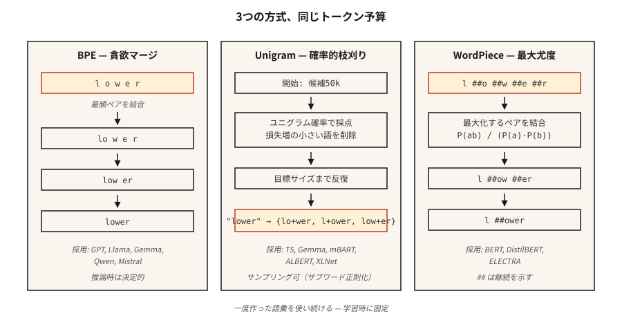

# 子词分词 — BPE、WordPiece、Unigram、SentencePiece (Subword Tokenization — BPE, WordPiece, Unigram, SentencePiece)

> 基于词的分词器遇到未见过的词就会失效。基于字符的分词器会把序列长度拉到爆炸。子词分词器则取其中间路线。每一个现代大语言模型都依赖它。

**类型：** 学习 (Type: Learn)
**语言：** Python (Languages: Python)
**前置知识：** 阶段 5 · 01（文本处理），阶段 5 · 04（GloVe / FastText / 子词） (Prerequisites: Phase 5 · 01 (Text Processing), Phase 5 · 04 (GloVe / FastText / Subword))
**时间：** 约 60 分钟 (Time: ~60 minutes)

## 问题 (The Problem)

你的词汇表有 50,000 个词。用户输入了"untokenizable"。你的分词器返回 `[UNK]`。模型现在对该词没有任何信号。更糟的是：语料库中第 90 百分位的文档有 40 个罕见词，这意味着每篇文档丢失了 40 比特的信息。

子词分词解决了这个问题。常见词保持为单个 token。罕见词分解成有意义的片段：`untokenizable` → `un`、`token`、`izable`。训练数据覆盖一切，因为任何字符串归根结底都是一串字节。

2026 年的每一个前沿大语言模型都依赖三种算法之一（BPE、Unigram、WordPiece），包裹在三个库之一中（tiktoken、SentencePiece、HF Tokenizers）。你要发布语言模型，就必须从中选一个。

## 概念 (The Concept)



**BPE（字节对编码，Byte-Pair Encoding）。** 从字符级别的词汇表开始。统计每一对相邻字符。将最频繁的相邻对合并为一个新 token。重复直到达到目标词汇表大小。主导算法：GPT-2/3/4、Llama、Gemma、Qwen2、Mistral。

**字节级 BPE（Byte-level BPE）。** 算法相同，但在原始字节（256 个基本 token）而非 Unicode 字符上运行。保证零 `[UNK]` token——任何字节序列都能编码。GPT-2 使用 50,257 个 token（256 字节 + 50,000 次合并 + 1 个特殊 token）。

**Unigram。** 从一个巨大的词汇表开始。为每个 token 分配一个 unigram 概率。迭代式地剪除那些移除后对语料库对数似然增加最小的 token。推理时具有概率性：可以对分词结果进行采样（通过子词正则化用于数据增强）。T5、mBART、ALBERT、XLNet、Gemma 使用。

**WordPiece。** 合并能够最大化训练语料库似然（而非原始频率）的相邻对。BERT、DistilBERT、ELECTRA 使用。

**SentencePiece vs tiktoken。** SentencePiece 是直接在原始 Unicode 文本上*训练*词汇表（BPE 或 Unigram）的库，将空白编码为 `▁`。tiktoken 是 OpenAI 针对预构建词汇表的快速*编码器*；它不进行训练。

经验法则：

- **训练新词汇表：** SentencePiece（多语言，无需预分词）或 HF Tokenizers。
- **针对 GPT 词汇表进行快速推理：** tiktoken（cl100k_base、o200k_base）。
- **两者都要：** HF Tokenizers——一个库，训练 + 服务。

```figure
bpe-merge
```

## 动手实现 (Build It)

### 第 1 步：从零实现 BPE (Step 1: BPE from scratch)

参见 `code/main.py`。循环：

```python
def train_bpe(corpus, num_merges):
    vocab = {tuple(word) + ("</w>",): count for word, count in corpus.items()}
    merges = []
    for _ in range(num_merges):
        pairs = Counter()
        for symbols, freq in vocab.items():
            for a, b in zip(symbols, symbols[1:]):
                pairs[(a, b)] += freq
        if not pairs:
            break
        best = pairs.most_common(1)[0][0]
        merges.append(best)
        vocab = apply_merge(vocab, best)
    return merges
```

该算法编码了三个事实。`</w>` 标记词尾，使 "low"（后缀）和 "lower"（前缀）保持区分。频率加权使高频对优先合并。合并列表是有序的——推理时按训练顺序应用合并。

### 第 2 步：用学到的合并规则进行编码 (Step 2: encode with the learned merges)

```python
def encode_bpe(word, merges):
    symbols = list(word) + ["</w>"]
    for a, b in merges:
        i = 0
        while i < len(symbols) - 1:
            if symbols[i] == a and symbols[i + 1] == b:
                symbols = symbols[:i] + [a + b] + symbols[i + 2:]
            else:
                i += 1
    return symbols
```

朴素实现为 O(n·|merges|)。生产级实现（tiktoken、HF Tokenizers）使用基于合并排名的查找配合优先队列，运行时间接近线性。

### 第 3 步：实践中的 SentencePiece (Step 3: SentencePiece in practice)

```python
import sentencepiece as spm

spm.SentencePieceTrainer.train(
    input="corpus.txt",
    model_prefix="my_tokenizer",
    vocab_size=8000,
    model_type="bpe",          # or "unigram"
    character_coverage=0.9995, # 对于CJK语言可降低（例如英语0.9995，日语0.995）
    normalization_rule_name="nmt_nfkc",
)

sp = spm.SentencePieceProcessor(model_file="my_tokenizer.model")
print(sp.encode("untokenizable", out_type=str))
# ['▁un', 'token', 'izable']
```

注意：无需预分词，空格编码为 `▁`，`character_coverage` 控制保留罕见字符与映射为 `<unk>` 之间的激进程度。

### 第 4 步：面向 OpenAI 兼容词汇表的 tiktoken (Step 4: tiktoken for OpenAI-compatible vocabs)

```python
import tiktoken
enc = tiktoken.get_encoding("o200k_base")
print(enc.encode("untokenizable"))        # [127340, 101028]
print(len(enc.encode("Hello, world!")))   # 4
```

仅编码。快速（Rust 后端）。与 GPT-4/5 分词结果精确匹配，用于字节计数、成本估算和上下文窗口预算。

## 2026 年仍在踩的坑 (Pitfalls that still ship in 2026)

- **分词器漂移（Tokenizer drift）。** 用词汇表 A 训练，部署时却针对词汇表 B。Token ID 不同；模型输出垃圾。在 CI 中检查 `tokenizer.json` 的哈希值。
- **空白歧义（Whitespace ambiguity）。** BPE 对 "hello" 和 " hello" 会产生不同的 token。始终显式指定 `add_special_tokens` 和 `add_prefix_space`。
- **多语言训练不足（Multilingual undertraining）。** 以英语为主的语料库训练出的词汇表会将非拉丁文字拆分成 5-10 倍的 token。同样的提示词在 GPT-3.5 上，日语/阿拉伯语的成本高出 5-10 倍。o200k_base 部分修复了这个问题。
- **Emoji 拆分（Emoji splits）。** 一个 emoji 可能占用 5 个 token。在预算上下文时务必检查 emoji 的处理方式。

## 应用 (Use It)

2026 年的选型表：

| 场景 (Situation) | 选择 (Pick) |
|----------------|------------|
| 从头训练单语言模型 | HF Tokenizers (BPE) |
| 训练多语言模型 | SentencePiece (Unigram, `character_coverage=0.9995`) |
| 提供 OpenAI 兼容 API 服务 | tiktoken（GPT-4+ 使用 `o200k_base`） |
| 领域特定词汇表（代码、数学、蛋白质） | 在领域语料上训练自定义 BPE，与基础词汇表合并 |
| 边缘推理、小模型 | Unigram（较小的词汇表效果更好） |

词汇表大小是一个缩放决策，而非固定常量。粗略经验：参数 <1B 时用 32k，1-10B 时用 50-100k，多语言/前沿模型用 200k+。

## 交付 (Ship It)

保存为 `outputs/skill-bpe-vs-wordpiece.md`：

```markdown
---
name: tokenizer-picker
description: 针对给定语料库和部署目标选择分词器算法、词汇表大小和库。
version: 1.0.0
phase: 5
lesson: 19
tags: [nlp, tokenization]
---

Given a corpus (size, languages, domain) and deployment target (training from scratch / fine-tuning / API-compatible inference), output:

1. Algorithm. BPE, Unigram, or WordPiece. One-sentence reason.
2. Library. SentencePiece, HF Tokenizers, or tiktoken. Reason.
3. Vocab size. Rounded to nearest 1k. Reason tied to model size and language coverage.
4. Coverage settings. `character_coverage`, `byte_fallback`, special-token list.
5. Validation plan. Average tokens-per-word on held-out set, OOV rate, compression ratio, round-trip decode equality.

Refuse to train a character-coverage <0.995 tokenizer on corpora with rare-script content. Refuse to ship a vocab without a frozen `tokenizer.json` hash check in CI. Flag any monolingual tokenizer under 16k vocab as likely under-spec.
```

## 练习 (Exercises)

1. **简单（Easy）。** 在 `code/main.py` 的小型语料库上训练一个 500 次合并的 BPE。对三个未见过的词进行编码。有多少生成了恰好 1 个 token vs >1 个 token？
2. **中等（Medium）。** 比较 100 条英文维基百科句子在 `cl100k_base`、`o200k_base` 和你用 vocab=32k 训练的 SentencePiece BPE 之间的 token 数量。报告每种方法的压缩比。
3. **困难（Hard）。** 在同一语料库上用 BPE、Unigram 和 WordPiece 分别训练。在小规模情感分类器上使用每种分词器，测量下游准确率。不同的选择是否会使 F1 分数产生超过 1 个百分点的差异？

## 关键术语 (Key Terms)

| Term | 大家怎么说 (What people say) | 实际含义 (What it actually means) |
|------|---------------------------|--------------------------------|
| BPE | 字节对编码 (Byte-Pair Encoding) | 贪心合并最频繁的字符对，直到达到目标词汇表大小。 |
| 字节级 BPE (Byte-level BPE) | 永不出现未知 token (No unknown tokens ever) | 在原始 256 字节上运行的 BPE；GPT-2 / Llama 使用此方法。 |
| Unigram | 概率分词器 (Probabilistic tokenizer) | 从大型候选集中利用对数似然进行剪枝；T5、Gemma 使用。 |
| SentencePiece | 处理空白的那个 (The whitespace one) | 在原始文本上训练 BPE/Unigram 的库；空格编码为 `▁`。 |
| tiktoken | 快速的那个 (The fast one) | OpenAI 基于 Rust 的 BPE 编码器，用于预构建词汇表。不进行训练。 |
| 合并列表 (Merge list) | 魔法数字 (The magic numbers) | 有序的 `(a, b) → ab` 合并列表；推理时按顺序应用。 |
| 字符覆盖率 (Character coverage) | 多罕见才算太罕见？(How rare is too rare?) | 分词器必须覆盖的训练语料库中字符的比例；通常约 0.9995。 |

## 扩展阅读 (Further Reading)

- [Sennrich, Haddow, Birch (2015). Neural Machine Translation of Rare Words with Subword Units](https://arxiv.org/abs/1508.07909) — BPE 论文。
- [Kudo (2018). Subword Regularization with Unigram Language Model](https://arxiv.org/abs/1804.10959) — Unigram 论文。
- [Kudo, Richardson (2018). SentencePiece: A simple and language independent subword tokenizer](https://arxiv.org/abs/1808.06226) — 该库的论文。
- [Hugging Face — Summary of the tokenizers](https://huggingface.co/docs/transformers/tokenizer_summary) — 简明参考。
- [OpenAI tiktoken repo](https://github.com/openai/tiktoken) — 示例手册 + 编码列表。
