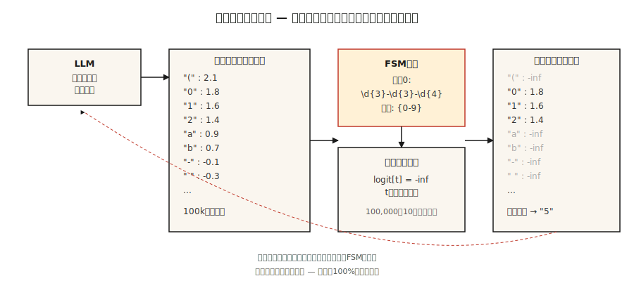

# Structured Outputs & Constrained Decoding

> 向LLM询问JSON。大部分时间都是JSON。在生产中，“大多数”是问题所在。约束解码通过在采样之前编辑logit将“most”转换为“always”。

** 类型：** 构建
** 语言：** Python
** 先决条件：** 阶段5 · 17（聊天机器人）、阶段5 · 19（子词代币化）
** 时间：** ~60分钟

## The Problem

分类器提示LLM：“返回{正、负、中性}之一。“模型回归”情绪是积极的-这篇评论非常有利，因为客户明确表示他们. ".您的解析器崩溃。您的分类器的F1为0.0。

自由形式的生成不是合同。这是一个建议。生产系统需要合同。

2026年存在三层。

1. **好好问。“只返回JSON对象。“在前沿模型上工作约80%，在较小的模型上工作较少。
2. ** 原生结构化输出API。** OpenAI ' respond_form '、Anthropic工具使用、Gemini Jackson模式。可靠地支持支持的模式。供应商锁定。
3. ** 受约束的解码。**在每个生成步骤修改日志，以便模型 * 无法 * 发出无效令牌。100%有效通过施工。适用于任何本地模型。

这堂课为这三个人建立了直觉，并指定了何时到达哪个。

## The Concept



** 受约束解码如何工作。**在每个生成步骤中，LLM都会在完整词汇表（~ 100 k个令牌）上生成一个logit载体。*logit处理器 * 位于模型和采样器之间。它根据目标语法中的当前位置计算哪些标记有效（JSON模式、regex、上下文无关语法），并将所有无效标记的logit设置为负无限大。剩余logit的softmax仅将概率质量置于有效延续上。

2026年实施情况：

- ** 大纲。**将SON架构或regex编译到有限状态机中。每个令牌都会获得O（1）有效下一个令牌查找。基于RSM，因此循环模式需要扁平化。
- **XGrammar / llguidance。**上下文无关的语法引擎。处理迭代的SON架构。接近零的解码开销。OpenAI在其2025年的结构化输出实现中将llguidance归功于他们。
- **vLLM引导解码。**通过Outlines、XGrammar或lm-form-energer后台内置“guided_json”、“guided_regex”、“guided_choice”、“guided_grammar”。
- ** 教练。**任何LLM上的基于Pydantick的包装器。验证失败时再试。跨提供商，但不修改日志-它依赖于再试次数+结构化输出感知提示。

### The counterintuitive result

受约束的解码通常比无约束的生成“更快”。两个原因第首先，它缩小了下一个令牌搜索空间。其次，聪明的实现完全跳过强制令牌的令牌生成（像'{'名称'：'-每个字节都被确定）。

### The pitfall that costs you

现场秩序很重要。将“答案”放在“推理”之前，模型在思考之前就承诺了答案。JSON有效。答案错误。没有验证捕获它。

```json
// BAD
{"answer": "yes", "reasoning": "because ..."}

// GOOD
{"reasoning": "... therefore ...", "answer": "yes"}
```

架构字段顺序是逻辑，而不是格式。

## Build It

### Step 1: regex-constrained generation from scratch

请参阅“code/main.py”以了解独立的RSM实现。30行核心思想：

```python
def mask_logits(logits, valid_token_ids):
    mask = [float("-inf")] * len(logits)
    for tid in valid_token_ids:
        mask[tid] = logits[tid]
    return mask


def generate_constrained(model, tokenizer, prompt, fsm):
    ids = tokenizer.encode(prompt)
    state = fsm.initial_state
    while not fsm.is_accept(state):
        logits = model.next_token_logits(ids)
        valid = fsm.valid_tokens(state, tokenizer)
        logits = mask_logits(logits, valid)
        tok = sample(logits)
        ids.append(tok)
        state = fsm.transition(state, tok)
    return tokenizer.decode(ids)
```

FSM跟踪到目前为止我们已经满足了语法的哪些部分。`valid_tokens（state，tokenizer）`计算哪些词汇标记可以在不离开接受路径的情况下推进FSM。

### Step 2: Outlines for JSON Schema

```python
from pydantic import BaseModel
from typing import Literal
import outlines


class Review(BaseModel):
    sentiment: Literal["positive", "negative", "neutral"]
    confidence: float
    evidence_span: str


model = outlines.models.transformers("meta-llama/Llama-3.2-3B-Instruct")
generator = outlines.generate.json(model, Review)

result = generator("Classify: 'The wait staff was attentive and the food arrived hot.'")
print(result)
# Review(sentiment='positive', confidence=0.93, evidence_span='attentive ... hot')
```

零验证错误。史以来RSM使无效输出不可访问。

### Step 3: Instructor for provider-agnostic Pydantic

```python
import instructor
from anthropic import Anthropic
from pydantic import BaseModel, Field


class Invoice(BaseModel):
    vendor: str
    total_usd: float = Field(ge=0)
    line_items: list[str]


client = instructor.from_anthropic(Anthropic())
invoice = client.messages.create(
    model="claude-opus-4-7",
    max_tokens=1024,
    response_model=Invoice,
    messages=[{"role": "user", "content": "Extract from: 'Acme Corp $420. Widget, Gizmo.'"}],
)
```

不同的机制。教练不碰Logits。它将模式格式化为提示符，解析输出，并在验证失败时重新尝试（默认为3次）。与任何提供商合作。尝试会增加延迟和成本。跨提供商的可移植性是卖点。

### Step 4: native vendor APIs

```python
from openai import OpenAI

client = OpenAI()
response = client.responses.create(
    model="gpt-5",
    input=[{"role": "user", "content": "Classify: 'The food was cold.'"}],
    text={"format": {"type": "json_schema", "name": "sentiment",
          "schema": {"type": "object", "required": ["sentiment"],
                     "properties": {"sentiment": {"type": "string",
                                                  "enum": ["positive", "negative", "neutral"]}}}}},
)
print(response.output_parsed)
```

服务器端约束解码。可靠性与所支持模式的大纲相当。没有本地模型管理。将您锁定在供应商手中。

## Pitfalls

- ** 循环模式。**概述了将回归扩展到固定深度的轮廓。树结构输出（嵌套注释、AST）需要XGrammar或llguidance（基于CGM）。
- ** 巨大的enums。** 10，000-选项enum编译缓慢或超时。切换到检索器：首先预测前k候选项，并限制于这些候选项。
- ** 语法太严格。**强制' Date：' yyyyY-MM-DD ' regex，模型无法为缺失的日期输出''。模特通过虚构日期来弥补。允许“空”或哨兵。
- ** 过早的承诺。**请参阅上面的字段订单陷阱。始终把推理放在第一位。
- ** 没有模式的供应商杨森模式。**纯SON模式仅保证有效的SON，而不是有效的 * 对于您的用例 *。始终提供完整的模式。

## Use It

2026年堆栈：

| 情况 | 接 |
|-----------|------|
| OpenAI/Anthropic/Google模型，简单的模式 | 本地供应商结构化输出 |
| 任何提供商、Pydantic工作流程都可以容忍再试 | 教官 |
| 本地模型，需要100%有效性，扁平模式 | 大纲（RSM） |
| 本地模型、循环模式 | XGrammar或llguide |
| 自托管推理服务器 | vLLM引导解码 |
| 可接受重复尝试的批处理 | 教练+最便宜的型号 |

## Ship It

另存为“输出/skill-structured-output-picker.md”：

```markdown
---
name: structured-output-picker
description: Choose a structured output approach, schema design, and validation plan.
version: 1.0.0
phase: 5
lesson: 20
tags: [nlp, llm, structured-output]
---

Given a use case (provider, latency budget, schema complexity, failure tolerance), output:

1. Mechanism. Native vendor structured output, Instructor retries, Outlines FSM, or XGrammar CFG. One-sentence reason.
2. Schema design. Field order (reasoning first, answer last), nullable fields for "unknown", enum vs regex, required fields.
3. Failure strategy. Max retries, fallback model, graceful `null` handling, out-of-distribution refusal.
4. Validation plan. Schema compliance rate (target 100%), semantic validity (LLM-judge), field-coverage rate, latency p50/p99.

Refuse any design that puts `answer` or `decision` before reasoning fields. Refuse to use bare JSON mode without a schema. Flag recursive schemas behind an FSM-only library.
```

## Exercises

1. ** 简单。**提示小型开权模型（例如，Llama-3.2-3B）没有“评论（情绪、信心、证据_span）”的约束解码。测量100条评论中解析为有效SON的比例。
2. ** 中等。**与概述SON模式相同的数据库。比较合规率、延迟和语义准确性。
3. ** 很难。**从头开始为电话号码（'\d{3}-\d{3}-\d{4}'）实现regex约束的解码器。验证1000个样本上的0个无效输出。

## Key Terms

| Term | 别人怎么说 | 它实际上意味着什么 |
|------|-----------------|-----------------------|
| 约束译码 | 强制有效输出 | 在每个生成步骤都屏蔽无效令牌日志。 |
| Logit处理器 | 约束的东西 | 函数：'（logits，状态）-> masked_logits '。 |
| FSM | 有限状态机 | 已编译的语法表示; O（1）有效下一个令牌查找。 |
| CFG | 上下文无关文法 | 处理回归的语法;速度较慢，但更有表达力。 |
| 架构字段顺序 | 有关系吗？ | 是的-第一个字段提交;始终将推理置于答案之上。 |
| 引导解码 | vLLM的名称 | 相同的概念，集成到推理服务器中。 |
| JSON模式 | OpenAI早期版本 | 保证SON语法;不保证模式匹配。 |

## Further Reading

- [Willard，Louf（2023）。LLM的高效引导生成]（https：//arxiv.org/ab/2307.09702）-大纲论文。
- [XGrammar论文（2024）]（https：//arxiv.org/ab/2411.15100）-快速基于CGM的约束解码。
- [vLLM- 结构化输出]（https：//docs.vllm.ai/en/latest/features/structured_outputs.html）-推理服务器集成。
- [OpenAI -结构化输出指南]（https：//platform.openai.com/docs/guides/structured-outputs）- API参考+ gotchas。
- [讲师库]（https：//python.useWebtor.com/）- Pydantic +跨提供程序重试。
- [JSONSchemaBench（2025）]（https：//arxiv.org/ab/2501.10868）-对6个受约束解码框架进行基准测试。
