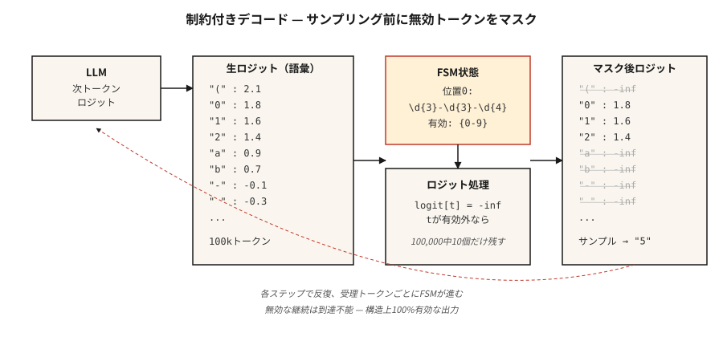

# 结构化输出与约束解码 (Structured Outputs & Constrained Decoding)

> 让 LLM 返回 JSON。大部分时候确实能拿到 JSON。但在生产环境中，"大部分"就是问题。约束解码通过在采样前修改 logits，将"大部分"变成了"总是"。

**类型：** 构建 (Build)
**语言：** Python
**前置条件：** 阶段 5 · 17（聊天机器人）, 阶段 5 · 19（子词分词）
**时间：** ~60 分钟

## 问题所在 (The Problem)

一个分类器提示 LLM："返回 {positive, negative, neutral} 中的一个。"模型返回："The sentiment is positive — this review is overwhelmingly favorable because the customer explicitly states that they ..."。你的解析器崩溃了。你的分类器 F1 得分为 0.0。

自由形式的生成不是契约，而是建议。生产系统需要契约。

2026 年存在三层方案。

1. **提示工程 (Prompting)。** 礼貌地要求。"只返回 JSON 对象。"在顶级模型上约 80% 有效，在较小模型上效果更差。
2. **原生结构化输出 API (Native structured output APIs)。** OpenAI `response_format`、Anthropic tool use、Gemini JSON 模式。在支持的 schema 上可靠，但被供应商锁定。
3. **约束解码 (Constrained decoding)。** 在每一步生成时修改 logits，使模型*无法*产生无效 token。从构造上保证 100% 有效。适用于任何本地模型。

本课旨在建立对这三种方法的直觉，并说明在何种情况下选择哪一种。

## 概念 (The Concept)



**约束解码的工作原理。** 在每一步生成时，LLM 产生一个覆盖整个词汇表（约 10 万个 token）的 logit 向量。一个 *logit 处理器* 位于模型和采样器之间。它根据当前位置在目标文法（JSON Schema、正则表达式、上下文无关文法）中的状态，计算哪些 token 是有效的，并将所有无效 token 的 logits 设为负无穷。在此基础上进行 softmax，概率质量只分布在有效的续写上。

2026 年的实现方案：

- **Outlines.** 将 JSON Schema 或正则表达式编译为有限状态机。每个 token 都能以 O(1) 时间查找下一个有效 token。基于 FSM，因此递归 schema 需要展平处理。
- **XGrammar / llguidance.** 上下文无关文法引擎。处理递归 JSON Schema。解码开销近乎为零。OpenAI 在其 2025 年的结构化输出实现中归功于 llguidance。
- **vLLM guided decoding.** 内置 `guided_json`、`guided_regex`、`guided_choice`、`guided_grammar`，后端基于 Outlines、XGrammar 或 lm-format-enforcer。
- **Instructor.** 基于 Pydantic 的包装器，适用于任何 LLM。验证失败时重试。跨提供商，但不修改 logits——它依赖重试和结构化输出感知的提示。

### 反直觉的结果 (The counterintuitive result)

约束解码通常比非约束生成*更快*。原因有二。第一，它缩小了下一个 token 的搜索空间。第二，巧妙的实现可以完全跳过强制 token 的生成（如 `{"name": "` 这类脚手架——每个字节都是确定的）。

### 让你付出代价的陷阱 (The pitfall that costs you)

字段顺序很重要。把 `answer` 放在 `reasoning` 之前，模型在思考之前就做出了回答。JSON 是有效的，但答案错了，没有任何验证能捕获这一点。

```json
// 错误做法 (BAD)
{"answer": "yes", "reasoning": "because ..."}

// 正确做法 (GOOD)
{"reasoning": "... therefore ...", "answer": "yes"}
```

Schema 字段的顺序是逻辑问题，不是格式问题。

## 动手构建 (Build It)

### 第 1 步：从头实现正则表达式约束生成 (Step 1: regex-constrained generation from scratch)

参见 `code/main.py` 中的独立 FSM 实现。30 行代码的核心思想：

```python
def mask_logits(logits, valid_token_ids):
    mask = [float("-inf")] * len(logits)
    for tid in valid_token_ids:
        mask[tid] = logits[tid]
    return mask


def generate_constrained(model, tokenizer, prompt, fsm):
    ids = tokenizer.encode(prompt)
    state = fsm.initial_state
    while not fsm.is_accept(state):
        logits = model.next_token_logits(ids)
        valid = fsm.valid_tokens(state, tokenizer)
        logits = mask_logits(logits, valid)
        tok = sample(logits)
        ids.append(tok)
        state = fsm.transition(state, tok)
    return tokenizer.decode(ids)
```

FSM 跟踪到目前为止我们已经满足了文法的哪些部分。`valid_tokens(state, tokenizer)` 计算哪些词汇表中的 token 能够推进 FSM 而不离开可接受的路径。

### 第 2 步：使用 Outlines 处理 JSON Schema (Step 2: Outlines for JSON Schema)

```python
from pydantic import BaseModel
from typing import Literal
import outlines


class Review(BaseModel):
    sentiment: Literal["positive", "negative", "neutral"]
    confidence: float
    evidence_span: str


model = outlines.models.transformers("meta-llama/Llama-3.2-3B-Instruct")
generator = outlines.generate.json(model, Review)

result = generator("Classify: 'The wait staff was attentive and the food arrived hot.'")
print(result)
# Review(sentiment='positive', confidence=0.93, evidence_span='attentive ... hot')
```

零验证错误。永远不会有。FSM 使无效输出不可达。

### 第 3 步：使用 Instructor 实现提供商无关的 Pydantic (Step 3: Instructor for provider-agnostic Pydantic)

```python
import instructor
from anthropic import Anthropic
from pydantic import BaseModel, Field


class Invoice(BaseModel):
    vendor: str
    total_usd: float = Field(ge=0)
    line_items: list[str]


client = instructor.from_anthropic(Anthropic())
invoice = client.messages.create(
    model="claude-opus-4-7",
    max_tokens=1024,
    response_model=Invoice,
    messages=[{"role": "user", "content": "Extract from: 'Acme Corp $420. Widget, Gizmo.'"}],
)
```

不同的机制。Instructor 不修改 logits。它将 schema 格式化为提示，解析输出，并在验证失败时重试（默认 3 次）。适用于任何提供商。重试会增加延迟和成本。跨提供商的可移植性是其主要卖点。

### 第 4 步：原生供应商 API (Step 4: native vendor APIs)

```python
from openai import OpenAI

client = OpenAI()
response = client.responses.create(
    model="gpt-5",
    input=[{"role": "user", "content": "Classify: 'The food was cold.'"}],
    text={"format": {"type": "json_schema", "name": "sentiment",
          "schema": {"type": "object", "required": ["sentiment"],
                     "properties": {"sentiment": {"type": "string",
                                                  "enum": ["positive", "negative", "neutral"]}}}}},
)
print(response.output_parsed)
```

服务端约束解码。对于支持的 schema，可靠性与 Outlines 相当。无需管理本地模型。但将你锁定在特定供应商上。

## 陷阱 (Pitfalls)

- **递归 Schema (Recursive schemas).** Outlines 将递归展平到固定深度。树形结构输出（嵌套评论、AST）需要 XGrammar 或 llguidance（基于 CFG）。
- **超大型枚举 (Huge enums).** 包含 10,000 个选项的枚举编译缓慢或超时。改用检索器：先预测 top-k 候选，再约束到这些候选上。
- **文法过于严格 (Grammar too strict).** 强制使用 `date: "YYYY-MM-DD"` 的正则表达式，模型在日期缺失时无法输出 `"unknown"`。模型会编造一个日期作为补偿。应允许 `null` 或一个占位符。
- **过早承诺 (Premature commitment).** 参见上面的字段顺序陷阱。始终把推理放在前面。
- **供应商 JSON 模式不带 schema (Vendor JSON mode without schema).** 纯 JSON 模式只保证有效的 JSON，而不保证对你的*用例*有效。始终提供完整的 schema。

## 使用场景 (Use It)

2026 年的选型方案：

| 场景 (Situation) | 选择 (Pick) |
|-------------------|-------------|
| OpenAI/Anthropic/Google 模型，简单 schema | 原生供应商结构化输出 |
| 任何提供商，Pydantic 工作流，可容忍重试 | Instructor |
| 本地模型，需要 100% 有效性，扁平 schema | Outlines (FSM) |
| 本地模型，递归 schema | XGrammar 或 llguidance |
| 自托管推理服务器 | vLLM guided decoding |
| 可接受重试的批量处理 | Instructor + 最便宜的模型 |

## 落地交付 (Ship It)

保存为 `outputs/skill-structured-output-picker.md`：

```markdown
---
name: structured-output-picker
description: Choose a structured output approach, schema design, and validation plan.
version: 1.0.0
phase: 5
lesson: 20
tags: [nlp, llm, structured-output]
---

Given a use case (provider, latency budget, schema complexity, failure tolerance), output:

1. Mechanism. Native vendor structured output, Instructor retries, Outlines FSM, or XGrammar CFG. One-sentence reason.
2. Schema design. Field order (reasoning first, answer last), nullable fields for "unknown", enum vs regex, required fields.
3. Failure strategy. Max retries, fallback model, graceful `null` handling, out-of-distribution refusal.
4. Validation plan. Schema compliance rate (target 100%), semantic validity (LLM-judge), field-coverage rate, latency p50/p99.

Refuse any design that puts `answer` or `decision` before reasoning fields. Refuse to use bare JSON mode without a schema. Flag recursive schemas behind an FSM-only library.
```

## 练习 (Exercises)

1. **简单 (Easy).** 在不使用约束解码的情况下，用一个小型开放权重模型（例如 Llama-3.2-3B）提示生成 `Review(sentiment, confidence, evidence_span)`。在 100 条评论上测量能解析为有效 JSON 的比例。
2. **中等 (Medium).** 用同一语料库，使用 Outlines JSON 模式。比较合规率、延迟和语义准确度。
3. **困难 (Hard).** 从头实现一个正则表达式约束解码器，用于电话号码（`\d{3}-\d{3}-\d{4}`）。验证在 1000 个样本上零无效输出。

## 关键术语 (Key Terms)

| 术语 (Term) | 人们说的 (What people say) | 实际含义 (What it actually means) |
|-------------|----------------------------|----------------------------------|
| Constrained decoding | 强制有效输出 | 在每一步生成时屏蔽无效 token 的 logits。 |
| Logit processor | 用来约束的那个东西 | 函数：`(logits, state) -> masked_logits`。 |
| FSM | 有限状态机 | 编译后的文法表示；O(1) 查找下一个有效 token。 |
| CFG | 上下文无关文法 | 能处理递归的文法；比 FSM 慢但表达能力更强。 |
| Schema field order | 这重要吗？ | 是的——第一个字段锚定了方向；始终把推理放在答案之前。 |
| Guided decoding | vLLM 的叫法 | 相同概念，集成在推理服务器中。 |
| JSON mode | OpenAI 的早期版本 | 保证 JSON 语法；但不保证与 schema 匹配。 |

## 延伸阅读 (Further Reading)

- [Willard, Louf (2023). Efficient Guided Generation for LLMs](https://arxiv.org/abs/2307.09702) — Outlines 论文。
- [XGrammar paper (2024)](https://arxiv.org/abs/2411.15100) — 基于 CFG 的快速约束解码。
- [vLLM — Structured Outputs](https://docs.vllm.ai/en/latest/features/structured_outputs.html) — 推理服务器集成。
- [OpenAI — Structured Outputs guide](https://platform.openai.com/docs/guides/structured-outputs) — API 参考与注意事项。
- [Instructor library](https://python.useinstructor.com/) — 跨提供商的 Pydantic + 重试。
- [JSONSchemaBench (2025)](https://arxiv.org/abs/2501.10868) — 对 6 种约束解码框架的基准测试。
