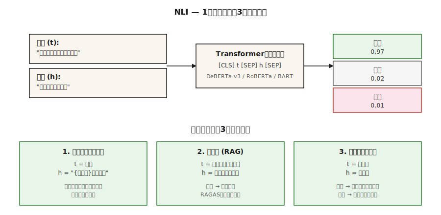

# Natural Language Inference — Textual Entailment

> “t包含h”意味着人类阅读t会得出h为真的结论。NLI的任务是预测隐含/矛盾/中性。表面无聊，生产中承重。

** 类型：** 学习
** 语言：** Python
** 先决条件：** 阶段5 · 05（情绪分析）、阶段5 · 13（问题解答）
** 时间：** ~60分钟

## The Problem

您构建了一个总结器。它产生了一个摘要。你怎么知道总结不包含幻觉？

你建造了一个聊天机器人。它回答“是的。“你怎么知道检索到的段落支持答案？

您需要按主题对10，000篇新闻文章进行分类。您没有培训标签。你可以重复使用模型吗？

所有这三个问题都归结为自然语言推理。NLI问道：给定前提“t”和假设“h”，“h”是由“t”所包含、矛盾还是中性（无关）？

- ** 幻觉检查：**' t '=源文件，' h '=摘要声明。不是束缚=幻觉。
- ** 接地QA：**' t '=检索到的段落，' h '=生成的答案。不是内涵=捏造。
- ** 零镜头分类：** `t` =文档，`h` =文字标签（“This is about sports”）。蕴涵=预测标签。

一项任务，三种生产用途。这就是为什么每个RAG评估框架都会附带NLI模型。

## The Concept



** 三个标签。**

- ** 内涵。** ' t '-h '。“猫在垫子上”意味着“有一只猫。"
- ** 矛盾。** ' t '-h '。“猫在垫子上”与“没有猫”相矛盾。"
- ** 中立。**无论如何都没有推论。“猫在垫子上”与“猫饿了”是中性的。"

** 不符合逻辑。** NLI是“自然”语言推理--典型的人类读者会推断的，而不是严格的逻辑。“约翰遛狗”在NLI中意味着“约翰有一只狗”，但严格的一级逻辑只有在你将附身公理化时才会承认这一点。

** 数据集。**

- **SNLI**（2015）。57万个人类注释对，图像标题作为前提。狭窄的领域。
- **MultiNLI**（2017）。10种流派中有43.3万对。2026年标准培训文集。
- **ANLI**（2019）。敌对的NLI。人类编写了专门旨在打破现有模型的例子。Harder.
- **DocNLI，ConTRoL**（2020-21）。文件长度的前提。测试多跳和远程推理。

** 建筑。** Transformer编码器（BERT、RoBERTa、DeBERTa）读取“[LIS]前提[SEN]假设[SEN]'。“[LIS]”表示提供3路softmax。在MNLI上进行训练，在已发布的基准上进行评估，在分布对上获得90%以上的准确性。

** 通过NLI进行零射击。**给定一个文档和候选标签，将每个标签转化为一个假设（“本文是关于体育的”）。计算每个的蕴含概率。选择最大值。这就是Hugging Face“零镜头分类”管道背后的机制。

## Build It

### Step 1: run a pretrained NLI model

```python
from transformers import pipeline

nli = pipeline("text-classification",
               model="facebook/bart-large-mnli",
               top_k=None)  # return all labels; replaces deprecated return_all_scores=True

premise = "The cat is sleeping on the couch."
hypothesis = "There is a cat in the room."

result = nli({"text": premise, "text_pair": hypothesis})[0]
print(result)
# [{'label': 'entailment', 'score': 0.97},
#  {'label': 'neutral', 'score': 0.02},
#  {'label': 'contradiction', 'score': 0.01}]
```

对于生产NLI，“Facebook/bart-large-mnli”和“Microsoft/deberta-v3-large-mnli”是开放默认设置。DeBERTa-v3位居排行榜榜首。

### Step 2: zero-shot classification

```python
zs = pipeline("zero-shot-classification", model="facebook/bart-large-mnli")

text = "The stock market rallied after the central bank cut interest rates."
labels = ["finance", "sports", "politics", "technology"]

result = zs(text, candidate_labels=labels)
print(result)
# {'labels': ['finance', 'politics', 'technology', 'sports'],
#  'scores': [0.92, 0.05, 0.02, 0.01]}
```

模板是“这个例子是关于{Label}的。“默认情况下。使用“假设_模板”自定义。不需要训练数据。没有微调。开箱即用。

### Step 3: faithfulness check for RAG

```python
def is_faithful(answer, context, threshold=0.5):
    result = nli({"text": context, "text_pair": answer})[0]
    entail = next(s for s in result if s["label"] == "entailment")
    return entail["score"] > threshold
```

这是RAGAS忠诚的核心。将生成的答案拆分为原子声明。根据检索到的上下文检查每个声明。报告所需的分数。

### Step 4: hand-rolled NLI classifier (conceptual)

请参阅“code/main.py”以获取仅限stdlib的玩具：通过词汇重叠+否定检测来比较前提和假设。与Transformer模型不具有竞争力-但它显示了任务的形状：两个文本，3路标签，损失=交叉熵超过'{entail，contradict，neutral}'。

## Pitfalls

- ** 仅假设的捷径。**模型在SNLI上仅根据假设预测标签的比例为约60%，因为“不”、“没有人”、“从不”与矛盾相关。检测标签泄漏的强大基线。
- ** 词汇重叠启发式。**子序列启发式（“每个子序列都包含”）通过SNLI，但HANS/ANLI失败。使用对抗基准。
- ** 文档长度下降。**单句NLI模型在文档长度的前提下下降20+ F1。将DocNLI训练的模型用于长上下文。
- ** 零激发模板敏感性。**“这个例子是关于{Label}”与“{Label}”与“主题是{Label}”可以使准确性提高10+个百分点。调整模板。
- ** 域名不匹配。** MNLI培训普通英语。法律、医学和科学文本需要特定领域的NLI模型（例如，SciNLI，MedNLI）。

## Use It

2026年堆栈：

| 用例 | 模型 |
|---------|-------|
| 通用NLI | '微软/deberta-v3-large-mnli ' |
| 快速/边缘 | “交叉编码器/nli-deberta-v3-base” |
| 零镜头分类（轻量级） | “Facebook/bart-large-mnli” |
| 文档级NLI | “MoritzLaurer/DeBERTa-v3-large-mnli-fever-anli-ling-wanli” |
| 多语言 | ' MoritzLaurer/多语言-MiniLMv 2-L 6-mnli-xnli ' |
| RAG中的幻觉检测 | RAGAS / DeepEval内部的NLI层 |

2026年元模式：NLI是文本理解的胶带。每当你需要时”A支持B吗？”或者“A是否与B矛盾？“-在您拨打另一个LLM电话之前，请联系NLI。

## Ship It

另存为“输出/skill-nli-picker.md”：

```markdown
---
name: nli-picker
description: Pick an NLI model, label template, and evaluation setup for a classification / faithfulness / zero-shot task.
version: 1.0.0
phase: 5
lesson: 21
tags: [nlp, nli, zero-shot]
---

Given a use case (faithfulness check, zero-shot classification, document-level inference), output:

1. Model. Named NLI checkpoint. Reason tied to domain, length, language.
2. Template (if zero-shot). Verbalization pattern. Example.
3. Threshold. Entailment cutoff for the decision rule. Reason based on calibration.
4. Evaluation. Accuracy on held-out labeled set, hypothesis-only baseline, adversarial subset.

Refuse to ship zero-shot classification without a 100-example labeled sanity check. Refuse to use a sentence-level NLI model on document-length premises. Flag any claim that NLI solves hallucination — it reduces it; it does not eliminate it.
```

## Exercises

1. ** 简单。**在涵盖所有三个类别的20个手工制作的（前提、假设、标签）三重组上运行“Facebook/bart-large-mnli”。测量准确性。添加对抗性的“子序列启发式”陷阱（“我没有吃蛋糕”与“我吃了蛋糕”），看看它是否会破裂。
2. ** 中等。**比较100个AG新闻头条新闻上的零镜头模板“此文本是关于{Label}”与“主题是{Label}”和“{Label}”。报告准确性摇摆。
3. ** 很难。**构建RAG忠诚度检查器：原子声明分解+每个声明的NLI。在黄金背景下评估50个RAG生成的答案。测量假阳性和假阴性率与手贴标签。

## Key Terms

| Term | 别人怎么说 | 它实际上意味着什么 |
|------|-----------------|-----------------------|
| NLI | 自然语言推理 | 3-前提-假设关系的方式分类。 |
| RTE | 识别文本内涵 | NLI的旧名称;相同的任务。 |
| 蕴涵 | “t意味着h” | 典型的读者会得出结论，给定t，h为真。 |
| 矛盾 | “t排除h” | 典型的读者会得出结论，给定t，h是假的。 |
| 中性 | “尚未决定” | 无论哪种方式都没有从t到h的推论。 |
| 零镜头分类 | NLI作为分类器 | 将标签口头化为假设，选择最大含义。 |
| 信实 | 答案是否得到支持？ | NLI结束（检索上下文，生成答案）。 |

## Further Reading

- [鲍曼等人（2015）。用于学习自然语言推理的大型注释文集]（https：//arxiv.org/ab/1508.05326）- SNLI。
- [威廉姆斯、南吉亚、鲍曼（2017）。通过推理理解句子的广泛覆盖挑战数据库]（https：//arxiv.org/ab/1704.05426）- MultiNLI。
- [Nie等人（2019）。对抗性NLI]（https：//arxiv.org/ab/1910.14599）-ANLI基准。
- [Yin、Hay，Roth（2019）。基准零镜头文本分类]（https：//arxiv.org/ab/1909.00161）- NLI-as-分类器。
- [He等人（2021）。DeBERTa：解码增强BERT，分散注意力]（https：//arxiv.org/ab/2006.03654）-2026年NLI主力。
