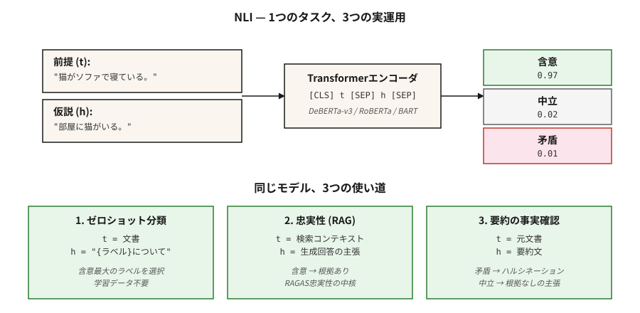

# 自然语言推理——文本蕴含 (Natural Language Inference — Textual Entailment)

> "t 蕴含 h" 意味着人类读者在阅读 t 后会认为 h 为真。NLI 是预测蕴含/矛盾/中立的任务。表面枯燥，生产中却是承重墙。

**类型:** 学习 (Learn)
**语言:** Python
**先修知识:** 阶段 5 · 05（情感分析），阶段 5 · 13（问答系统）
**时间:** ~60 分钟

## 问题 (The Problem)

你构建了一个摘要器。它生成了一段摘要。你如何知道这段摘要没有产生幻觉？

你构建了一个聊天机器人。它回答了"是"。你如何知道这个答案得到了检索段落的支持？

你需要按主题分类 10,000 篇新闻文章。你没有训练标签。你能复用模型吗？

这三个问题都归结为自然语言推理（Natural Language Inference）。NLI 问的是：给定前提 `t` 和假设 `h`，`h` 是被 `t` 蕴含、矛盾，还是中立（无关）？

- **幻觉检查：** `t` = 源文档，`h` = 摘要中的主张。非蕴含 = 幻觉。
- **有据问答：** `t` = 检索段落，`h` = 生成的答案。非蕴含 = 捏造。
- **零样本分类：** `t` = 文档，`h` = 口头化标签（"这是关于体育的"）。蕴含 = 预测的标签。

一个任务，三种生产用途。这就是为什么每个 RAG 评估框架都内置了一个 NLI 模型。

## 概念 (The Concept)



**三个标签。**

- **蕴含（Entailment）。** `t` → `h`。"猫在垫子上"蕴含"有一只猫"。
- **矛盾（Contradiction）。** `t` → ¬`h`。"猫在垫子上"矛盾"没有猫"。
- **中立（Neutral）。** 无法推断任何一种方向。"猫在垫子上"对"猫饿了"持中立态度。

**非逻辑蕴含。** NLI 是*自然*语言推理——一个典型的人类读者会推断出的内容，而非严格的逻辑。"约翰遛了他的狗"在 NLI 中蕴含"约翰有一条狗"，但严格的一阶逻辑只有在你将所有权公理化时才会承认这一点。

**数据集。**

- **SNLI**（2015 年）。57 万个人工标注对，以图像描述为前提。领域狭窄。
- **MultiNLI**（2017 年）。涵盖 10 种体裁的 43.3 万对。2026 年的标准训练语料库。
- **ANLI**（2019 年）。对抗性 NLI。人类编写了专门用于攻破现有模型的示例。难度更大。
- **DocNLI、ConTRoL**（2020–21 年）。文档长度的前提。测试多跳和长程推理。

**架构。** 一个 Transformer 编码器（BERT、RoBERTa、DeBERTa）读取 `[CLS] premise [SEP] hypothesis [SEP]`。`[CLS]` 表示输入一个 3 路 softmax。在 MNLI 上训练，在保留测试集上评估，在分布内样本对上的准确率可达 90%+。

**通过 NLI 实现零样本分类。** 给定一篇文档和候选标签，将每个标签转化为一个假设（"这段文本是关于体育的"）。计算每个标签的蕴含概率。选择最高的。这就是 Hugging Face 的 `zero-shot-classification` 管道背后的机制。

## 动手构建 (Build It)

### 步骤 1：运行预训练 NLI 模型

```python
from transformers import pipeline

nli = pipeline("text-classification",
               model="facebook/bart-large-mnli",
               top_k=None)  # return all labels; replaces deprecated return_all_scores=True

premise = "The cat is sleeping on the couch."
hypothesis = "There is a cat in the room."

result = nli({"text": premise, "text_pair": hypothesis})[0]
print(result)
# [{'label': 'entailment', 'score': 0.97},
#  {'label': 'neutral', 'score': 0.02},
#  {'label': 'contradiction', 'score': 0.01}]
```

在生产环境中使用 NLI，`facebook/bart-large-mnli` 和 `microsoft/deberta-v3-large-mnli` 是开源的默认选择。DeBERTa-v3 在排行榜上名列前茅。

### 步骤 2：零样本分类

```python
zs = pipeline("zero-shot-classification", model="facebook/bart-large-mnli")

text = "The stock market rallied after the central bank cut interest rates."
labels = ["finance", "sports", "politics", "technology"]

result = zs(text, candidate_labels=labels)
print(result)
# {'labels': ['finance', 'politics', 'technology', 'sports'],
#  'scores': [0.92, 0.05, 0.02, 0.01]}
```

默认模板为 "This example is about {label}."。可以使用 `hypothesis_template` 自定义。无需训练数据。无需微调。开箱即用。

### 步骤 3：RAG 的忠实性检查

```python
def is_faithful(answer, context, threshold=0.5):
    result = nli({"text": context, "text_pair": answer})[0]
    entail = next(s for s in result if s["label"] == "entailment")
    return entail["score"] > threshold
```

这是 RAGAS 忠实性检查的核心。将生成的答案拆分为原子声明。将每个声明与检索到的上下文进行核对。报告蕴含的比例。

### 步骤 4：手写 NLI 分类器（概念性）

参见 `code/main.py`，这是一个仅使用标准库的玩具实现：前提和假设通过词汇重叠 + 否定检测进行比较。无法与 Transformer 模型竞争——但它展示了任务的轮廓：输入两段文本，输出三路标签，损失 = 在 `{entail, contradict, neutral}` 上的交叉熵。

## 陷阱 (Pitfalls)

- **仅假设捷径。** 模型仅从假设本身就能以约 60% 的准确率预测 SNLI 的标签，因为"不"、"没有人"、"从不"与矛盾相关。检测标签泄漏的强基线。
- **词汇重叠启发式。** 子序列启发式（"每个子序列都是蕴含的"）能通过 SNLI，但会在 HANS/ANLI 上失败。请使用对抗性基准测试。
- **文档长度性能下降。** 单句 NLI 模型在文档长度前提上 F1 分数下降 20+。长上下文请使用 DocNLI 训练的模型。
- **零样本模板敏感性。** "This example is about {label}" 对比 "{label}" 对比 "The topic is {label}" 可能导致准确率波动 10+ 个百分点。请调优模板。
- **领域不匹配。** MNLI 在通用英语上训练。法律、医学和科学文本需要领域特定的 NLI 模型（例如 SciNLI、MedNLI）。

## 使用建议 (Use It)

2026 年推荐栈：

| 使用场景 | 模型 |
|---------|------|
| 通用 NLI | `microsoft/deberta-v3-large-mnli` |
| 快速 / 边缘部署 | `cross-encoder/nli-deberta-v3-base` |
| 零样本分类（轻量级） | `facebook/bart-large-mnli` |
| 文档级 NLI | `MoritzLaurer/DeBERTa-v3-large-mnli-fever-anli-ling-wanli` |
| 多语言 | `MoritzLaurer/multilingual-MiniLMv2-L6-mnli-xnli` |
| RAG 中的幻觉检测 | RAGAS / DeepEval 内部的 NLI 层 |

2026 年的元模式：NLI 是文本理解的"万能胶带"。每当你需要"A 是否支持 B？"或"A 是否与 B 矛盾？"时——先使用 NLI，再考虑调用另一个 LLM。

## 交付物 (Ship It)

保存为 `outputs/skill-nli-picker.md`：

```markdown
---
name: nli-picker
description: Pick an NLI model, label template, and evaluation setup for a classification / faithfulness / zero-shot task.
version: 1.0.0
phase: 5
lesson: 21
tags: [nlp, nli, zero-shot]
---

Given a use case (faithfulness check, zero-shot classification, document-level inference), output:

1. Model. Named NLI checkpoint. Reason tied to domain, length, language.
2. Template (if zero-shot). Verbalization pattern. Example.
3. Threshold. Entailment cutoff for the decision rule. Reason based on calibration.
4. Evaluation. Accuracy on held-out labeled set, hypothesis-only baseline, adversarial subset.

Refuse to ship zero-shot classification without a 100-example labeled sanity check. Refuse to use a sentence-level NLI model on document-length premises. Flag any claim that NLI solves hallucination — it reduces it; it does not eliminate it.
```

## 练习 (Exercises)

1. **简单。** 在 20 个手工编写的（前提、假设、标签）三元组上运行 `facebook/bart-large-mnli`，覆盖全部三个类别。测量准确率。添加对抗性的"子序列启发式"陷阱（"我没有吃蛋糕" vs "我吃了蛋糕"），观察模型是否失效。
2. **中等。** 在 100 条 AG News 标题上比较零样本模板 `"This text is about {label}"` 与 `"The topic is {label}"` 和 `"{label}"`。报告准确率波动。
3. **困难。** 构建一个 RAG 忠实性检查器：原子声明分解 + 每个声明的 NLI。在 50 个带有黄金上下文的 RAG 生成答案上进行评估。与人工标注对比，测量假阳性和假阴性率。

## 关键术语 (Key Terms)

| Term | What people say | What it actually means |
|------|-----------------|-----------------------|
| NLI | Natural Language Inference | 前提-假设关系的三分分类。 |
| RTE | Recognizing Textual Entailment | NLI 的旧称；同一任务。 |
| Entailment | "t 蕴含 h" | 典型读者会认为给定 t 则 h 为真。 |
| Contradiction | "t 排除 h" | 典型读者会认为给定 t 则 h 为假。 |
| Neutral | "无法判断" | 从 t 到 h 无法进行任何方向推断。 |
| Zero-shot classification | NLI 作为分类器 | 将标签口头化为假设，选择最大蕴含值。 |
| Faithfulness | 答案是否得到支持？ | 对（检索上下文，生成答案）进行 NLI。 |

## 进一步阅读 (Further Reading)

- [Bowman et al. (2015). A large annotated corpus for learning natural language inference](https://arxiv.org/abs/1508.05326) — SNLI。
- [Williams, Nangia, Bowman (2017). A Broad-Coverage Challenge Corpus for Sentence Understanding through Inference](https://arxiv.org/abs/1704.05426) — MultiNLI。
- [Nie et al. (2019). Adversarial NLI](https://arxiv.org/abs/1910.14599) — ANLI 基准测试。
- [Yin, Hay, Roth (2019). Benchmarking Zero-shot Text Classification](https://arxiv.org/abs/1909.00161) — NLI 作为分类器。
- [He et al. (2021). DeBERTa: Decoding-enhanced BERT with Disentangled Attention](https://arxiv.org/abs/2006.03654) — 2026 年 NLI 的主力模型。
