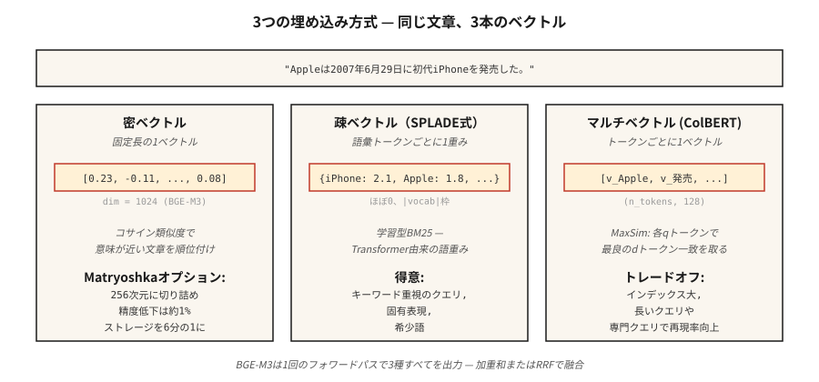

# Embedding Modelleri — 2026 Derinlemesine İnceleme

> Word2Vec size kelime başına bir vektör verdi. Modern embedding modelleri size pasaj başına, diller arası, seyrek, yoğun ve çoklu vektör görünümlerine sahip, indeksinize uyacak şekilde boyutlandırılmış bir vektör sunar. Yanlışı seçersen RAG'ın yanlış şeyi alır.

**Tür:** Öğren
**Diller:** Python
**Önkoşullar:** Aşama 5 · 03 (Word2Vec), Aşama 5 · 14 (Bilgi Erişimi)
**Süre:** ~60 dakika

## Sorun

RAG sisteminiz %40 oranında yanlış geçişi bulur. Suçlu nadiren vector database veya prompt'dir. embedding modelidir.

2026'da bir embedding seçmek, beş eksen arasından seçim yapmak anlamına gelir:

1. **Yoğun vs seyrek vs çoklu vektör.** Pasaj başına bir vektör veya token başına bir vektör veya seyrek ağırlıklı bir kelime torbası.
2. **Dil kapsamı.** Tek dilli İngilizce modeller hâlâ yalnızca İngilizce görevlerde kazanıyor. Çok dilli modeller, derlemler karıştırıldığında kazanır.
3. **Bağlam uzunluğu.** 512 token'ye karşı 8.192'ye karşı 32.768 — ve gerçek etkin kapasite genellikle reklamı yapılan maksimum değerin %60-70'idir.
4. **Boyut bütçesi.** Tam hassasiyette 3.072 kayan nokta = vektör başına 12 KB. 100 milyon vektörde depolama ayda 1.300 ABD dolarıdır. Matryoshka'nın kesilmesi bunu 4 kat keser.
5. **Açık ve barındırılan karşılaştırması.** Açık ağırlık, yığını ve verileri kontrol ettiğiniz anlamına gelir. Barındırılan, kontrolü her zaman en yeniye çevirdiğiniz anlamına gelir.

Bu ders, geçen çeyrekte popüler olana göre değil, kanıta göre seçim yapabilmeniz için ödünleşimleri adlandıracaktır.

## Konsept



**Yoğun embedding'ler.** Geçiş başına bir vektör (genellikle 384-3.072 boyut). Kosinüs benzerliği pasajları anlamsal yakınlığa göre sıralar. OpenAI `text-embedding-3-large`, BGE-M3 yoğun mod, Voyage-3. Varsayılan seçim.

**Seyrek embedding'ler.** SPLADE tarzı. Bir transformer, her token kelimesi için bir ağırlık tahmin eder ve ardından çoğunu sıfırlar. Sonuç |vocab| boyutunda seyrek bir vektördür. Sözcüksel eşleşmeyi (BM25 gibi) ancak öğrenilmiş terim ağırlıklarıyla yakalar. Anahtar kelime ağırlıklı sorgularda güçlü.

**Çoklu vektör (geç etkileşim).** ColBERTv2, Jina-ColBERT. token başına bir vektör. MaxSim ile puanlama: her token sorgusu için en benzer token belgesini bulun, puanları toplayın. Depolamak ve puanlamak daha pahalıdır, ancak uzun sorgularda ve alana özgü derlemlerde kazanç sağlar.

**BGE-M3: üçü aynı anda.** Tek model, yoğun, seyrek ve çoklu vektör temsillerini eş zamanlı olarak üretir. Her biri bağımsız olarak sorgulanabilir; puanlar ağırlıklı toplam yoluyla birleştirilir. Tek bir kontrol noktasından esneklik istediğinizde 2026 varsayılanı.

**Matryoshka Temsil Öğrenimi.** Vektörün ilk N boyutunun kullanışlı, bağımsız bir embedding oluşturması için eğitildi. 1.536 dim vektörünü 256 dim'e kısaltın ve 6 kat depolama tasarrufu için ~%1 doğruluk ödeyin. OpenAI text-3, Cohere v4, Voyage-4, Jina v5, Gemini Embedding 2, Nomic v1.5+ tarafından desteklenir.

### MTEB liderlik tablosu kısmi bir hikaye anlatıyor

Massive Text Embedding Benchmark — Lansmanda (2022) 8 görev türünde 56 görev, MTEB v2'de 100'den fazla göreve genişletildi. 2026'nın başlarında Gemini Embedding 2, geri alımlarda zirveye yerleşti (67,71 MTEB-R). Cohere embed-v4 genel olarak önde (65,2 MTEB). BGE-M3 açık ağırlıkta çok dillilikte (63,0) liderdir. Skor tablosu gerekli ancak yeterli değil; alan adınızda her zaman benchmark.

### Üç katmanlı model

| Kullanım örneği | Desen |
|----------|---------|
| Hızlı ilk geçiş | Yoğun çift kodlayıcı (BGE-M3, metin-3-küçük) |
| Hatırlama desteği | Seyrek (SPLADE, BGE-M3 seyrek) + RRF sigortası |
| İlk 50'de hassasiyet | Çoklu vektör (ColBERTv2) veya çapraz kodlayıcı yeniden sıralayıcı |

Çoğu üretim yığını üçünü de kullanır.

## İnşa Et

### Adım 1: temel — Cümle-BERT ile yoğun embedding'ler

```python
from sentence_transformers import SentenceTransformer
import numpy as np

encoder = SentenceTransformer("BAAI/bge-small-en-v1.5")
corpus = [
    "The first iPhone launched in 2007.",
    "Apple released the iPod in 2001.",
    "Android is an operating system from Google.",
]
emb = encoder.encode(corpus, normalize_embeddings=True)

query = "When was the iPhone released?"
q_emb = encoder.encode([query], normalize_embeddings=True)[0]
scores = emb @ q_emb
print(sorted(enumerate(scores), key=lambda x: -x[1]))
```

`normalize_embeddings=True` nokta çarpımı eşit kosinüs benzerliğine dönüştürür. Her zaman ayarlayın.

### Adım 2: Matryoshka'nın kesilmesi

```python
def truncate(vectors, dim):
    out = vectors[:, :dim]
    return out / np.linalg.norm(out, axis=1, keepdims=True)

emb_256 = truncate(emb, 256)
emb_128 = truncate(emb, 128)
```

Kesmeden sonra yeniden normalleştirin. Nomic v1.5, OpenAI text-3 ve Voyage-4 eğitildiğinden ilk birkaç seviye için kayıpsızdır. Matryoshka olmayan modeller (orijinal Cümle-BERT) kesildiğinde keskin bir şekilde bozulur.

### Adım 3: BGE-M3 çok işlevliliği

```python
from FlagEmbedding import BGEM3FlagModel

model = BGEM3FlagModel("BAAI/bge-m3", use_fp16=True)

output = model.encode(
    corpus,
    return_dense=True,
    return_sparse=True,
    return_colbert_vecs=True,
)
# output["dense_vecs"]:    (n_docs, 1024)
# output["lexical_weights"]: list of dict {token_id: weight}
# output["colbert_vecs"]:  list of (n_tokens, 1024) arrays
```

Üç dizin, bir inference çağrısı. Puan füzyonu:

```python
dense_score = ... # cosine over dense_vecs
sparse_score = model.compute_lexical_matching_score(q_lex, d_lex)
colbert_score = model.colbert_score(q_col, d_col)
final = 0.4 * dense_score + 0.2 * sparse_score + 0.4 * colbert_score
```

Alanınızdaki ağırlıkları ayarlayın.

### Adım 4: Özel bir görevde METEB değerlendirmesi

```python
from mteb import MTEB

tasks = ["ArguAna", "SciFact", "NFCorpus"]
evaluation = MTEB(tasks=tasks)
results = evaluation.run(encoder, output_folder="./mteb-results")
```

Aday modellerinizi *temsilci* bir alt küme üzerinde çalıştırın. Liderlik sıralamasına tek başına güvenmeyin; alan adınız önemlidir.

### Adım 5: sıfırdan elle haddelenmiş kosinüs

Bkz. `code/main.py`. Ortalama Hashing Hilesi embedding'ler (yalnızca stdlib). transformer embedding'lerle rekabet etmez ancak şu şekli gösterir: tokenize → vektör → normalleştir → nokta çarpım.

## Tuzaklar

- **Sorgu ve belge için aynı model.** Bazı modeller (Voyage, Jina-ColBERT) asimetrik kodlama kullanır; sorgu ve belge farklı yollardan geçer. Daima model kartını kontrol edin.
- **Önek eksik.** `bge-*` modellerinde sorguların başına `"Represent this sentence for searching relevant passages: "` eklenmesi gerekir. Unutursanız 3-5 puanlık hatırlama boşluğu.
- **Matryoshka'yı aşırı kırpmak.** 1.536 → 256 genellikle güvenlidir. 1.536 → 64 değil. Değerlendirme kümenizi doğrulayın.
- **Bağlamın kesilmesi.** Çoğu model, girişleri maksimum uzunlukları boyunca sessizce keser. Uzun dokümanların parçalanması gerekir (bkz. ders 23).
- **Gecikme kuyruğu göz ardı ediliyor.** MTEB puanları p99 gecikmesini gizler. 600M modeli, 335M modelini 2 puan geride bırakabilir ancak sorgu başına maliyeti 3 kat daha fazladır.

## Kullan onu

2026 yığını:

| Durum | Seç |
|-----------|------|
| Yalnızca İngilizce, hızlı, API | `text-embedding-3-large` veya `voyage-3-large` |
| Açık ağırlık, İngilizce | `BAAI/bge-large-en-v1.5` |
| Açık ağırlık, çok dilli | `BAAI/bge-m3` veya `Qwen3-Embedding-8B` |
| Uzun içerik (32k+) | Voyage-3-büyük, Cohere yerleştirme-v4, Qwen3-Embedding-8B |
| Yalnızca CPU deployment | Nomic Embed v2 (137 milyon parametre, MoE) |
| Depolama kısıtlamalı | Matryoshka-kesilmiş + int8 nicemleme |
| Anahtar kelime ağırlıklı sorgular | SPLADE seyrek, yoğun |

2026 modeli: BGE-M3 veya text-3-large ile başlayın, alanınızda MTEB ile değerlendirin, alana özel bir modelin 3 puandan fazla kazanması durumunda takas yapın.

## Gönderin

`outputs/skill-embedding-picker.md` olarak kaydet:

```markdown
---
name: embedding-picker
description: Pick embedding model, dimension, and retrieval mode for a given corpus and deployment.
version: 1.0.0
phase: 5
lesson: 22
tags: [nlp, embeddings, retrieval]
---

Given a corpus (size, languages, domain, avg length), deployment target (cloud / edge / on-prem), latency budget, and storage budget, output:

1. Model. Named checkpoint or API. One-sentence reason.
2. Dimension. Full / Matryoshka-truncated / int8-quantized. Reason tied to storage budget.
3. Mode. Dense / sparse / multi-vector / hybrid. Reason.
4. Query prefix / template if required by the model card.
5. Evaluation plan. MTEB tasks relevant to domain + held-out domain eval with nDCG@10.

Refuse recommendations that truncate Matryoshka to <64 dims without domain validation. Refuse ColBERTv2 for corpora under 10k passages (overhead not justified). Flag long-document corpora (>8k tokens) routed to models with 512-token windows.
```

## Egzersizler

1. **Kolay.** 100 cümleyi `bge-small-en-v1.5` ile tam karanlıkta (384), ardından Matryoshka 128'de kodlayın. 10 sorgudaki MRR düşüşünü ölçün.
2. **Orta.** Alanınızdaki 500 pasajda BGE-M3'ün yoğun, seyrek ve colbert değerlerini karşılaştırın. Recall@10'da hangisi kazanır? RRF füzyonu en iyi tekli modu yener mi?
3. **Zor.** En önemli 2 alan görevinizdeki üç aday modelde MTEB'yi çalıştırın. MTEB puanını, 100 sorguluk bir grupta p99 gecikmesini ve 1 milyon $ sorguyu raporlayın. Pareto-optimal olanı seçin.

## Anahtar Terimler

| Dönem | İnsanlar ne diyor | Aslında ne anlama geliyor |
|------|-----------------|-----------------------|
| Yoğun embedding | vektör | Metin başına bir sabit boyutlu vektör. Sıralama için kosinüs benzerliği. |
| Seyrek embedding | BM25'i öğrendim | Kelime başına bir ağırlık token; çoğunlukla sıfırlar; uçtan uca eğitilmiştir. |
| Çoklu vektör | ColBERT tarzı | token başına bir vektör; MaxSim puanlaması; daha büyük indeks, daha iyi hatırlama. |
| Matruşka | Rus bebek numarası | İlk N dim, kendi başına geçerli, daha küçük bir embedding'dir. |
| METEB | benchmark | Massive Text Embedding Benchmark — Başlangıçta 56 görev, v2'de 100'den fazla görev. |
| BEİR | Geri alma benchmark | 18 sıfır atışlı geri alma görevi; genellikle alanlar arası sağlamlık nedeniyle alıntılanır. |
| Asimetrik kodlama | Sorgu ≠ belge yolu | Model, sorgular ve belgeler için farklı projeksiyonlar kullanır. |

## Daha Fazla Okuma

- [Reimers, Gurevych (2019). Cümle-BERT](https://arxiv.org/abs/1908.10084) — iki kodlayıcılı kağıt.
- [Muennighoff ve ark. (2022). MTEB: Massive Text Embedding Benchmark](https://arxiv.org/abs/2210.07316) — skor tablosu kağıdı.
- [Chen ve ark. (2024). BGE-M3: Çok Dilli, Çok İşlevli, Çok Parçalılık](https://arxiv.org/abs/2402.03216) — birleşik üç modlu model.
- [Kusupati ve ark. (2022). Matryoshka Temsil Öğrenimi](https://arxiv.org/abs/2205.13147) — boyut merdiveni eğitimi hedefi.
-[Santhanam ve ark. (2022). ColBERTv2: Hafif Geç Etkileşim aracılığıyla Etkili ve Verimli Erişim](https://arxiv.org/abs/2112.01488) — üretimde geç etkileşim.
- [Sarılma Yüzünde MTEB lider tablosu](https://huggingface.co/spaces/mteb/leaderboard) — canlı sıralamalar.
