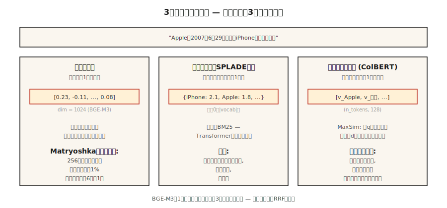

# Embedding 模型 —— 2026 深度解析

> 译注：本文译自同目录 [`en.md`](./en.md)。术语遵循仓根 [TRANSLATION_GUIDE.md](../../../../TRANSLATION_GUIDE.md)。

> Word2Vec 给你的是「一个词一个向量」。现代 embedding 模型给你的是「一段文本一个向量」，跨语言、同时提供 sparse、dense、multi-vector 多种视图，维度还能裁到刚好塞进你的索引。挑错了，你的 RAG 就检索到错的东西。

**Type:** Learn
**Languages:** Python
**Prerequisites:** Phase 5 · 03 (Word2Vec), Phase 5 · 14 (Information Retrieval)
**Time:** ~60 minutes

## 问题（Problem）

你的 RAG 系统有 40% 的概率检索错段落。罪魁祸首往往不是向量数据库，也不是 prompt，而是 embedding 模型。

2026 年挑选 embedding 模型，要在五个维度上做权衡：

1. **Dense vs sparse vs multi-vector。** 一段文本一个向量，还是一个 token 一个向量，又或者一袋带权重的 sparse 词袋。
2. **语言覆盖。** 单语英文模型在纯英文任务上仍然占优。语料混合时，多语模型才赢。
3. **Context length（上下文长度）。** 512 token vs 8,192 vs 32,768 —— 而且实际有效容量通常只有标称值的 60%-70%。
4. **维度预算。** 全精度下 3,072 个 float = 每个向量 12 KB。1 亿向量时，存储成本是 $1,300/月。Matryoshka 截断可以把这个数字砍到原来的 1/4。
5. **Open vs hosted（开源 vs 托管）。** 开源权重意味着你掌控整个技术栈和数据。托管意味着用控制权换永远最新的模型。

这一课把这些权衡讲清楚，让你基于证据做选择，而不是看上个季度谁火就追谁。

## 概念（Concept）



**Dense embedding。** 一段文本一个向量（通常 384-3,072 维）。用 cosine similarity（余弦相似度）按语义近似度对段落排序。OpenAI `text-embedding-3-large`、BGE-M3 dense 模式、Voyage-3 都属于这类。默认选择。

**Sparse embedding。** SPLADE 风格。一个 transformer 为词表里的每个 token 预测一个权重，然后把大多数清零。结果是一个大小为 |vocab| 的 sparse 向量。它捕捉词汇匹配（像 BM25 那样），但用的是学到的词权重。在关键词密集的 query 上表现强劲。

**Multi-vector（late interaction，延迟交互）。** ColBERTv2、Jina-ColBERT。一个 token 一个向量。用 MaxSim 打分：对每个 query token，找到最相似的 document token，把分数加起来。存储和打分都更贵，但在长 query 和领域专属语料上更胜一筹。

**BGE-M3：三种模式一次出。** 单个模型同时输出 dense、sparse、multi-vector 三种表示。每一种都可以独立查询，分数通过加权和融合。当你想用一个 checkpoint 拿到全套灵活性时，2026 年的默认选择就是它。

**Matryoshka Representation Learning（套娃表示学习）。** 训练时让向量的前 N 维本身就是一个可用的 embedding。把 1,536 维向量截到 256 维，准确率只掉约 1%，存储节省 6 倍。OpenAI text-3、Cohere v4、Voyage-4、Jina v5、Gemini Embedding 2、Nomic v1.5+ 都支持。

### MTEB 排行榜只讲了半个故事

Massive Text Embedding Benchmark —— 发布时（2022）覆盖 8 类任务共 56 项，MTEB v2 扩展到 100+ 项。2026 年初，Gemini Embedding 2 在检索榜上居首（MTEB-R 67.71）。Cohere embed-v4 在通用榜上领先（MTEB 65.2）。BGE-M3 在开源多语榜上领先（63.0）。排行榜是必要条件但不充分 —— 永远要在你自己的领域上跑 benchmark。

### 三层模式

| 用途 | 模式 |
|----------|---------|
| 快速初筛 | Dense bi-encoder（BGE-M3、text-3-small） |
| 召回增强 | Sparse（SPLADE、BGE-M3 sparse）+ RRF 融合 |
| Top-50 上的精排 | Multi-vector（ColBERTv2）或 cross-encoder reranker |

大多数生产环境同时用上三层。

## 动手实现（Build It）

### Step 1：基线 —— 用 Sentence-BERT 做 dense embedding

```python
from sentence_transformers import SentenceTransformer
import numpy as np

encoder = SentenceTransformer("BAAI/bge-small-en-v1.5")
corpus = [
    "The first iPhone launched in 2007.",
    "Apple released the iPod in 2001.",
    "Android is an operating system from Google.",
]
emb = encoder.encode(corpus, normalize_embeddings=True)

query = "When was the iPhone released?"
q_emb = encoder.encode([query], normalize_embeddings=True)[0]
scores = emb @ q_emb
print(sorted(enumerate(scores), key=lambda x: -x[1]))
```

`normalize_embeddings=True` 让点积等于 cosine similarity。永远开着它。

### Step 2：Matryoshka 截断

```python
def truncate(vectors, dim):
    out = vectors[:, :dim]
    return out / np.linalg.norm(out, axis=1, keepdims=True)

emb_256 = truncate(emb, 256)
emb_128 = truncate(emb, 128)
```

截断后要重新归一化。Nomic v1.5、OpenAI text-3、Voyage-4 在训练时就考虑了这点，所以前几个层级几乎无损。非 Matryoshka 模型（原版 Sentence-BERT）一截断就掉得很惨。

### Step 3：BGE-M3 多功能输出

```python
from FlagEmbedding import BGEM3FlagModel

model = BGEM3FlagModel("BAAI/bge-m3", use_fp16=True)

output = model.encode(
    corpus,
    return_dense=True,
    return_sparse=True,
    return_colbert_vecs=True,
)
# output["dense_vecs"]:    (n_docs, 1024)
# output["lexical_weights"]: list of dict {token_id: weight}
# output["colbert_vecs"]:  list of (n_tokens, 1024) arrays
```

三个索引，一次推理。分数融合：

```python
dense_score = ... # cosine over dense_vecs
sparse_score = model.compute_lexical_matching_score(q_lex, d_lex)
colbert_score = model.colbert_score(q_col, d_col)
final = 0.4 * dense_score + 0.2 * sparse_score + 0.4 * colbert_score
```

权重要在你自己的领域上调。

### Step 4：在自定义任务上跑 MTEB 评估

```python
from mteb import MTEB

tasks = ["ArguAna", "SciFact", "NFCorpus"]
evaluation = MTEB(tasks=tasks)
results = evaluation.run(encoder, output_folder="./mteb-results")
```

在*有代表性*的子集上跑你的候选模型。不要只信排行榜排名 —— 你的领域才是关键。

### Step 5：手撸 cosine

见 `code/main.py`。基于 Hashing Trick 的平均 embedding（只用标准库）。打不过 transformer embedding，但能展示套路：tokenize → 向量 → 归一化 → 点积。

## 坑（Pitfalls）

- **query 和 doc 用同一个模型。** 有些模型（Voyage、Jina-ColBERT）用的是非对称编码 —— query 和 document 走不同的路径。永远先看 model card。
- **忘了加前缀。** `bge-*` 系列模型需要在 query 前面拼上 `"Represent this sentence for searching relevant passages: "`。漏了的话召回率会差 3-5 个点。
- **Matryoshka 砍过头。** 1,536 → 256 一般安全，1,536 → 64 就不安全了。在你的评估集上验证。
- **Context 被悄悄截断。** 大多数模型对超过最大长度的输入会无声截断。长文档需要 chunking（见第 23 课）。
- **忽视延迟尾部。** MTEB 分数掩盖了 p99 延迟。一个 600M 的模型可能比 335M 的高 2 分，但每次查询贵 3 倍。

## 用起来（Use It）

2026 年的技术栈：

| 场景 | 选择 |
|-----------|------|
| 纯英文、要快、API | `text-embedding-3-large` 或 `voyage-3-large` |
| 开源权重、英文 | `BAAI/bge-large-en-v1.5` |
| 开源权重、多语 | `BAAI/bge-m3` 或 `Qwen3-Embedding-8B` |
| 长 context（32k+） | Voyage-3-large、Cohere embed-v4、Qwen3-Embedding-8B |
| 仅 CPU 部署 | Nomic Embed v2（137M 参数，MoE） |
| 存储受限 | Matryoshka 截断 + int8 量化 |
| 关键词密集 query | 加上 SPLADE sparse，与 dense 做 RRF 融合 |

2026 的套路：从 BGE-M3 或 text-3-large 起步，在你自己的领域用 MTEB 评估，如果某个领域专属模型领先 3 分以上再换。

## 上线部署（Ship It）

保存为 `outputs/skill-embedding-picker.md`：

```markdown
---
name: embedding-picker
description: Pick embedding model, dimension, and retrieval mode for a given corpus and deployment.
version: 1.0.0
phase: 5
lesson: 22
tags: [nlp, embeddings, retrieval]
---

Given a corpus (size, languages, domain, avg length), deployment target (cloud / edge / on-prem), latency budget, and storage budget, output:

1. Model. Named checkpoint or API. One-sentence reason.
2. Dimension. Full / Matryoshka-truncated / int8-quantized. Reason tied to storage budget.
3. Mode. Dense / sparse / multi-vector / hybrid. Reason.
4. Query prefix / template if required by the model card.
5. Evaluation plan. MTEB tasks relevant to domain + held-out domain eval with nDCG@10.

Refuse recommendations that truncate Matryoshka to <64 dims without domain validation. Refuse ColBERTv2 for corpora under 10k passages (overhead not justified). Flag long-document corpora (>8k tokens) routed to models with 512-token windows.
```

## 练习（Exercises）

1. **Easy。** 用 `bge-small-en-v1.5` 在全维（384）和 Matryoshka 128 下编码 100 句话。在 10 个 query 上测 MRR 下降幅度。
2. **Medium。** 在你领域的 500 段文本上对比 BGE-M3 的 dense、sparse、colbert 三种模式。哪个 recall@10 最高？RRF 融合能不能赢过最强的单一模式？
3. **Hard。** 在你最在意的两个领域任务上跑 MTEB 评估三个候选模型。报告 MTEB 分、100-query batch 上的 p99 延迟、以及每百万 query 的成本（$/1M queries）。挑 Pareto 最优的那个。

## 关键术语（Key Terms）

| 术语 | 大家嘴上说的 | 它真正的意思 |
|------|-----------------|-----------------------|
| Dense embedding | 那个向量 | 每段文本一个固定大小的向量。用 cosine similarity 排序。 |
| Sparse embedding | 学出来的 BM25 | 每个词表 token 一个权重；大部分是零；端到端训练。 |
| Multi-vector | ColBERT 风格 | 每个 token 一个向量；MaxSim 打分；索引更大，召回更好。 |
| Matryoshka | 套娃戏法 | 前 N 维本身就是一个有效的小 embedding。 |
| MTEB | 那个 benchmark | Massive Text Embedding Benchmark —— 发布时 56 项任务，v2 扩展到 100+。 |
| BEIR | 那个检索 benchmark | 18 个 zero-shot 检索任务；常被引用来衡量跨领域稳健性。 |
| Asymmetric encoding | query ≠ doc 路径 | 模型对 query 和 document 用不同的投影。 |

## 延伸阅读（Further Reading）

- [Reimers, Gurevych (2019). Sentence-BERT](https://arxiv.org/abs/1908.10084) —— bi-encoder 那篇论文。
- [Muennighoff et al. (2022). MTEB: Massive Text Embedding Benchmark](https://arxiv.org/abs/2210.07316) —— 排行榜论文。
- [Chen et al. (2024). BGE-M3: Multi-lingual, Multi-functionality, Multi-granularity](https://arxiv.org/abs/2402.03216) —— 三模式统一模型。
- [Kusupati et al. (2022). Matryoshka Representation Learning](https://arxiv.org/abs/2205.13147) —— 维度阶梯式训练目标。
- [Santhanam et al. (2022). ColBERTv2: Effective and Efficient Retrieval via Lightweight Late Interaction](https://arxiv.org/abs/2112.01488) —— late interaction 在生产中的用法。
- [MTEB leaderboard on Hugging Face](https://huggingface.co/spaces/mteb/leaderboard) —— 实时排名。
