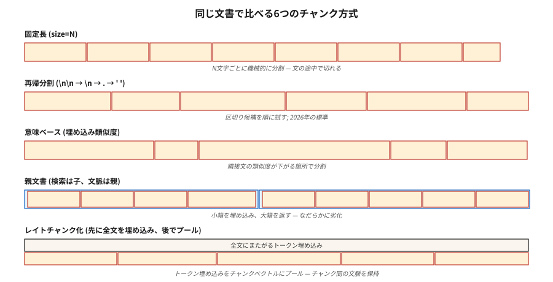

# RAG için Parçalama Stratejileri

> Parçalama yapılandırması, alma kalitesini embedding modelinin seçimi kadar etkiler (Vectara NAACL 2025). Yanlış parçalama yapın ve hiçbir yeniden sıralama sizi kurtaramaz.

**Tür:** Yapım
**Diller:** Python
**Önkoşullar:** Aşama 5 · 14 (Bilgi Erişimi), Aşama 5 · 22 (Embedding Modelleri)
**Süre:** ~60 dakika

## Sorun

RAG sistemine 50 sayfalık bir sözleşme koyuyorsunuz. Kullanıcı şunu sorar: "Fesih hükmü nedir?" Alıcı, kapak sayfasını döndürür. Neden? Çünkü model 512-token parça üzerinde eğitilmiştir ve sonlandırma cümleciği, onu sorguya bağlayan hiçbir yerel anahtar kelime olmadan, bir sayfa sonuna bölünmüş olarak 20 sayfa içinde yer alır.

Çözüm "daha iyi bir embedding modeli satın almak" değildir. Düzeltme parçalanıyor. Ne kadar büyük? Örtüşmek? Nereden ayrılmalı? Çevreleyen bağlamla mı?

Şubat 2026 benchmark'lar şaşırtıcı sonuçlar gösteriyor:

- Vectara'nın 2026 çalışması: özyinelemeli 512-token parçalama, semantik parçalamayı %69 → %54 doğrulukla yendi.
- Doğal Sorunlarda SPLADE + Mistral-8B: örtüşme sıfır ölçülebilir fayda sağladı.
- Bağlam uçurumu: Yanıt kalitesi 2.500 token saniyelik bağlam civarında keskin bir şekilde düşüyor.

"Açık" yanıt (anlamsal parçalama, %20 örtüşme, 1000 tokens) genellikle yanlıştır. Bu ders altı stratejiye ilişkin sezgiyi geliştirir ve hangisine ne zaman ulaşacağınızı söyler.

## Konsept



**Sabit parçalama.** Her N karakteri veya token'yi bölün. En basit temel. Cümlenin ortasında keser. İyi sıkıştırma, kötü tutarlılık.

**Özyinelemeli.** LangChain'in `RecursiveCharacterTextSplitter`. Önce `\n\n`'ye, ardından `\n`'ye, ardından `.`'ye ve ardından boşluk bırakmayı deneyin. Temiz bir şekilde geri düşüyor. 2026 varsayılanı.

**Anlamsal.** Her cümleyi ekleyin. Bitişik cümleler arasındaki kosinüs benzerliğini hesaplayın. Benzerliğin bir eşiğin altına düştüğü yerde bölün. Konu tutarlılığını korur. Yavaş; bazen geri getirmeyi zorlaştıran 40-token kadar küçük parçalar üretir.

**Cümle.** Cümle sınırlarına göre bölünmüş. Parça başına bir cümle veya N cümleden oluşan bir pencere. Maliyetin küçük bir kısmıyla ~5k tokens'ye kadar anlamsal parçalamayı eşleştirir.

**Parent-document.** Küçük alt öbekleri geri çağırmak için ve* daha büyük ana öbekleri bağlam için saklayın. Çocuk tarafından alın; ebeveyni geri ver. İncelikle bozulur: Kötü çocuk parçaları hâlâ makul ebeveynleri geri getirir.

**Geç parçalama (2024).** Önce tüm belgeyi token düzeyinde gömün, ardından token embedding'leri embedding'ler halinde bir araya toplayın. Çapraz yığın bağlamını korur. Uzun bağlam katıştırıcılarla çalışır (BGE-M3, Jina v3). Daha yüksek hesaplama.

**Bağlamsal erişim (Antropik, 2024).** Her parçanın başına, belgedeki konumunun LLM tarafından oluşturulmuş bir özetini ekleyin ("Bu parça, sonlandırma hükümlerinin 3.2 bölümüdür..."). Anthropic'in kendi benchmark'sında %35-50 geri alma artışı. Endeksi pahalı.

### Her varsayılanı aşan kural

Parça boyutunu sorgu türüyle eşleştirin:

| Sorgu türü | Parça boyutu |
|------------|-----------|
| Factoid ("CEO'nun adı nedir?") | 256-512 tokens |
| Analitik / çoklu atlama | 512-1024 tokens |
| Tüm bölümün anlaşılması | 1024-2048 tokens |

NVIDIA'nın 2026 benchmark. Parça, cevabı artı yerel bağlamı içerecek kadar büyük olmalı ve alıcının en üst K dönüşünün bağlam gürültüsünden ziyade cevaba odaklanmasını sağlayacak kadar küçük olmalıdır.

## İnşa Et

### Adım 1: sabit ve özyinelemeli parçalama

```python
def chunk_fixed(text, size=512, overlap=0):
    step = size - overlap
    return [text[i:i + size] for i in range(0, len(text), step)]


def chunk_recursive(text, size=512, seps=("\n\n", "\n", ". ", " ")):
    if len(text) <= size:
        return [text]
    for sep in seps:
        if sep not in text:
            continue
        parts = text.split(sep)
        chunks = []
        buf = ""
        for p in parts:
            if len(p) > size:
                if buf:
                    chunks.append(buf)
                    buf = ""
                chunks.extend(chunk_recursive(p, size=size, seps=seps[1:] or (" ",)))
                continue
            candidate = buf + sep + p if buf else p
            if len(candidate) <= size:
                buf = candidate
            else:
                if buf:
                    chunks.append(buf)
                buf = p
        if buf:
            chunks.append(buf)
        return [c for c in chunks if c.strip()]
    return chunk_fixed(text, size)
```

### Adım 2: anlamsal parçalama

```python
def chunk_semantic(text, encoder, threshold=0.6, min_chars=200, max_chars=2048):
    sentences = split_sentences(text)
    if not sentences:
        return []
    embs = encoder.encode(sentences, normalize_embeddings=True)
    chunks = [[sentences[0]]]
    for i in range(1, len(sentences)):
        sim = float(embs[i] @ embs[i - 1])
        current_len = sum(len(s) for s in chunks[-1])
        if sim < threshold and current_len >= min_chars:
            chunks.append([sentences[i]])
        else:
            chunks[-1].append(sentences[i])

    result = []
    for group in chunks:
        text_group = " ".join(group)
        if len(text_group) > max_chars:
            result.extend(chunk_recursive(text_group, size=max_chars))
        else:
            result.append(text_group)
    return result
```

Alanınızda `threshold` ayarını yapın. Çok yüksek → parçalar. Çok düşük → dev bir parça.

### Adım 3: ana belge

```python
def chunk_parent_child(text, parent_size=2048, child_size=256):
    parents = chunk_recursive(text, size=parent_size)
    mapping = []
    for p_idx, parent in enumerate(parents):
        children = chunk_recursive(parent, size=child_size)
        for child in children:
            mapping.append({"child": child, "parent_idx": p_idx, "parent": parent})
    return mapping


def retrieve_parent(child_query, mapping, encoder, top_k=3):
    child_embs = encoder.encode([m["child"] for m in mapping], normalize_embeddings=True)
    q_emb = encoder.encode([child_query], normalize_embeddings=True)[0]
    scores = child_embs @ q_emb
    top = np.argsort(-scores)[:top_k]
    seen, parents = set(), []
    for i in top:
        if mapping[i]["parent_idx"] not in seen:
            parents.append(mapping[i]["parent"])
            seen.add(mapping[i]["parent_idx"])
    return parents
```

Temel bilgi: ebeveynlerin tekilleştirilmesi. Birden fazla çocuk aynı ebeveynle eşleşebilir; hepsini geri döndürmek bağlamı boşa harcar.

### Adım 4: bağlamsal erişim (Antropik model)

```python
def contextualize_chunks(document, chunks, llm):
    context_prompts = [
        f"""<document>{document}</document>
Here is the chunk to situate: <chunk>{c}</chunk>
Write 50-100 words placing this chunk in the document's context."""
        for c in chunks
    ]
    contexts = llm.batch(context_prompts)
    return [f"{ctx}\n\n{c}" for ctx, c in zip(contexts, chunks)]
```

Bağlamsallaştırılmış parçaları indeksleyin. Sorgu zamanında, alma ekstra çevre sinyalinden yararlanır.

### Adım 5: değerlendirin

```python
def recall_at_k(queries, corpus_chunks, encoder, k=5):
    chunk_embs = encoder.encode(corpus_chunks, normalize_embeddings=True)
    hits = 0
    for q_text, gold_idxs in queries:
        q_emb = encoder.encode([q_text], normalize_embeddings=True)[0]
        top = np.argsort(-(chunk_embs @ q_emb))[:k]
        if any(i in gold_idxs for i in top):
            hits += 1
    return hits / len(queries)
```

Her zaman benchmark. Derleminiz için "en iyi" strateji herhangi bir blog yazısıyla eşleşmeyebilir.

## Tuzaklar

- **Parçalama yalnızca factoid sorgularda değerlendirilir.** Çok atlamalı sorgular çok farklı kazananları ortaya çıkarır. Sorgu türü katmanlı bir değerlendirme kümesi kullanın.
- **Minimum boyut olmadan anlamsal parçalama.** Geri çağırmayı zorlaştıran 40-token parça üretir. Her zaman `min_tokens`'yi uygula.
- **Kargo kültü olarak örtüşme.** 2026 çalışmaları, örtüşmenin genellikle sıfır fayda sağladığını ve endeks maliyetini iki katına çıkardığını ortaya koyuyor. Ölçün, varsaymayın.
- **Min/maks uygulama yok.** 5 tokens veya 5000 tokens'lik parçaların her ikisi de alımı keser. Kelepçe.
- **Belgeler arası parçalama.** Asla bir parçanın iki belgeye yayılmasına izin vermeyin. Her zaman belge başına parçalayın, ardından birleştirin.

## Kullan onu

2026 yığını:

| Durum | Strateji |
|-----------|----------|
| İlk yapı, bilinmeyen derlem | Özyinelemeli, 512 tokens, çakışma yok |
| Gerçek Kalite Güvencesi | Yinelemeli, 256-512 tokens |
| Analitik / çoklu atlama | Özyinelemeli, 512-1024 tokens + ana belge |
| Yoğun çapraz referans (sözleşmeler, belgeler) | Geç parçalama veya bağlamsal erişim |
| Konuşma / diyalog külliyatı | Sıra düzeyinde parçalar + hoparlör meta verileri |
| Kısa ifadeler (tweetler, incelemeler) | Bir belge = bir yığın |

Özyinelemeli 512 ile başlayın. 50 sorguluk değerlendirme kümesinde geri çağırma@5'i ölçün. Oradan ayarlayın.

## Gönderin

`outputs/skill-chunker.md` olarak kaydet:

```markdown
---
name: chunker
description: Pick a chunking strategy, size, and overlap for a given corpus and query distribution.
version: 1.0.0
phase: 5
lesson: 23
tags: [nlp, rag, chunking]
---

Given a corpus (document types, avg length, domain) and query distribution (factoid / analytical / multi-hop), output:

1. Strategy. Recursive / sentence / semantic / parent-document / late / contextual. Reason.
2. Chunk size. Token count. Reason tied to query type.
3. Overlap. Default 0; justify if >0.
4. Min/max enforcement. `min_tokens`, `max_tokens` guards.
5. Evaluation plan. Recall@5 on 50-query stratified eval set (factoid, analytical, multi-hop).

Refuse any chunking strategy without min/max chunk size enforcement. Refuse overlap above 20% without an ablation showing it helps. Flag semantic chunking recommendations without a min-token floor.
```

## Egzersizler

1. **Kolay.** 20 sayfalık bir belgeyi sabit(512, 0), özyinelemeli(512, 0) ve özyinelemeli(512, 100) ile birleştirin. Parça sayılarını ve sınır kalitesini karşılaştırın.
2. **Orta.** 5 belge üzerinden 30 sorguluk bir değerlendirme seti oluşturun. Özyinelemeli, anlamsal ve ana belge için geri çağırma@5'i ölçün. Hangisi kazanır? Blog yazılarıyla eşleşiyor mu?
3. **Zor.** Bağlamsal erişimi uygulayın. Temel özyinelemeye göre MRR iyileşmesini ölçün. Endeks maliyetini (LLM çağrıları) ve doğruluk kazancını raporlayın.

## Anahtar Terimler

| Dönem | İnsanlar ne diyor | Aslında ne anlama geliyor |
|------|-----------------|-----------------------|
| Parça | Bir belge parçası | Yerleştirilen, dizine eklenen ve alınan alt belge birimi. |
| Örtüşme | Güvenlik marjı | Bitişik parçalar arasında N token paylaşılır; 2026 benchmark'larda genellikle işe yaramaz. |
| Anlamsal parçalama | Akıllı parçalama | Bitişik cümle embedding benzerliğinin azaldığı yerde bölün. |
| Ebeveyn belgesi | İki seviyeli erişim | Küçük çocukları alın, büyük ebeveynleri geri getirin. |
| Geç parçalama | embedding'dan sonra parça | Dokümanın tamamını token düzeyinde gömün, öbek vektörleri halinde havuzlayın. |
| Bağlamsal erişim | Antropik'in numarası | LLM tarafından oluşturulan özet, indekslemeden önce her bir parçanın başına eklenir. |
| Bağlam uçurumu | 2500-token duvar | RAG'de (Ocak 2026) yaklaşık 2,5 bin bağlam tokens civarında kalite düşüşü gözlemlendi. |

## Daha Fazla Okuma

- [Yepes ve ark. / LangChain — Özyinelemeli Karakter Bölme belgeleri](https://python.langchain.com/docs/how_to/recursive_text_splitter/) — üretimdeki varsayılan.
- [Vectara (2024, NAACL 2025). Yapılandırmaları parçalama analizi](https://arxiv.org/abs/2410.13070) — parçalama, embedding seçimi kadar önemlidir.
- [Jina AI — Uzun Bağlamda Geç Parçalama Embedding Modeller (2024)](https://jina.ai/news/late-chunking-in-long-context-embedding-models/) — geç parçalama makalesi.
- [Antropik — Bağlamsal Geri Alma](https://www.anthropic.com/news/contextual-retrieval) — LLM tarafından oluşturulan bağlam önekleriyle %35-50 alma artışı.
- [NVIDIA 2026 parça boyutu benchmark — Ön özet](https://blog.premai.io/rag-chunking-strategies-the-2026-benchmark-guide/) — sorgu türüne göre parça boyutu.
