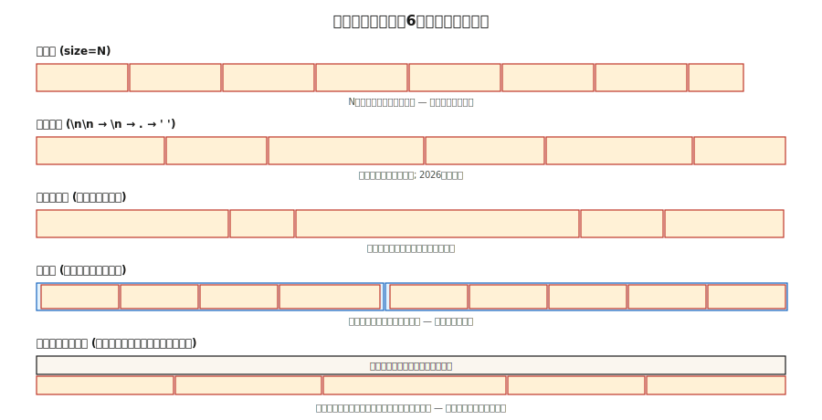

# RAG的分块策略

> 分块配置对检索质量的影响与嵌入模型的选择同等重要（Vectara NAACL 2025）。分块策略选错了，再多的重排序也无法挽救。

**类型：** 构建  
**语言：** Python  
**前置条件：** 阶段5 · 14（信息检索），阶段5 · 22（嵌入模型）  
**时间：** 约60分钟

## 问题所在

你将一份50页的合同放入RAG系统。用户问：“终止条款是什么？”检索器返回了封面页。为什么？因为模型是在512 token的块上训练的，而终止条款在第20页，被分页符分割，且没有局部关键词将其与查询关联起来。

解决方案不是“买一个更好的嵌入模型”。解决方案是分块。多大？重叠？在哪里分割？是否包含周围上下文？

2026年2月的基准测试显示了令人惊讶的结果：

- Vectara 2026年研究：递归512 token分块的准确率从语义分块的69% → 54%。
- SPLADE + Mistral-8B在Natural Questions上：重叠带来零可衡量的提升。
- 上下文悬崖（Context cliff）：在约2500 token的上下文中，响应质量急剧下降。

“显而易见”的答案（语义分块，20%重叠，1000 token）通常是错误的。本节课将构建对六种策略的直觉，并告诉你何时该用哪种。

## 概念



**固定分块（Fixed chunking）。** 每N个字符或token进行切割。最简单的基线。会中断句子。压缩性好，连贯性差。

**递归分块（Recursive）。** LangChain的`RecursiveCharacterTextSplitter`。先尝试以`\n\n`分割，然后是`\n`，再是`.`，最后是空格。干净地回退。2026年的默认选择。

**语义分块（Semantic）。** 对每个句子进行嵌入。计算相邻句子之间的余弦相似度。在相似度低于阈值处进行分割。保留主题连贯性。较慢；有时会产生40 token的微小片段，损害检索效果。

**句子分块（Sentence）。** 以句子边界分割。每个块一个句子，或N个句子的窗口。在约5k token以内匹配语义分块的效果，成本却低得多。

**父文档分块（Parent-document）。** 存储小的子块用于检索，*同时*存储较大的父块用于上下文。通过子块检索，返回父块。优雅降级：糟糕的子块仍能返回合理的父块。

**延迟分块（Late chunking，2024年）。** 首先在token级别对整个文档进行嵌入，然后将token嵌入池化为块嵌入。保留跨块上下文。适用于长上下文嵌入器（BGE-M3, Jina v3）。计算量更高。

**上下文检索（Contextual retrieval，Anthropic，2024年）。** 在每个块前添加LLM生成的该块在文档中位置的摘要（“此块是终止条款的第3.2部分……”）。在Anthropic自己的基准测试中，检索提升35-50%。索引成本高。

### 击败所有默认设置的规则

将块大小与查询类型匹配：

| 查询类型 | 块大小 |
|---------|--------|
| 事实型（Factoid，如“CEO的名字是什么？”） | 256-512 token |
| 分析型/多跳（Analytical / multi-hop） | 512-1024 token |
| 整节理解（Whole-section comprehension） | 1024-2048 token |

来自NVIDIA 2026年基准测试。块应该足够大以包含答案及局部上下文，同时足够小，使检索器的top-K结果聚焦于答案而非上下文噪声。

## 构建

### 步骤1：固定和递归分块

```python
def chunk_fixed(text, size=512, overlap=0):
    step = size - overlap
    return [text[i:i + size] for i in range(0, len(text), step)]


def chunk_recursive(text, size=512, seps=("\n\n", "\n", ". ", " ")):
    if len(text) <= size:
        return [text]
    for sep in seps:
        if sep not in text:
            continue
        parts = text.split(sep)
        chunks = []
        buf = ""
        for p in parts:
            if len(p) > size:
                if buf:
                    chunks.append(buf)
                    buf = ""
                chunks.extend(chunk_recursive(p, size=size, seps=seps[1:] or (" ",)))
                continue
            candidate = buf + sep + p if buf else p
            if len(candidate) <= size:
                buf = candidate
            else:
                if buf:
                    chunks.append(buf)
                buf = p
        if buf:
            chunks.append(buf)
        return [c for c in chunks if c.strip()]
    return chunk_fixed(text, size)
```

### 步骤2：语义分块

```python
def chunk_semantic(text, encoder, threshold=0.6, min_chars=200, max_chars=2048):
    sentences = split_sentences(text)
    if not sentences:
        return []
    embs = encoder.encode(sentences, normalize_embeddings=True)
    chunks = [[sentences[0]]]
    for i in range(1, len(sentences)):
        sim = float(embs[i] @ embs[i - 1])
        current_len = sum(len(s) for s in chunks[-1])
        if sim < threshold and current_len >= min_chars:
            chunks.append([sentences[i]])
        else:
            chunks[-1].append(sentences[i])

    result = []
    for group in chunks:
        text_group = " ".join(group)
        if len(text_group) > max_chars:
            result.extend(chunk_recursive(text_group, size=max_chars))
        else:
            result.append(text_group)
    return result
```

在你的领域调整`threshold`。太高→碎片。太低→一个巨大的块。

### 步骤3：父文档分块

```python
def chunk_parent_child(text, parent_size=2048, child_size=256):
    parents = chunk_recursive(text, size=parent_size)
    mapping = []
    for p_idx, parent in enumerate(parents):
        children = chunk_recursive(parent, size=child_size)
        for child in children:
            mapping.append({"child": child, "parent_idx": p_idx, "parent": parent})
    return mapping


def retrieve_parent(child_query, mapping, encoder, top_k=3):
    child_embs = encoder.encode([m["child"] for m in mapping], normalize_embeddings=True)
    q_emb = encoder.encode([child_query], normalize_embeddings=True)[0]
    scores = child_embs @ q_emb
    top = np.argsort(-scores)[:top_k]
    seen, parents = set(), []
    for i in top:
        if mapping[i]["parent_idx"] not in seen:
            parents.append(mapping[i]["parent"])
            seen.add(mapping[i]["parent_idx"])
    return parents
```

关键洞察：对父块去重。多个子块可能映射到同一个父块；全部返回会浪费上下文。

### 步骤4：上下文检索（Anthropic模式）

```python
def contextualize_chunks(document, chunks, llm):
    context_prompts = [
        f"""<document>{document}</document>
Here is the chunk to situate: <chunk>{c}</chunk>
Write 50-100 words placing this chunk in the document's context."""
        for c in chunks
    ]
    contexts = llm.batch(context_prompts)
    return [f"{ctx}\n\n{c}" for ctx, c in zip(contexts, chunks)]
```

索引上下文化后的块。在查询时，检索受益于额外的周围信号。

### 步骤5：评估

```python
def recall_at_k(queries, corpus_chunks, encoder, k=5):
    chunk_embs = encoder.encode(corpus_chunks, normalize_embeddings=True)
    hits = 0
    for q_text, gold_idxs in queries:
        q_emb = encoder.encode([q_text], normalize_embeddings=True)[0]
        top = np.argsort(-(chunk_embs @ q_emb))[:k]
        if any(i in gold_idxs for i in top):
            hits += 1
    return hits / len(queries)
```

始终进行基准测试。对于你的语料库，“最佳”策略可能与任何博客文章都不匹配。

## 陷阱

- **仅在事实型查询上评估分块。** 多跳查询会揭示不同的优胜者。使用按查询类型分层的评估集。
- **没有最小大小的语义分块。** 产生40 token的碎片，损害检索。始终强制执行`min_tokens`。
- **将重叠当作教条。** 2026年的研究发现重叠通常带来零收益，并使索引成本翻倍。测量，不要假设。
- **没有最小/最大限制。** 5 token或5000 token的块都会破坏检索。进行钳制（Clamp）。
- **跨文档分块。** 绝不能让一个块跨越两个文档。始终按文档分块，然后合并。

## 使用

2026年的栈：

| 情况 | 策略 |
|-----|------|
| 首次构建，未知语料库 | 递归，512 token，无重叠 |
| 事实型问答 | 递归，256-512 token |
| 分析型/多跳 | 递归，512-1024 token + 父文档 |
| 高度交叉引用（合同、论文） | 延迟分块或上下文检索 |
| 对话型/对话语料库 | 轮次级别分块 + 说话者元数据 |
| 短文本（推文、评论） | 一个文档 = 一个块 |

从递归512开始。在50个查询的评估集上测量recall@5。然后进行调整。

## 交付

保存为 `outputs/skill-chunker.md`：

```markdown
---
name: chunker
description: 为给定的语料库和查询分布选择分块策略、大小和重叠量。
version: 1.0.0
phase: 5
lesson: 23
tags: [nlp, rag, chunking]
---

给定语料库（文档类型、平均长度、领域）和查询分布（事实型/分析型/多跳），输出：

1. 策略。递归/句子/语义/父文档/延迟/上下文。给出理由。
2. 块大小。token数量。理由与查询类型关联。
3. 重叠量。默认为0；如果>0则需证明。
4. 最小/最大限制。`min_tokens`，`max_tokens`防护。
5. 评估计划。在50个查询的分层评估集（事实型、分析型、多跳）上的recall@5。

拒绝任何没有最小/最大块大小限制的分块策略。拒绝超过20%的重叠，除非有消融实验证明其有效。对于没有最小token底线的语义分块建议，进行标记。
```

## 练习

1. **简单。** 使用固定分块(512, 0)、递归分块(512, 0)和递归分块(512, 100)对一份20页的文档进行分块。比较块数量和边界质量。
2. **中等。** 构建一个包含5个文档、30个查询的评估集。测量递归、语义和父文档分块的recall@5。哪个胜出？与博客文章是否一致？
3. **困难。** 实现上下文检索。测量相对于基线递归的MRR提升。报告索引成本（LLM调用）与准确率提升。

## 关键术语

| 术语 | 人们说的意思 | 实际含义 |
|-----|-------------|---------|
| 块（Chunk） | 文档的一部分 | 子文档单元，被嵌入、索引和检索。 |
| 重叠（Overlap） | 安全余量 | 相邻块之间共享的N个token；在2026年基准测试中通常无用。 |
| 语义分块（Semantic chunking） | 智能分块 | 在相邻句子嵌入相似度下降处分割。 |
| 父文档（Parent-document） | 两级检索 | 检索小子块，返回较大父块。 |
| 延迟分块（Late chunking） | 嵌入后分块 | 对整个文档进行token级嵌入，池化为块向量。 |
| 上下文检索（Contextual retrieval） | Anthropic的技巧 | 在索引前，将LLM生成的摘要添加到每个块之前。 |
| 上下文悬崖（Context cliff） | 2500 token之墙 | 在RAG中约2.5k上下文token处观察到的质量下降（2026年1月）。 |

## 延伸阅读

- [Yepes等人 / LangChain — 递归字符分割文档](https://python.langchain.com/docs/how_to/recursive_text_splitter/) — 生产环境中的默认方式。
- [Vectara（2024年，NAACL 2025年）。分块配置分析](https://arxiv.org/abs/2410.13070) — 分块与嵌入选择同等重要。
- [Jina AI — 长上下文嵌入模型中的延迟分块（2024年）](https://jina.ai/news/late-chunking-in-long-context-embedding-models/) — 延迟分块论文。
- [Anthropic — 上下文检索](https://www.anthropic.com/news/contextual-retrieval) — 使用LLM生成的上下文前缀实现35-50%的检索提升。
- [NVIDIA 2026年块大小基准测试 — Premai摘要](https://blog.premai.io/rag-chunking-strategies-the-2026-benchmark-guide/) — 按查询类型划分的块大小。