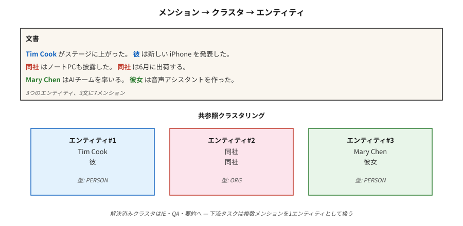

# Çekirdek Referans Çözünürlüğü

> "Onu aradı. Cevap vermedi. Doktor öğle yemeğindeydi." İki kişiye üç atıfta bulunuluyor ve kimsenin adı geçmiyor. Coreference çözümü kimin kim olduğunu çözer.

**Tür:** Öğren
**Diller:** Python
**Önkoşullar:** Aşama 5 · 06 (NER), Aşama 5 · 07 (POS ve Ayrıştırma)
**Süre:** ~60 dakika

## Sorun

300 kelimelik bir makaleden Apple Inc.'e dair her sözü çıkarın. Makalede "Apple" dendiğinde kolay. "Şirket", "onlar", "Cupertino'nun teknoloji devi" veya "Jobs'un firması" derken zor. Bu bahisleri aynı varlığa çözümlemediğiniz takdirde NER boru hattınız bahsi geçenlerin %60-80'ini kaçırır.

Çekirdek referans çözünürlüğü, aynı gerçek dünya varlığına atıfta bulunan her ifadeyi tek bir kümeye bağlar. Yüzey düzeyindeki NLP (NER, ayrıştırma) ile aşağı akış semantiği (IE, QA, özetleme, KG) arasındaki yapıştırıcıdır.

2026'da neden önemli:

- Özetleme: "CEO duyurdu..." vs "Tim Cook duyurdu..." — özette CEO'nun adı yazılmalıdır.
- Soru yanıtlama: "Kimi aradı?" "kadın"ın çözülmesini gerektirir.
- Bilgi çıkarma: "PER1 Apple'ı kurdu" ve "Jobs Apple'ı kurdu" şeklinde ayrı girişler içeren bir bilgi grafiği yanlıştır.
- Çoklu belge IE: aynı olayla ilgili makalelerdeki sözlerin birleştirilmesi, belgeler arası ortak referanstır.

## Konsept



**Görev.** Giriş: bir belge. Çıktı: Her bir kümenin bir varlığa atıfta bulunduğu, bahsedilenlerin (yayılma alanlarının) kümelenmesi.

**Bahsetme türleri.**

- **Adlandırılmış kuruluş.** "Tim Cook"
- **Nominal.** "CEO", "şirket"
- **Zamir.** "o", "o", "onlar", "o"
- **Olumlu.** "Tim Cook, Apple'ın CEO'su"

**Mimariler.**

1. **Kural tabanlı (Hobbs, 1978).** Dilbilgisi kurallarını kullanan sözdizimsel ağaç tabanlı zamir çözümlemesi. İyi bir temel. Zamirlerde yenmek şaşırtıcı derecede zor.
2. **Bahsetme çifti sınıflandırıcısı.** Her bir bahsetme çifti (m_i, m_j) için bunların ortak referans alıp almadığını tahmin edin. Geçişli kapanışa göre kümeleme. Standart 2016 öncesi.
3. **Bahsetme sıralaması.** Her bir söz için adayın öncüllerini sıralayın ("öncesi yok" dahil). Üstü seç.
4. **Span tabanlı uçtan uca (Lee ve diğerleri, 2017).** Transformer kodlayıcı. Tüm aday aralıklarını bir uzunluk sınırına kadar numaralandırın. Bahsetme puanlarını tahmin edin. Her bir yayılma için öncül olasılığını tahmin edin. Açgözlülükle kümeleşin. Modern varsayılan.
5. **Generative (2024+).** Prompt ve Yüksek Lisans: "Bu metindeki her zamiri ve öncüllerini listeleyin." Kolay vakalarda iyi çalışır, uzun belgelerde ve nadir referanslarda zorluk çeker.

**Değerlendirme metrikleri.** Beş standart metrik (MUC, B³, CEAF, BLANC, LEA) çünkü kümeleme kalitesini tek başına ölçen bir ölçüt yoktur. İlk üçün ortalamasını CoNLL F1 olarak bildirin. CoNLL-2012'de 2026'daki son teknoloji: ~83 F1.

**Bilinen zor durumlar.**

- Sayfalarda daha önce tanıtılan varlıklara ilişkin kesin açıklamalar.
- Köprü oluşturan anafora ("tekerlekler" → daha önce bahsedilen bir araba).
- Çince ve Japonca gibi dillerde sıfır anafora.
- Katafora (göstergeden önceki zamir): "**O** içeri girdiğinde Mary gülümsedi."

## İnşa Et

### Adım 1: önceden eğitilmiş sinirsel referans (AllenNLP / spaCy-deneysel)

```python
import spacy
nlp = spacy.load("en_coreference_web_trf")   # experimental model
doc = nlp("Apple announced new products. The company said they would ship soon.")
for cluster in doc._.coref_clusters:
    print(cluster, "->", [m.text for m in cluster])
```

Daha uzun bir belgede şöyle bir şey elde edersiniz:
- Küme 1: [Apple, Şirket, onlar]
- Küme 2: [yeni ürünler]

### Adım 2: kurala dayalı zamir çözümleyici (öğretme)

Yalnızca stdlib uygulaması için `code/main.py` konusuna bakın:

1. Bahsedilen alıntılar: adlandırılmış varlıklar (büyük harfle yazılmış aralıklar), zamirler (dikte araması), belirli açıklamalar ("X").
2. Her zamir için önceki K bahsine bakın ve bunları şu şekilde puanlayın:
- cinsiyet/sayı anlaşması (sezgisel)
- güncellik (yaklaşan kazanır)
- sözdizimsel rol (konular tercih edilir)
3. En yüksek puanı alan öncülü bağlayın.

Sinir modelleriyle rekabet edemez. Ancak arama alanını ve uçtan uca bir modelin alması gereken kararları gösterir.

### Adım 3: Yüksek Lisans'ları referans için kullanma

```python
prompt = f"""Text: {text}

List every pronoun and noun phrase that refers to a person or company.
Cluster them by what they refer to. Output JSON:
[{{"entity": "Apple", "mentions": ["Apple", "the company", "it"]}}, ...]
"""
```

İzlenecek iki arıza modu. İlk olarak, Yüksek Lisans'lar aşırı birleşiyor ("o" ve "o" iki farklı kişiye atıfta bulunuyor). İkincisi, Yüksek Lisans'lar uzun belgelerde sessizce sözlerden vazgeçerler. Her zaman açıklık-ofset kontrolleriyle doğrulayın.

### Adım 4: değerlendirme

Standart conll-2012 komut dosyası MUC, B³, CEAF-φ4'ü hesaplar ve ortalamayı bildirir. Şirket içi bir değerlendirme için, aralık düzeyinde hassasiyetle başlayın ve açıklamalı test setinizi geri çağırın, ardından F1'den bahsetme bağlantısını ekleyin.

## Tuzaklar

- **Singleton patlaması.** Bazı sistemler her sözü kendi kümesi olarak rapor eder. B³ hoşgörülüdür. MUC bunu cezalandırıyor. Her zaman üç ölçümün tümünü kontrol edin.
- **Uzun bağlamda zamirler.** Performans, 2.000 token saniye boyunca belgelerde ~15 F1 düşer. Dikkatlice parçalayın.
- **Cinsiyet varsayımları.** İkili olmayan referanslar, kuruluşlar ve hayvanlar üzerinde katı kodlanmış cinsiyet kuralları çiğneniyor. Öğrenilen modelleri veya tarafsız puanlamayı kullanın.
- **Uzun dokümanlarda yüksek lisans kayması.** Tek bir API çağrısı, 50'den fazla paragrafta bahsedilenleri güvenilir bir şekilde kümeleyemez. Kayan pencere + birleştirmeyi kullanın.

## Kullan onu

2026 yığını:

| Durum | Seç |
|-----------|------|
| İngilizce, tek belge | `en_coreference_web_trf` (spaCy-deneysel) veya AllenNLP sinir çekirdeği |
| Çok dilli | SpanBERT / XLM-R, OntoNotes veya Çok Dilli CoNLL eğitimi aldı |
| Belgeler arası olay coref | Özel uçtan uca modeller (2025–26 SOTA) |
| Hızlı Yüksek Lisans temel çizgisi | GPT-4o / Claude, yapılandırılmış çıkış çekirdeği prompt ile |
| Üretim diyalog sistemleri | Kritik alanlar için kural tabanlı geri dönüş + sinirsel birincil + manuel inceleme |

2026'da gönderilen entegrasyon modeli: önce NER'i çalıştırın, coref'i çalıştırın, coref kümelerini NER varlıklarıyla birleştirin. Aşağı akış görevleri, söz başına bir varlık değil, küme başına bir varlık görür.

## Gönderin

`outputs/skill-coref-picker.md` olarak kaydet:

```markdown
---
name: coref-picker
description: Pick a coreference approach, evaluation plan, and integration strategy.
version: 1.0.0
phase: 5
lesson: 24
tags: [nlp, coref, information-extraction]
---

Given a use case (single-doc / multi-doc, domain, language), output:

1. Approach. Rule-based / neural span-based / LLM-prompted / hybrid. One-sentence reason.
2. Model. Named checkpoint if neural.
3. Integration. Order of operations: tokenize → NER → coref → downstream task.
4. Evaluation. CoNLL F1 (MUC + B³ + CEAF-φ4 average) on held-out set + manual cluster review on 20 documents.

Refuse LLM-only coref for documents over 2,000 tokens without sliding-window merge. Refuse any pipeline that runs coref without a mention-level precision-recall report. Flag gender-heuristic systems deployed in demographically diverse text.
```

## Egzersizler

1. **Kolay.** `code/main.py`'daki kural tabanlı çözümleyiciyi 5 el yapımı paragraf üzerinde çalıştırın. Bahsetme bağlantısının doğruluğunu temel gerçeğe göre ölçün.
2. **Orta.** Bir haber makalesinde önceden eğitilmiş bir nöral çekirdek modeli kullanın. Kümeleri kendi manuel ek açıklamalarınızla karşılaştırın. Nerede başarısız oldu?
3. **Zor.** Coref ile geliştirilmiş bir NER hattı oluşturun: Önce NER, ardından coref kümeleri aracılığıyla birleştirin. 100 makalede yalnızca NER'e kıyasla varlık kapsamı iyileştirmesini ölçün.

## Anahtar Terimler

| Dönem | İnsanlar ne diyor | Aslında ne anlama geliyor |
|------|-----------------|-----------------------|
| Mansiyon | Bir referans | Bir varlığa (ad, zamir, isim tamlaması) atıfta bulunan bir metin aralığı. |
| öncül | "O" ne anlama gelir | Daha önce bahsedilen, daha sonra bahsedilenle aynı anlama gelir. |
| Küme | Kuruluşun sözleri | Hepsinin gerçek dünyadaki aynı varlığa atıfta bulunduğuna dair bir dizi ifade. |
| Anafora | Geriye referans | Daha sonra bahsedildiğinde daha öncekilere atıfta bulunulur ("o" → "John"). |
| Katafora | İleri referans | Daha önce sözü daha sonra anlamına gelir ("O geldiğinde, John..."). |
| Köprüleme | Örtülü referans | "Bir araba aldım. Tekerlekler kötüydü." (O arabanın tekerlekleri.) |
| CONLL F1 | Skor tablolarındaki sayı | MUC, B³, CEAF-φ4 F1 puanlarının ortalaması. |

## Daha Fazla Okuma

- [Jurafsky ve Martin, SLP3 Bölüm. 26 — Çekirdek Referans Çözünürlüğü ve Varlık Bağlantısı](https://web.stanford.edu/~jurafsky/slp3/26.pdf) — standart ders kitabı bölümü.
- [Lee ve ark. (2017). Uçtan uca Sinirsel Çekirdek Referans Çözünürlüğü](https://arxiv.org/abs/1707.07045) — uçtan uca yayılma tabanlı.
- [Joshi ve ark. (2020). SpanBERT](https://arxiv.org/abs/1907.10529) — coref'i geliştiren ön eğitim.
- [Pradhan ve ark. (2012). CoNLL-2012 Paylaşılan Görev](https://aclanthology.org/W12-4501/) — benchmark.
-[Hobbs (1978). Zamir Referanslarını Çözümleme](https://www.sciencedirect.com/science/article/pii/0024384178900064) — kural tabanlı klasik.
