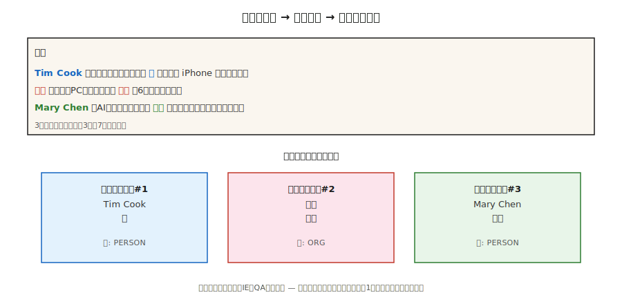

# 指代消解（Coreference Resolution）

> "她打电话给他。他没有接。医生当时正在吃午饭。"三个提及指代两个人，但没有人被点名。指代消解（Coreference Resolution）就是弄清楚谁是谁。

**类型：** 学习
**语言：** Python
**前置知识：** Phase 5 · 06（NER），Phase 5 · 07（词性标注与句法分析）
**时间：** 约60分钟

## 问题

从一篇300词的新闻中提取所有关于苹果公司（Apple Inc.）的提及。当文章出现"Apple"时很容易。但当文章出现"the company"、"they"、"Cupertino's technology giant"或"Jobs's firm"时就困难了。如果不将这些提及解析到同一个实体，你的NER（命名实体识别）流水线会遗漏60-80%的提及。

指代消解将指代同一现实世界实体的所有表达链接到一个簇中。它是表层NLP（NER、句法分析）与下游语义理解（信息抽取、问答、摘要、知识图谱）之间的粘合剂。

为什么它在2026年很重要：

- 摘要："The CEO announced..."对比"Tim Cook announced..."——摘要应提到CEO的名字。
- 问答："Who did she call?"需要解析出"she"。
- 信息抽取：一个知识图谱中"PER1 founded Apple"和"Jobs founded Apple"作为两个独立条目是错误的。
- 多文档信息抽取：将关于同一事件的多篇文章中的提及合并，属于跨文档指代消解。

## 概念



**任务。** 输入：一个文档。输出：提及（文本跨度）的聚类，每个簇指代一个实体。

**提及类型。**

- **命名实体（Named entity）。** "Tim Cook"
- **名词性短语（Nominal）。** "the CEO"、"the company"
- **代词（Pronominal）。** "he"、"she"、"they"、"it"
- **同位语（Appositive）。** "Tim Cook, Apple's CEO,"

**架构。**

1. **基于规则（Hobbs, 1978）。** 基于句法树使用语法规则的代词消解。好的基线。在代词上出奇地难以被击败。
2. **提及对分类器（Mention-pair classifier）。** 对于每一对提及(m_i, m_j)，预测它们是否共指。通过传递闭包聚类。2016年之前的标准做法。
3. **提及排序（Mention-ranking）。** 对每个提及，对候选先行词（包括"无先行词"）进行排序。选择排第一的。
4. **基于跨度的端到端模型（Span-based end-to-end, Lee et al., 2017）。** Transformer编码器。枚举所有长度上限内的候选跨度。预测提及分数。预测每个跨度的先行词概率。贪心聚类。现代默认方法。
5. **生成式（Generative, 2024+）。** 提示大语言模型（LLM）："列出此文本中的每个代词及其先行词。"在简单情况下效果良好，但在长文档和罕见指代物上表现困难。

**评估指标。** 五个标准指标（MUC、B³、CEAF、BLANC、LEA），因为没有任何单一指标能完美捕捉聚类质量。报告前三项的平均值作为CoNLL F1。2026年在CoNLL-2012上的最优水平：约83 F1。

**已知困难情况。**

- 描述性定指短语指代几页前引入的实体。
- 桥接回指（Bridging anaphora）："the wheels" → 之前提到过的汽车。
- 汉语、日语等语言中的零回指（Zero anaphora）。
- 前指（Cataphora，代词出现在指代对象之前）："When **she** walked in, Mary smiled."

## 动手实践

### 步骤 1：预训练神经网络指代消解（AllenNLP / spaCy-experimental）

```python
import spacy
nlp = spacy.load("en_coreference_web_trf")   # 实验性模型
doc = nlp("Apple announced new products. The company said they would ship soon.")
for cluster in doc._.coref_clusters:
    print(cluster, "->", [m.text for m in cluster])
```

在较长文档上，你会得到类似：
- 簇 1：[Apple, The company, they]
- 簇 2：[new products]

### 步骤 2：基于规则的代词消解器（教学用途）

参见 `code/main.py` 中的纯标准库实现：

1. 提取提及：命名实体（大写跨度）、代词（字典查找）、定指描述（"the X"）。
2. 对于每个代词，查看之前的K个提及，并根据以下条件评分：
   - 性别/数一致（启发式）
   - 近因（越近越优）
   - 句法角色（主语优先）
3. 链接得分最高的先行词。

无法与神经模型竞争。但它展示了搜索空间以及端到端模型必须做出的决策。

### 步骤 3：使用大语言模型进行指代消解

```python
prompt = f"""文本：{text}

列出所有指代人或公司的代词和名词短语。将它们按指代对象聚类。输出JSON：
[{{"entity": "Apple", "mentions": ["Apple", "the company", "it"]}}, ...]
"""
```

注意两种失效模式。首先，大语言模型会过度合并（"him"和"her"指代两个不同的人）。其次，在长文档中，大语言模型会静默地遗漏提及。始终通过跨度偏移检查进行验证。

### 步骤 4：评估

标准的conll-2012脚本计算MUC、B³、CEAF-φ4并报告平均值。对于内部评估，首先在标注测试集上计算跨度级别的精确率和召回率，然后添加提及链接F1。

## 陷阱

- **单例爆炸（Singleton explosion）。** 某些系统将每个提及都报告为独立的簇。B³较为宽容，MUC会惩罚这种结果。始终检查全部三个指标。
- **长上下文中的代词。** 在超过2000个token的文档上，性能下降约15 F1。请小心分块。
- **性别假设。** 硬编码的性别规则无法处理非二元指代、组织、动物。使用学习型模型或中性评分。
- **长文档上的大语言模型漂移。** 单次API调用无法可靠地对超过50段文档中的提及进行聚类。使用滑动窗口+合并策略。

## 使用建议

2026年的选择栈：

| 情况 | 推荐方法 |
|-----------|------|
| 英语，单文档 | `en_coreference_web_trf`（spaCy-experimental）或 AllenNLP 神经指代消解 |
| 多语言 | 在OntoNotes或多语言CoNLL上训练的SpanBERT / XLM-R |
| 跨文档事件共指 | 专门的端到端模型（2025–26 最优水平） |
| 快速大语言模型基线 | GPT-4o / Claude 配合结构化输出指代提示 |
| 生产对话系统 | 基于规则的备选 + 神经模型主选 + 关键槽位人工审核 |

2026年部署的集成模式：先运行NER，再运行指代消解，将指代簇合并到NER实体中。下游任务看到的是每个簇一个实体，而不是每个提及一个实体。

## 产出交付

保存为 `outputs/skill-coref-picker.md`：

```markdown
---
name: coref-picker
description: 选择指代消解方法、评估计划和集成策略。
version: 1.0.0
phase: 5
lesson: 24
tags: [nlp, coref, 信息抽取]
---

给定一个使用场景（单文档/多文档、领域、语言），输出：

1. 方法。基于规则/神经跨度/大语言模型提示/混合。一句话理由。
2. 模型。如果使用神经模型，指定检查点名称。
3. 集成。操作顺序：分词 → NER → 指代消解 → 下游任务。
4. 评估。在保留集上的CoNLL F1（MUC + B³ + CEAF-φ4平均值） + 对20份文档进行人工簇审查。

对于超过2000个token的文档，拒绝仅使用大语言模型进行指代消解而不使用滑动窗口合并。拒绝任何没有提及级别精确率-召回率报告的指代消解流水线。标记在人口多样性文本中部署的性别启发式系统。
```

## 练习

1. **简单题。** 在5段手工编写的段落上运行 `code/main.py` 中的基于规则消解器。将提及链接准确率与真实标注进行比较。
2. **中等题。** 在一篇新闻文章上使用预训练的神经指代消解模型。将得到的簇与你自己的人工标注进行比较。哪些地方出错了？
3. **困难题。** 构建一个指代增强的NER流水线：先运行NER，然后通过指代簇进行合并。在100篇文章上测量与仅NER相比的实体覆盖提升。

## 关键术语

| 术语 | 人们说的意思 | 实际含义 |
|------|-----------------|-----------------------|
| 提及（Mention） | 一个指代 | 指代一个实体的文本跨度（名称、代词、名词短语）。 |
| 先行词（Antecedent） | "it"指代的对象 | 与后文提及共指的前文提及。 |
| 簇（Cluster） | 实体的提及 | 所有指代同一现实世界实体的提及集合。 |
| 回指（Anaphora） | 后向指代 | 后文提及指向前文（"he" → "John"）。 |
| 前指（Cataphora） | 前向指代 | 前文提及指向后文（"When he arrived, John..."）。 |
| 桥接（Bridging） | 隐含指代 | "I bought a car. The wheels were bad."（那辆车的轮子。） |
| CoNLL F1 | 排行榜上的数字 | MUC、B³、CEAF-φ4 三个F1分数的平均值。 |

## 延伸阅读

- [Jurafsky & Martin, SLP3 第26章 — 指代消解与实体链接](https://web.stanford.edu/~jurafsky/slp3/26.pdf) — 教科书标准章节。
- [Lee et al. (2017). End-to-end Neural Coreference Resolution](https://arxiv.org/abs/1707.07045) — 基于跨度的端到端方法。
- [Joshi et al. (2020). SpanBERT](https://arxiv.org/abs/1907.10529) — 能够改进指代消解的预训练方法。
- [Pradhan et al. (2012). CoNLL-2012 Shared Task](https://aclanthology.org/W12-4501/) — 基准评测。
- [Hobbs (1978). Resolving Pronoun References](https://www.sciencedirect.com/science/article/pii/0024384178900064) — 基于规则的经典之作。