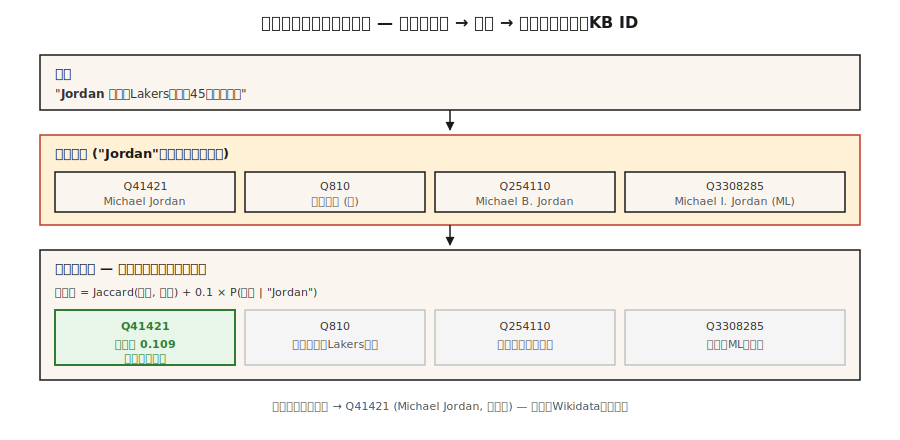

# エンティティリンキングと曖昧性解消

> NER は "Paris" を見つけました。Entity linking は、Paris, France なのか、Paris Hilton なのか、Paris, Texas なのか、Paris (Trojan prince) なのかを決めます。linking がなければ、knowledge graph は曖昧なままです。

**種別:** 構築
**言語:** Python
**前提条件:** Phase 5 · 06 (NER), Phase 5 · 24 (Coreference Resolution)
**所要時間:** 約60分

## 問題

ある文に "Jordan beat the press." とあります。NER は "Jordan" を PERSON と tag しました。良い結果です。しかし、*どの* Jordan でしょうか。

- Michael Jordan (basketball)?
- Michael B. Jordan (actor)?
- Michael I. Jordan (Berkeley ML professor — ML papers では実際にこの混同が起きます)?
- Jordan (the country)?
- Jordan (Hebrew first name)?

Entity linking (EL) は、各 mention を knowledge base 内の一意な entry に resolve します。Wikidata、Wikipedia、DBpedia、または domain KB です。subtasks は 2 つあります。

1. **Candidate generation。** "Jordan" が与えられたとき、どの KB entries が plausible か。
2. **Disambiguation。** context が与えられたとき、どの candidate が正しいか。

どちらの step も学習可能です。どちらも benchmark されています。組み合わせた pipeline は 10 年ほど安定しています。変わっているのは disambiguator の品質です。

## 概念



**Candidate generation。** mention surface form ("Jordan") が与えられたら、alias index で candidates を引きます。Wikipedia alias dictionaries はほとんどの named entities を cover します。"JFK" → John F. Kennedy、Jacqueline Kennedy、JFK airport、JFK (movie)。典型的な index は mention ごとに 10-30 candidates を返します。

**Disambiguation: 3 つのアプローチ。**

1. **Prior + context (Milne & Witten, 2008)。** `P(entity | mention) × context-similarity(entity, text)`。高速で、training なしでもよく動きます。
2. **Embedding-based (ESS / REL / Blink)。** mention + context を encode します。各 candidate の description も encode します。cosine が最大のものを選びます。2020-2024 年の default です。
3. **Generative (GENRE, 2021; LLM-based, 2023+)。** entity の canonical name を token-by-token に decode します。valid entity names の trie に constrain するため、output は valid KB id であることが保証されます。

**End-to-end vs pipeline。** 現代の models (ELQ、BLINK、ExtEnD、GENRE) は NER + candidate generation + disambiguation を 1 pass で実行します。production では components を交換できるため、pipeline systems が今も主流です。

### 2 つの測定値

- **Mention recall (candidate gen)。** gold mentions のうち、正しい KB entry が candidate list に含まれる割合。pipeline 全体の floor です。
- **Disambiguation accuracy / F1。** correct candidates が与えられたとき、top-1 がどれだけ正しいか。

必ず両方を報告してください。80% candidate recall 上で 99% disambiguation の system は、全体としては 80% pipeline です。

## 作ってみる

### Step 1: Wikipedia redirects から alias index を作る

```python
alias_to_entities = {
    "jordan": ["Q41421 (Michael Jordan)", "Q810 (Jordan, country)", "Q254110 (Michael B. Jordan)"],
    "paris":  ["Q90 (Paris, France)", "Q663094 (Paris, Texas)", "Q55411 (Paris Hilton)"],
    "apple":  ["Q312 (Apple Inc.)", "Q89 (apple, fruit)"],
}
```

Wikipedia alias data は約 18M の (alias, entity) pairs です。Wikidata dumps から download します。inverted index として保存してください。

### Step 2: context-based disambiguation

```python
def disambiguate(mention, context, alias_index, entity_desc):
    candidates = alias_index.get(mention.lower(), [])
    if not candidates:
        return None, 0.0
    context_words = set(tokenize(context))
    best, best_score = None, -1
    for entity_id in candidates:
        desc_words = set(tokenize(entity_desc[entity_id]))
        union = len(context_words | desc_words)
        score = len(context_words & desc_words) / union if union else 0.0
        if score > best_score:
            best, best_score = entity_id, score
    return best, best_score
```

Jaccard overlap は toy です。embeddings 上の cosine similarity に置き換えてください (transformer version は `code/main.py` の step-2 を参照)。

### Step 3: embedding-based (BLINK-style)

```python
from sentence_transformers import SentenceTransformer
encoder = SentenceTransformer("sentence-transformers/all-MiniLM-L6-v2")

def embed_mention(text, mention_span):
    start, end = mention_span
    marked = f"{text[:start]} [MENTION] {text[start:end]} [/MENTION] {text[end:]}"
    return encoder.encode([marked], normalize_embeddings=True)[0]

def embed_entity(entity_id, description):
    return encoder.encode([f"{entity_id}: {description}"], normalize_embeddings=True)[0]
```

index time では、すべての KB entity を一度だけ embed します。query time では、mention + context を一度だけ embed し、candidate pool に対して dot-product を取り、最大のものを選びます。

### Step 4: generative entity linking (concept)

GENRE は entity の Wikipedia title を character-by-character に decode します。constrained decoding (lesson 20 参照) により、valid titles だけを output できます。KB-backed trie と密に統合します。現代的な descendant は REL-GEN と、structured output を使う LLM-prompted EL です。

```python
prompt = f"""Text: {text}
Mention: {mention}
List the best Wikipedia title for this mention.
Respond with JSON: {{"title": "..."}}"""
```

whitelist (Outlines `choice`) と組み合わせると、これは 2026 年に出荷できる最も簡単な EL pipeline です。

### Step 5: AIDA-CoNLL で評価する

AIDA-CoNLL は標準的な EL benchmark です。1,393 Reuters articles、34k mentions、Wikipedia entities で構成されます。in-KB accuracy (`P@1`) と out-of-KB NIL-detection rate を報告します。

## 落とし穴

- **NIL handling。** 一部の mentions は KB にありません (emerging entities、obscure people)。systems は誤った entity を推測するのではなく NIL を予測しなければなりません。これは別に測定します。
- **Mention boundary errors。** upstream NER が partial spans を miss します ("Bank of America" が "Bank" だけとして tagged される)。EL recall が落ちます。
- **Popularity bias。** trained systems は frequent entities を過剰に予測します。ML paper 上の "Michael I. Jordan" という mention が basketball Jordan に link されることがよくあります。
- **Cross-lingual EL。** 中国語 text 内の mentions を English Wikipedia entities に map します。multilingual encoder か translation step が必要です。
- **KB staleness。** 新しい companies、events、people は去年の Wikipedia dump にはありません。production pipelines には refresh loop が必要です。

## 使う

2026 年の stack:

| 状況 | 選択 |
|-----------|------|
| General-purpose English + Wikipedia | BLINK または REL |
| Cross-lingual、KB = Wikipedia | mGENRE |
| LLM-friendly、few mentions/day | candidate list + constrained JSON で Claude/GPT-4 に prompt する |
| Domain-specific KB (medical、legal) | KB-aware retrieval を備えた custom BERT + domain AIDA-style set で fine-tune |
| Extremely low-latency | exact-match prior only (Milne-Witten baseline) |
| Research SOTA | GENRE / ExtEnD / generative LLM-EL |

2026 年に出荷される production pattern: NER → coref → 各 mention に EL → clusters を 1 つの canonical entity per cluster に collapse。output は document 内の entity ごとに 1 つの KB id であり、mention ごとに 1 つではありません。

## 出荷する

`outputs/skill-entity-linker.md` として保存:

```markdown
---
name: entity-linker
description: entity linking pipeline を設計する。KB、candidate generator、disambiguator、evaluation を含める。
version: 1.0.0
phase: 5
lesson: 25
tags: [nlp, entity-linking, knowledge-graph]
---

use case (domain KB、language、volume、latency budget) が与えられたら、次を出力してください。

1. Knowledge base。Wikidata / Wikipedia / custom KB。Version date。Refresh cadence。
2. Candidate generator。Alias-index、embedding、または hybrid。Target mention recall @ K。
3. Disambiguator。Prior + context、embedding-based、generative、または LLM-prompted。
4. NIL strategy。Top score の threshold、classifier、または explicit NIL candidate。
5. Evaluation。Held-out set 上の mention recall @ 30、top-1 accuracy、NIL-detection F1。

mention-recall baseline のない EL pipeline は拒否する (candidate gen が正しい entity を surfaced したかを知らずに disambiguator は評価できない)。valid KB ids への constrained output なしに LLM-prompted EL を使う pipeline は拒否する。domain fine-tuning なしに popularity bias が minority entities (例: name-clashes) に影響する systems は警告する。
```

## 演習

1. **Easy.** `code/main.py` で prior+context disambiguator を 10 個の ambiguous mentions (Paris、Jordan、Apple) に対して実装してください。正しい entity を hand-label し、accuracy を測ります。
2. **Medium.** sentence transformer で 50 個の ambiguous mentions を encode してください。各 candidate の description を embed します。embedding-based disambiguation と Jaccard context overlap を比較してください。
3. **Hard.** 1k-entity の domain KB (例: 自社の employees + products) を作ってください。NER + EL を end-to-end に実装し、100 held-out sentences 上で precision と recall を測ります。

## 重要用語

| Term | みんなの言い方 | 実際の意味 |
|------|-----------------|-----------------------|
| Entity linking (EL) | Wikipedia に link する | mention を一意な KB entry に map する。 |
| Candidate generation | それは誰/何の可能性があるか | mention に対して plausible な KB entries の shortlist を返す。 |
| Disambiguation | 正しいものを選ぶ | context を使って candidates を score し、winner を選ぶ。 |
| Alias index | lookup table | surface form → candidate entities に map する。 |
| NIL | KB にない | 一致する KB entry がないことを明示的に予測する。 |
| KB | Knowledge base | Wikidata、Wikipedia、DBpedia、または domain KB。 |
| AIDA-CoNLL | benchmark | gold entity links を持つ 1,393 Reuters articles。 |

## 参考文献

- [Milne, Witten (2008). Learning to Link with Wikipedia](https://www.cs.waikato.ac.nz/~ihw/papers/08-DM-IHW-LearningToLinkWithWikipedia.pdf) — foundational な prior+context approach。
- [Wu et al. (2020). Zero-shot Entity Linking with Dense Entity Retrieval (BLINK)](https://arxiv.org/abs/1911.03814) — embedding-based の workhorse。
- [De Cao et al. (2021). Autoregressive Entity Retrieval (GENRE)](https://arxiv.org/abs/2010.00904) — constrained decoding を使う generative EL。
- [Hoffart et al. (2011). Robust Disambiguation of Named Entities in Text (AIDA)](https://www.aclweb.org/anthology/D11-1072.pdf) — benchmark paper。
- [REL: An Entity Linker Standing on the Shoulders of Giants (2020)](https://arxiv.org/abs/2006.01969) — open production stack。
