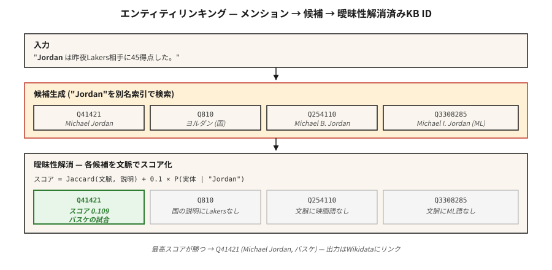

# Varlık Bağlantısı ve Belirsizliğin Giderilmesi

> NER "Paris"i buldu. Varlık bağlama kararı: Paris mi, Fransa mı? Paris Hilton'u mu? Paris mi, Teksas mı? Paris (Truva prensi) mi? Bağlantı olmadan bilgi grafiğiniz belirsiz kalır.

**Tür:** Yapım
**Diller:** Python
**Önkoşullar:** Aşama 5 · 06 (NER), Aşama 5 · 24 (Bağlantı Çözünürlüğü)
**Süre:** ~60 dakika

## Sorun

Bir cümle şöyle: "Ürdün basını yendi." NER'iniz "Ürdün"ü KİŞİ olarak etiketler. İyi. Ama *hangi* Ürdün?

- Michael Jordan (basketbol)?
- Michael B. Jordan (aktör)?
- Michael I. Jordan (Berkeley ML profesörü — evet, bu kafa karışıklığı ML makalelerinde gerçektir)?
- Ürdün (ülke)?
- Ürdün (İbranice adı)?

Varlık bağlama (EL), her bahsi bir bilgi tabanındaki benzersiz bir girişe çözümler: Wikidata, Wikipedia, DBpedia veya etki alanınız KB. İki alt görev:

1. **Aday oluşturma.** "Jordan" göz önüne alındığında hangi KB girişleri makuldür?
2. **Belirsizliği giderme.** Bağlam göz önüne alındığında hangi aday doğru adaydır?

Her iki adım da öğrenilebilir. Her ikisi de benchmarked'dir. Birleşik boru hattı on yıldır istikrarlıydı; değişen şey, belirsizliği gidericinin kalitesiydi.

## Konsept



**Aday oluşturma.** Bahsetme yüzey formu ("Jordan") göz önüne alındığında, adayları bir takma ad dizininde arayın. Vikipedi takma ad sözlükleri en çok adı geçen varlıkları kapsar: "JFK" → John F. Kennedy, Jacqueline Kennedy, JFK havaalanı, JFK (film). Tipik dizin, söz başına 10-30 aday döndürür.

**Belirsizliği giderme: üç yaklaşım.**

1. **Önceki + bağlam (Milne ve Witten, 2008).** `P(entity | mention) × context-similarity(entity, text)`. İyi çalışıyor, hızlı, eğitim yok.
2. **Embedding tabanlı (ESS / REL / Blink).** Bahsi + bağlamı kodlayın. Her adayın açıklamasını kodlayın. Maksimum kosinüsü seçin. 2020-2024 varsayılanı.
3. **Üretimsel (TÜR, 2021; LLM tabanlı, 2023+).** Varlığın standart adının token-by-token kodunu çözün. Bir dizi geçerli varlık adı ile sınırlandırıldığından çıktının geçerli bir KB kimliği olması garanti edilir.

**Uçtan uca ve ardışık düzen.** Modern modeller (ELQ, BLINK, ExtEnD, GENRE) NER + aday oluşturma + belirsizliği gidermeyi tek geçişte çalıştırır. Bileşenleri değiştirebildiğiniz için boru hattı sistemleri hâlâ üretimde hakim konumdadır.

### İki ölçüm

- **Bahsetmeyi geri çağırma (aday gen).** Altının kesri, aday listesinde doğru KB girişinin nerede göründüğünü belirtir. Boru hattının tamamı için zemin.
- **Belirsizliği giderme doğruluğu / F1.** Doğru adaylar göz önüne alındığında, ilk 1'in ne sıklıkla doğru olduğu.

Her zaman ikisini de rapor edin. %80 aday geri çağırmada %99 netleştirme sağlayan bir sistem, %80'lik bir ardışık düzendir.

## İnşa Et

### Adım 1: Wikipedia yönlendirmelerinden bir takma ad dizini oluşturun

```python
alias_to_entities = {
    "jordan": ["Q41421 (Michael Jordan)", "Q810 (Jordan, country)", "Q254110 (Michael B. Jordan)"],
    "paris":  ["Q90 (Paris, France)", "Q663094 (Paris, Texas)", "Q55411 (Paris Hilton)"],
    "apple":  ["Q312 (Apple Inc.)", "Q89 (apple, fruit)"],
}
```

Vikipedi takma ad verileri: ~18M (takma ad, varlık) çifti. Vikiveri dökümlerinden indirin. Tersine çevrilmiş dizin olarak saklayın.

### Adım 2: bağlama dayalı belirsizliği giderme

```python
def disambiguate(mention, context, alias_index, entity_desc):
    candidates = alias_index.get(mention.lower(), [])
    if not candidates:
        return None, 0.0
    context_words = set(tokenize(context))
    best, best_score = None, -1
    for entity_id in candidates:
        desc_words = set(tokenize(entity_desc[entity_id]))
        union = len(context_words | desc_words)
        score = len(context_words & desc_words) / union if union else 0.0
        if score > best_score:
            best, best_score = entity_id, score
    return best, best_score
```

Jaccard örtüşmesi bir oyuncaktır. embedding'lerde kosinüs benzerliğiyle değiştirin (transformer sürümü için `code/main.py` adım-2'ye bakın).

### Adım 3: embedding tabanlı (BLINK stili)

```python
from sentence_transformers import SentenceTransformer
encoder = SentenceTransformer("sentence-transformers/all-MiniLM-L6-v2")

def embed_mention(text, mention_span):
    start, end = mention_span
    marked = f"{text[:start]} [MENTION] {text[start:end]} [/MENTION] {text[end:]}"
    return encoder.encode([marked], normalize_embeddings=True)[0]

def embed_entity(entity_id, description):
    return encoder.encode([f"{entity_id}: {description}"], normalize_embeddings=True)[0]
```

Dizin zamanında her KB varlığını bir kez ekleyin. Sorgu zamanında, söz + bağlamı bir kez ekleyin, nokta çarpımını aday havuzuna yerleştirin, maksimum değeri seçin.

### Adım 4: üretken varlık bağlantısı (kavram)

TÜR, varlığın Vikipedi başlığının kodunu karakter karakter çözer. Kısıtlı kod çözme (bkz. ders 20) yalnızca geçerli başlıkların çıktısının alınabilmesini sağlar. KB destekli denemeyle sıkı entegrasyon. Modern soyundan gelen, yapılandırılmış çıktıya sahip REL-GEN ve LLM-prompted EL'dir.

```python
prompt = f"""Text: {text}
Mention: {mention}
List the best Wikipedia title for this mention.
Respond with JSON: {{"title": "..."}}"""
```

Beyaz listeyle (Outlines `choice`) birleştirildiğinde bu, 2026'da gönderilecek en basit EL boru hattıdır.

### Adım 5: AIDA-CoNLL'yi değerlendirin

AIDA-CoNLL standart EL benchmark'dir: 1.393 Reuters makalesi, 34 bin bahsedilme, Wikipedia varlıkları. KB içi doğruluğunu (`P@1`) ve KB dışı NIL tespit oranını bildirin.

## Tuzaklar

- **NIL yönetimi.** Bazı sözlerden KB'de bahsedilmiyor (gelişmekte olan varlıklar, belirsiz insanlar). Sistemler yanlış varlığı tahmin etmek yerine NIL'yi tahmin etmelidir. Ayrı olarak ölçüldü.
- **Sınır hatalarından bahsedin.** Yukarı akış NER kısmi aralıkları kaçırıyor ("Bank of America" yalnızca "Banka" olarak etiketlendi). EL geri çağırma düşer.
- **Popülerlik yanlılığı.** Eğitimli sistemler sık rastlanan varlıkları aşırı tahmin ediyor. Bir ML makalesinde "Michael I. Jordan"dan söz edilmesi genellikle Jordan basketboluyla bağlantılıdır.
- **Dillerarası EL.** Çince metindeki sözlerin İngilizce Vikipedi öğeleriyle eşleştirilmesi. Çok dilli bir kodlayıcı veya çeviri adımı gerektirir.
- **KB bayatlığı.** Yeni şirketler, etkinlikler, kişiler geçen yılın Wikipedia çöplüğünde yok. Üretim ardışık düzenlerinin bir yenileme döngüsüne ihtiyacı vardır.

## Kullan onu

2026 yığını:

| Durum | Seç |
|-----------|------|
| Genel amaçlı İngilizce + Vikipedi | BLINK veya REL |
| Diller arası, KB = Vikipedi | mTÜR |
| Yüksek Lisans dostu, günde birkaç kez bahsedilme | Prompt Claude/GPT-4, aday listesi + kısıtlı JSON ile |
| Alana özel KB (medikal, hukuki) | KB bilinçli alma + alan adı AIDA tarzı sette ince ayar yapma özelliğine sahip özel BERT |
| Son derece düşük gecikme süresi | Yalnızca önceki tam eşleşme (Milne-Witten temel çizgisi) |
| SOTA'yı araştırın | TÜR / Kapsam / üretken LLM-EL |

2026'da piyasaya sürülecek üretim modeli: NER → coref → her sözde EL → kümeleri küme başına bir kanonik varlığa daraltın. Çıktı: belgedeki varlık başına bir KB kimliği, söz başına bir değil.

## Gönderin

`outputs/skill-entity-linker.md` olarak kaydet:

```markdown
---
name: entity-linker
description: Design an entity linking pipeline — KB, candidate generator, disambiguator, evaluation.
version: 1.0.0
phase: 5
lesson: 25
tags: [nlp, entity-linking, knowledge-graph]
---

Given a use case (domain KB, language, volume, latency budget), output:

1. Knowledge base. Wikidata / Wikipedia / custom KB. Version date. Refresh cadence.
2. Candidate generator. Alias-index, embedding, or hybrid. Target mention recall @ K.
3. Disambiguator. Prior + context, embedding-based, generative, or LLM-prompted.
4. NIL strategy. Threshold on top score, classifier, or explicit NIL candidate.
5. Evaluation. Mention recall @ 30, top-1 accuracy, NIL-detection F1 on held-out set.

Refuse any EL pipeline without a mention-recall baseline (you cannot evaluate a disambiguator without knowing candidate gen surfaced the right entity). Refuse any pipeline using LLM-prompted EL without constrained output to valid KB ids. Flag systems where popularity bias affects minority entities (e.g. name-clashes) without domain fine-tuning.
```

## Egzersizler

1. **Kolay.** `code/main.py`'deki önceki+bağlam belirsizliğini gidericiyi 10 belirsiz söze (Paris, Ürdün, Apple) uygulayın. Doğru varlığı elle etiketleyin. Doğruluğu ölçün.
2. **Orta.** 50 belirsiz bahsi transformer cümlesiyle kodlayın. Her adayın açıklamasını ekleyin. embedding tabanlı belirsizliği gidermeyi Jaccard bağlam örtüşmesiyle karşılaştırın.
3. **Zor.** 1k varlıklı bir alan adı KB (e.g. çalışanlar + şirketinizdeki ürünler) oluşturun. NER + EL'i uçtan uca uygulayın. 100 uzatılmış cümlenin hassasiyetini ölçün ve hatırlayın.

## Anahtar Terimler

| Dönem | İnsanlar ne diyor | Aslında ne anlama geliyor |
|------|-----------------|-----------------------|
| Varlık bağlama (EL) | Wikipedia'ya Bağlantı | Bir bahsi benzersiz bir bilgi bankası girişiyle eşleyin. |
| Aday nesli | Kim olabilir? | Bahsetmek için makul KB girişlerinin kısa listesini döndürün. |
| Belirsizliği giderme | Doğru olanı seçin | Adayları bağlamı kullanarak puanlayın, kazananı seçin. |
| Takma ad dizini | Arama tablosu | Yüzey formundan harita → aday varlıklar. |
| NIL | KB'de değil | Hiçbir KB girişinin eşleşmediğine dair açık tahmin. |
| bilgi bankası | Bilgi tabanı | Wikidata, Wikipedia, DBpedia veya alan adınız KB. |
| AIDA-CoNLL | benchmark | Altın varlık bağlantıları içeren 1.393 Reuters makalesi. |

## Daha Fazla Okuma

- [Milne, Witten (2008). Vikipedi ile Bağlantı Kurmayı Öğrenmek](https://www.cs.waikato.ac.nz/~ihw/papers/08-DM-IHW-LearningToLinkWithWikipedia.pdf) — temel önceki+bağlam yaklaşımı.
- [Wu ve ark. (2020). Yoğun Varlık Alma (BLINK) ile Sıfır Atışlı Varlık Bağlantısı](https://arxiv.org/abs/1911.03814) — embedding tabanlı güçlü çalışma.
- [De Cao ve ark. (2021). Otoregresif Varlık Alma (TÜR)](https://arxiv.org/abs/2010.00904) — kısıtlı kod çözme ile üretken EL.
- [Hoffart ve ark. (2011). Metindeki Adlandırılmış Varlıkların Güçlü Belirsizliğinin Giderilmesi (AIDA)](https://www.aclweb.org/anthology/D11-1072.pdf) — benchmark makalesi.
- [REL: Devlerin Omuzlarında Duran Bir Varlık Bağlayıcı (2020)](https://arxiv.org/abs/2006.01969) — açık üretim yığını.
