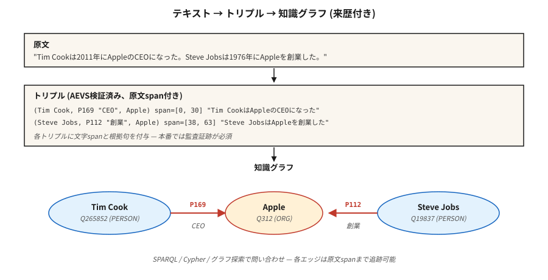

# İlişki Çıkarma ve Bilgi Grafiği Oluşturma

> NER varlıkları buldu. Varlık bağlantısı onları sabitledi. İlişki çıkarma, aralarındaki kenarları bulur. Bilgi grafiği düğümlerin, kenarların ve bunların kaynaklarının toplamıdır.

**Tür:** Yapım
**Diller:** Python
**Önkoşullar:** Aşama 5 · 06 (NER), Aşama 5 · 25 (Varlık Bağlantısı)
**Süre:** ~60 dakika

## Sorun

Bir analist şunu okuyor: "Tim Cook, 2011'de Apple'ın CEO'su oldu." Dört gerçek:

- `(Tim Cook, role, CEO)`
- `(Tim Cook, employer, Apple)`
- `(Tim Cook, start_date, 2011)`
- `(Apple, type, Organization)`

İlişki Çıkarma (RE), serbest metni yapılandırılmış üçlülere `(subject, relation, object)` dönüştürür. Bir korpusta topladığınızda bir bilgi grafiğiniz olur. Toplayın ve sorgulayın; RAG, analitik veya uyumluluk denetimleri için bir muhakeme alt yapısına sahip olursunuz.

2026 sorunu: Yüksek Lisans'lar ilişkileri coşkuyla çıkarıyor. Fazla coşkulu. Kaynak metnin desteklemediği üçlü halüsinasyonlar görüyorlar. Kaynağı olmadan, gerçek üçlüleri makul kurgudan ayıramazsınız. 2026'nın yanıtı AEVS tarzı sabitleme ve doğrulama işlem hatlarıdır.

## Konsept



**Üçlü biçim.** `(subject_entity, relation_type, object_entity)`. İlişkiler kapalı bir ontolojiden (Wikidata özellikleri, FIBO, UMLS) veya açık bir kümeden (OpenIE tarzı, her şey yolunda) gelir.

**Üç ekstraksiyon yaklaşımı.**

1. **Kural/örüntü tabanlı.** Hearst kalıpları: "X gibi Y" → `(Y, isA, X)`. Ayrıca el yapımı normal ifade. Kırılgan, kesin, açıklanabilir.
2. **Denetimli sınıflandırıcı.** Bir cümlede iki varlık bahsi verildiğinde, ilişkiyi sabit bir kümeden tahmin edin. TACRED, ACE, KBP konusunda eğitim aldım. Standart 2015–2022.
3. **Üretken LLM.** Prompt üçlü yayma modeli. Kutunun dışında çalışır. Kaynağına ihtiyacı var ya da makul görünen ıvır zıvır halüsinasyonu görüyor.

**AEVS (Çapa-Çıkartma-Doğrulama-Ek, 2026).** Mevcut halüsinasyon azaltma framework:

- **Bağlayıcı.** Her varlık kapsamını ve ilişki-ifade aralığını kesin konumlarla tanımlayın.
- **Çıkar.** Bağlantı aralıklarına bağlı üçlüler oluşturun.
- **Doğrulayın.** Her üçlü öğeyi kaynak metinle eşleştirin; desteklenmeyen her şeyi reddedin.
- **Ek.** Kapsama geçişi hiçbir sabit açıklığın düşürülmemesini sağlar.

Halüsinasyonlar keskin bir şekilde azalır. Daha fazla işlem gerektirir ancak denetlenebilir.

**Açık-kapalı karşılaştırması.**

- **Kapalı ontoloji.** Sabit özellik listesi (e.g., Wikidata'nın 11.000'den fazla özelliği). Tahmin edilebilir. Sorgulanabilir. İcat etmek zor.
- **IE'yi açın.** Herhangi bir sözlü ifade bir ilişkiye dönüşür. Yüksek hatırlama. Düşük hassasiyet. Sorgulamak karmaşık.

Üretim KG'leri genellikle şunları karıştırır: keşif için IE'yi açın, ardından ana grafikle birleşmeden önce ilişkileri kapalı bir ontolojiye göre kanonikleştirin.

## İnşa Et

### Adım 1: desen tabanlı çıkarma

```python
PATTERNS = [
    (r"(?P<s>[A-Z]\w+) (?:is|was) (?:a|an|the) (?P<o>[A-Z]?\w+)", "isA"),
    (r"(?P<s>[A-Z]\w+) (?:is|was) born in (?P<o>\w+)", "bornIn"),
    (r"(?P<s>[A-Z]\w+) works? (?:at|for) (?P<o>[A-Z]\w+)", "worksAt"),
    (r"(?P<s>[A-Z]\w+) founded (?P<o>[A-Z]\w+)", "founded"),
]
```

Oyuncak çıkarıcının tamamı için `code/main.py` konusuna bakın. Hearst kalıpları, hata ayıklanabilir oldukları için hâlâ alana özgü işlem hatlarıyla gönderiliyor.

### Adım 2: denetlenen ilişki sınıflandırması

```python
from transformers import AutoTokenizer, AutoModelForSequenceClassification

tok = AutoTokenizer.from_pretrained("Babelscape/rebel-large")
model = AutoModelForSequenceClassification.from_pretrained("Babelscape/rebel-large")

text = "Tim Cook was born in Alabama. He later became CEO of Apple."
encoded = tok(text, return_tensors="pt", truncation=True)
output = model.generate(**encoded, max_length=200)
triples = tok.batch_decode(output, skip_special_tokens=False)
```

REBEL bir seq2seq ilişki çıkarıcısıdır: metin girişi, üçe katlanması, zaten Wikidata özellik kimliklerindedir. Uzaktan denetim verilerine göre ince ayar yapıldı. Standart açık ağırlıklar temel çizgisi.

### 3. Adım: Sabitleme ile LLM-prompted çıkarma

```python
prompt = f"""Extract (subject, relation, object) triples from the text.
For each triple, include the exact character span in the source text.

Text: {text}

Output JSON:
[{{"subject": {{"text": "...", "span": [start, end]}},
   "relation": "...",
   "object": {{"text": "...", "span": [start, end]}}}}, ...]

Only include triples fully supported by the text. No inference beyond what is stated.
"""
```

Döndürülen her yayılmayı kaynağa göre doğrulayın. `text[start:end] != triple_entity` olan her şeyi reddet. Bu, AEVS'nin minimal formundaki "doğrulama" adımıdır.

### Adım 4: kapalı bir ontolojiye göre kanonikleştirme

```python
RELATION_MAP = {
    "is the CEO of": "P169",       # "chief executive officer"
    "was born in":   "P19",         # "place of birth"
    "founded":        "P112",       # "founded by" (inverted subject/object)
    "works at":       "P108",       # "employer"
}


def canonicalize(relation):
    rel_low = relation.lower().strip()
    if rel_low in RELATION_MAP:
        return RELATION_MAP[rel_low]
    return None   # drop unmapped open relations or route to manual review
```

Kanonikleştirme genellikle mühendislik çalışmasının %60-80'ini oluşturur. Bunun için bütçe.

### Adım 5: küçük bir grafik ve sorgu oluşturun

```python
triples = extract(text)
graph = {}
for s, r, o in triples:
    graph.setdefault(s, []).append((r, o))


def neighbors(node, relation=None):
    return [(r, o) for r, o in graph.get(node, []) if relation is None or r == relation]


print(neighbors("Tim Cook", relation="P108"))    # -> [(P108, Apple)]
```

Bu, her RAG-over-KG sisteminin atomudur. RDF üçlü depoları (Blazegraph, Virtuoso), özellik grafikleri (Neo4j) veya vektörle zenginleştirilmiş grafik depolarıyla ölçeklendirin.

## Tuzaklar

- **RE'den önceki referans.** "Apple'ı o kurdu" — RE'nin "kendisinin" kim olduğunu bilmesi gerekiyor. Önce coref'i çalıştırın (ders 24).
- **Varlık kanonikleştirmesi.** "Apple Inc" ve "Apple" aynı düğüme çözümlenmelidir. Önce varlık bağlama (ders 25).
- **Halüsinasyonlu üçlüler.** Yüksek Lisans'lar metnin desteklemediği üçlüler yayar. Aralık doğrulamasını zorunlu kılın.
- **İlişki kanonikleştirme sapması.** Açık IE ilişkileri tutarsızdır ("doğum yeri", "yerlisi", "yerlisi"). Kurallı kimliklere daraltın veya grafik sorgulanamaz.
- **Geçici hatalar.** "Tim Cook, Apple'ın CEO'sudur" — şu anda doğru, 2005'te yanlış. Pek çok ilişki zamanla sınırlıdır. Niteleyicileri kullanın (Wikiveri'de `P580` başlangıç ​​zamanı, `P582` bitiş zamanı).
- **Alan adı uyuşmazlığı.** REBEL, Vikipedi'de eğitildi. Yasal, tıbbi ve bilimsel metinler genellikle alana göre hassas ayarlanmış RE modellerine ihtiyaç duyar.

## Kullan onu

2026 yığını:

| Durum | Seç |
|-----------|------|
| Hızlı üretim, genel alan adı | Wikiveri kanonikleştirmesi ile REBEL veya LlamaPred |
| Alana özel (biyomed, yasal) | SciREX tarzı alan adı ince ayarı + özel ontoloji |
| LLM-promptdüzenlenmiş, denetlenmiş çıktı | AEVS boru hattı: bağlantı → ayıklama → doğrulama → ek |
| Yüksek hacimli haberler IE | Desen tabanlı + denetimli hibrit |
| Sıfırdan bir KG oluşturmak | IE + manuel kanonikleştirme geçişini açın |
| Geçici KG | Niteleyicilerle çıkarma (başlangıç/bitiş zamanı, zaman içindeki nokta) |

Entegrasyon modeli: NER → coref → varlık bağlama → ilişki çıkarma → ontoloji haritalama → grafik yükü. Her aşama potansiyel bir kalite kapısıdır.

## Gönderin

`outputs/skill-re-designer.md` olarak kaydet:

```markdown
---
name: re-designer
description: Design a relation extraction pipeline with provenance and canonicalization.
version: 1.0.0
phase: 5
lesson: 26
tags: [nlp, relation-extraction, knowledge-graph]
---

Given a corpus (domain, language, volume) and downstream use (KG-RAG, analytics, compliance), output:

1. Extractor. Pattern-based / supervised / LLM / AEVS hybrid. Reason tied to precision vs recall target.
2. Ontology. Closed property list (Wikidata / domain) or open IE with canonicalization pass.
3. Provenance. Every triple carries source char-span + doc id. Non-negotiable for audit.
4. Merge strategy. Canonical entity id + relation id + temporal qualifiers; dedup policy.
5. Evaluation. Precision / recall on 200 hand-labelled triples + hallucination-rate on LLM-extracted sample.

Refuse any LLM-based RE pipeline without span verification (source provenance). Refuse open-IE output flowing into a production graph without canonicalization. Flag pipelines with no temporal qualifier on time-bounded relations (employer, spouse, position).
```

## Egzersizler

1. **Kolay.** `code/main.py`'daki kalıp çıkarıcıyı 5 haber makalesi cümlesi üzerinde çalıştırın. Elle kontrol hassasiyeti.
2. **Orta.** Aynı cümlelerde REBEL (veya küçük bir LLM) kullanın. Üçlüleri karşılaştırın. Hangi çıkarıcının hassasiyeti daha yüksektir? Daha yüksek hatırlama mı?
3. **Zor.** AEVS hattını oluşturun: LLM ile çıkartın + yayılma alanlarını kaynağa göre doğrulayın. 50 Wikipedia tarzı cümle üzerinde doğrulama adımından önce ve sonra halüsinasyon oranını ölçün.

## Anahtar Terimler

| Dönem | İnsanlar ne diyor | Aslında ne anlama geliyor |
|------|-----------------|-----------------------|
| Üçlü | Özne-ilişki-nesne | Bir KG'nin atom birimi olan `(s, r, o)` demet. |
| IE'yi açın | Herhangi bir şeyi çıkarın | Kelime dağarcığı açık ilişki cümleleri; yüksek hatırlama, düşük hassasiyet. |
| Kapalı ontoloji | Sabit şema | Sınırlı ilişki türleri kümesi (Wikidata, UMLS, FIBO). |
| Kanonikleştirme | Her şeyi normalleştirin | Yüzey adlarını/ilişkilerini kanonik kimliklerle eşleyin. |
| AEVS | Topraklanmış ekstraksiyon | Çapa-Çıkartma-Doğrulama-Ek boru hattı (2026). |
| Köken | Gerçeğin kaynağı bağlantısı | Her üçlü, kaynağına bir belge kimliği + karakter aralığı taşır. |
| Uzaktan denetim | Ucuz etiketler | Eğitim verileri oluşturmak için metni mevcut bir KG ile hizalayın. |

## Daha Fazla Okuma

- [Mintz ve ark. (2009). Etiketli veriler olmadan ilişki çıkarma için uzaktan denetim](https://www.aclweb.org/anthology/P09-1113.pdf) — uzaktan denetim belgesi.
- [Huguet Cabot, Navigli (2021). REBEL: Uçtan Uca Dil Oluşturma Yoluyla İlişki Çıkarma](https://aclanthology.org/2021.findings-emnlp.204.pdf) — seq2seq RE iş gücü.
- [Wadden ve ark. (2019). Bağlamsallaştırılmış Yayılma Gösterimleriyle Varlık, İlişki ve Olay Çıkarma (DyGIE++)](https://arxiv.org/abs/1909.03546) — ortak IE.
- [AEVS — Çapa-Çıkarma-Doğrulama-Eki framework](https://www.mdpi.com/2073-431X/15/3/178) — 2026 halüsinasyonu azaltma tasarımı.
- [Wikidata SPARQL öğreticisi](https://www.wikidata.org/wiki/Wikidata:SPARQL_tutorial) — kanonik grafik sorguları.
