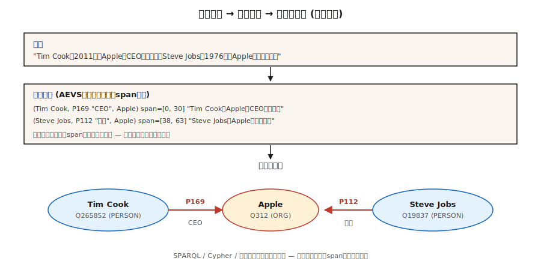

# 关系抽取与知识图谱构建（Relation Extraction & Knowledge Graph Construction）

> 译注：本文译自同目录 [`en.md`](./en.md)。术语遵循仓根 [TRANSLATION_GUIDE.md](../../../../TRANSLATION_GUIDE.md)。

> NER 找到了实体。Entity linking 把它们锚定到了知识库。关系抽取（relation extraction）则负责找出实体之间的边。一张知识图谱，等于节点、边和它们的来源（provenance）的总和。

**Type:** Build
**Languages:** Python
**Prerequisites:** Phase 5 · 06 (NER), Phase 5 · 25 (Entity Linking)
**Time:** ~60 minutes

## 问题（The Problem）

一位分析师读到这样一句话：「Tim Cook became CEO of Apple in 2011.」其中藏着四个事实：

- `(Tim Cook, role, CEO)`
- `(Tim Cook, employer, Apple)`
- `(Tim Cook, start_date, 2011)`
- `(Apple, type, Organization)`

关系抽取（Relation Extraction，RE）就是把自由文本变成结构化三元组 `(subject, relation, object)` 的过程。把整个语料里的三元组聚合起来，你就拿到了一张知识图谱；再加上查询能力，你就有了一个可以服务 RAG、分析、合规审计的推理底座。

2026 年的新麻烦：LLM 抽起关系来太热情了。热情到会编出原文根本不支持的三元组。没有 provenance，你就分不清哪些是真三元组、哪些是听起来像样的虚构。2026 年的答案是 AEVS 风格的「锚定–抽取–验证」流水线。

## 概念（The Concept）



**三元组形式。** `(subject_entity, relation_type, object_entity)`。关系要么来自一个封闭本体（Wikidata 属性、FIBO、UMLS），要么来自开放集合（OpenIE 风格，什么都行）。

**三种抽取路线。**

1. **基于规则 / 模式。** Hearst 模式：「X such as Y」 → `(Y, isA, X)`。再加上手写正则。脆弱、精准、可解释。
2. **有监督分类器。** 给定一句话里的两个实体提及，从一个固定集合里预测它们的关系。在 TACRED、ACE、KBP 上训练。2015–2022 的标准做法。
3. **生成式 LLM。** 直接 prompt 模型吐三元组。开箱即用。但需要 provenance，否则会一本正经地编出看起来很像样的垃圾。

**AEVS（Anchor-Extraction-Verification-Supplement，2026）。** 当下主流的幻觉（hallucination）抑制框架：

- **Anchor（锚定）。** 标出每个实体片段和关系短语片段的精确位置。
- **Extract（抽取）。** 生成与 anchor 片段挂钩的三元组。
- **Verify（验证）。** 把三元组的每个元素都对回原文；找不到依据的统统拒掉。
- **Supplement（补全）。** 一遍覆盖度检查，确保没有任何已锚定的片段被漏掉。

幻觉率会陡降。代价是更多算力，但全程可审计。

**开放 vs 封闭的取舍。**

- **封闭本体。** 固定的属性表（例如 Wikidata 的 11000+ 属性）。可预期、可查询、难以乱编。
- **Open IE。** 任何动词短语都能成为一个关系。recall 高，precision 低，查询起来很乱。

生产级知识图谱通常是混合做法：用 open IE 做发现，再把关系规范化（canonicalize）到一个封闭本体上，然后才合入主图。

## 动手实现（Build It）

### Step 1: pattern-based extraction

```python
PATTERNS = [
    (r"(?P<s>[A-Z]\w+) (?:is|was) (?:a|an|the) (?P<o>[A-Z]?\w+)", "isA"),
    (r"(?P<s>[A-Z]\w+) (?:is|was) born in (?P<o>\w+)", "bornIn"),
    (r"(?P<s>[A-Z]\w+) works? (?:at|for) (?P<o>[A-Z]\w+)", "worksAt"),
    (r"(?P<s>[A-Z]\w+) founded (?P<o>[A-Z]\w+)", "founded"),
]
```

完整玩具版抽取器见 `code/main.py`。Hearst 模式至今仍活跃在领域专属的流水线里，因为它好调试。

### Step 2: supervised relation classification

```python
from transformers import AutoTokenizer, AutoModelForSequenceClassification

tok = AutoTokenizer.from_pretrained("Babelscape/rebel-large")
model = AutoModelForSequenceClassification.from_pretrained("Babelscape/rebel-large")

text = "Tim Cook was born in Alabama. He later became CEO of Apple."
encoded = tok(text, return_tensors="pt", truncation=True)
output = model.generate(**encoded, max_length=200)
triples = tok.batch_decode(output, skip_special_tokens=False)
```

REBEL 是一个 seq2seq 关系抽取器：进文本，出三元组，关系直接是 Wikidata 的属性 id。它在远程监督（distant supervision）数据上微调（fine-tune）。是开放权重领域的标准基线。

### Step 3: LLM-prompted extraction with anchoring

```python
prompt = f"""Extract (subject, relation, object) triples from the text.
For each triple, include the exact character span in the source text.

Text: {text}

Output JSON:
[{{"subject": {{"text": "...", "span": [start, end]}},
   "relation": "...",
   "object": {{"text": "...", "span": [start, end]}}}}, ...]

Only include triples fully supported by the text. No inference beyond what is stated.
"""
```

把模型返回的每一个 span 都和原文比对一遍。只要 `text[start:end] != triple_entity`，就直接拒掉。这就是 AEVS 中「verify」环节最简版的实现。

### Step 4: canonicalize onto a closed ontology

```python
RELATION_MAP = {
    "is the CEO of": "P169",       # "chief executive officer"
    "was born in":   "P19",         # "place of birth"
    "founded":        "P112",       # "founded by" (inverted subject/object)
    "works at":       "P108",       # "employer"
}


def canonicalize(relation):
    rel_low = relation.lower().strip()
    if rel_low in RELATION_MAP:
        return RELATION_MAP[rel_low]
    return None   # drop unmapped open relations or route to manual review
```

规范化往往要花掉整个工程 60–80% 的工作量。预算上要留够。

### Step 5: build a small graph and query

```python
triples = extract(text)
graph = {}
for s, r, o in triples:
    graph.setdefault(s, []).append((r, o))


def neighbors(node, relation=None):
    return [(r, o) for r, o in graph.get(node, []) if relation is None or r == relation]


print(neighbors("Tim Cook", relation="P108"))    # -> [(P108, Apple)]
```

这就是任何 RAG-over-KG 系统的最小原子。要把它做大，可以接 RDF 三元组库（Blazegraph、Virtuoso）、属性图（Neo4j），或者向量增强的图存储。

## 坑（Pitfalls）

- **共指消解放在 RE 之前。** 「He founded Apple」 —— RE 得先知道「he」指谁。先跑 coref（第 24 课）。
- **实体规范化。** 「Apple Inc」 和 「Apple」 必须解析到同一个节点上。先做 entity linking（第 25 课）。
- **幻觉三元组。** LLM 会吐出原文不支持的三元组。强制做 span 验证。
- **关系规范化漂移。** Open IE 抽出的关系彼此不一致（「was born in」、「came from」、「is a native of」）。统统压到规范 id 上，否则图根本没法查。
- **时间错误。** 「Tim Cook is CEO of Apple」 —— 现在为真，2005 年为假。很多关系是有时间边界的。要用 qualifier（Wikidata 的 `P580` 起始时间、`P582` 终止时间）。
- **领域错配。** REBEL 是在维基百科上训练的。法律、医疗、科研文本往往需要做领域微调的 RE 模型。

## 用起来（Use It）

2026 的技术栈：

| 场景 | 选什么 |
|-----------|------|
| 通用领域、追求快上线 | REBEL 或 LlamaPred + Wikidata 规范化 |
| 领域专属（生物医学、法律） | SciREX 风格的领域微调 + 自定义本体 |
| LLM 抽取、要求可审计 | AEVS 流水线：anchor → extract → verify → supplement |
| 高吞吐新闻 IE | 模式 + 有监督的混合方案 |
| 从零搭一张 KG | Open IE + 人工规范化轮 |
| 时序 KG | 抽取时带上 qualifier（起止时间、时刻点） |

集成模式：NER → 共指消解 → entity linking → 关系抽取 → 本体映射 → 图加载。每一步都是潜在的质量闸门。

## 上线部署（Ship It）

存为 `outputs/skill-re-designer.md`：

```markdown
---
name: re-designer
description: Design a relation extraction pipeline with provenance and canonicalization.
version: 1.0.0
phase: 5
lesson: 26
tags: [nlp, relation-extraction, knowledge-graph]
---

Given a corpus (domain, language, volume) and downstream use (KG-RAG, analytics, compliance), output:

1. Extractor. Pattern-based / supervised / LLM / AEVS hybrid. Reason tied to precision vs recall target.
2. Ontology. Closed property list (Wikidata / domain) or open IE with canonicalization pass.
3. Provenance. Every triple carries source char-span + doc id. Non-negotiable for audit.
4. Merge strategy. Canonical entity id + relation id + temporal qualifiers; dedup policy.
5. Evaluation. Precision / recall on 200 hand-labelled triples + hallucination-rate on LLM-extracted sample.

Refuse any LLM-based RE pipeline without span verification (source provenance). Refuse open-IE output flowing into a production graph without canonicalization. Flag pipelines with no temporal qualifier on time-bounded relations (employer, spouse, position).
```

## 练习（Exercises）

1. **Easy.** 把 `code/main.py` 里的模式抽取器跑在 5 句新闻文本上。手工核对 precision。
2. **Medium.** 用 REBEL（或一个小 LLM）跑同一批句子。比一比三元组。哪种 precision 更高？哪种 recall 更高？
3. **Hard.** 搭一个 AEVS 流水线：用 LLM 抽取 + 对源文本做 span 验证。在 50 句维基百科风格的句子上度量验证步骤前后的 hallucination 率变化。

## 关键术语（Key Terms）

| 术语 | 大家嘴上说的 | 它实际是什么 |
|------|-----------------|-----------------------|
| Triple（三元组） | 主-谓-宾 | `(s, r, o)` 元组，KG 的原子单位。 |
| Open IE | 啥都能抽 | 开放词表的关系短语；recall 高、precision 低。 |
| Closed ontology（封闭本体） | 固定 schema | 关系类型有界集合（Wikidata、UMLS、FIBO）。 |
| Canonicalization（规范化） | 啥都归一 | 把字面名 / 关系映射到规范 id。 |
| AEVS | 有依据的抽取 | Anchor-Extraction-Verification-Supplement 流水线（2026）。 |
| Provenance（出处） | 真值溯源链接 | 每个三元组带上其来源的 doc id + 字符 span。 |
| Distant supervision（远程监督） | 廉价标签 | 把文本和已有 KG 对齐来造训练数据。 |

## 延伸阅读（Further Reading）

- [Mintz et al. (2009). Distant supervision for relation extraction without labeled data](https://www.aclweb.org/anthology/P09-1113.pdf) —— 远程监督的奠基论文。
- [Huguet Cabot, Navigli (2021). REBEL: Relation Extraction By End-to-end Language generation](https://aclanthology.org/2021.findings-emnlp.204.pdf) —— seq2seq RE 的主力选手。
- [Wadden et al. (2019). Entity, Relation, and Event Extraction with Contextualized Span Representations (DyGIE++)](https://arxiv.org/abs/1909.03546) —— 联合 IE。
- [AEVS — Anchor-Extraction-Verification-Supplement framework](https://www.mdpi.com/2073-431X/15/3/178) —— 2026 年的幻觉抑制设计。
- [Wikidata SPARQL tutorial](https://www.wikidata.org/wiki/Wikidata:SPARQL_tutorial) —— 规范化图查询入门。
