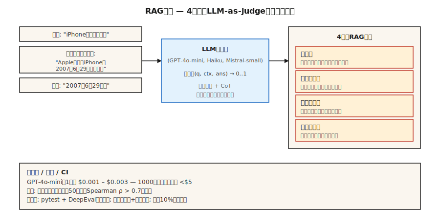

# Avaliação de LLMs — RAGAS, DeepEval, G-Eval

> Match exato e F1 perdem equivalência semântica. Revisão humana não escala. LLM-como-julgador é a resposta em produção — com calibração suficiente pra confiar no número.

**Tipo:** Construir
**Linguagens:** Python
**Pré-requisitos:** Fase 5 · 13 (Question-Answering), Fase 5 · 14 (Recuperação de Informação)
**Tempo:** ~75 minutos

## O Problema

Seu sistema RAG responde: "June 29th, 2007."
A referência dourada é: "June 29, 2007."
Match exato tira 0. F1 tira ~75%. Um humano daria 100%.

Agora multiplique por 10.000 casos de teste. Multiplique de novo por cada mudança no recuperador, chunking, prompt ou modelo. Você precisa de um avaliador que entende significado, roda barato em escala, não mente sobre regressões e mostra os modos de falha certos.

2026 tem três frameworks que dominam esse problema.

- **RAGAS.** Retrieval-Augmented Generation ASsessment. Quatro métricas de RAG (fidelidade, relevância da resposta, precisão do contexto, recall do contexto) com backends NLI + LLM-julgador. Respaldado por pesquisa, leve.
- **DeepEval.** Pytest pra LLMs. G-Eval, completude de tarefa, alucinação, métricas de viés. Nativo de CI/CD.
- **G-Eval.** Um método (e uma métrica do DeepEval): LLM-como-julgador com chain-of-thought, critérios customizados, pontuação 0-1.

Os três dependem de LLM-como-julgador. Essa lição constrói intuição pro método e pra camada de confiança ao redor.

## O Conceito



**LLM-como-julgador.** Substitua uma métrica estática por um LLM que pontua saídas dado um rúbrica. Dado `(consulta, context, answer)`, faça o julgador LLM: "Score 0-1 on faithfulness." Retorne a pontuação.

Por que funciona: LLMs aproximam julgamento humano numa fração mínima do custo. GPT-4o-mini a ~$0.003 por caso avaliado permite rodas de avaliação de regressão com 1000 amostras por menos de $5.

Por que falha silenciosamente:

1. **Viés do julgador.** Julgadores preferem respostas mais longas, respostas de sua própria família de modelo, respostas que combinam com o estilo do prompt.
2. **Falhas de parsing JSON.** JSON ruim → NaN → silenciosamente excluído da agregação. Usuários do RAGAS conhecem essa dor. Filtre com try/except + modo de falha explícito.
3. **Drift entre versões de modelo.** Atualizar o julgador muda todas as métricas. Congele modelo + versão do julgador.

**Os quatro do RAG.**

| Métrica | Pergunta | Backend |
|--------|----------|---------|
| Fidelidade | Cada afirmação da resposta vem do contexto recuperado? | Implicação baseada em NLI |
| Relevância da resposta | A resposta aborda a pergunta? | Gere perguntas hipotéticas da resposta; compare com a pergunta real |
| Precisão do contexto | Dos chunks recuperados, qual fração era relevante? | LLM-julgador |
| Recall do contexto | O retrieval retornou tudo que era necessário? | LLM-julgador contra resposta dourada |

**G-Eval.** Defina um critério customizado: "Did the answer cite the correct source?" O framework expande automaticamente em passos de avaliação com chain-of-thought, depois pontua 0-1. Bom pra dimensões de qualidade de domínio eespecificaçãoífico que o RAGAS não cobre.

**Calibração.** Nunca confie na pontuação bruta do julgador até ter uma correlação com rótulos humanos. Rode 100 exemplos anotados manualmente. Plote julgador vs humano. Calcule Spearman rho. Se rho < 0.7, sua rúbrica de julgador precisa de trabalho.

## Construindo

### Passo 1: fidelidade com NLI (estilo RAGAS)

```python
from typing import Callable
from transformers import pipeline

nli = pipeline("text-classification",
               model="MoritzLaurer/DeBERTa-v3-large-mnli-fever-anli-ling-wanli",
               top_k=None)

# `llm` é qualquer chamável: str de prompt -> str gerada.
# Exemplo: llm = lambda p: client.messages.create(model="claude-haiku-4-5", ...).content[0].text
LLM = Callable[[str], str]


def atomic_claims(answer: str, llm: LLM) -> list[str]:
    prompt = f"""Break this answer into simple factual claims (one per line):
{answer}
"""
    return llm(prompt).splitlines()


def faithfulness(answer: str, context: str, llm: LLM) -> float:
    claims = atomic_claims(answer, llm)
    if not claims:
        return 0.0
    supported = 0
    for claim in claims:
        result = nli({"text": context, "text_pair": claim})[0]
        entail = next((s for s in result if s["label"] == "entailment"), None)
        if entail and entail["score"] > 0.5:
            supported += 1
    return supported / len(claims)
```

Decomponha a resposta em afirmações atômicas. Verifique NLI cada afirmação contra o contexto recuperado. Fidelidade = fração suportada.

### Passo 2: relevância da resposta

```python
import numpy as np
from sentence_transformers import SentenceTransformer
# encoder: qualquer modelo implementando .encode(texts, normalize_embeddings=True) -> ndarray
# ex.: encoder = SentenceTransformer("BAAI/bge-small-en-v1.5")

def answer_relevance(question: str, answer: str, encoder, llm: LLM, n: int = 3) -> float:
    prompt = f"Write {n} questions this answer could be the answer to:\\n{answer}"
    generated = [line for line in llm(prompt).splitlines() if line.strip()][:n]
    if not generated:
        return 0.0
    q_emb = np.asarray(encoder.encode([question], normalize_embeddings=True)[0])
    g_embs = np.asarray(encoder.encode(generated, normalize_embeddings=True))
    sims = [float(q_emb @ g_emb) for g_emb in g_embs]
    return sum(sims) / len(sims)
```

Se a resposta implica perguntas diferentes da que foi feita, a relevância cai.

### Passo 3: métrica customizada G-Eval

```python
from deepeval.metrics import GEval
from deepeval.test_case import LLMTestCaseParams, LLMTestCase

metric = GEval(
    name="Correctness",
    criteria="The answer should be factually accurate and match the expected output.",
    evaluation_steps=[
        "Read the expected output.",
        "Read the actual output.",
        "List factual claims in the actual output.",
        "For each claim, mark supported or unsupported by the expected output.",
        "Return score = fraction supported.",
    ],
    evaluation_params=[LLMTestCaseParams.INPUT, LLMTestCaseParams.ACTUAL_OUTPUT, LLMTestCaseParams.EXPECTED_OUTPUT],
)

test = LLMTestCase(input="When was the first iPhone released?",
                   actual_output="June 29th, 2007.",
                   expected_output="June 29, 2007.")
metric.measure(test)
print(metric.score, metric.reason)
```

Os passos de avaliação são a rúbrica. Passos explícitos são mais estáveis que prompts implícitos de "pontue 0-1".

### Passo 4: gate de CI

```python
import deepeval
from deepeval.metrics import FaithfulnessMetric, ContextualRelevancyMetric


def test_rag_system():
    cases = load_regression_cases()
    faith = FaithfulnessMetric(threshold=0.85)
    rel = ContextualRelevancyMetric(threshold=0.7)
    for case in cases:
        faith.measure(case)
        assert faith.score >= 0.85, f"faithfulness regression on {case.id}"
        rel.measure(case)
        assert rel.score >= 0.7, f"relevancy regression on {case.id}"
```

Disponibilize como arquivo pytest. Rode em cada PR. Bloqueie merges em regressões.

### Passo 5: avaliação de brinquedo do zero

Veja `code/main.py`. Aproximações com stdlib apenas de fidelidade (sobreposição de afirmações da resposta com contexto) e relevância (sobreposição de tokens da resposta com tokens da pergunta). Não é produção. Mostra a forma.

## Armadilhas

- **Sem calibração.** Um julgador com 0.3 de correlação com rótulos humanos é ruído. Exija uma rodada de calibração antes de disponibilizar.
- **Auto-avaliação.** Usar o mesmo LLM pra gerar e julgar infla pontuações em 10-20%. Use uma família de modelo diferente pro julgador.
- **Viés posicional em julgamento pareado.** Julgadores preferem a primeira opção apresentada. Sempre randomize a ordem e rode as duas.
- **Agregação bruta esconde falhas.** Média de 0.85 frequentemente esconde 5% de falhas catastróficas. Sempre inespecificaçãoione o quantil inferior.
- **Deterioração do dataset dourado.** Conjuntos de avaliação sem versionamento que derivaam quebram comparação longitudinal. Rotule o dataset a cada mudança.
- **Custo de LLM.** Em escala, chamadas do julgador dominam o custo. Use o modelo mais barato que atinge o limiar de calibração. GPT-4o-mini, Claude Haiku, Mistral-small.

## Usar

A stack de 2026:

| Caso de uso | Framework |
|---------|-----------|
| Monitoramento de qualidade de RAG | RAGAS (4 métricas) |
| Gates de regressão CI/CD | DeepEval + pytest |
| Critérios customizados de domínio | G-Eval dentro do DeepEval |
| Monitoramento de tráfego ao vivo | RAGAS com modo sem referência |
| Verificações pontuais human-in-the-loop | LangSmith ou Phoenix com UI de anotação |
| Red-teaming / avaliação de segurança | Promptfoo + DeepEval |

Stack típica: RAGAS pra monitoramento, DeepEval pra CI, G-Eval pra dimensões novas. Rode os três; eles discordam de forma útil.

## Entregar

Salve como `outputs/skill-eval-architect.md`:

```markdown
---
name: eval-architect
description: Design an LLM evaluation plan with calibrated judge and CI gates.
version: 1.0.0
phase: 5
lesson: 27
tags: [nlp, evaluation, rag]
---

Given a use case (RAG / agente / generative task), output:

1. Metrics. Faithfulness / relevance / context-precision / context-recall + any custom G-Eval metrics with criteria.
2. Judge model. Named model + version, rationale for cost vs accuracy.
3. Calibration. Hand-labeled set size, target Spearman rho vs human > 0.7.
4. Dataset versioning. Tag strategy, change log, stratification.
5. CI gate. Thresholds per metric, regression-window logic, bottom-quantile alert.

Refuse to rely on a judge untested against ≥50 human-labeled examples. Refuse self-evaluation (same model generates + judges). Refuse aggregate-only reporting without bottom-10% surfacing. Flag any pipeline where judge upgrade lands without parallel baseline eval.
```

## Exercícios

1. **Fácil.** Use RAGAS em 10 exemplos de RAG com alucinações conhecidas. Verifique se a métrica de fidelidade pega cada uma.
2. **Médio.** Anote manualmente 50 respostas de QA de 0-1 pra correção. Pontue com G-Eval. Meça Spearman rho entre julgador e humano.
3. **Difícil.** Construa um gate CI com pytest e DeepEval. Regreda intencionalmente o recuperador. Verifique se o gate falha. Adicione alerta de quantil inferior via verificação de limiar nos 10% mais baixos.

## Termos Chave

| Termo | O que as pessoas dizem | O que significa de verdade |
|------|-----------------|-----------------------|
| LLM-como-julgador | Pontuação com LLM | Faça o modelo julgador pontuar saídas 0-1 dado uma rúbrica. |
| RAGAS | A biblioteca de métricas de RAG | Framework de avaliação open-source com 4 métricas de RAG sem referência. |
| Fidelidade | A resposta é fundamentada? | Fração de afirmações da resposta implicadas pelo contexto recuperado. |
| Precisão do contexto | Os chunks recuperados eram relevantes? | Fração dos chunks top-K que realmente importaram. |
| Recall do contexto | O retrieval encontrou tudo? | Fração das afirmações da resposta dourada suportadas por chunks recuperados. |
| G-Eval | Julgador LLM customizado | Rúbrica + passos de avaliação com chain-of-thought + pontuação 0-1. |
| Calibração | Confiar mas verificar | Correlação Spearman entre pontuação do julgador e pontuação humana. |

## Leitura Complementar

- [Es et al. (2023). RAGAS: Automated Evaluation of Retrieval Augmented Generation](https://arxiv.org/abs/2309.15217) — o paper do RAGAS.
- [Liu et al. (2023). G-Eval: NLG Evaluation using GPT-4 with Better Human Alignment](https://arxiv.org/abs/2303.16634) — o paper do G-Eval.
- [DeepEval docs](https://deepeval.com/docs/metrics-introduction) — stack de produção aberta.
- [Zheng et al. (2023). Judging LLM-as-a-Judge with MT-Bench and Chatbot Arena](https://arxiv.org/abs/2306.05685) — vieses, calibração, limites.
- [MLflow GenAI Scorer](https://mlflow.org/blog/third-party-scorers) — framework unificado que integra RAGAS, DeepEval, Phoenix.
