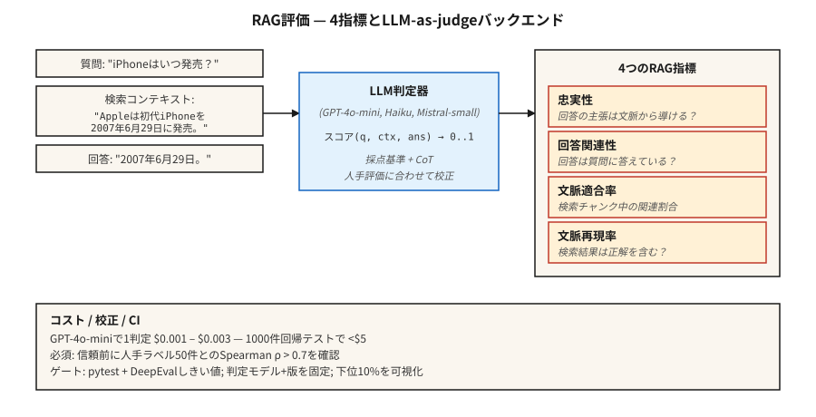

# LLM Evaluation — RAGAS, DeepEval, G-Eval (LLM 评估 — RAGAS、DeepEval、G-Eval)

> Exact-match and F1 miss semantic equivalence. Human review does not scale. LLM-as-judge is the production answer — with enough calibration to trust the number.
> 精确匹配和 F1 分数无法捕捉语义等价性。人工评审无法规模化。LLM 作为评判者（LLM-as-judge）是生产环境的答案——配合充分的校准，才能信任那个数字。

**类型：** Build（构建）
**语言：** Python
**先修课程：** 阶段5 · 13（问答系统）、阶段5 · 14（信息检索）
**时长：** 约 75 分钟

## The Problem（问题）

你的 RAG 系统回答："June 29th, 2007。"
标准答案是："June 29, 2007。"
精确匹配（Exact Match）得分为 0。F1 得分约 75%。人类会给出 100%。

现在把这个数字乘以 10,000 个测试用例。再乘以对检索器、分块策略、提示词或模型的每一次改动。你需要一个评估器，它能理解语义，能以低成本大规模运行，不会在回归问题上撒谎，并能暴露出正确的失败模式。

2026 年，有三个框架主宰了这个问题。

- **RAGAS.** Retrieval-Augmented Generation Assessment（检索增强生成评估）。四个 RAG 指标（忠实度、答案相关性、上下文精确度、上下文召回率），后端基于 NLI + LLM 评判。有研究支撑，轻量级。
- **DeepEval.** 面向 LLM 的 Pytest。G-Eval、任务完成度、幻觉、偏见等指标。原生支持 CI/CD。
- **G-Eval.** 一种方法（也是 DeepEval 的一个指标）：LLM 作为评判者，结合思维链（Chain-of-Thought）、自定义标准，输出 0-1 分数。

三者都依赖 LLM-as-judge。本节课旨在建立对该方法及其信任层的直觉理解。

## The Concept（核心概念）



**LLM-as-judge（LLM 作为评判者）。** 用 LLM 替代静态指标，根据评分标准对输出打分。给定 `(问题, 上下文, 答案)`，向评判 LLM 发出提示："在忠实度上给出 0-1 的分数。" 返回分数。

为什么有效：LLM 能以极低的成本近似人类判断。GPT-4o-mini 每次评分约 $0.003，1000 个样本的回归评估成本不到 $5 美元。

为什么会无声地失败：

1. **评判者偏见。** 评判者偏好更长的答案、来自同模型家族的答案、以及符合其提示风格的答案。
2. **JSON 解析失败。** 格式错误的 JSON → NaN 分数 → 被静默地从聚合结果中排除。RAGAS 用户深有体会。用 try/except 加显式失败模式来防护。
3. **模型版本漂移。** 升级评判模型会改变每一个指标。请冻结评判模型的型号和版本。

**RAG 四大指标。**

| 指标 | 问题 | 后端 |
|--------|----------|---------|
| Faithfulness（忠实度） | 答案中的每个陈述是否都来自检索到的上下文？ | 基于 NLI 的蕴涵判断 |
| Answer relevance（答案相关性） | 答案是否回应了问题？ | 从答案生成假设性问题，与真实问题比较 |
| Context precision（上下文精确度） | 检索到的分块中，有多大比例是相关的？ | LLM 评判 |
| Context recall（上下文召回率） | 检索是否返回了所有需要的信息？ | LLM 评判，对照标准答案 |

**G-Eval。** 定义一个自定义标准："答案是否引用了正确的来源？"框架会自动将其扩展为思维链评估步骤，然后给出 0-1 分。适用于 RAGAS 未覆盖的领域特定质量维度。

**校准（Calibration）。** 在未验证评判者分数与人工标注的相关性之前，永远不要信任原始评判分数。准备 100 个人工标注的样本。绘制评判者分数 vs. 人工分数的图表。计算斯皮尔曼秩相关系数（Spearman rho）。如果 rho < 0.7，你的评判标准需要改进。

## Build It（动手实现）

### Step 1: faithfulness with NLI, RAGAS-style（步骤 1：基于 NLI 的忠实度评估，RAGAS 风格）

```python
from typing import Callable
from transformers import pipeline

nli = pipeline("text-classification",
               model="MoritzLaurer/DeBERTa-v3-large-mnli-fever-anli-ling-wanli",
               top_k=None)

# `llm` is any callable: prompt str -> generated str.
# Example: llm = lambda p: client.messages.create(model="claude-haiku-4-5", ...).content[0].text
LLM = Callable[[str], str]


def atomic_claims(answer: str, llm: LLM) -> list[str]:
    prompt = f"""Break this answer into simple factual claims (one per line):
{answer}
"""
    return llm(prompt).splitlines()


def faithfulness(answer: str, context: str, llm: LLM) -> float:
    claims = atomic_claims(answer, llm)
    if not claims:
        return 0.0
    supported = 0
    for claim in claims:
        result = nli({"text": context, "text_pair": claim})[0]
        entail = next((s for s in result if s["label"] == "entailment"), None)
        if entail and entail["score"] > 0.5:
            supported += 1
    return supported / len(claims)
```

将答案分解为原子化陈述。对每个陈述与检索到的上下文进行 NLI 蕴涵检查。忠实度 = 被支持的陈述比例。

### Step 2: answer relevance（步骤 2：答案相关性）

```python
import numpy as np
from sentence_transformers import SentenceTransformer

# encoder: any model implementing .encode(texts, normalize_embeddings=True) -> ndarray
# e.g., encoder = SentenceTransformer("BAAI/bge-small-en-v1.5")

def answer_relevance(question: str, answer: str, encoder, llm: LLM, n: int = 3) -> float:
    prompt = f"Write {n} questions this answer could be the answer to:\n{answer}"
    generated = [line for line in llm(prompt).splitlines() if line.strip()][:n]
    if not generated:
        return 0.0
    q_emb = np.asarray(encoder.encode([question], normalize_embeddings=True)[0])
    g_embs = np.asarray(encoder.encode(generated, normalize_embeddings=True))
    sims = [float(q_emb @ g_emb) for g_emb in g_embs]
    return sum(sims) / len(sims)
```

如果答案暗示的是与所提问题不同的问题，则相关性下降。

### Step 3: G-Eval custom metric（步骤 3：G-Eval 自定义指标）

```python
from deepeval.metrics import GEval
from deepeval.test_case import LLMTestCaseParams, LLMTestCase

metric = GEval(
    name="Correctness",
    criteria="The answer should be factually accurate and match the expected output.",
    evaluation_steps=[
        "Read the expected output.",
        "Read the actual output.",
        "List factual claims in the actual output.",
        "For each claim, mark supported or unsupported by the expected output.",
        "Return score = fraction supported.",
    ],
    evaluation_params=[LLMTestCaseParams.INPUT, LLMTestCaseParams.ACTUAL_OUTPUT, LLMTestCaseParams.EXPECTED_OUTPUT],
)

test = LLMTestCase(input="When was the first iPhone released?",
                   actual_output="June 29th, 2007.",
                   expected_output="June 29, 2007.")
metric.measure(test)
print(metric.score, metric.reason)
```

评估步骤就是评分标准。显式的步骤比隐式的"给出 0-1 分"提示更加稳定。

### Step 4: CI gate（步骤 4：CI 门控）

```python
import deepeval
from deepeval.metrics import FaithfulnessMetric, ContextualRelevancyMetric


def test_rag_system():
    cases = load_regression_cases()
    faith = FaithfulnessMetric(threshold=0.85)
    rel = ContextualRelevancyMetric(threshold=0.7)
    for case in cases:
        faith.measure(case)
        assert faith.score >= 0.85, f"faithfulness regression on {case.id}"
        rel.measure(case)
        assert rel.score >= 0.7, f"relevancy regression on {case.id}"
```

以 pytest 文件的形式提交。在每个 PR 上运行。在回归问题上阻止合并。

### Step 5: toy eval from scratch（步骤 5：从零开始的玩具评估）

参见 `code/main.py`。仅使用标准库实现了忠实度（答案陈述与上下文的重叠）和相关性（答案令牌与问题令牌的重叠）的近似版本。不适用于生产环境。仅展示基本形态。

## Pitfalls（常见陷阱）

- **未做校准。** 评判者与人工标签相关性仅为 0.3 时，其输出就是噪声。要求在部署前完成一次校准运行。
- **自我评估。** 使用同一个 LLM 既生成又评估，会使分数虚高 10-20%。应为评判者使用不同的模型家族。
- **成对评判中的位置偏差。** 评判者倾向于选择第一个呈现的选项。务必随机化顺序并运行两次。
- **原始聚合值掩盖失败。** 平均分 0.85 往往掩盖了 5% 的灾难性失败。始终检查底部百分位数。
- **黄金数据集腐烂。** 未做版本管理的评估集随时间漂移，会破坏纵向比较。每次变更都要给数据集打标签。
- **LLM 成本。** 大规模使用时，评判者调用将主导成本。使用满足校准阈值的最便宜模型：GPT-4o-mini、Claude Haiku、Mistral-small。

## Use It（使用方式）

2026 年的技术栈：

| 使用场景 | 框架 |
|---------|-----------|
| RAG 质量监控 | RAGAS（4 个指标） |
| CI/CD 回归门控 | DeepEval + pytest |
| 自定义领域标准 | DeepEval 中的 G-Eval |
| 在线实时流量监控 | RAGAS 无参考模式 |
| 人在回路中抽检 | LangSmith 或 Phoenix，带标注 UI |
| 红队测试 / 安全评估 | Promptfoo + DeepEval |

典型技术栈：RAGAS 用于监控，DeepEval 用于 CI，G-Eval 用于新的评估维度。三者都运行；它们之间的不一致本身就有价值。

## Ship It（产出交付）

保存为 `outputs/skill-eval-architect.md`：

```markdown
---
name: eval-architect
description: Design an LLM evaluation plan with calibrated judge and CI gates.
version: 1.0.0
phase: 5
lesson: 27
tags: [nlp, evaluation, rag]
---

Given a use case (RAG / agent / generative task), output:

1. Metrics. Faithfulness / relevance / context-precision / context-recall + any custom G-Eval metrics with criteria.
2. Judge model. Named model + version, rationale for cost vs accuracy.
3. Calibration. Hand-labeled set size, target Spearman rho vs human > 0.7.
4. Dataset versioning. Tag strategy, change log, stratification.
5. CI gate. Thresholds per metric, regression-window logic, bottom-quantile alert.

Refuse to rely on a judge untested against ≥50 human-labeled examples. Refuse self-evaluation (same model generates + judges). Refuse aggregate-only reporting without bottom-10% surfacing. Flag any pipeline where judge upgrade lands without parallel baseline eval.
```

## Exercises（练习）

1. **简单。** 使用 RAGAS 对 10 个包含已知幻觉的 RAG 示例进行评估。验证忠实度指标能捕捉到每一个。
2. **中等。** 人工标注 50 个 QA 答案的正确性（0-1 分）。使用 G-Eval 评分。计算评判者与人工之间的斯皮尔曼秩相关系数。
3. **困难。** 使用 DeepEval 构建一个 pytest CI 门控。有意退化检索器。验证门控生效。添加底部百分位数告警——检查最低 10% 的阈值是否达标。

## Key Terms（关键术语）

| 术语 | 通常的含义 | 实际含义 |
|------|-----------------|-----------------------|
| LLM-as-judge（LLM 作为评判者） | 用 LLM 进行评分 | 用评判模型根据评分标准对输出打分 0-1。 |
| RAGAS | RAG 指标库 | 开源评估框架，包含 4 个无需参考的 RAG 指标。 |
| Faithfulness（忠实度） | 答案是否有据可依？ | 答案陈述中被检索上下文蕴含的比例。 |
| Context precision（上下文精确度） | 检索到的分块是否相关？ | 前 K 个分块中真正有用的比例。 |
| Context recall（上下文召回率） | 检索是否找到了所有内容？ | 标准答案的陈述中被检索分块支持的比例。 |
| G-Eval | 自定义 LLM 评判 | 评分标准 + 思维链评估步骤 + 0-1 分数。 |
| Calibration（校准） | 信任但验证 | 评判者分数与人工分数之间的斯皮尔曼相关性。 |

## Further Reading（延伸阅读）

- [Es et al. (2023). RAGAS: Automated Evaluation of Retrieval Augmented Generation](https://arxiv.org/abs/2309.15217) — RAGAS 论文。
- [Liu et al. (2023). G-Eval: NLG Evaluation using GPT-4 with Better Human Alignment](https://arxiv.org/abs/2303.16634) — G-Eval 论文。
- [DeepEval docs](https://deepeval.com/docs/metrics-introduction) — 开源生产技术栈。
- [Zheng et al. (2023). Judging LLM-as-a-Judge with MT-Bench and Chatbot Arena](https://arxiv.org/abs/2306.05685) — 偏见、校准、局限。
- [MLflow GenAI Scorer](https://mlflow.org/blog/third-party-scorers) — 统一框架，集成了 RAGAS、DeepEval、Phoenix。
