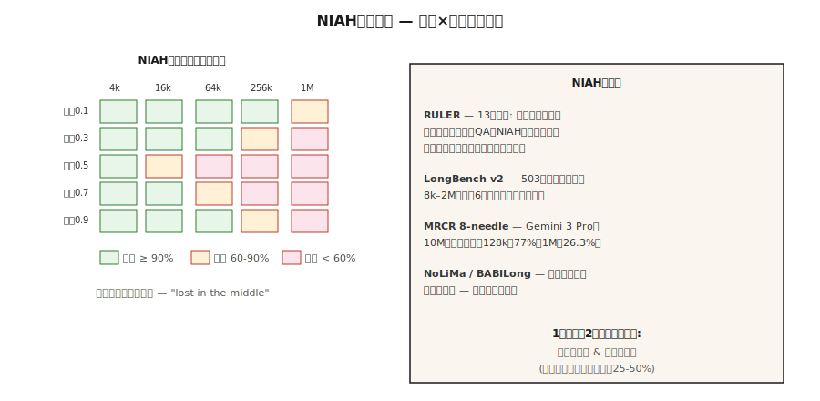

# 长上下文评估 —— NIAH、RULER、LongBench、MRCR

> 译注：本文译自同目录 [`en.md`](./en.md)。术语遵循仓根 [TRANSLATION_GUIDE.md](../../../../TRANSLATION_GUIDE.md)。

> Gemini 3 Pro 宣传 10M token 的 context（上下文）。但在 1M token 时，8-needle MRCR 直接掉到 26.3%。**宣传容量 ≠ 可用容量**。长上下文评估告诉你：你正要上线的那个模型，**实际能用多长**。

**Type:** Learn
**Languages:** Python
**Prerequisites:** Phase 5 · 13 (Question Answering), Phase 5 · 23 (Chunking Strategies)
**Time:** ~60 minutes

## 问题（The Problem）

你手上有一份 200 页的合同。模型号称 1M token 的 context。你把整份合同贴进去，然后问：「终止条款是什么？」模型给了答案——但它答的是封面页的内容，因为真正的终止条款埋在 120k token 深处，已经超出了模型实际能 attend（注意）到的范围。

这就是 2026 年的 **context 容量鸿沟**。规格表写着 1M 或 10M。现实是：能用的只有 60-70%，而且「能用」还要看具体任务。

- **Retrieval（单 needle 大海捞针）：** 在前沿模型上几乎能做到接近完美，直至宣传的最大长度。
- **多跳 / 聚合：** 大多数模型在约 128k 之后急剧退化。
- **对分散事实的推理：** 第一个崩掉的任务类型。

长上下文评估就是要量化这些维度。本课会列出主流基准（benchmark）、各自实际测的是什么，以及如何为你的领域搭建自定义 needle 测试。

## 概念（The Concept）



**Needle-in-a-Haystack（NIAH，2023）。** 在长 context 的某个受控深度埋一个事实（比如「the magic word is pineapple」），然后让模型把它捞出来。扫一遍「深度 × 长度」组合。这是最早的长上下文基准。前沿模型现在已经把它打满了；它是必要的、但远远不够的基线。

**RULER（Nvidia，2024）。** 4 大类共 13 种任务：retrieval（单键 / 多键 / 多值）、多跳追溯（变量追踪）、聚合（高频词统计）、QA。Context 长度可配（4k 到 128k+）。它能揭示出那些「打满 NIAH 但多跳直接崩」的模型。在 2024 年发布时，17 个号称支持 32k+ context 的模型里，**只有一半**能在 32k 上保持质量。

**LongBench v2（2024）。** 503 道选择题，context 8k-2M 词，6 大任务类别：单文档 QA、多文档 QA、long in-context learning、长对话、代码仓库、长结构化数据。**面向真实世界长上下文行为的生产级基准。**

**MRCR（Multi-Round Coreference Resolution，多轮指代消解）。** 大规模多轮指代。有 8-needle、24-needle、100-needle 几种变体。直接暴露出模型在 attention 退化前能同时 juggle（兼顾）多少个事实。

**NoLiMa。** 「非词法 needle」。needle 和 query 没有任何字面重叠；retrieval 必须经过一步语义推理。比 NIAH 难。

**HELMET。** 把许多文档拼接起来，再针对其中任意一篇提问。考的是**选择性 attention**。

**BABILong。** 把 bAbI 推理链嵌入到无关的 haystack 里。考的是「haystack 里的推理」，而不只是 retrieval。

### 实际应该上报哪些数

- **Advertised context window（宣传的 context 窗口）。** 规格表上的那个数字。
- **Effective retrieval length（有效检索长度）。** 在某个阈值（比如 90%）下还能通过的 NIAH 长度。
- **Effective reasoning length（有效推理长度）。** 在该阈值下还能通过多跳或聚合任务的长度。
- **Degradation curve（退化曲线）。** 准确率 vs context 长度，按任务类型分别画出。

写进规格表的两个数：**retrieval-effective** 和 **reasoning-effective**。通常 reasoning-effective 只有宣传窗口的 25-50%。

## 动手实现（Build It）

### Step 1：为你的领域定制一个 NIAH

参考 `code/main.py`。骨架如下：

```python
def build_haystack(filler_text, needle, depth_ratio, total_tokens):
    if not (0.0 <= depth_ratio <= 1.0):
        raise ValueError(f"depth_ratio must be in [0, 1], got {depth_ratio}")
    if total_tokens <= 0:
        raise ValueError(f"total_tokens must be positive, got {total_tokens}")

    filler_tokens = tokenize(filler_text)
    needle_tokens = tokenize(needle)
    if not filler_tokens:
        raise ValueError("filler_text produced no tokens")

    # Repeat filler until long enough to fill the haystack body.
    body_len = max(total_tokens - len(needle_tokens), 0)
    while len(filler_tokens) < body_len:
        filler_tokens = filler_tokens + filler_tokens
    filler_tokens = filler_tokens[:body_len]

    insert_at = min(int(body_len * depth_ratio), body_len)
    haystack = filler_tokens[:insert_at] + needle_tokens + filler_tokens[insert_at:]
    return " ".join(haystack)


def score_niah(model, haystack, question, expected):
    answer = model.complete(f"Context: {haystack}\nQ: {question}\nA:", max_tokens=50)
    return 1 if expected.lower() in answer.lower() else 0
```

扫 `depth_ratio` ∈ {0, 0.25, 0.5, 0.75, 1.0} × `total_tokens` ∈ {1k, 4k, 16k, 64k}。画出热力图。这就是你这个目标模型的 NIAH 卡片。

### Step 2：多 needle 变体

```python
def build_multi_needle(filler, needles, total_tokens):
    depths = [0.1, 0.4, 0.7]
    chunks = [filler[:int(total_tokens * 0.1)]]
    for depth, needle in zip(depths, needles):
        chunks.append(needle)
        next_chunk = filler[int(total_tokens * depth): int(total_tokens * (depth + 0.3))]
        chunks.append(next_chunk)
    return " ".join(chunks)
```

像「三个魔法词分别是什么？」这种问题，需要把三个 needle 全找出来。**单 needle 通过并不能预测多 needle 通过。**

### Step 3：多跳变量追溯（RULER 风格）

```python
haystack = """X1 = 42. ... (filler) ... X2 = X1 + 10. ... (filler) ... X3 = X2 * 2."""
question = "What is X3?"
```

答案需要把三个赋值串起来。前沿模型在 128k 上常常掉到 50-70% 的准确率。

### Step 4：在你的栈上跑 LongBench v2

```python
from datasets import load_dataset
longbench = load_dataset("THUDM/LongBench-v2")

def eval_model_on_longbench(model, subset="single-doc-qa"):
    tasks = [x for x in longbench["test"] if x["task"] == subset]
    correct = 0
    for x in tasks:
        answer = model.complete(x["context"] + "\n\nQ: " + x["question"], max_tokens=20)
        if normalize(answer) == normalize(x["answer"]):
            correct += 1
    return correct / len(tasks)
```

**按类别分别报准确率。** 聚合分数会掩盖任务级的巨大差异。

## 常见坑（Pitfalls）

- **只跑 NIAH。** 在 1M token 上通过 NIAH 完全不能说明多跳能力。一定要跑 RULER 或自定义多跳测试。
- **深度采样过于均匀。** 很多实现只测 depth=0.5。一定要测 depth=0、0.25、0.5、0.75、1.0——「lost in the middle（中段失忆）」效应是真实存在的。
- **Needle 和 filler 有词法重叠。** 如果 needle 跟 filler 共享关键词，retrieval 就退化成关键字匹配了。改用 NoLiMa 风格的无重叠 needle。
- **忽略延迟。** 1M-token 的 prompt prefill 需要 30-120 秒。**测准确率的同时一定要测 time-to-first-token（首 token 延迟）。**
- **厂商自报数据。** OpenAI、Google、Anthropic 都会发自家分数。永远要在自己的用例上独立复跑。

## 用起来（Use It）

2026 年的标准栈：

| 场景 | 基准 |
|-----------|-----------|
| 快速 sanity check | 自定义 NIAH，3 个深度 × 3 个长度 |
| 生产模型选型 | 在你的目标长度上跑 RULER（13 个任务） |
| 真实世界 QA 质量 | LongBench v2 的 single-doc-QA 子集 |
| 多跳推理 | BABILong 或自定义变量追踪 |
| 对话场景 | 在你的目标长度上跑 MRCR 8-needle |
| 模型升级回归 | 固定的内部 NIAH + RULER 套件，每次新模型上来都跑一遍 |

生产经验法则：**在没有跑过「NIAH + 一个推理任务」之前，永远不要相信 context 窗口的标称值。**

## 上线部署（Ship It）

存为 `outputs/skill-long-context-eval.md`：

```markdown
---
name: long-context-eval
description: Design a long-context evaluation battery for a given model and use case.
version: 1.0.0
phase: 5
lesson: 28
tags: [nlp, long-context, evaluation]
---

Given a target model, target context length, and use case, output:

1. Tests. NIAH depth × length grid; RULER multi-hop; custom domain task.
2. Sampling. Depths 0, 0.25, 0.5, 0.75, 1.0 at each length.
3. Metrics. Retrieval pass rate; reasoning pass rate; time-to-first-token; cost-per-query.
4. Cutoff. Effective retrieval length (90% pass) and effective reasoning length (70% pass). Report both.
5. Regression. Fixed harness, rerun on every model upgrade, surface deltas.

Refuse to trust a context window from the model card alone. Refuse NIAH-only evaluation for any multi-hop workload. Refuse vendor self-reported long-context scores as independent evidence.
```

## 练习（Exercises）

1. **简单。** 搭一个 NIAH，3 个深度（0.25、0.5、0.75）× 3 个长度（1k、4k、16k）。在任意模型上跑一遍。把通过率画成 3×3 热力图。
2. **中等。** 加一个 3-needle 变体。测量在每个长度下「三个 needle 全部命中」的比例。和同长度的单 needle 通过率对比。
3. **困难。** 构造一个变量追溯任务（X1 → X2 → X3，3 跳），嵌进 64k 的 filler 里。在 3 个前沿模型上测准确率。报告每个模型的有效推理长度。

## 关键术语（Key Terms）

| 术语 | 大家的口头说法 | 实际含义 |
|------|-----------------|-----------------------|
| NIAH | 大海捞针 | 在 filler 里埋一个事实，让模型捞出来。 |
| RULER | 加强版 NIAH | 4 类共 13 种任务：retrieval / 多跳 / 聚合 / QA。 |
| Effective context | 真正的容量 | 在该长度下准确率仍能保持在阈值之上。 |
| Lost in the middle | 深度偏差 | 模型对长输入「中段」的内容 attend 不足。 |
| Multi-needle | 一次多个事实 | 同时埋多个 needle；考的是 attention 兼顾能力，而不只是 retrieval。 |
| MRCR | 多轮指代 | 8、24、100-needle 指代消解；暴露 attention 饱和点。 |
| NoLiMa | 非词法 needle | needle 与 query 无字面 token 重叠；必须靠推理。 |

## 延伸阅读（Further Reading）

- [Kamradt (2023). Needle in a Haystack analysis](https://github.com/gkamradt/LLMTest_NeedleInAHaystack) — 最初的 NIAH 仓库。
- [Hsieh et al. (2024). RULER: What's the Real Context Size of Your Long-Context LMs?](https://arxiv.org/abs/2404.06654) — 多任务基准。
- [Bai et al. (2024). LongBench v2](https://arxiv.org/abs/2412.15204) — 真实世界长上下文评估。
- [Modarressi et al. (2024). NoLiMa: Non-lexical needles](https://arxiv.org/abs/2404.06666) — 更难的 needle。
- [Kuratov et al. (2024). BABILong](https://arxiv.org/abs/2406.10149) — haystack 中的推理。
- [Liu et al. (2024). Lost in the Middle: How Language Models Use Long Contexts](https://arxiv.org/abs/2307.03172) — 深度偏差那篇论文。
