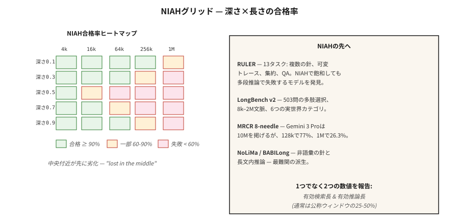

# Long-Context Evaluation — NIAH, RULER, LongBench, MRCR（长上下文评估）

> Gemini 3 Pro 号称支持 1000 万 token 的上下文。但在 100 万 token 时，8-needle MRCR 跌至 26.3%。号称 ≠ 可用。长上下文评估告诉你实际发货的模型到底有多大容量。

**类型：** 学习（Learn）
**语言：** Python
**前置要求：** 阶段 5 · 13（问答系统）、阶段 5 · 23（分块策略）
**预计时间：** ~60 分钟

## 问题（The Problem）

你手中有一份 200 页的合同。模型号称拥有 100 万 token 的上下文窗口。你将合同粘贴进去，问："终止条款是什么？"模型回答了——但答案来自封面页，因为终止条款位于 12 万 token 深处，超出了模型实际能注意到的范围。

这就是 2026 年的上下文容量差距。规格表上写着 100 万或 1000 万，而实际可用的只有 60-70%，并且"可用"还取决于具体任务。

- **检索（单针找草）：** 前沿模型在标称最大值附近几乎完美。
- **多跳 / 聚合：** 大多数模型在超过 ~12.8 万 token 后急剧下降。
- **分散事实推理：** 最先失败的任务。

长上下文评估衡量这些维度。本节课介绍各基准测试的名称、它们实际衡量的内容，以及如何为你的领域构建自定义 needle 测试。

## 核心概念（The Concept）



**大海捞针（Needle-in-a-Haystack，NIAH，2023 年）。** 将一个事实（"魔法词是 pineapple"）放置在长上下文中的某个受控深度，要求模型将其检索出来。遍历深度 × 长度。这是最早的长上下文基准。前沿模型现在已能在此测试上饱和；它是必要但不充分的基准。

**RULER（英伟达，2024 年）。** 涵盖 4 个大类共 13 种任务类型：检索（单键 / 多键 / 多值）、多跳追踪（变量追踪）、聚合（常见词频统计）、问答。可配置上下文长度（4k 到 128k+）。揭示了那些在 NIAH 上表现饱和但在多跳任务上失败的模型。在 2024 年的发布中，17 个声称支持 32k+ 上下文的模型中只有一半在 32k 长度上保持了质量。

**LongBench v2（2024 年）。** 503 道多选题，上下文长度为 8000 到 200 万词，涵盖六个任务类别：单文档问答、多文档问答、长上下文学习、长对话、代码仓库、长结构化数据。这是面向真实世界长上下文行为的生产级基准。

**MRCR（Multi-Round Coreference Resolution，多轮指代消解）。** 大规模多轮指代消解。有 8-needle、24-needle、100-needle 变体。揭示模型在注意力衰减前能同时处理多少个事实。

**NoLiMa（"Non-lexical needle"）。** 针（needle）和查询之间没有字面重叠；检索需要一步语义推理。比 NIAH 更难。

**HELMET。** 拼接多个文档，然后针对其中任意一个文档提出问题。测试选择性注意力。

**BABILong。** 将 bAbI 推理链嵌入不相关的干扰文本中。测试的是"在干草堆中推理"，而不仅仅是检索。

### 实际应报告的内容（What to actually report）

- **标称上下文窗口（Advertised context window）。** 规格表上的数字。
- **有效检索长度（Effective retrieval length）。** 在某个阈值（如 90%）下 NIAH 通过的长度。
- **有效推理长度（Effective reasoning length）。** 在该阈值下多跳或聚合任务通过的长度。
- **衰减曲线（Degradation curve）。** 按任务类型绘制的准确率 vs 上下文长度曲线。

为你的规格表准备两个数字：有效检索长度和有效推理长度。通常有效推理长度是标称窗口的 25-50%。

## 动手实现（Build It）

### 步骤 1：为你的领域构建自定义 NIAH（Step 1: a custom NIAH for your domain）

详见 `code/main.py`。框架如下：

```python
def build_haystack(filler_text, needle, depth_ratio, total_tokens):
    if not (0.0 <= depth_ratio <= 1.0):
        raise ValueError(f"depth_ratio must be in [0, 1], got {depth_ratio}")
    if total_tokens <= 0:
        raise ValueError(f"total_tokens must be positive, got {total_tokens}")

    filler_tokens = tokenize(filler_text)
    needle_tokens = tokenize(needle)
    if not filler_tokens:
        raise ValueError("filler_text produced no tokens")

    # Repeat filler until long enough to fill the haystack body.
    body_len = max(total_tokens - len(needle_tokens), 0)
    while len(filler_tokens) < body_len:
        filler_tokens = filler_tokens + filler_tokens
    filler_tokens = filler_tokens[:body_len]

    insert_at = min(int(body_len * depth_ratio), body_len)
    haystack = filler_tokens[:insert_at] + needle_tokens + filler_tokens[insert_at:]
    return " ".join(haystack)


def score_niah(model, haystack, question, expected):
    answer = model.complete(f"Context: {haystack}\nQ: {question}\nA:", max_tokens=50)
    return 1 if expected.lower() in answer.lower() else 0
```

遍历 `depth_ratio` ∈ {0, 0.25, 0.5, 0.75, 1.0} × `total_tokens` ∈ {1k, 4k, 16k, 64k}，绘制热力图。这就是目标模型的 NIAH 卡片。

### 步骤 2：多针变体（Step 2: a multi-needle variant）

```python
def build_multi_needle(filler, needles, total_tokens):
    depths = [0.1, 0.4, 0.7]
    chunks = [filler[:int(total_tokens * 0.1)]]
    for depth, needle in zip(depths, needles):
        chunks.append(needle)
        next_chunk = filler[int(total_tokens * depth): int(total_tokens * (depth + 0.3))]
        chunks.append(next_chunk)
    return " ".join(chunks)
```

像"三个魔法词分别是什么？"这样的问题需要检索全部三个事实。单针成功并不能预测多针成功。

### 步骤 3：多跳变量追踪（RULER 风格）（Step 3: multi-hop variable tracing, RULER-style）

```python
haystack = """X1 = 42. ... (filler) ... X2 = X1 + 10. ... (filler) ... X3 = X2 * 2."""
question = "What is X3?"
```

答案需要串联三个赋值操作。前沿模型在 12.8 万 token 处准确率通常会下降到 50-70%。

### 步骤 4：在你的栈上运行 LongBench v2（Step 4: LongBench v2 on your stack）

```python
from datasets import load_dataset
longbench = load_dataset("THUDM/LongBench-v2")

def eval_model_on_longbench(model, subset="single-doc-qa"):
    tasks = [x for x in longbench["test"] if x["task"] == subset]
    correct = 0
    for x in tasks:
        answer = model.complete(x["context"] + "\n\nQ: " + x["question"], max_tokens=20)
        if normalize(answer) == normalize(x["answer"]):
            correct += 1
    return correct / len(tasks)
```

按类别报告准确率。汇总分数会掩盖任务级别上的巨大差异。

## 常见陷阱（Pitfalls）

- **仅做 NIAH 评估。** 在 100 万 token 上通过 NIAH 并不能说明多跳能力。务必同时运行 RULER 或自定义多跳测试。
- **均匀深度采样。** 许多实现只测试 depth=0.5。应测试 depth=0、0.25、0.5、0.75、1.0——"中间丢失"效应真实存在。
- **与填充文本存在字面重叠。** 如果 needle 与填充文本共享关键词，检索就变得过于简单。应使用 NoLiMa 风格的无重叠 needle。
- **忽略延迟。** 100 万 token 的提示需要 30-120 秒进行预填充。在衡量准确率的同时也要测量首个 token 的生成时间。
- **供应商自报数据。** OpenAI、Google、Anthropic 都会公布自己的分数。务必基于你的使用场景独立复现测试。

## 实际应用（Use It）

2026 年的推荐方案：

| 场景 | 基准测试 |
|--------|-----------|
| 快速健康检查 | 自定义 NIAH，3 种深度 × 3 种长度 |
| 生产用模型选择 | 在目标长度上运行 RULER（13 项任务） |
| 真实世界问答质量 | LongBench v2 单文档问答子集 |
| 多跳推理 | BABILong 或自定义变量追踪 |
| 对话 / 多轮对话 | 在目标长度上运行 MRCR 8-needle |
| 模型升级回归测试 | 固定内部 NIAH + RULER 测试框架，每个新模型都运行 |

生产环境经验法则：在你用 NIAH + 至少一项推理任务验证目标长度之前，永远不要相信任何上下文窗口。

## 交付物（Ship It）

保存为 `outputs/skill-long-context-eval.md`：

```markdown
---
name: long-context-eval
description: Design a long-context evaluation battery for a given model and use case.
version: 1.0.0
phase: 5
lesson: 28
tags: [nlp, long-context, evaluation]
---

Given a target model, target context length, and use case, output:

1. Tests. NIAH depth × length grid; RULER multi-hop; custom domain task.
2. Sampling. Depths 0, 0.25, 0.5, 0.75, 1.0 at each length.
3. Metrics. Retrieval pass rate; reasoning pass rate; time-to-first-token; cost-per-query.
4. Cutoff. Effective retrieval length (90% pass) and effective reasoning length (70% pass). Report both.
5. Regression. Fixed harness, rerun on every model upgrade, surface deltas.

Refuse to trust a context window from the model card alone. Refuse NIAH-only evaluation for any multi-hop workload. Refuse vendor self-reported long-context scores as independent evidence.
```

## 练习（Exercises）

1. **简单。** 构建一个 NIAH 测试，包含 3 种深度（0.25、0.5、0.75）× 3 种长度（1k、4k、16k）。在任意模型上运行。绘制 3×3 的准确率热力图。
2. **中等。** 增加一个 3 针变体。测量在每个长度上同时检索全部 3 个事实的成功率，并与同长度下的单针通过率进行比较。
3. **困难。** 构建一个嵌入在 6.4 万 token 填充文本中的变量追踪任务（X1 → X2 → X3，3 跳）。在 3 个前沿模型上测量准确率，报告每个模型的有效推理长度。

## 关键术语（Key Terms）

| 术语（Term） | 字面含义（What people say） | 实际含义（What it actually means） |
|-------------|----------------------------|-----------------------------------|
| NIAH | 大海捞针 | 在填充文本中植入一个事实，让模型检索出来。 |
| RULER | 强化版 NIAH | 13 种任务类型，涵盖检索/多跳/聚合/问答。 |
| 有效上下文（Effective context） | 真实容量 | 准确率仍能保持在阈值之上的上下文长度。 |
| 中间丢失（Lost in the middle） | 深度偏差 | 模型对长输入中间部分内容的注意力不足。 |
| 多针（Multi-needle） | 同时处理多个事实 | 多处植入；考验注意力分配能力，而不仅仅是检索。 |
| MRCR | 多轮指代消解 | 8、24 或 100-needle 指代消解；揭示注意力饱和情况。 |
| NoLiMa | 非字面针 | Needle 和查询之间没有字面重叠的 token；需要语义推理。 |

## 延伸阅读（Further Reading）

- [Kamradt (2023). Needle in a Haystack analysis](https://github.com/gkamradt/LLMTest_NeedleInAHaystack) — 原始 NIAH 仓库。
- [Hsieh et al. (2024). RULER: What's the Real Context Size of Your Long-Context LMs?](https://arxiv.org/abs/2404.06654) — 多任务基准测试。
- [Bai et al. (2024). LongBench v2](https://arxiv.org/abs/2412.15204) — 真实世界长上下文评估。
- [Modarressi et al. (2024). NoLiMa: Non-lexical needles](https://arxiv.org/abs/2404.06666) — 更难的 needle 测试。
- [Kuratov et al. (2024). BABILong](https://arxiv.org/abs/2406.10149) — 在干草堆中推理。
- [Liu et al. (2024). Lost in the Middle: How Language Models Use Long Contexts](https://arxiv.org/abs/2307.03172) — 深度偏差论文。
