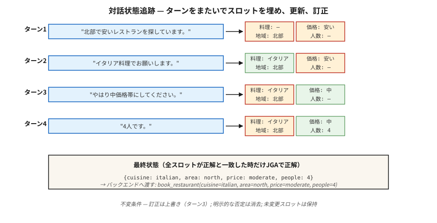

# Diyalog Durumu Takibi

> "Kuzeyde ucuz bir restoran istiyorum... aslında orta halli olsun... ve İtalyan ekleyin." Üç tur, üç durum güncellemesi. DST, ayırmanın çalışması için alan değeri diktesini senkronize tutar.

**Tür:** Yapım
**Diller:** Python
**Önkoşullar:** Aşama 5 · 17 (Sohbet Robotları), Aşama 5 · 20 (Yapılandırılmış Çıktılar)
**Süre:** ~75 dakika

## Sorun

Görev odaklı bir diyalog sisteminde kullanıcının hedefi, bir dizi slot-değer çifti olarak kodlanır: `{cuisine: italian, area: north, price: moderate}`. Her kullanıcı sırası bir yuva ekleyebilir, değiştirebilir veya kaldırabilir. Sistem tüm konuşmayı okumalı ve mevcut durumu doğru bir şekilde çıkarmalıdır.

Tek bir slotta hata yaparsanız sistem yanlış restorana rezervasyon yapar, yanlış uçuşu planlar veya yanlış karttan ücret alır. DST, kullanıcının söylediği ile arka ucun yürüttüğü arasındaki bağlantıdır.

Yüksek Lisans'lara rağmen 2026'da neden hala önemli:

- Uyumluluğa duyarlı alanlar (bankacılık, sağlık hizmetleri, havayolu rezervasyonu), serbest biçimli oluşturma yerine deterministik slot değerleri gerektirir.
- Araç kullanımı agent'lerin API'leri çağırmadan önce hala yuva çözünürlüğüne ihtiyacı vardır.
- Çok turlu düzeltme göründüğünden daha zordur: "aslında hayır, perşembe günü yap."

Modern boru hattı: klasik DST konseptleri + Yüksek Lisans çıkarıcıları + yapılandırılmış çıkışlı korkuluklar.

## Konsept



**Görev yapısı.** Bir şema, alanları (restoran, otel, taksi) ve bunların alanlarını (mutfak, bölge, fiyat, insanlar) tanımlar. Her yuva boş olabilir, kapalı bir kümeden bir değerle (fiyat: {ucuz, orta, pahalı}) veya serbest biçimli bir değerle (isim: "Bakır Kettle") doldurulabilir.

**İki DST formülasyonu.**

- **Sınıflandırma.** Her (yuva, aday_değer) çifti için evet/hayır tahmininde bulunun. Kapalı sözcük yuvaları için çalışır. Standart 2020 öncesi.
- **Nesil.** Diyalog verildiğinde, alan değerlerini serbest metin olarak oluşturun. Açık sözcük yuvaları için çalışır. Modern varsayılan.

**Metrik.** Ortak Hedef Doğruluğu (JGA) — *her* slotun doğru olduğu dönüşlerin oranı. Ya hep ya hiç. MultiWOZ 2.4 liderlik tablosu 2026'da yaklaşık %83'e ulaştı.

**Mimariler.**

1. **Kural tabanlı (slot normal ifadesi + anahtar kelime).** Dar alanlar için güçlü temel. Hata ayıklanabilir.
2. **TripPy / BERT-DST.** BERT kodlamasıyla kopya tabanlı oluşturma. LLM öncesi standart.
3. **LDST (LLaMA + LoRA).** prompting etki alanı yuvasına sahip, talimatlara göre ayarlanmış LLM. MultiWOZ 2.4'te ChatGPT düzeyinde kaliteye ulaşır.
4. **Ontolojiden bağımsız (2024–26).** Şemayı atlayın; doğrudan slot adları ve değerleri oluşturun. Açık alan adlarını yönetir.
5. **Prompt + yapılandırılmış çıktı (2024–26).** Pydantic şema + kısıtlı kod çözme ile Yüksek Lisans. 5 satır kod, üretime hazır.

### Klasik arıza modları

- **Sıralar arasında ortak referans.** "İlk seçenekte kalalım." Hangi seçeneğe karar verilmesi gerekiyor.
- **Üzerine yazma ve ekleme karşılaştırması.** Kullanıcı "İtalyanca ekle" diyor. Mutfağı mı değiştiriyorsunuz yoksa ekliyor musunuz?
- **Örtülü onaylar.** "Tamam tamam" — bu teklif edilen rezervasyonu kabul etti mi?
- **Düzeltme.** "Aslında saat 19:00 olsun." Diğer slotları temizlemeden zamanı güncellemelidir.
- **Önceki sistem ifadesine referans.** "Evet, o." Hangi "o"?

## İnşa Et

### Adım 1: kural tabanlı slot çıkarıcı

Bkz. `code/main.py`. Regex + eşanlamlı sözlükler, dar alanlardaki kanonik ifadelerin %70'ini kapsar:

```python
CUISINE_SYNONYMS = {
    "italian": ["italian", "pasta", "pizza", "italy"],
    "chinese": ["chinese", "chow mein", "noodles"],
}


def extract_cuisine(utterance):
    for canonical, synonyms in CUISINE_SYNONYMS.items():
        if any(syn in utterance.lower() for syn in synonyms):
            return canonical
    return None
```

Kanonik kelime dağarcığının dışında kırılgan. Deterministik slot onayları için çalışır.

### Adım 2: durum güncelleme döngüsü

```python
def update_state(state, utterance):
    new_state = dict(state)
    for slot, extractor in SLOT_EXTRACTORS.items():
        value = extractor(utterance)
        if value is not None:
            new_state[slot] = value
    for slot in NEGATION_CLEARS:
        if is_negated(utterance, slot):
            new_state[slot] = None
    return new_state
```

Üç değişmez:

- Kullanıcının dokunmadığı bir yuvayı asla sıfırlamayın.
- Açık olumsuzluk ("mutfağı boş verin") açıklığa kavuşturulmalıdır.
- Kullanıcı düzeltmesi ("aslında...") eklenmesi değil, üzerine yazılması gerekir.

### Adım 3: Yapılandırılmış çıktıyla LLM odaklı DST

```python
from pydantic import BaseModel
from typing import Literal, Optional
import instructor

class RestaurantState(BaseModel):
    cuisine: Optional[Literal["italian", "chinese", "indian", "thai", "any"]] = None
    area: Optional[Literal["north", "south", "east", "west", "center"]] = None
    price: Optional[Literal["cheap", "moderate", "expensive"]] = None
    people: Optional[int] = None
    day: Optional[str] = None


def llm_dst(history, llm):
    prompt = f"""You track the slot values of a restaurant booking across turns.
Dialogue so far:
{render(history)}

Update the state based on the latest user turn. Output only the JSON state."""
    return llm(prompt, response_model=RestaurantState)
```

Instructor + Pydantic geçerli bir durum nesnesini garanti eder. Normal ifade yok, şema uyumsuzluğu yok, halüsinasyonlu yuva yok.

### Adım 4: JGA değerlendirmesi

```python
def joint_goal_accuracy(predicted_states, gold_states):
    correct = sum(1 for p, g in zip(predicted_states, gold_states) if p == g)
    return correct / len(predicted_states)
```

Kalibre edin: sistem TÜM yuvaları kaç turda doğru alıyor? MultiWOZ 2.4 için en iyi 2026 sistemler: %80-83. Alan içi sisteminiz, dar kelime dağarcığınızdakini aşmalıdır, aksi takdirde LLM temel çizgisi sizi geçecektir.

### Adım 5: düzeltmeyi ele alma

```python
CORRECTION_CUES = {"actually", "no wait", "on second thought", "change that to"}


def is_correction(utterance):
    return any(cue in utterance.lower() for cue in CORRECTION_CUES)
```

Algılanan bir düzeltmede, ekleme yapmak yerine son güncellenen alanın üzerine yazın. Yüksek Lisans'ın yardımı olmadan doğru sonuca ulaşmak zor. Modern model: Aşamalı güncelleme yerine her zaman LLM'nin tüm durumu geçmişten yeniden oluşturmasına izin verin - bu doğal olarak düzeltmeleri halleder.

## Tuzaklar

- **Tam geçmiş yenileme maliyeti.** LLM'nin her turda durumu yeniden oluşturmasına izin vermek toplam O(n²) token'ye mal olur. Geçmişi sınırlayın veya eski dönüşleri özetleyin.
- **Şema kayması.** Post-hoc yeni slotların eklenmesi eski eğitim verilerini bozar. Şemanızı sürümlendirin.
- **Büyük/küçük harf duyarlılığı.** "İtalyanca", "İtalyanca" ve "İTALYANCA" — her yerde normalleştirin.
- **Örtülü devralma.** Kullanıcı daha önce "4 kişi için" seçeneğini belirtmişse, farklı bir zaman için yeni bir istek, kişileri temizlememelidir. Her zaman tam geçmişi aktarın.
- **Serbest biçimli ve kapalı küme karşılaştırması.** Adlar, zamanlar ve adresler serbest biçimli yuvalara ihtiyaç duyar; mutfaklar ve alanlar kapalı. Her ikisini de şemada karıştırın.

## Kullan onu

2026 yığını:

| Durum | Yaklaşım |
|-----------|----------|
| Dar etki alanı (bir veya iki amaç) | Kural tabanlı + normal ifade |
| Geniş alan adı, etiketli veriler mevcut | LDST (MultiWOZ tarzı verilerde LLaMA + LoRA) |
| Geniş alan adı, etiket yok, üretime hazır | Yüksek Lisans + Eğitmen + Pydantic şeması |
| Konuşulan / ses | ASR + normalleştirici + LLM-DST |
| Çok alanlı rezervasyon akışı | Alan başına Pydantic modelleri ile şema rehberli Yüksek Lisans |
| Uyumluluğa duyarlı | Kural tabanlı birincil, onay akışıyla Yüksek Lisans geri dönüşü |

## Gönderin

`outputs/skill-dst-designer.md` olarak kaydet:

```markdown
---
name: dst-designer
description: Design a dialogue state tracker — schema, extractor, update policy, evaluation.
version: 1.0.0
phase: 5
lesson: 29
tags: [nlp, dialogue, task-oriented]
---

Given a use case (domain, languages, vocab openness, compliance needs), output:

1. Schema. Domain list, slots per domain, open vs closed vocabulary per slot.
2. Extractor. Rule-based / seq2seq / LLM-with-Pydantic. Reason.
3. Update policy. Regenerate-whole-state / incremental; correction handling; negation handling.
4. Evaluation. Joint Goal Accuracy on a held-out dialogue set, slot-level precision/recall, confusion on the hardest slot.
5. Confirmation flow. When to explicitly ask the user to confirm (destructive actions, low-confidence extractions).

Refuse LLM-only DST for compliance-sensitive slots without a rule-based secondary check. Refuse any DST that cannot roll back a slot on user correction. Flag schemas without version tags.
```

## Egzersizler

1. **Kolay.** `code/main.py`'de 3 yuva (mutfak, bölge, fiyat) için kural tabanlı durum izleyiciyi oluşturun. 10 el yapımı diyalog üzerinde test yapın. JGA'yı ölçün.
2. **Orta.** Eğitmen + Pydantic + küçük bir LLM ile aynı dataset. JGA'yı karşılaştırın. En zor dönüşleri inceleyin.
3. **Zor.** Her ikisini de uygulayın ve yönlendirin: kural tabanlı birincil, kural tabanlı <2 yuvayı güvenle yayınladığında LLM geri dönüşü. JGA ve inference'nin birleşik dönüş başına maliyetini ölçün.

## Anahtar Terimler

| Dönem | İnsanlar ne diyor | Aslında ne anlama geliyor |
|------|-----------------|-----------------------|
| DST | Diyalog durumu takibi | Diyalog dönüşleri boyunca slot değeri diktesini koruyun. |
| Yuvası | Kullanıcı amacı birimi | Arka ucun ihtiyaç duyduğu adlandırılmış parametre (mutfak, tarih). |
| Etki Alanı | Görev alanı | Restoran, otel, taksi – slot setleri. |
| JGA | Ortak Hedef Doğruluğu | Her slotun doğru olduğu dönüş oranı. Ya hep ya hiç. |
| MultiWOZ | benchmark | Çok alanlı WOZ dataset; standart DST değerlendirmesi. |
| Ontolojiden bağımsız DST | Şema yok | Slot adlarını ve değerlerini doğrudan oluşturun; sabit bir liste yoktur. |
| Düzeltme | "Aslında..." | Daha önce doldurulmuş bir yuvanın üzerine yazan döndürün. |

## Daha Fazla Okuma

- [Budzianowski ve ark. (2018). MultiWOZ — Büyük Ölçekli Çok Etki Alanlı Oz Sihirbazı](https://arxiv.org/abs/1810.00278) — standart benchmark.
- [Feng ve ark. (2023). LLM odaklı Diyalog Durumu İzlemeye (LDST) doğru](https://arxiv.org/abs/2310.14970) — DST için LLaMA + LoRA talimat ayarı.
- [Heck ve ark. (2020). TripPy — Değerden Bağımsız Sinirsel Diyalog Durum Takibi için Üçlü Kopya Stratejisi](https://arxiv.org/abs/2005.02877) — kopya tabanlı DST iş makinesi.
- [Kral, Flanigan (2024). LLM'lerle Denetimsiz Uçtan Uca Görev Odaklı Diyalog](https://arxiv.org/abs/2404.10753) — EM tabanlı denetimsiz TOD.
- [MultiWOZ lider tablosu](https://github.com/budzianowski/multiwoz) — kanonik DST sonuçları.
