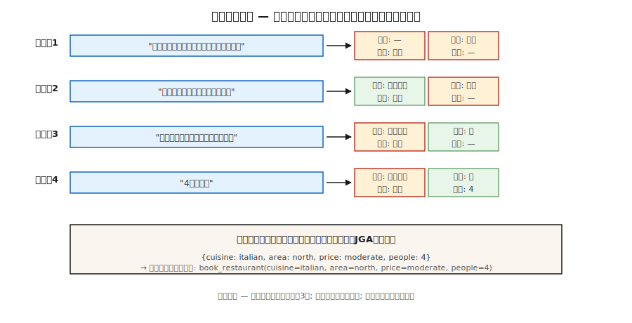

# Dialogue State Tracking

> “我想在北方找一家便宜的餐馆。实际上使其适度...加上意大利语。“三个回合，三个状态更新。DST使老虎机价值决定保持同步，以便预订正常进行。

** 类型：** 构建
** 语言：** Python
** 先决条件：** 阶段5 · 17（聊天机器人）、阶段5 · 20（结构化输出）
** 时间：** ~75分钟

## The Problem

在面向任务的对话系统中，用户的目标被编码为一组老虎机值对：“{美食：意大利，地区：北部，价格：中等}”。每个用户回合都可以添加、更改或删除插槽。系统必须读取整个对话并正确输出当前状态。

如果某个老虎机出错，系统就会预订错误的餐厅、安排错误的航班或充值错误的卡。DST是用户所说的内容和后台执行的内容之间的枢纽。

为什么尽管有LLM，但它在2026年仍然很重要：

- 合规敏感域（银行、医疗保健、航空预订）需要确定性的老虎机值，而不是自由形式的生成。
- 工具使用代理在调用API之前仍然需要插槽解析。
- 多轮修正比看起来更难：“实际上不，就在周四吧。"

现代管道：经典DST概念+ LLM提取器+结构化输出护栏。

## The Concept



** 任务结构。**模式定义了域（餐厅、酒店、出租车）及其位置（美食、区域、价格、人员）。每个插槽可以是空的，填充封闭集中的值（价格：{廉价、中等、昂贵}），也可以填充自由形式的值（名称：“The Copper Kettle”）。

** 两种DST配方。**

- ** 分类。**对于每个（插槽，候选人_值）对，预测是/否。适用于封闭语音插槽。标准2020年之前。
- ** 一代。**给定对话，生成老虎机值作为自由文本。适用于开放式词汇插槽。现代的默认值。

** 公制。**联合目标准确性（JGA）-* 每个 * 槽都正确的转弯比例。全有或全无。2026年MultiWOZ 2.4排行榜将超过83%左右。

** 建筑。**

1. ** 基于规则（老虎机regex +关键字）。**狭窄领域的强大基线。可移植的。
2. **TripPy / BERT-DST。**使用BERT编码的基于复制的生成。LLM预科标准。
3. **LDST（LLaMA + LoRA）.**具有域槽提示的指令调优LLM。在MultiWOZ 2.4上达到ChatGPT级质量。
4. ** 无实体（2024-26）。**跳过模式;直接生成插槽名称和值。处理开放域。
5. ** 提示+结构化输出（2024-26年）。**具有Pydantic模式+约束解码的LLM。5行代码，可生产。

### The classic failure modes

- ** 交叉参考。**“让我们坚持第一个选择。“需要解决哪个选项。
- ** 重写与附加。**用户说“添加意大利语。“你是取代美食还是附加？
- ** 隐含确认。**“OK cool”--这是否接受提供的预订？
- ** 更正。**“实际上是晚上7点。“必须在不清除其他插槽的情况下更新时间。
- ** 对先前系统话语的共同引用。**“是的，就是那个。“哪个“那个”？

## Build It

### Step 1: rule-based slot extractor

请参阅' code/main.py '。Regex +同义词词典涵盖狭窄领域70%的规范话语：

```python
CUISINE_SYNONYMS = {
    "italian": ["italian", "pasta", "pizza", "italy"],
    "chinese": ["chinese", "chow mein", "noodles"],
}


def extract_cuisine(utterance):
    for canonical, synonyms in CUISINE_SYNONYMS.items():
        if any(syn in utterance.lower() for syn in synonyms):
            return canonical
    return None
```

在规范词汇之外易碎。适用于确定性插槽确认。

### Step 2: state update loop

```python
def update_state(state, utterance):
    new_state = dict(state)
    for slot, extractor in SLOT_EXTRACTORS.items():
        value = extractor(utterance)
        if value is not None:
            new_state[slot] = value
    for slot in NEGATION_CLEARS:
        if is_negated(utterance, slot):
            new_state[slot] = None
    return new_state
```

三个不变量：

- 切勿重置用户未触摸的插槽。
- 明确的否定（“别管这道菜”）必须清楚。
- 用户更正（“实际上.”）必须覆盖，而不是附加。

### Step 3: LLM-driven DST with structured output

```python
from pydantic import BaseModel
from typing import Literal, Optional
import instructor

class RestaurantState(BaseModel):
    cuisine: Optional[Literal["italian", "chinese", "indian", "thai", "any"]] = None
    area: Optional[Literal["north", "south", "east", "west", "center"]] = None
    price: Optional[Literal["cheap", "moderate", "expensive"]] = None
    people: Optional[int] = None
    day: Optional[str] = None


def llm_dst(history, llm):
    prompt = f"""You track the slot values of a restaurant booking across turns.
Dialogue so far:
{render(history)}

Update the state based on the latest user turn. Output only the JSON state."""
    return llm(prompt, response_model=RestaurantState)
```

讲师+ Pydantic保证状态对象有效。没有regex，没有模式不匹配，没有幻觉老虎机。

### Step 4: JGA evaluation

```python
def joint_goal_accuracy(predicted_states, gold_states):
    correct = sum(1 for p, g in zip(predicted_states, gold_states) if p == g)
    return correct / len(predicted_states)
```

校准：系统正确处理所有插槽的圈数是多少？对于MultiWOZ 2.4，2026年排名前几的系统：80- 83%。您的领域内系统应该超过您的狭隘词汇量，否则LLM基线会击败您。

### Step 5: handling correction

```python
CORRECTION_CUES = {"actually", "no wait", "on second thought", "change that to"}


def is_correction(utterance):
    return any(cue in utterance.lower() for cue in CORRECTION_CUES)
```

检测到更正后，覆盖上次更新的插槽，而不是添加。如果没有LLM的帮助，很难找到正确的答案。现代模式：始终让LLM从历史中重新生成整个状态，而不是增量更新-这自然会处理更正。

## Pitfalls

- ** 全历史再生成本。**让LLM每轮重新生成状态总共花费O（n²）个代币。记录历史或总结旧的转折。
- ** 架构漂移。**事后添加新插槽会破坏旧的训练数据。版本您的模式。
- ** 区分大小写。**“意大利人”vs“意大利人”vs“意大利人”--到处都正常化。
- ** 隐性继承。**如果用户之前指定了“适合4人”，则不同时间的新请求不应清除人员。始终通过完整的历史记录。
- ** 自由形式vs封闭式。**姓名、时间和地址需要自由形式的插槽;美食和区域是关闭的。将两者混合在模式中。

## Use It

2026年堆栈：

| 情况 | 方法 |
|-----------|----------|
| 狭窄领域（一两个意图） | 基于规则+ regex |
| 广泛的领域，可用的标记数据 | LDST（MultiWOZ风格数据上的LLaMA + LoRA） |
| 广泛的领域，无标签，随时准备 | 法学硕士+讲师+ Pydantic模式 |
| 口语/语音 | ASB+规范化器+ LLM-DST |
| 多域预订流程 | 具有每域Pydantic模型的模式引导LLM |
| 合规敏感 | 基于规则的主要、具有确认流的LLM后备 |

## Ship It

另存为“输出/skill-dst-designer.md”：

```markdown
---
name: dst-designer
description: Design a dialogue state tracker — schema, extractor, update policy, evaluation.
version: 1.0.0
phase: 5
lesson: 29
tags: [nlp, dialogue, task-oriented]
---

Given a use case (domain, languages, vocab openness, compliance needs), output:

1. Schema. Domain list, slots per domain, open vs closed vocabulary per slot.
2. Extractor. Rule-based / seq2seq / LLM-with-Pydantic. Reason.
3. Update policy. Regenerate-whole-state / incremental; correction handling; negation handling.
4. Evaluation. Joint Goal Accuracy on a held-out dialogue set, slot-level precision/recall, confusion on the hardest slot.
5. Confirmation flow. When to explicitly ask the user to confirm (destructive actions, low-confidence extractions).

Refuse LLM-only DST for compliance-sensitive slots without a rule-based secondary check. Refuse any DST that cannot roll back a slot on user correction. Flag schemas without version tags.
```

## Exercises

1. ** 简单。**在`code/main.py`中为3个插槽（美食，区域，价格）构建基于规则的状态跟踪器。测试10个手工制作的对话。测量JGA。
2. ** 中等。**与讲师+ Pydantic +一个小LLM相同的数据集。比较JGA。检查最难的转弯。
3. ** 很难。**同时实施并路由：基于规则的主要，当基于规则的自信地发出<2个插槽时，LLM回撤。测量每回合的JGA和推理成本的组合。

## Key Terms

| Term | 别人怎么说 | 它实际上意味着什么 |
|------|-----------------|-----------------------|
| DST | 对话状态跟踪 | 在对话回合中保持槽值dict。 |
| 槽 | 用户意图单位 | 后台需要的命名参数（美食、日期）。 |
| 域 | 所述任务区域 | 餐厅、酒店、出租车-一套老虎机。 |
| JGA | 联合目标准确性 | 每个插槽都正确的转弯比例。全有或全无。 |
| MultiWOZ | 基准 | 多域WOZ数据集;标准DST评估。 |
| 无实体DST | 没有架构 | 直接生成老虎机名称和值，没有固定列表。 |
| 校正 | “实际上. " | 翻转该内容将覆盖之前填充的插槽。 |

## Further Reading

- [Budzianowski et al.（2018）. MultiWOZ -一个大规模多域向导]（https：//arxiv.org/abs/1810.00278）-规范基准。
- [Feng等人（2023）。迈向LLM驱动的对话状态跟踪（LDST）]（https：//arxiv.org/ab/2310.14970）-针对DST的LLaMA + LoRA指令调整。
- [Heck等人（2020）。TripPy -价值独立神经对话状态跟踪的三重复制策略]（https：//arxiv.org/ab/2005.02877）-基于复制的DST主力。
- [King、Flanigan（2024）。与LLM的无监督端到端面向任务的对话]（https：//arxiv.org/ab/2404.10753）-基于EM的无监督的DOE。
- [MultiWOZ排行榜]（https：//github.com/budzianowski/Multiwoz）-典型的DST结果。
