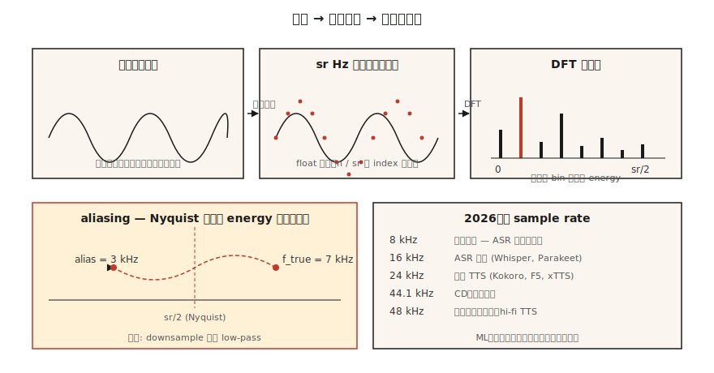

# オーディオの基礎 — 波形、サンプリング、フーリエ変換

> 波形は生の信号です。スペクトログラムはその表現です。Mel 特徴量は機械学習で扱いやすい形です。現代の ASR と TTS のパイプラインはすべてこの段階をたどり、最初の一段はサンプリングとフーリエを理解することです。

**種別:** 学習
**言語:** Python
**前提条件:** Phase 1 · 06 (Vectors & Matrices), Phase 1 · 14 (Probability Distributions)
**所要時間:** 約45分

## 問題

マイクは「圧力 対 時間」の信号を生成します。ニューラルネットはテンソルを受け取ります。その間には、破ると静かなバグを生む慣習の層があります。モデルは問題なく学習しているように見えるのに WER が倍になる、TTS にヒスノイズが混ざる、音声クローニングシステムが話者ではなくマイクを記憶してしまう、といった具合です。

音声システムのバグは、突き詰めると次の 3 つの問いのどれかに戻ります。

1. データはどのサンプルレートで録音され、モデルは何を期待しているか。
2. 信号にエイリアシングは起きていないか。
3. 生サンプルを扱っているのか、周波数表現を扱っているのか。

ここを正しく押さえれば、Phase 6 の残りは扱いやすくなります。間違えると、Whisper-Large-v4 でさえゴミのような結果を出します。

## 概念



**波形。** `[-1.0, 1.0]` の float からなる 1 次元配列です。サンプル番号でインデックスします。秒に変換するには、サンプルレートで割ります: `t = n / sr`。16 kHz の 10 秒クリップは 160,000 個の float の配列です。

**サンプリングレート (sr)。** 1 秒あたりのサンプル数です。2026 年によく使われるレート:

| レート | 用途 |
|------|-----|
| 8 kHz | 電話、レガシー VOIP。Nyquist が 4 kHz なので子音が失われます。ASR では避けます。 |
| 16 kHz | ASR の標準。Whisper、Parakeet、SeamlessM4T v2 はすべて 16 kHz を入力にします。 |
| 22.05 kHz | 古いモデルの TTS vocoder 学習。 |
| 24 kHz | 現代の TTS (Kokoro, F5-TTS, xTTS v2)。 |
| 44.1 kHz | CD オーディオ、音楽。 |
| 48 kHz | 映画、プロ音声、高忠実度 TTS (VALL-E 2, NaturalSpeech 3)。 |

**Nyquist-Shannon。** サンプルレート `sr` では、`sr/2` までの周波数を曖昧さなく表現できます。`sr/2` の境界が *Nyquist frequency* です。Nyquist を超えるエネルギーは *aliased* され、低い周波数へ折り返されて信号を汚します。ダウンサンプリング前には必ずローパスフィルタをかけます。

**ビット深度。** 16-bit PCM (signed int16、範囲 ±32,767) は汎用の交換形式です。音楽では 24-bit、内部 DSP では 32-bit float を使います。`soundfile` のようなライブラリは int16 を読み込みますが、`[-1, 1]` の float32 配列として公開します。

**フーリエ変換。** 任意の有限信号は、異なる周波数の正弦波の和です。Discrete Fourier Transform (DFT) は、`N` 個のサンプルに対して `N` 個の複素係数を計算します。周波数ビンごとに 1 つです。`bin k` は周波数 `k · sr / N` Hz に対応します。大きさはその周波数の振幅、角度は位相です。

**FFT。** Fast Fourier Transform は、`N` が 2 のべき乗のときに DFT を計算する `O(N log N)` アルゴリズムです。すべてのオーディオライブラリが内部で FFT を使っています。16 kHz で 1024 サンプルの FFT を使うと、0–8 kHz を 15.6 Hz 解像度で覆う 512 個の有効な周波数ビンが得られます。

**フレーミング + 窓。** クリップ全体を FFT するわけではありません。重なり合う *frames* に分割し (典型的には 25 ms、hop は 10 ms)、各フレームに窓関数 (Hann、Hamming) を掛けて端の不連続を抑え、その後で各フレームを FFT します。これが Short-Time Fourier Transform (STFT) です。Lesson 02 はここから続きます。

## 作る

### 手順 1: クリップを読み込み、波形をプロットする

`code/main.py` はデモを依存なしに保つため、stdlib の `wave` モジュールだけを使います。本番では `soundfile` または `torchaudio.load` を使います (どちらも `(waveform, sr)` タプルを返します):

```python
import soundfile as sf
waveform, sr = sf.read("clip.wav", dtype="float32")  # shape (T,), sr=int
```

### 手順 2: 原理から正弦波を合成する

```python
import math

def sine(freq_hz, sr, seconds, amp=0.5):
    n = int(sr * seconds)
    return [amp * math.sin(2 * math.pi * freq_hz * i / sr) for i in range(n)]
```

16 kHz で 1 秒の 440 Hz 正弦波 (concert A) は 16,000 個の float です。16-bit PCM エンコーディングを使って `wave.open(..., "wb")` で書き出します。

### 手順 3: DFT を手で計算する

```python
def dft(x):
    N = len(x)
    out = []
    for k in range(N):
        re = sum(x[n] * math.cos(-2 * math.pi * k * n / N) for n in range(N))
        im = sum(x[n] * math.sin(-2 * math.pi * k * n / N) for n in range(N))
        out.append((re, im))
    return out
```

`O(N²)` です。`N=256` で正しさを確認するには十分ですが、実際の音声には使えません。本番コードでは `numpy.fft.rfft` または `torch.fft.rfft` を呼びます。

### 手順 4: 支配的な周波数を見つける

大きさのピークインデックス `k_star` は、周波数 `k_star * sr / N` に対応します。440 Hz の正弦波で実行すると、`440 * N / sr` のビンにピークが出るはずです。

### 手順 5: エイリアシングを実演する

10 kHz (Nyquist = 5 kHz) で 7 kHz の正弦波をサンプリングします。7 kHz の音は Nyquist を超えているため、`10 − 7 = 3 kHz` に折り返されます。FFT のピークは 3 kHz に現れます。これは典型的なエイリアシングのデモであり、すべての DAC/ADC に急峻なローパスフィルタが載っている理由です。

## 使う

2026 年に実際に出荷するスタック:

| タスク | ライブラリ | 理由 |
|------|---------|-----|
| WAV/FLAC/OGG の読み書き | `soundfile` (libsndfile wrapper) | 高速で安定し、float32 を返します。 |
| リサンプリング | `torchaudio.transforms.Resample` または `librosa.resample` | 正しいアンチエイリアシングが組み込まれています。 |
| STFT / Mel | `torchaudio` または `librosa` | GPU フレンドリーで、PyTorch エコシステムに合います。 |
| リアルタイムストリーミング | `sounddevice` または `pyaudio` | クロスプラットフォームの PortAudio バインディングです。 |
| ファイル調査 | `ffprobe` または `soxi` | CLI で高速、sr/channels/codec を報告します。 |

判断規則: **何より先にサンプルレートを合わせる**。Whisper は 16 kHz mono float32 を期待します。44.1 kHz stereo を渡すと、モデルのバグに見えるゴミが返ってきます。

## 出荷する

`outputs/skill-audio-loader.md` として保存します。このスキルは、音声入力が下流モデルの期待と一致するかを確認し、一致しない場合に正しくリサンプリングする助けになります。

## 演習

1. **Easy.** 16 kHz で 220 Hz + 440 Hz + 880 Hz の 1 秒ミックスを合成します。DFT を実行します。期待されるビンに 3 つのピークがあることを確認します。
2. **Medium.** 自分の声を 48 kHz で 3 秒の WAV として録音します。`torchaudio.transforms.Resample` (アンチエイリアシングあり) で 16 kHz にダウンサンプリングし、さらにナイーブな間引き (3 サンプルごと) でも 16 kHz にします。両方を FFT します。エイリアシングはどこに現れますか。
3. **Hard.** 手順 3 の DFT と `math` だけを使って STFT をゼロから作ります。フレームサイズ 400、hop 160、Hann 窓。`matplotlib.pyplot.imshow` で大きさをプロットします。これが Lesson 02 のスペクトログラムです。

## 重要用語

| 用語 | よく言われる説明 | 実際の意味 |
|------|-----------------|-----------------------|
| Sample rate | 1 秒あたりのサンプル数 | ADC が信号を測定する周波数 (Hz)。 |
| Nyquist | 表現できる最大周波数 | `sr/2`; それを超えるエネルギーは下へ折り返されます。 |
| Bit depth | 各サンプルの解像度 | `int16` = 65,536 段階; `float32` = `[-1, 1]` で 24-bit 精度。 |
| DFT | 列に対するフーリエ変換 | `N` サンプル → `N` 個の複素周波数係数。 |
| FFT | 高速な DFT | `N` = 2 のべき乗を前提にする `O(N log N)` アルゴリズム。 |
| Bin | 周波数の列 | `k · sr / N` Hz; 解像度 = `sr / N`。 |
| STFT | スペクトログラムの中身 | 時間方向にフレーム化し、窓を掛けた FFT。 |
| Aliasing | 奇妙な周波数の幻影 | Nyquist を超えたエネルギーが低いビンへ鏡写しになること。 |

## 参考資料

- [Shannon (1949). Communication in the Presence of Noise](https://people.math.harvard.edu/~ctm/home/text/others/shannon/entropy/entropy.pdf) — サンプリング定理の背後にある論文。
- [Smith — The Scientist and Engineer's Guide to Digital Signal Processing](https://www.dspguide.com/ch8.htm) — 無料で標準的な DSP 教科書。
- [librosa docs — audio primer](https://librosa.org/doc/latest/tutorial.html) — コード付きの実践的な導入。
- [Heinrich Kuttruff — Room Acoustics (6th ed.)](https://www.routledge.com/Room-Acoustics/Kuttruff/p/book/9781482260434) — 現実の音声がきれいな正弦波ではない理由の参考書。
- [Steve Eddins — FFT Interpretation notebook](https://blogs.mathworks.com/steve/2020/03/30/fft-spectrum-and-spectral-densities/) — 周波数ビンの直感を 10 分で整理できます。
