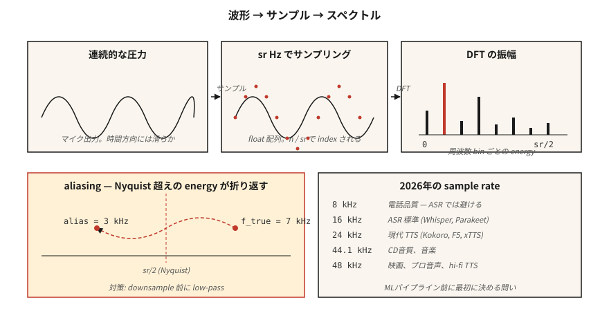

# 音频基础——波形、采样、傅里叶变换

> 波形是原始信号，频谱图是表示形式，Mel 特征是 ML 友好的形式。每个现代 ASR 和 TTS 流水线都沿着这个阶梯前进，而第一级台阶就是理解采样和傅里叶变换。

**类型：** 学习
**语言：** Python
**前置知识：** 阶段 1 · 06（向量与矩阵），阶段 1 · 14（概率分布）
**时间：** ~45 分钟

## 问题

麦克风产生一个压力-时间信号。你的神经网络消费的是张量。这两者之间有一整套约定，一旦违反就会产生静默缺陷：模型训练正常但 WER 翻倍，或 TTS 输出嘶嘶声，或语音克隆系统记住了麦克风而非说话者。

语音系统中的每个 bug 最终都能追溯到以下三个问题之一：

1. 数据录制时的采样率是多少，模型期望的采样率是多少？
2. 信号是否存在混叠（aliasing）？
3. 你是在原始样本上操作，还是在频率表示上操作？

搞对了这些问题，阶段 6 的其余部分就变得可控。搞错了，即使是 Whisper-Large-v4 也会输出垃圾。

## 概念



**波形（Waveform）。** 一个一维浮点数数组，范围 `[-1.0, 1.0]`。按样本编号索引。要转换为秒，除以采样率：`t = n / sr`。一段 10 秒、16 kHz 的片段是一个包含 160,000 个浮点数的数组。

**采样率（Sampling rate, sr）。** 每秒的样本数。2026 年常见采样率：

| 采样率 | 用途 |
|------|-----|
| 8 kHz | 电话、传统 VOIP。奈奎斯特频率为 4 kHz，会丢失辅音。避免用于 ASR。 |
| 16 kHz | ASR 标准。Whisper、Parakeet、SeamlessM4T v2 都使用 16 kHz。 |
| 22.05 kHz | 旧模型 TTS vocoder 训练。 |
| 24 kHz | 现代 TTS（Kokoro、F5-TTS、xTTS v2）。 |
| 44.1 kHz | CD 音频、音乐。 |
| 48 kHz | 电影、专业音频、高保真 TTS（VALL-E 2、NaturalSpeech 3）。 |

**奈奎斯特-香农（Nyquist-Shannon）。** 采样率 `sr` 可以无歧义地表示最高 `sr/2` 的频率。`sr/2` 边界就是*奈奎斯特频率*。高于奈奎斯特频率的能量会发生*混叠（aliasing）*——折叠到较低的频率中——从而破坏信号。降采样前务必使用低通滤波。

**位深（Bit depth）。** 16-bit PCM（有符号 int16，范围 ±32,767）是通用交换格式。音乐使用 24-bit，内部 DSP 使用 32-bit 浮点数。像 `soundfile` 这样的库读取 int16 但输出 `[-1, 1]` 范围的 float32 数组。

**傅里叶变换（Fourier Transform）。** 任何有限信号都可以表示为不同频率正弦波的叠加。离散傅里叶变换（DFT）对 `N` 个样本计算 `N` 个复数系数——每个频率 bin 一个。`bin k` 对应频率 `k · sr / N` Hz。幅值（Magnitude）是该频率的振幅，角度（angle）是相位。

**FFT。** 快速傅里叶变换：当 `N` 为 2 的幂时，计算 DFT 的 `O(N log N)` 算法。每个音频库底层都使用 FFT。16 kHz 下对 1024 个样本做 FFT，得到 512 个可用频率 bin，覆盖 0–8 kHz，分辨率 15.6 Hz。

**分帧 + 加窗（Framing + window）。** 我们不会对整个片段做 FFT，而是将其切分成重叠的*帧*（通常 25 ms，帧移 10 ms），每帧乘以窗函数（Hann、Hamming）以消除边缘不连续性，然后对每帧做 FFT。这就是短时傅里叶变换（STFT）。第 02 课接着讲这个。

```figure
mel-scale
```

## 动手实现

### 第 1 步：读取片段并绘制波形

`code/main.py` 仅使用标准库的 `wave` 模块，以保持演示无外部依赖。生产环境中你会使用 `soundfile` 或 `torchaudio.load`（两者都返回 `(waveform, sr)` 元组）：

```python
import soundfile as sf
waveform, sr = sf.read("clip.wav", dtype="float32")  # shape (T,), sr=int
```

### 第 2 步：从零合成正弦波

```python
import math

def sine(freq_hz, sr, seconds, amp=0.5):
    n = int(sr * seconds)
    return [amp * math.sin(2 * math.pi * freq_hz * i / sr) for i in range(n)]
```

16 kHz 下 1 秒的 440 Hz 正弦波（音乐会 A 调）是 16,000 个浮点数。使用 `wave.open(..., "wb")` 以 16-bit PCM 编码写入。

### 第 3 步：手动计算 DFT

```python
def dft(x):
    N = len(x)
    out = []
    for k in range(N):
        re = sum(x[n] * math.cos(-2 * math.pi * k * n / N) for n in range(N))
        im = sum(x[n] * math.sin(-2 * math.pi * k * n / N) for n in range(N))
        out.append((re, im))
    return out
```

`O(N²)`——当 `N=256` 时用于验证正确性尚可，对真实音频无用。实际代码应调用 `numpy.fft.rfft` 或 `torch.fft.rfft`。

### 第 4 步：寻找主频率

幅值峰值索引 `k_star` 对应频率 `k_star * sr / N`。对 440 Hz 正弦波运行此计算，应该在 bin `440 * N / sr` 处得到峰值。

### 第 5 步：演示混叠（aliasing）

以 10 kHz（奈奎斯特频率 = 5 kHz）采样一个 7 kHz 的正弦波。7 kHz 信号高于奈奎斯特频率，折叠到 `10 - 7 = 3 kHz`。FFT 峰值出现在 3 kHz。这是经典的混叠演示，也是每个 DAC/ADC 都配有砖墙式低通滤波器的原因。

## 使用建议

2026 年你将实际使用的技术栈：

| 任务 | 库 | 原因 |
|------|---------|-----|
| 读/写 WAV/FLAC/OGG | `soundfile`（libsndfile 封装） | 最快、稳定、返回 float32。 |
| 重采样 | `torchaudio.transforms.Resample` 或 `librosa.resample` | 内置正确的抗混叠滤波。 |
| STFT / Mel | `torchaudio` 或 `librosa` | GPU 友好；PyTorch 生态系统。 |
| 实时流式处理 | `sounddevice` 或 `pyaudio` | 跨平台 PortAudio 绑定。 |
| 检查文件 | `ffprobe` 或 `soxi` | CLI 工具，快速，报告采样率/通道数/编码格式。 |

决策规则：**先匹配采样率，再匹配其他任何东西**。Whisper 期望 16 kHz 单声道 float32。传入 44.1 kHz 立体声，你会得到看似模型错误的垃圾输出。

## 交付物

保存为 `outputs/skill-audio-loader.md`。该技能帮助你检查音频输入是否符合下游模型的期望，并在不符合时正确重采样。

## 练习

1. **简单。** 在 16 kHz 下合成 1 秒混合音：220 Hz + 440 Hz + 880 Hz。运行 DFT。确认三个峰值在预期的 bin 位置。
2. **中等。** 以 48 kHz 录制 3 秒的声音 WAV。使用 `torchaudio.transforms.Resample`（带抗混叠滤波）降采样到 16 kHz，再用朴素抽取法（每三个样本取一个）降采样到 16 kHz。对两者做 FFT。混叠出现在哪里？
3. **困难。** 仅使用 `math` 和第 3 步的 DFT 从零构建 STFT。帧大小 400，帧移 160，Hann 窗。使用 `matplotlib.pyplot.imshow` 绘制幅值图。这就是第 02 课的频谱图。

## 关键词汇

| 术语 | 通常说法 | 实际含义 |
|------|-----------------|-----------------------|
| Sample rate | 每秒采样数 | ADC 测量信号的频率（Hz）。 |
| Nyquist | 能表示的最大频率 | `sr/2`；高于此频率的能量会混叠回来。 |
| Bit depth | 每个样本的分辨率 | `int16` = 65,536 级；`float32` = `[-1, 1]` 范围内的 24 位精度。 |
| DFT | 序列的傅里叶变换 | `N` 个样本 → `N` 个复数频率系数。 |
| FFT | 快速 DFT | `O(N log N)` 算法，要求 `N` 为 2 的幂。 |
| Bin | 频率列 | `k · sr / N` Hz；分辨率 = `sr / N`。 |
| STFT | 频谱图的底层实现 | 随时间分帧加窗的 FFT。 |
| Aliasing | 奇怪的频率鬼影 | 高于奈奎斯特频率的能量镜像到较低 bin。 |

## 延伸阅读

- [Shannon (1949). Communication in the Presence of Noise](https://people.math.harvard.edu/~ctm/home/text/others/shannon/entropy/entropy.pdf)——采样定理背后的论文。
- [Smith——The Scientist and Engineer's Guide to Digital Signal Processing](https://www.dspguide.com/ch8.htm)——免费的经典 DSP 教科书。
- [librosa docs——audio primer](https://librosa.org/doc/latest/tutorial.html)——含代码的实践教程。
- [Heinrich Kuttruff——Room Acoustics (6th ed.)](https://www.routledge.com/Room-Acoustics/Kuttruff/p/book/9781482260434)——了解为什么真实音频不是干净的正弦波。
- [Steve Eddins——FFT Interpretation notebook](https://blogs.mathworks.com/steve/2020/03/30/fft-spectrum-and-spectral-densities/)——10 分钟理清频率 bin 的直觉。
