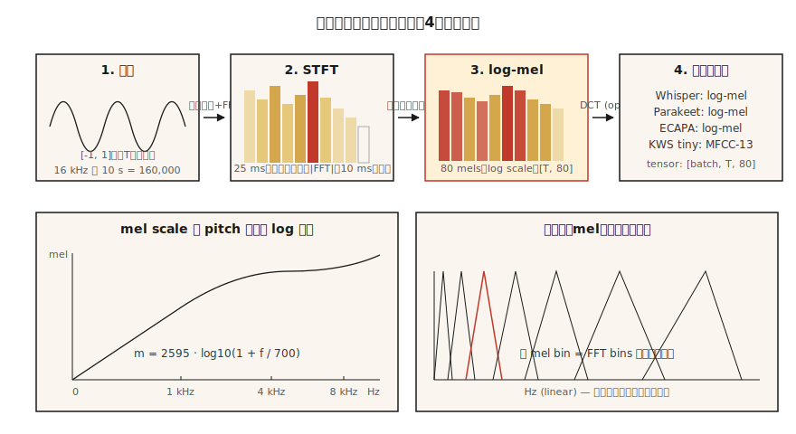

# Eespecificaçãotrogramas, Escala Mel e Características de Áudio

> Redes neurais não consomem formas de onda brutas bem. Consomem eespecificaçãotrogramas. Consomem eespecificaçãotrogramas mel ainda melhor. Todo classificador de ASR, TTS e áudio em 2026 vive ou morre por essa única escolha de pré-processamento.

**Tipo:** Construir
**Idiomas:** Python
**Pré-requisitos:** Fase 6 · 01 (Fundamentos de Áudio)
**Tempo:** ~45 minutos

## O Problema

Pegue um clipe de 10 segundos a 16 kHz. São 160.000 floats, todos em `[-1, 1]`, quase perfeitamente descorrelacionados com o rótulo "cachorro late" ou "a palavra gato". A forma de onda bruta tem a informação mas numa forma que o modelo não consegue extrair facilmente. Dois fonemas idênticos pronunciados 100 ms têm amostras completamente diferentes.

Um eespecificaçãotrograma resolve isso. Ele colapsa o detalhe temporal onde a percepção humana ignora (jitter de microssegundos) e preserva a estrutura onde a percepção atenta (quais frequências são energéticas, em janelas de tempo de ~10–25 ms).

Eespecificaçãotrogramas mel vão além. Humanos percebem pitch logaritmicamente: 100 Hz vs 200 Hz soam "na mesma distância" que 1000 Hz vs 2000 Hz. A escala mel distorce o eixo de frequência para combinar. Um eespecificaçãotrograma na escala mel é a característica mais importante em ML de fala de 2010 até 2026.

## O Conceito



**STFT (Short-Time Fourier Transform).** Fatiar a forma de onda em frames sobrepostos (típico: janela de 25 ms, hop de 10 ms = 400 amostras / 160 amostras a 16 kHz). Multiplicar cada frame por uma função de janela (Hann é o padrão; Hamming com tradeoff levemente diferente). FFT em cada frame. Empilhar os eespecificaçãotros de magnitude em uma matriz de formato `(n_frames, n_freq_bins)`. Esse é seu eespecificaçãotrograma.

**Magnitude logarítmica.** Magnitudes brutas cobrem 5-6 ordens de magnitude. Pegue `log(|X| + 1e-6)` ou `20 * log10(|X|)` para comprimir a faixa dinâmica. Toda pipeline de produção usa magnitude logarítmica, não magnitude bruta.

**Escala mel.** Frequência `f` em Hz mapeia para mel `m` por `m = 2595 * log10(1 + f / 700)`. O mapeamento é aproximadamente linear abaixo de 1 kHz e aproximadamente logarítmico acima. 80 bins mel cobrindo 0–8 kHz é a entrada padrão de ASR.

**Banco de filtros mel.** Um conjunto de filtros triangulares espaçados igualmente na escala mel. Cada filtro é uma soma ponderada de bins FFT adjacentes. Multiplicar a magnitude STFT pela matriz do banco de filtros dá o eespecificaçãotrograma mel num único matmul.

**Eespecificaçãotrograma log-mel.** `log(mel_especificação + 1e-10)`. A entrada do Whisper. A entrada do Parakeet. A entrada do SeamlessM4T. O frontend de áudio universal de 2026.

**MFCCs.** Pegue o eespecificaçãotrograma log-mel, aplique uma DCT (tipo II), mantenha os 13 primeiros coeficientes. Desserializa as características e comprime mais. Característica dominante até cerca de 2015 quando CNNs/Transformers em log-mels brutos alcançaram. Ainda usado em reconhecimento de falante (x-vectors, ECAPA).

**Tradeoff de resolução.** FFT maior = melhor resolução de frequência mas pior resolução temporal. 25 ms / 10 ms é o padrão de áudio-ML; 50 ms / 12.5 ms para música; 5 ms / 2 ms para detecção de transientes (batidas de bateria, oclusivas).

## Construa

### Passo 1: enquadre a forma de onda

```python
def frame(signal, frame_len, hop):
    n = 1 + (len(signal) - frame_len) // hop
    return [signal[i * hop : i * hop + frame_len] for i in range(n)]
```

Um clipe de 10 segundos a 16 kHz com `frame_len=400, hop=160` produz 998 frames.

### Passo 2: janela Hann

```python
import math

def hann(N):
    return [0.5 * (1 - math.cos(2 * math.pi * n / (N - 1))) for n in range(N)]
```

Multiplicar elemento-a-elemento antes da FFT. Remove vazamento eespecificaçãotral causado por truncamento em endpoints não-zero.

### Passo 3: magnitude da STFT

```python
def stft_magnitude(signal, frame_len=400, hop=160):
    win = hann(frame_len)
    frames = frame(signal, frame_len, hop)
    return [magnitudes(dft([w * s for w, s in zip(win, f)])) for f in frames]
```

Produção usa `torch.stft` ou `librosa.stft` (com FFT, vectorizado). O loop aqui é didático; roda em clips curtos em `code/main.py`.

### Passo 4: banco de filtros mel

```python
def hz_to_mel(f):
    return 2595.0 * math.log10(1.0 + f / 700.0)

def mel_to_hz(m):
    return 700.0 * (10 ** (m / 2595.0) - 1)

def mel_filterbank(n_mels, n_fft, sr, fmin=0, fmax=None):
    fmax = fmax or sr / 2
    mels = [hz_to_mel(fmin) + (hz_to_mel(fmax) - hz_to_mel(fmin)) * i / (n_mels + 1)
            for i in range(n_mels + 2)]
    hzs = [mel_to_hz(m) for m in mels]
    bins = [int(h * n_fft / sr) for h in hzs]
    fb = [[0.0] * (n_fft // 2 + 1) for _ in range(n_mels)]
    for m in range(n_mels):
        for k in range(bins[m], bins[m + 1]):
            fb[m][k] = (k - bins[m]) / max(1, bins[m + 1] - bins[m])
        for k in range(bins[m + 1], bins[m + 2]):
            fb[m][k] = (bins[m + 2] - k) / max(1, bins[m + 2] - bins[m + 1])
    return fb
```

80 mels cobrindo 0–8 kHz com `n_fft=400` dá uma matriz `(80, 201)`. Multiplique a magnitude STFT `(n_frames, 201)` pela transposta para obter o eespecificaçãotrograma mel `(n_frames, 80)`.

### Passo 5: log-mel

```python
def log_mel(mel_especificação, eps=1e-10):
    return [[math.log(max(v, eps)) for v in frame] for frame in mel_especificação]
```

Alternativas comuns: `librosa.power_to_db` (dB normalizado por referência), `10 * log10(power + eps)`. O Whisper usa um routine mais elaborado de clip + normalização (veja `log_mel_especificaçãotrogram` do Whisper).

### Passo 6: MFCCs

```python
def dct_ii(x, n_coeffs):
    N = len(x)
    return [
        sum(x[n] * math.cos(math.pi * k * (2 * n + 1) / (2 * N)) for n in range(N))
        for k in range(n_coeffs)
    ]
```

Aplique DCT em cada frame log-mel, mantenha os 13 primeiros coeficientes. Essa é sua matriz MFCC. O primeiro coeficiente geralmente é descartado (codifica energia total).

## Use

A pilha de 2026:

| Tarefa | Características |
|--------|----------------|
| ASR (Whisper, Parakeet, SeamlessM4T) | 80 log-mels, hop de 10 ms, janela de 25 ms |
| Modelo acústico TTS (VITS, F5-TTS, Kokoro) | 80 mels, hop de 5–12 ms para controle temporal fino |
| Classificação de áudio (AST, PANNs, BEATs) | 128 log-mels, hop de 10 ms |
| Embedding de falante (ECAPA-TDNN, WavLM) | 80 log-mels ou SSL de forma de onda bruta |
| Música (MusicGen, Stable Audio 2) | Tokens discretos EnCodec (não mels) |
| Detecção de palavra-chave | 40 MFCCs para dispositivos minúsculos |

Regra de ouro: **se você não está trabalhando com música, comece com 80 log-mels.** O ônus da prova é de qualquer desvio.

## Armadilhas que ainda aparecem em 2026

- **Incompatibilidade de contagem mel.** Treino com 80 mels, inferência com 128 mels. Falha silenciosa. Registre a forma da característica nas duas pontas.
- **Incompatibilidade de taxa de amostragem upstream.** Mels computadas a 22.05 kHz parecem diferentes das de 16 kHz. Corrija SR *antes* da extração.
- **dB vs log.** O Whisper espera log-mel, não dB-mel. Algumas pipelines HF autodetectam; seu código custom não vai.
- **Drift de normalização.** Normalização por utterance durante treino, normalização global durante inferência. Bug de produção que dobra o WER.
- **Vazamento do padding.** Zero-padding no fim de um clipe produz um eespecificaçãotro plano nos frames finais. Pad simetricamente ou replique.

## Entregue

Salve como `outputs/skill-feature-extractor.md`. A skill escolhe tipo de característica, contagem mel, frame/hop e normalização para um alvo de modelo dado.

## Exercícios

1. **Fácil.** Execute `code/main.py`. Sintetiza um chirp (frequência varrendo 200 → 4000 Hz) e imprime o argmax do bin mel por frame. Plote (opcional) e confirme que bate com a varredura.
2. **Médio.** Reexecute com `n_mels` em `{40, 80, 128}` e `frame_len` em `{200, 400, 800}`. Meça a largura do pico agudo ao longo do eixo temporal. Qual combinação resolve melhor o chirp?
3. **Difícil.** Implemente `power_to_db` e compare a acurácia de ASR de um classificador CNN minúsculo no AudioMNIST usando (a) log-mel bruto, (b) dB-mel com `ref=max`, (c) MFCC-13 + delta + delta-delta. Reporte acurácia top-1.

## Termos Chave

| Termo | O que a gente diz | O que significa de verdade |
|-------|-------------------|---------------------------|
| Frame | Uma fatia | Pedacinho de 25 ms da forma de onda alimentado a uma FFT. |
| Hop | Stride | Amostras entre frames consecutivos; 10 ms é o padrão ASR. |
| Janela | A parada Hann/Hamming | Multiplicador pontual que reduz as bordas do frame a zero. |
| STFT | Gerador de eespecificaçãotrograma | FFT com enquadramento + janela; produz matriz tempo × frequência. |
| Mel | Frequência distorcida | Escala de percepção logarítmica; `m = 2595·log10(1 + f/700)`. |
| Banco de filtros | A matriz | Filtros triangulares que projetam STFT nos bins mel. |
| Log-mel | A entrada do Whisper | `log(mel_especificação + eps)`; padronizado em 2026. |
| MFCC | Característica antiga | DCT de log-mel; 13 coeficientes, desserializados. |

## Leitura Adicional

- [Davis, Mermelstein (1980). Comparison of parametric representations for monosyllabic word recognition](https://ieeexplore.ieee.org/document/1163420) — o paper das MFCC.
- [Stevens, Volkmann, Newman (1937). A Scale for the Measurement of the Psychological Magnitude Pitch](https://pubs.aip.org/asa/jasa/article-abstract/8/3/185/735757/) — a escala mel original.
- [OpenAI — Whisper source, log_mel_especificaçãotrogram](https://github.com/openai/whisper/blob/main/whisper/audio.py) — leia a implementação de referência.
- [librosa funcionalidade extraction docs](https://librosa.org/doc/main/feature.html) — referência para `mfcc`, `melespecificaçãotrogram` e hop/janela.
- [NVIDIA NeMo — audio preprocessing](https://docs.nvidia.com/deeplearning/nemo/user-guide/docs/en/main/asr/asr_all.html#featurizers) — pipeline em escala de produção para modelos Parakeet + Canary.
