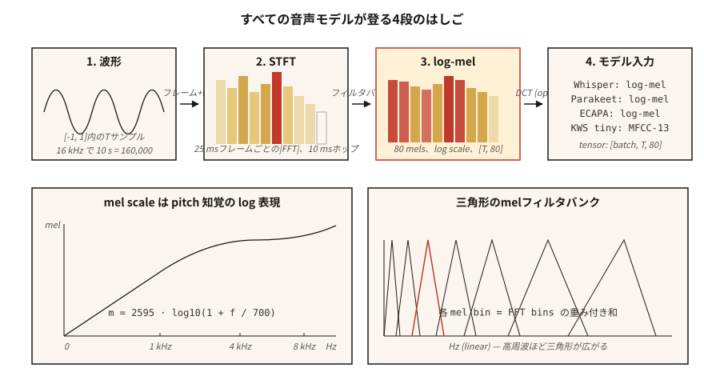

# Spektrogramlar, Mel Ölçeği ve Ses Özellikleri

> Sinir ağları ham dalga formlarını iyi tüketmez. Spektrogramları tüketirler. Mel spektrogramlarını daha da iyi tüketiyorlar. 2026'daki her ASR, TTS ve ses sınıflandırıcı bu tek ön işleme seçimiyle yaşar veya ölür.

**Tür:** Yapım
**Diller:** Python
**Önkoşullar:** Aşama 6 · 01 (Sesle İlgili Temel Bilgiler)
**Süre:** ~45 dakika

## Sorun

10 saniyelik 16 kHz'lik bir klip çekin. Bu, tamamı `[-1, 1]` cinsinden 160.000 uçuş anlamına geliyor ve "köpek havlaması" veya "kedi kelimesi" etiketiyle neredeyse tamamen alakasız. Ham dalga formu bilgiye sahiptir ancak modelin kolayca çıkaramayacağı bir formdadır. 100 ms aralıklarla konuşulan iki özdeş fonem tamamen farklı ham örneklere sahiptir.

Bir spektrogram bunu düzeltir. İnsan algısının onu görmezden geldiği (mikrosaniye titreşimi) zamansal ayrıntıyı çökertir ve algının katıldığı yapıyı korur (hangi frekanslar enerjiktir, ~10-25 ms'lik zaman pencereleri).

Mel spektrogramları daha da ileri gidiyor. İnsanlar ses perdesini logaritmik olarak algılar: 100 Hz ve 200 Hz sesleri, 1000 Hz ve 2000 Hz ile "aynı mesafede" duyulur. Mel ölçeği, frekans eksenini eşleşecek şekilde çarpıtır. Mel ölçekli bir spektrogram, 2010'dan 2026'ya kadar konuşma makine öğrenimindeki en önemli özelliktir.

## Konsept



**STFT (Kısa Zamanlı Fourier Dönüşümü).** Dalga biçimini örtüşen çerçevelere bölün (tipik: 25 ms pencere, 10 ms atlama = 400 örnek / 16 kHz'de 160 örnek). Her kareyi bir pencere fonksiyonuyla çarpın (Hann varsayılandır; Hamming biraz farklı bir ödünleşimdir). Her karede FFT. Büyüklük spektrumlarını `(n_frames, n_freq_bins)` şeklindeki bir matrise istifleyin. Bu senin spektrogramın.

**Log-büyüklük.** Ham büyüklükler 5-6 büyüklük sırasını kapsar. Dinamik aralığı sıkıştırmak için `log(|X| + 1e-6)` veya `20 * log10(|X|)`'yi alın. Her üretim hattı ham büyüklüğü değil, log-büyüklüğünü kullanır.

**Mel ölçeği.** Hz cinsinden frekans `f`, `m = 2595 * log10(1 + f / 700)` ile mel `m` ile eşleşir. Eşleme 1 kHz'in altında kabaca doğrusal ve üstünde kabaca logaritmiktir. 0–8 kHz'i kapsayan 80 mel kutu standart ASR girişidir.

**Mel filtre bankası.** Mel ölçeğine eşit aralıklarla yerleştirilmiş bir dizi üçgen filtre. Her filtre, bitişik FFT kutularının ağırlıklı toplamıdır. STFT büyüklüğünün filtre bankası matrisiyle çarpılması, bir matmulda mel spektrogramını verir.

**Log-mel spektrogramı.** `log(mel_spec + 1e-10)`. Whisper'ın girişi. Muhabbetkuşu'nun girişi. SeamlessM4T'nin girişi. Evrensel 2026 ses ön ucu.

**MFCC'ler.** Log-mel spektrogramını alın, bir DCT (tip II) uygulayın, ilk 13 katsayıyı koruyun. Özelliklerin ilişkisini düzeltir ve daha da sıkıştırır. Ham log-mel'lerdeki CNN'lerin/Transformer'lerin yetiştiği 2015 yılına kadar baskın özellik. Halen konuşmacı tanımada kullanılmaktadır (x-vektörler, ECAPA).

**Çözünürlük ticareti.** Daha büyük FFT = daha iyi frekans çözünürlüğü ancak daha kötü zaman çözünürlüğü. 25 ms / 10 ms, ses-ML varsayılanıdır; Müzik için 50 ms / 12,5 ms; Geçici algılama için 5 ms / 2 ms (davul vuruşları, patlayıcılar).

```figure
spectrogram-window
```

## İnşa Et

### Adım 1: dalga formunu çerçeveleyin

```python
def frame(signal, frame_len, hop):
    n = 1 + (len(signal) - frame_len) // hop
    return [signal[i * hop : i * hop + frame_len] for i in range(n)]
```

`frame_len=400, hop=160` ile 10 saniyelik 16 kHz'lik bir klip 998 kare üretir.

### Adım 2: Hann penceresi

```python
import math

def hann(N):
    return [0.5 * (1 - math.cos(2 * math.pi * n / (N - 1))) for n in range(N)]
```

FFT'den önce eleman bazında çarpın. Sıfır olmayan uç noktalarda kesintinin neden olduğu spektral sızıntıyı ortadan kaldırır.

### Adım 3: STFT büyüklüğü

```python
def stft_magnitude(signal, frame_len=400, hop=160):
    win = hann(frame_len)
    frames = frame(signal, frame_len, hop)
    return [magnitudes(dft([w * s for w, s in zip(win, f)])) for f in frames]
```

Üretimde `torch.stft` veya `librosa.stft` (FFT destekli, vektörleştirilmiş) kullanılır. Buradaki döngü pedagojiktir; `code/main.py`'da kısa klipler halinde yayınlanıyor.

### Adım 4: Mel filtre bankası

```python
def hz_to_mel(f):
    return 2595.0 * math.log10(1.0 + f / 700.0)

def mel_to_hz(m):
    return 700.0 * (10 ** (m / 2595.0) - 1)

def mel_filterbank(n_mels, n_fft, sr, fmin=0, fmax=None):
    fmax = fmax or sr / 2
    mels = [hz_to_mel(fmin) + (hz_to_mel(fmax) - hz_to_mel(fmin)) * i / (n_mels + 1)
            for i in range(n_mels + 2)]
    hzs = [mel_to_hz(m) for m in mels]
    bins = [int(h * n_fft / sr) for h in hzs]
    fb = [[0.0] * (n_fft // 2 + 1) for _ in range(n_mels)]
    for m in range(n_mels):
        for k in range(bins[m], bins[m + 1]):
            fb[m][k] = (k - bins[m]) / max(1, bins[m + 1] - bins[m])
        for k in range(bins[m + 1], bins[m + 2]):
            fb[m][k] = (bins[m + 2] - k) / max(1, bins[m + 2] - bins[m + 1])
    return fb
```

`n_fft=400` ile 0–8 kHz'i kapsayan 80 mel, bir `(80, 201)` matrisi verir. `(n_frames, 80)` mel spektrogramını elde etmek için `(n_frames, 201)` STFT büyüklüğünü devrik ile çarpın.

### Adım 5: log-mel

```python
def log_mel(mel_spec, eps=1e-10):
    return [[math.log(max(v, eps)) for v in frame] for frame in mel_spec]
```

Ortak alternatifler: `librosa.power_to_db` (referans normalleştirilmiş dB), `10 * log10(power + eps)`. Whisper daha kapsamlı bir klip + normalleştirme rutini kullanır (bkz. Whisper'ın `log_mel_spectrogram`).

### Adım 6: MFCC'ler

```python
def dct_ii(x, n_coeffs):
    N = len(x)
    return [
        sum(x[n] * math.cos(math.pi * k * (2 * n + 1) / (2 * N)) for n in range(N))
        for k in range(n_coeffs)
    ]
```

Her log-mel çerçevesine DCT uygulayın, ilk 13 katsayıyı koruyun. Bu sizin MFCC matrisinizdir. İlk katsayı genellikle düşürülür (toplam enerjiyi kodlar).

## Kullan onu

2026 yığını:

| Görev | Özellikler |
|------|----------|
| ASR (Fısıltı, Muhabbetkuşu, SeamlessM4T) | 80 log-mels, 10 ms atlama, 25 ms pencere |
| TTS akustik modeli (VITS, F5-TTS, Kokoro) | Hassas zamansal kontrol için 80 mel, 5–12 ms atlama |
| Ses sınıflandırması (AST, PANN'ler, BEAT'ler) | 128 log-mels, 10 ms atlama |
| Konuşmacı embedding (ECAPA-TDNN, WavLM) | 80 log-mels veya ham dalga biçimi SSL |
| Müzik (MusicGen, Sabit Ses 2) | EnCodec ayrık token'ler (mels değil) |
| Anahtar kelime tespit | Küçük cihazlar için 40 MFCC |

Temel kural: **eğer müzik üzerinde çalışmıyorsanız, 80 log-mel ile başlayın.** Kanıt yükü herhangi bir sapmaya aittir.

## 2026'da hâlâ gönderilecek tuzaklar

- **Mel sayımı uyuşmazlığı.** 80 mel ile antrenman, inference 128 mel ile. Sessiz başarısızlık. Özellik şeklini her iki uçta da günlüğe kaydedin.
- **Örnekleme oranı uyumsuzluğu yukarı akış.** 22,05 kHz'de hesaplanan Mel'ler 16 kHz'den farklı görünür. SR *öncesi* özelliği düzeltildi.
- **dB'ye karşı log.** Whisper, dB-mel'i değil log-mel'i bekler. Bazı HF boru hatları otomatik olarak algılanır; özel kodunuz bunu yapmayacaktır.
- **Normalleştirme sapması.** Eğitim sırasında ifade başına normalleştirme, inference sırasında genel normalleştirme. WER'yi ikiye katlayan üretim hatası.
- **Doldurma nedeniyle sızıntı.** Bir klibin ucunun sıfır doldurulması, arkadaki karelerde düz bir spektrum oluşturur. Simetrik olarak doldurun veya çoğaltın.

## Gönderin

`outputs/skill-feature-extractor.md` olarak kaydet. Beceri, belirli bir model hedefi için özellik türünü, erime sayısını, kare/atlamayı ve normalleştirmeyi seçer.

## Egzersizler

1. **Kolay.** `code/main.py` komutunu çalıştırın. Bir cıvıltı sentezler (frekans süpürüldü 200 → 4000 Hz) ve kare başına argmax mel bin'i yazdırır. Çizimi yapın (isteğe bağlı) ve taramayla eşleştiğini doğrulayın.
2. **Orta.** `{40, 80, 128}`'da `n_mels` ve `{200, 400, 800}`'da `frame_len` ile yeniden çalıştırın. Zaman ekseni boyunca keskin tepe bant genişliğini ölçün. Hangi kombinasyon cıvıltıyı en iyi şekilde çözer?
3. **Zor.** `power_to_db`'yi uygulayın ve (a) ham log-mel, (b) `ref=max` ile dB-mel, (c) MFCC-13 + delta + delta-delta kullanarak AudioMNIST'teki küçük bir CNN sınıflandırıcısının ASR doğruluğunu karşılaştırın. İlk 1 doğruluğu bildirin.

## Anahtar Terimler

| Dönem | İnsanlar ne diyor | Aslında ne anlama geliyor |
|------|-----------------|-----------------------|
| Çerçeve | bir dilim | Bir FFT'ye beslenen 25 ms'lik dalga biçimi öbeği. |
| Hop | Adım | Ardışık çerçeveler arasındaki örnekler; 10 ms ASR varsayılanıdır. |
| Pencere | Hann/Hamming olayı | Çerçeve kenarlarını sıfıra doğru incelen noktasal çarpan. |
| STFT | Spektrogram jeneratörü | Çerçeveli + pencereli FFT; zaman × frekans matrisini verir. |
| Mel | Çarpık frekans | Log-algı ölçeği; `m = 2595·log10(1 + f/700)`. |
| Filtre Bankası | Matris | STFT'yi mel kutularına yansıtan üçgen filtreler. |
| Log-mel | Whisper'ın girişi | `log(mel_spec + eps)`; 2026'da standartlaştırıldı. |
| MFCC | Eski tarz özellik | log-mel'in DCT'si; 13 katsayı, ilişkisizleştirilmiş. |

## Daha Fazla Okuma

- [Davis, Mermelstein (1980). Tek heceli kelime tanıma için parametrik gösterimlerin karşılaştırılması](https://ieeexplore.ieee.org/document/1163420) — MFCC makalesi.
- [Stevens, Volkmann, Newman (1937). Psikolojik Büyüklük Aralığının Ölçülmesine Yönelik Bir Ölçek](https://pubs.aip.org/asa/jasa/article-abstract/8/3/185/735757/) — orijinal mel ölçeği.
- [OpenAI — Whisper source, log_mel_spectrogram](https://github.com/openai/whisper/blob/main/whisper/audio.py) — referans uygulamasını okuyun.
- [librosa özellik çıkarma belgeleri](https://librosa.org/doc/main/feature.html) — `mfcc`, `melspectrogram` ve atlama/pencere için referans.
- [NVIDIA NeMo — ses ön işleme](https://docs.nvidia.com/deeplearning/nemo/user-guide/docs/en/main/asr/asr_all.html#featurizers) — Parakeet + Canary modelleri için üretim ölçeğinde ardışık düzen.
