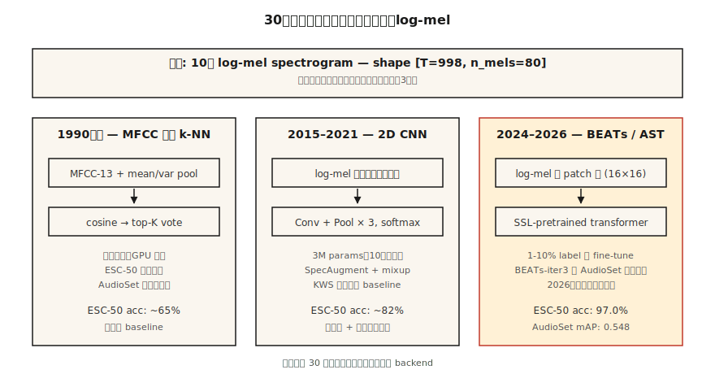

# Classificação de Áudio — De k-NN em MFCCs até AST e BEATs

> Tudo de "cachorro late vs sirene" até "que idioma é isso" é classificação de áudio. As características são mels. A arquitetura muda a cada década. A avaliação continua sendo AUC, F1 e recall por classe.

**Tipo:** Construir
**Idiomas:** Python
**Pré-requisitos:** Fase 6 · 02 (Eespecificaçãotrogramas e Mel), Fase 3 · 06 (CNNs), Fase 5 · 08 (CNNs e RNNs para Texto)
**Tempo:** ~75 minutos

## O Problema

Você recebe um clipe de 10 segundos. Quer saber: "o que é?" Som urbano (sirene, furadeira, cachorro), comando de voz (sim/não/pare), ID de idioma (en/es/ar), emoção do falante (raiva/neutro), ou som ambiental (dentro/fora, conversa). Tudo isso é *classificação de áudio*, e em 2026 a arquitetura baseline é madura: log-mel → CNN ou Transformer → softmax.

A dificuldade central não é a rede. São dados. Datasets de áudio têm desbalanceamento brutal de classes, forte shift de domínio (limpo vs ruidoso), e ruído nos rótulos (quem decidiu "conversa urbana" vs "ruído de restaurante"?). 80% do problema é curadoria, augmentação e avaliação, não trocar CNN por Transformer.

## O Conceito



**k-NN em MFCCs (o baseline dos anos 1990).** Achatar MFCCs por clipe, computar similaridade cosseno com um banco rotulado, retornar voto majoritário dos top K. Surpreendentemente forte em datasets limpos e pequenos (Speech Commands, ESC-50). Roda sem GPU.

**2D CNN em log-mels (2015-2019).** Tratar o log-mel `(T, n_mels)` como uma imagem. Aplicar ResNet-18 ou estilo VGG. Pooling médio global no eixo temporal. Softmax sobre classes. Ainda o baseline na maioria das competições Kaggle de 2026.

**Audio Spectrogram Transformer, AST (2021-2024).** Patchificar o log-mel (ex. patches 16×16), adicionar embeddings posicionais, alimentar um ViT. Estado da arte no AudioSet (mAP 0.485) para aprendizado supervisionado.

**BEATs e WavLM-base (2024-2026).** Pré-treino auto-supervisionado em milhões de horas. Ajuste fino na sua tarefa com 1-10% dos dados supervisionados que você precisaria. Em 2026 esse é o ponto de partida padrão para áudio não-fala. BEATs-iter3 supera AST por 1-2 mAP no AudioSet usando 1/4 do compute.

**Encoder do Whisper como backbone congelado (2024).** Pegue o encoder do Whisper, descarte o decoder, adicione um classificador linear. Quase-SOTA em ID de idioma e classificação simples de eventos com zero augmentação de áudio. O baseline de "almoço grátis".

### O desbalanceamento de classe é o desafio real

ESC-50: 50 classes, 40 clips cada — balanceado, fácil. UrbanSound8K: 10 classes, desbalanceado 10:1. AudioSet: 632 classes com uma cauda longa de 100.000:1. Técnicas que funcionam:

- Amostragem balanceada durante treino (não na avaliação).
- Mixup: interpolar linearmente dois clips (e seus rótulos) como augmentação.
- SpecAugment: mascarar bandas aleatórias de tempo e frequência. Simples; crítico.

### Avaliação

- Multiclasse exclusiva (Speech Commands): acurácia top-1, top-5.
- Multiclasse multi-rótulo (AudioSet, estilo UrbanSound): precisão média (mAP).
- Fortemente desbalanceado: recall por classe + F1 macro.

Números de 2026 que você deve conhecer:

| Benchmark | Baseline | SOTA 2026 | Fonte |
|-----------|----------|-----------|-------|
| ESC-50 | 82% (AST) | 97.0% (BEATs-iter3) | Paper BEATs (2024) |
| AudioSet mAP | 0.485 (AST) | 0.548 (BEATs-iter3) | HEAR ranking 2026 |
| Speech Commands v2 | 98% (CNN) | 99.0% (Audio-MAE) | Resultados HEAR v2 |

## Construa

### Passo 1: extração de características

```python
def featurize_mfcc(signal, sr, n_mfcc=13, n_mels=40, frame_len=400, hop=160):
    mag = stft_magnitude(signal, frame_len, hop)
    fb = mel_filterbank(n_mels, frame_len, sr)
    mels = apply_filterbank(mag, fb)
    log = log_transform(mels)
    return [dct_ii(frame, n_mfcc) for frame in log]
```

### Passo 2: resumo de tamanho fixo

```python
def summarize(mfcc_frames):
    n = len(mfcc_frames[0])
    mean = [sum(f[i] for f in mfcc_frames) / len(mfcc_frames) for i in range(n)]
    var = [
        sum((f[i] - mean[i]) ** 2 for f in mfcc_frames) / len(mfcc_frames) for i in range(n)
    ]
    return mean + var
```

Simples mas forte: média + variância ao longo do tempo dá um embedding fixo de 26 dimensões para uma MFCC de 13 coeficientes. Roda instantaneamente. Derrotou baselines neurais SOTA no ESC-50 em 2017.

### Passo 3: k-NN

```python
def cosine(a, b):
    dot = sum(x * y for x, y in zip(a, b))
    na = math.sqrt(sum(x * x for x in a)) or 1e-12
    nb = math.sqrt(sum(x * x for x in b)) or 1e-12
    return dot / (na * nb)

def knn_classify(q, bank, rótulos, k=5):
    sims = sorted(range(len(bank)), key=lambda i: -cosine(q, bank[i]))[:k]
    votes = Counter(rótulos[i] for i in sims)
    return votes.most_common(1)[0][0]
```

### Passo 4: upgrade para CNN em log-mels

Em PyTorch:

```python
import torch.nn as nn

class AudioCNN(nn.Module):
    def __init__(self, n_mels=80, n_classes=50):
        super().__init__()
        self.body = nn.Sequential(
            nn.Conv2d(1, 32, 3, padding=1), nn.ReLU(), nn.MaxPool2d(2),
            nn.Conv2d(32, 64, 3, padding=1), nn.ReLU(), nn.MaxPool2d(2),
            nn.Conv2d(64, 128, 3, padding=1), nn.ReLU(),
            nn.AdaptiveAvgPool2d(1),
        )
        self.head = nn.Linear(128, n_classes)

    def forward(self, x):  # x: (B, 1, T, n_mels)
        return self.head(self.body(x).flatten(1))
```

3M parâmetros. Treina em ~10 min no ESC-50 com uma RTX 4090. 80%+ de acurácia.

### Passo 5: o padrão de 2026 — ajuste fino em BEATs

```python
from transformers import ASTFeatureExtractor, ASTForAudioClassification

ext = ASTFeatureExtractor.from_pretrained("MIT/ast-finetuned-audioset-10-10-0.4593")
model = ASTForAudioClassification.from_pretrained(
    "MIT/ast-finetuned-audioset-10-10-0.4593",
    num_rótulos=50,
    ignore_mismatched_sizes=True,
)

inputs = ext(audio, sampling_rate=16000, return_tensors="pt")
logits = model(**inputs).logits
```

Para BEATs, use `microsoft/BEATs-base` via a biblioteca `beats`; a API de transformers tem o mesmo formato.

## Use

A pilha de 2026:

| Situação | Comece com |
|----------|-----------|
| Dataset pequeno (<1000 clips) | k-NN em MFCCs (seu baseline) + augmentação de áudio |
| Dataset médio (1K–100K) | BEATs ou AST com ajuste fino |
| Dataset grande (>100K) | Treinar do zero ou ajuste fino do encoder Whisper |
| Tempo real, edge | CNN de 40-MFCC, quantizado para int8 (estilo KWS) |
| Multi-rótulo (AudioSet) | BEATs-iter3 com BCE loss + mixup + SpecAugment |
| ID de idioma | MMS-LID, baseline SpeechBrain VoxLingua107 |

Regra de ouro: **comece com um backbone congelado, não um modelo novo**. Ajustar um head do BEATs te dá 95% do SOTA em horas, não semanas.

## Entregue

Salve como `outputs/skill-classifier-designer.md`. Escolha arquitetura, augmentações, estratégia de balanceamento de classes e métrica de avaliação para uma tarefa de classificação de áudio.

## Exercícios

1. **Fácil.** Execute `code/main.py`. Treina o baseline k-NN MFCC em um dataset sintético de 4 classes (tons puros em pitches diferentes). Reporte a matriz de confusão.
2. **Médio.** Substitua `summarize` por [média, variância, skew, curtose]. O pooling de 4 momentos supera média+variância no mesmo dataset sintético?
3. **Difícil.** Usando `torchaudio`, treine uma 2D CNN no ESC-50 fold 1. Reporte acurácia de validação cruzada 5-fold. Adicione SpecAugment (time mask = 20, freq mask = 10) e reporte o delta.

## Termos Chave

| Termo | O que a gente diz | O que significa de verdade |
|-------|-------------------|---------------------------|
| AudioSet | O ImageNet do áudio | Dataset do Google com 2M clips, 632 classes, rótulos fracos do YouTube. |
| ESC-50 | Benchmark pequeño de classificação | 50 classes × 40 clips de sons ambientais. |
| AST | Audio Spectrogram Transformer | ViT em patches de log-mel; SOTA de 2021. |
| BEATs | Áudio auto-supervisionado | Modelo da Microsoft, iter3 lidera AudioSet em 2026. |
| Mixup | Augmentação de pares | `x = λ·x1 + (1-λ)·x2; y = λ·y1 + (1-λ)·y2`. |
| SpecAugment | Augmentação baseada em máscara | Zerar bandas aleatórias de tempo e frequência do eespecificaçãotrograma. |
| mAP | Métrica principal multi-rótulo | Precisão média across classes e limiares. |

## Leitura Adicional

- [Gong, Chung, Glass (2021). AST: Audio Spectrogram Transformer](https://arxiv.org/abs/2104.01778) — a arquitetura de referência de 2021–2024.
- [Chen et al. (2022, rev. 2024). BEATs: Audio Pre-Training with Acoustic Tokenizers](https://arxiv.org/abs/2212.09058) — o padrão pós-2024.
- [Park et al. (2019). SpecAugment](https://arxiv.org/abs/1904.08779) — a augmentação de áudio dominante.
- [Piczak (2015). ESC-50 dataset](https://github.com/karolpiczak/ESC-50) — benchmark de 50 classes que persiste.
- [Gemmeke et al. (2017). AudioSet](https://research.google.com/audioset/) — taxonomia de 632 classes do YouTube; ainda o padrão ouro.
