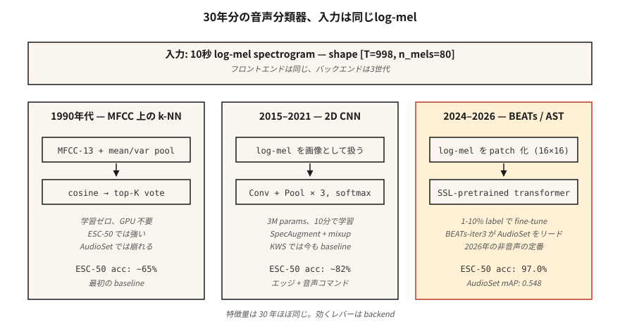

# Ses Sınıflandırması — MFCC'lerdeki k-NN'den AST ve BEAT'lere kadar

> "Köpek havlaması vs siren"den "bu hangi dil"e kadar her şey ses sınıflandırmasıdır. Özellikleri çok iyi. Mimari her on yılda bir hareket ediyor. Değerlendirme AUC, F1 ve sınıf başına geri çağırma olarak kalır.

**Tür:** Yapım
**Diller:** Python
**Önkoşullar:** Aşama 6 · 02 (Spektrogramlar ve Mel), Aşama 3 · 06 (CNN'ler), Aşama 5 · 08 (Metin için CNN'ler ve RNN'ler)
**Süre:** ~75 dakika

## Sorun

10 saniyelik bir klip alırsınız. Bilmek istiyorsun: "Bu nedir?" Şehir sesi (siren, tatbikat, köpek), konuşma komutu (evet/hayır/dur), dil kimliği (en/es/ar), konuşmacının duygusu (kızgın/nötr) veya çevresel ses (iç mekan/dış mekan, gevezelik). Bunların hepsi *ses sınıflandırmasıdır* ve 2026'da temel mimari olgunlaşmıştır: log-mel → CNN veya Transformer → softmax.

Temel zorluk ağ değil. Bu veridir. Ses dataset'lerde acımasız sınıf dengesizliği, güçlü alan değişikliği (temiz ve gürültülü) ve etiket gürültüsü ("kentsel gevezelik" ve "restoran gürültüsü"ne kim karar verdi?) var. Sorunun %80'i, CNN'in Transformer ile değiştirilmesi değil, iyileştirme, geliştirme ve değerlendirmedir.

## Konsept



**MFCC'lerde k-NN (1990'ların temeli).** Klip başına MFCC'leri düzleştirin, etiketli bir bankayla kosinüs benzerliğini hesaplayın, en üstteki K'nın çoğunluk oyu döndürün. Temiz, küçük dataset'lerde şaşırtıcı derecede güçlü (Konuşma Komutları, ESC-50). GPU olmadan çalışır.

**log-mels'de 2D CNN (2015-2019).** `(T, n_mels)` log-mel'i bir görüntü olarak ele alın. ResNet-18 veya VGG stilini uygulayın. Küresel ortalama, zaman eksenini havuzlayın. Sınıflar üzerinde Softmax. Hala çoğu 2026 kaggle yarışmasında temel çizgi.

**Ses Spektrogramı Transformer, AST (2021-2024).** Log-mel'i yamalayın (e.g. 16×16 yamalar), embedding konumlarını ekleyin, bir ViT'ye besleyin. Denetimli öğrenme için AudioSet'teki son teknoloji (mAP 0.485).

**BEAT'ler ve WavLM tabanı (2024-2026).** Milyonlarca saat süren, kendi kendini denetleyen ön eğitim. İhtiyaç duyacağınız denetlenen verilerin %1-10'unu kullanarak görevinize ince ayar yapın. 2026'da bu, konuşma dışı ses için varsayılan başlangıç ​​noktasıdır. BEATs-iter3, işlem miktarının 1/4'ünü kullanırken AudioSet'te AST'yi 1-2 mAP yener.

**Dondurulmuş bir omurga olarak Whisper-kodlayıcı (2024).** Whisper'ın kodlayıcısını alın, kod çözücüyü bırakın, doğrusal bir sınıflandırıcı ekleyin. Dil kimliğinde SOTA'ya yakın ve sıfır ses artırmayla basit olay sınıflandırması. "Ücretsiz öğle yemeği" temeli.

### Sınıf dengesizliği asıl zorluktur

ESC-50: 50 sınıf, her biri 40 klip — dengeli, kolay. UrbanSound8K: 10 sınıf, dengesiz 10:1. AudioSet: 100.000:1 uzun kuyruklu 632 sınıf. İşe yarayan teknikler:

- Eğitim sırasında dengeli örnekleme (değerlendirmede değil).
- Karıştırma: iki klibi (ve etiketlerini) büyütme olarak doğrusal olarak enterpolasyonlayın.
- SpecAugment: rastgele zaman ve frekans bantlarını maskeler. Basit; kritik.

### Değerlendirme

- Çok sınıflı özel (Konuşma Komutları): ilk 1 doğruluk, ilk 5 doğruluk.
- Çok sınıflı çoklu etiket (AudioSet, UrbanSound tarzı): ortalama hassasiyet (mAP).
- Oldukça dengesiz: sınıf başına geri çağırma + makro F1.

Bilmeniz gereken 2026 rakamı:

| Benchmark | Temel | SOTA 2026 | Kaynak |
|-----------|----------|-----------|--------|
| ESC-50 | %82 (AST) | %97,0 (BEATs-iter3) | BEATs makalesi (2024) |
| AudioSet mAP | 0,485 (AST) | 0,548 (BEAT'ler-iter3) | HEAR liderlik tablosu 2026 |
| Konuşma Komutları v2 | %98 (CNN) | %99,0 (Ses-MAE) | HEAR v2 sonuçlarını |

## İnşa Et

### Adım 1: Özelleştirme

```python
def featurize_mfcc(signal, sr, n_mfcc=13, n_mels=40, frame_len=400, hop=160):
    mag = stft_magnitude(signal, frame_len, hop)
    fb = mel_filterbank(n_mels, frame_len, sr)
    mels = apply_filterbank(mag, fb)
    log = log_transform(mels)
    return [dct_ii(frame, n_mfcc) for frame in log]
```

### 2. Adım: sabit uzunluklu özet

```python
def summarize(mfcc_frames):
    n = len(mfcc_frames[0])
    mean = [sum(f[i] for f in mfcc_frames) / len(mfcc_frames) for i in range(n)]
    var = [
        sum((f[i] - mean[i]) ** 2 for f in mfcc_frames) / len(mfcc_frames) for i in range(n)
    ]
    return mean + var
```

Basit ama güçlü: zaman içindeki ortalama + varyans, 13 katsayılı bir MFCC için 26-dim sabit embedding verir. Anında çalışır. 2017 gibi yakın bir tarihte ESC-50'de en son teknolojiye sahip NN temellerini geçin.

### Adım 3: k-NN

```python
def cosine(a, b):
    dot = sum(x * y for x, y in zip(a, b))
    na = math.sqrt(sum(x * x for x in a)) or 1e-12
    nb = math.sqrt(sum(x * x for x in b)) or 1e-12
    return dot / (na * nb)

def knn_classify(q, bank, labels, k=5):
    sims = sorted(range(len(bank)), key=lambda i: -cosine(q, bank[i]))[:k]
    votes = Counter(labels[i] for i in sims)
    return votes.most_common(1)[0][0]
```

### Adım 4: log-mels'te CNN'ye yükseltme

PyTorch'ta:

```python
import torch.nn as nn

class AudioCNN(nn.Module):
    def __init__(self, n_mels=80, n_classes=50):
        super().__init__()
        self.body = nn.Sequential(
            nn.Conv2d(1, 32, 3, padding=1), nn.ReLU(), nn.MaxPool2d(2),
            nn.Conv2d(32, 64, 3, padding=1), nn.ReLU(), nn.MaxPool2d(2),
            nn.Conv2d(64, 128, 3, padding=1), nn.ReLU(),
            nn.AdaptiveAvgPool2d(1),
        )
        self.head = nn.Linear(128, n_classes)

    def forward(self, x):  # x: (B, 1, T, n_mels)
        return self.head(self.body(x).flatten(1))
```

3M parametreleri. Tek bir RTX 4090 ile ESC-50'de ~10 dakikada eğitilir. %80+ doğruluk.

### Adım 5: 2026 varsayılanı — BEAT'lere ince ayar yapın

```python
from transformers import ASTFeatureExtractor, ASTForAudioClassification

ext = ASTFeatureExtractor.from_pretrained("MIT/ast-finetuned-audioset-10-10-0.4593")
model = ASTForAudioClassification.from_pretrained(
    "MIT/ast-finetuned-audioset-10-10-0.4593",
    num_labels=50,
    ignore_mismatched_sizes=True,
)

inputs = ext(audio, sampling_rate=16000, return_tensors="pt")
logits = model(**inputs).logits
```

BEAT'ler için `beats` kitaplığı aracılığıyla `microsoft/BEATs-base`'yi kullanın; transformers API'si aynı şekildedir.

## Kullan onu

2026 yığını:

| Durum | Şununla başla |
|-----------|-----------|
| Minik dataset (<1000 klip) | MFCC'de k-NN, (temel çizginiz) + ses artırma anlamına gelir |
| Orta dataset (1K–100K) | BEAT'ler veya AST'nin ince ayarı |
| Büyük dataset (>100K) | Sıfırdan eğitin veya Whisper kodlayıcıya ince ayar yapın |
| Gerçek zamanlı, uç | 40-MFCC CNN, int8'e nicemlenmiş (KWS stili) |
| Çoklu etiket (AudioSet) | BCE kaybı + karışım + SpecAugment ile BEATs-iter3 |
| Dil Kimliği | MMS-LID, SpeechBrain VoxLingua107 temel çizgisi |

Karar kuralı: **yeni bir modelle değil, donmuş bir omurgayla başlayın**. Fine-tuning BEAT'in kafası size SOTA'nın %95'ini haftalar değil, saatler içinde kazandırır.

## Gönderin

`outputs/skill-classifier-designer.md` olarak kaydedin. Belirli bir ses sınıflandırma görevi için mimariyi, genişletmeleri, sınıf dengesi stratejisini ve değerlendirme ölçüsünü seçin.

## Egzersizler

1. **Kolay.** `code/main.py`'yi çalıştırın. K-NN MFCC temel çizgisini 4 sınıflı sentetik dataset (farklı perdelerdeki saf tonlar) üzerinde eğitir. Karışıklık matrisini bildirin.
2. **Orta.** `summarize`'yi [ortalama, değişken, çarpık, basıklık] ile değiştirin. 4 dakikalık havuzlama atımı aynı sentetik dataset üzerinde +varlık anlamına mı geliyor?
3. **Zor.** `torchaudio`'yi kullanarak ESC-50 kat 1 üzerinde 2D CNN eğitin. 5 kat çapraz doğrulama doğruluğunu bildirin. SpecAugment'i ekleyin (zaman maskesi = 20, frekans maskesi = 10) ve deltayı bildirin.

## Anahtar Terimler

| Dönem | İnsanlar ne diyor | Aslında ne anlama geliyor |
|------|-----------------|-----------------------|
| Ses Seti | Sesin ImageNet'i | Google'ın 2M klibi, 632 sınıfı zayıf etiketli YouTube dataset. |
| ESC-50 | Küçük sınıflandırma benchmark | 50 sınıf × 40 çevresel ses klibi. |
| AST | Ses Spektrogramı Transformer | log-mel yamalarında ViT; 2021 SOTA. |
| BEAT'ler | Kendi kendini denetleyen ses | Microsoft modeli, iter3, 2026 itibarıyla AudioSet'e liderlik ediyor. |
| Karışık | Çift büyütme | `x = λ·x1 + (1-λ)·x2; y = λ·y1 + (1-λ)·y2`. |
| SpecAugment | Maske tabanlı büyütme | Spektrogramın rastgele zaman ve frekans bantlarının sıfırlanması. |
| harita | Ana çoklu etiket metriği | Sınıflar ve eşikler genelinde ortalama ortalama hassasiyet. |

## Daha Fazla Okuma

- [Gong, Chung, Cam (2021). AST: Ses Spektrogramı Transformer](https://arxiv.org/abs/2104.01778) — 2021–2024 kayıt mimarisi.
- [Chen ve ark. (2022, rev. 2024). BEAT'ler: Akustik Tokenizer'lerle Ses Ön Eğitimi](https://arxiv.org/abs/2212.09058) — 2024+ varsayılanı.
- [Park ve ark. (2019). SpecAugment](https://arxiv.org/abs/1904.08779) — baskın ses artırma.
- [Piczak (2015). ESC-50 dataset](https://github.com/karolpiczak/ESC-50) — Yaşamaya devam eden 50 sınıf benchmark.
- [Gemmeke ve ark. (2017). AudioSet](https://research.google.com/audioset/) — 632 sınıfı YouTube sınıflandırması; hala altın standart.
