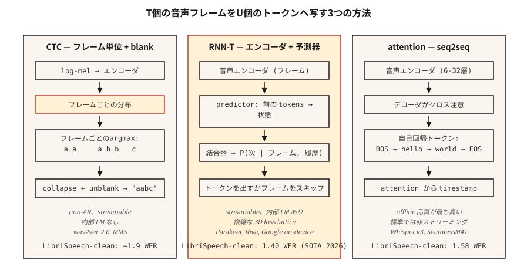

# Konuşma Tanıma (ASR) — CTC, RNN-T, Dikkat

> Konuşma tanıma, İngilizce ve sessizliği bilen bir dizi modeliyle birbirine yapıştırılmış, her zaman adımında ses sınıflandırmasıdır. CTC, RNN-T ve dikkat bunu yapmanın üç yoludur. Birini seçin ve nedenini anlayın.

**Tür:** Yapım
**Diller:** Python
**Önkoşullar:** Aşama 6 · 02 (Spektrogramlar ve Mel), Aşama 5 · 08 (Metin için CNN'ler ve RNN'ler), Aşama 5 · 10 (Dikkat)
**Süre:** ~45 dakika

## Sorun

10 saniyelik 16 kHz klibiniz var. Bir dize istiyorsun: "mutfak ışıklarını aç". Buradaki zorluk yapısaldır: Ses çerçeveleri karakterlerle bire bir hizalanmamaktadır. "Tamam" kelimesi 200 ms veya 1200 ms sürebilir. Sessizlik cümleyi noktalıyor. Bazı fonemler diğerlerinden daha uzundur. token çıkışlarının sayısı önceden bilinmemektedir.

Üç formülasyon bunu çözer:

1. **CTC (Bağlantıcı Zamansal Sınıflandırma).** Özel bir *boşluk* dahil olmak üzere kare başına token olasılıkları yayınlayın. Kod çözme sırasında tekrarları ve boşlukları daraltın. Otoregresif olmayan, hızlı. wav2vec 2.0, MMS tarafından kullanılır.
2. **RNN-T (Tekrarlayan Neural Network Dönüştürücü).** Ortak ağ, verilen kodlayıcı çerçevesini ve önceki token'leri sonraki token'yi tahmin eder. Yayınlanabilir. Google'ın cihaz içi ASR'si NVIDIA Parakeet tarafından kullanılır.
3. **Kodlayıcı-kod çözücüye dikkat.** Kodlayıcı sesi gizli durumlara sıkıştırır, kod çözücü token'leri otomatik regresif olarak oluşturmak için çapraz katılım sağlar. Whisper, SeamlessM4T tarafından kullanılır.

2026'da LibriSpeech test temizliğinde SOTA WER %1,4 (Parakeet-TDT-1.1B, NVIDIA) ve %1,58 (Whisper-Large-v3-turbo) oldu. Farklılıklar çok küçüktür; deployment farkları çok büyük.

## Konsept



**CTC sezgisi.** Kodlayıcının `V+1` token'ler (V karakterleri + boş) üzerinden `T` çerçeve düzeyi dağılımlarını çıkarmasına izin verin. `U < T` uzunluğundaki `y` hedef dizesi için, `y`'ye daraltılan herhangi bir çerçeve hizalaması sayılır. Tüm bu hizalamaların CTC kaybı toplamı. Inference: kare başına argmax, tekrarları daralt, boşlukları kaldır.

Avantajları: otoregresif olmayan, akışa uygun, sıfır bakış açısı. Dezavantajı: *koşullu bağımsızlık varsayımı* — her çerçeve tahmini diğerlerinden bağımsızdır, dolayısıyla dahili bir dil modeli yoktur. Işın arama veya sığ füzyon yoluyla harici bir LM ile sabitleyin.

**RNN-T sezgisi.** token geçmişini içeren bir *tahmin edici* ağı ve tahminci durumunu kodlayıcı çerçevesiyle `V+1` üzerinden ortak bir dağıtımda birleştiren bir *birleştirici* ekler (`+1` boştur/yayma yapmaz). CTC'nin göz ardı ettiği koşullu bağımlılığı açıkça modeller. Akış yapılabilir çünkü her adım yalnızca geçmiş kareleri ve geçmiş token'leri koşullandırır.

Avantajları: yayınlanabilir + dahili LM. Dezavantajı: eğitim daha karmaşıktır ve hafızaya ihtiyaç duyar (3 boyutlu kayıp kafesi); RNN-T kayıp çekirdekleri başlı başına bir kütüphane kategorisidir.

**Kodlayıcı-kod çözücüye dikkat.** Log-mel çerçeveleri üzerinde kodlayıcı (6-32 transformer katmanı). Kod çözücü (6-32 transformer katmanı), token'leri otomatik regresif olarak oluşturmak için kodlayıcı çıkışlarına çapraz katılım sağlar. Hizalama kısıtlaması yok; dikkat sesin herhangi bir yerine odaklanabilir. Dikkati kısıtlamadığınız sürece yayınlanamaz (yığınlanmış Whisper-Streaming, 2024).

Avantajları: çevrimdışı ASR'de en yüksek kalite, standart seq2seq araçlarıyla eğitilmesi kolaydır. Dezavantajı: otoregresif gecikme, çıkış uzunluğuyla orantılıdır; mühendislik olmadan yayın yapılamaz.

### WER: tek sayı

**Kelime Hata Oranı** = `(S + D + I) / N`, burada S=değiştirmeler, D=silmeler, I=eklemeler, N=referans kelime sayısı. Kelime düzeyinde Levenshtein düzenleme mesafesiyle eşleşir. Daha düşük olması daha iyidir. %20'nin üzerindeki bir WER genellikle kullanılamaz; %5'in altında okuma konuşması için insan eşitliğidir. Standart benchmark'lerde 2026 numara:

| Modeli | LibriSpeech test-temiz | LibriSpeech testi-diğer | Boyut |
|-------|------------------------|------------------------|------|
| Muhabbetkuşu-TDT-1.1B | %1,40 | %2,78 | 1.1B parametreleri |
| Whisper-Large-v3-turbo | %1,58 | %3,03 | 809M |
| Kanarya-1B Flaş | %1,48 | %2,87 | 1B |
| Kusursuz M4T v2 | %1,7 | %3,5 | 2.3B |

Bunların hepsi kodlayıcı-kod çözücü veya RNN-T tabanlıdır. Saf CTC sistemleri (wav2vec 2.0) test temizlemesinde %1,8-2,1 civarındadır.

## İnşa Et

### Adım 1: açgözlü CTC kod çözme

```python
def ctc_greedy(frame_logits, blank=0, vocab=None):
    # frame_logits: list of per-frame probability vectors
    preds = [max(range(len(p)), key=lambda i: p[i]) for p in frame_logits]
    out = []
    prev = -1
    for p in preds:
        if p != prev and p != blank:
            out.append(p)
        prev = p
    return "".join(vocab[i] for i in out) if vocab else out
```

İki kural: ardışık tekrarları daraltın, boşlukları bırakın. Örnek: `a a _ _ a b b _ c` → `a a b c`.

### Adım 2: ışın arama CTC'si

```python
def ctc_beam(frame_logits, beam=8, blank=0):
    import math
    beams = [([], 0.0)]  # (tokens, log_prob)
    for p in frame_logits:
        log_p = [math.log(max(pi, 1e-10)) for pi in p]
        candidates = []
        for seq, lp in beams:
            for t, lpt in enumerate(log_p):
                new = seq[:] if t == blank else (seq + [t] if not seq or seq[-1] != t else seq)
                candidates.append((new, lp + lpt))
        candidates.sort(key=lambda x: -x[1])
        beams = candidates[:beam]
    return beams[0][0]
```

Prodüksiyon, LM füzyonu ile önek ağaç ışını aramasını kullanır; bu kavramsal iskelettir.

### Adım 3: WER

```python
def wer(ref, hyp):
    r, h = ref.split(), hyp.split()
    dp = [[0] * (len(h) + 1) for _ in range(len(r) + 1)]
    for i in range(len(r) + 1):
        dp[i][0] = i
    for j in range(len(h) + 1):
        dp[0][j] = j
    for i in range(1, len(r) + 1):
        for j in range(1, len(h) + 1):
            cost = 0 if r[i - 1] == h[j - 1] else 1
            dp[i][j] = min(
                dp[i - 1][j] + 1,
                dp[i][j - 1] + 1,
                dp[i - 1][j - 1] + cost,
            )
    return dp[len(r)][len(h)] / max(1, len(r))
```

### Adım 4: Whisper'a karşı inference

```python
import whisper
model = whisper.load_model("large-v3-turbo")
result = model.transcribe("clip.wav")
print(result["text"])
```

2026'nın en güçlü genel ASR'si için tek satırlık. 24 GB GPU'da ~20 kat gerçek zamanlı olarak çalışır.

### Adım 5: Parakeet veya wav2vec 2.0 ile akış

```python
from transformers import pipeline
asr = pipeline("automatic-speech-recognition", model="nvidia/parakeet-tdt-1.1b")
for chunk in streaming_audio():
    print(asr(chunk, return_timestamps=True))
```

ASR akışı, parçalanmış kodlayıcı dikkatine ve aktarım durumuna ihtiyaç duyar; onu destekleyen bir kitaplık kullanın (Parakeet için NeMo, `chunk_length_s` ile `transformers` ardışık düzeni).

## Kullan onu

2026 yığını:

| Durum | Seç |
|-----------|------|
| İngilizce, çevrimdışı, maksimum kalite | Whisper-büyük-v3-turbo |
| Çok dilli, sağlam | SeamlessM4T v2 |
| Akış, düşük gecikme | Parakeet-TDT-1.1B veya Riva |
| Edge, mobil, <500 ms gecikme | Whisper-Tiny nicemlenmiş veya Moonshine (2024) |
| Uzun biçimli | VAD tabanlı parçalama (WhisperX) ile Whisper |
| Alana özel (medikal, hukuki) | wav2vec 2.0 + etki alanı LM füzyonunda ince ayar yapın |

## 2026'da hâlâ gönderilecek tuzaklar

- **VAD yok.** Whisper'ı sessizlikte çalıştırmak halüsinasyonlara neden olur ("İzlediğiniz için teşekkürler!"). Daima VAD ile geçiş yapın.
- **Karakter, kelime ve alt kelime WER.** Normalleştirmeden (küçük harf, noktalama işaretleri çıkarıldıktan sonra) kelime düzeyinde WER'yi rapor edin.
- **Dil kimliği kayması.** Whisper'ın otomatik LID'si gürültülü klipleri Japonca veya Galce'ye yanlış yönlendirir; bildiğiniz zaman `language="en"`'yi zorlayın.
- **Parçalanma olmadan uzun klipler.** Whisper'ın 30 saniyelik bir penceresi vardır. Daha uzun bir süre için `chunk_length_s=30, stride=5` kullanın.

## Gönderin

`outputs/skill-asr-picker.md` olarak kaydedin. Belirli bir deployment hedefi için modeli, kod çözme stratejisini, parçalamayı ve LM füzyonunu seçin.

## Egzersizler

1. **Kolay.** `code/main.py`'yi çalıştırın. El yapımı bir CTC çıktısının kodunu açgözlülükle çözer ve bir referansa göre WER'yi hesaplar.
2. **Orta.** 2. Adımdaki önek ağacı ışın aramasını doğru şekilde uygulayın (boş birleştirme kuralını hesaba katın). 10 örnekli sentetik dataset üzerinde açgözlüyle karşılaştırın.
3. **Zor.** [LibriSpeech test-clean](https://www.openslr.org/12) üzerinde `whisper-large-v3-turbo` kullanın. İlk 100 ifadenin WER'sini hesaplayın. Yayınlanan sayılarla karşılaştırın.

## Anahtar Terimler

| Dönem | İnsanlar ne diyor | Aslında ne anlama geliyor |
|------|-----------------|-----------------------|
| CTC | Boş-token kaybı | Tüm çerçeveden token'ye hizalamalarda marjinal; AR olmayan. |
| RNN-T | Akış kaybı | CTC + sonraki token tahmincisi; Kelime sırasını yönetir. |
| Dikkat enc-dec | Fısıltı tarzı | Kodlayıcı + çapraz katılımlı kod çözücü; en iyi çevrimdışı kalite. |
| WER | Bildirdiğiniz numara | Kelime düzeyinde `(S+D+I)/N`. |
| Boş | boşluk | CTC'de "bu karede emisyon yok" sinyalini veren özel token. |
| LM füzyonu | Dış dil modeli | Işın araması sırasında ağırlıklı LM günlük problarını ekleyin. |
| VAD | Sessizlik kapısı | Ses etkinliği dedektörü; Konuşmamayı düzeltir. |

## Daha Fazla Okuma

- [Graves ve ark. (2006). Bağlantıcı Geçici Sınıflandırma](https://www.cs.toronto.edu/~graves/icml_2006.pdf) — CTC makalesi.
- [Mezarlar (2012). RNN'lerle Dizi Transdüksiyonu](https://arxiv.org/abs/1211.3711) — RNN-T makalesi.
-[Radford ve ark. / OpenAI (2022). Fısıltı: Büyük Ölçekli Zayıf Denetim aracılığıyla Sağlam Konuşma Tanıma](https://arxiv.org/abs/2212.04356) — 2022 standart makalesi; 2024'te v3-turbo uzantısı.
- [NVIDIA NeMo — Parakeet-TDT kartı](https://huggingface.co/nvidia/parakeet-tdt-1.1b) — 2026 Açık ASR Skor Tablosu lideri.
- [Sarılma Yüzü — ASR Skor Tablosunu Aç](https://huggingface.co/spaces/hf-audio/open_asr_leaderboard) — 25'ten fazla modelde canlı benchmark.
