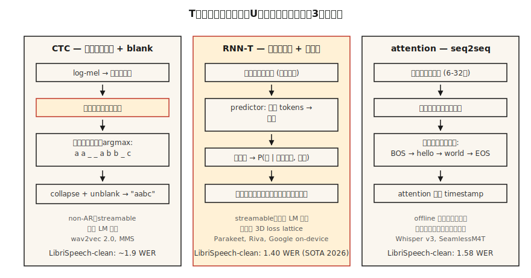

# 语音识别（ASR）——CTC、RNN-T、注意力机制

> 语音识别是在每个时间步上进行的音频分类，并通过一个知晓英语和静音的序列模型将结果拼接起来。CTC、RNN-T 和注意力机制是实现这一目标的三种方式。选择其中一种并理解其原理。

**类型：** 构建  
**语言：** Python  
**前置知识：** 阶段 6 · 02（频谱图与梅尔频谱）、阶段 5 · 08（用于文本的 CNN 与 RNN）、阶段 5 · 10（注意力机制）  
**时间：** 约 45 分钟

## 问题

你有一个 10 秒、16 kHz 的音频片段，想要得到字符串 "turn on the kitchen lights"。挑战在于结构层面：音频帧与字符之间并非一一对应。"okay" 这个词可能持续 200 毫秒，也可能持续 1200 毫秒。静音标点着整个语句。有些音素比其他音素更长。输出 token 的数量预先未知。

三种方案解决了这个问题：

1. **CTC（连接主义时间分类，Connectionist Temporal Classification）**。输出每帧的 token 概率，包含一个特殊的 *空白* 标记。在解码时合并重复并移除空白。非自回归，速度快。被 wav2vec 2.0、MMS 使用。
2. **RNN-T（循环神经网络换能器，Recurrent Neural Network Transducer）**。联合网络根据编码器帧和之前的 token 预测下一个 token。可流式处理。被 Google 的端侧 ASR、NVIDIA Parakeet 使用。
3. **注意力编码器-解码器**。编码器将音频压缩为隐藏状态，解码器通过交叉注意力自回归地生成 token。被 Whisper、SeamlessM4T 使用。

截至 2026 年，LibriSpeech test-clean 上的 SOTA WER 为 1.4%（Parakeet-TDT-1.1B，NVIDIA）和 1.58%（Whisper-Large-v3-turbo）。差异微小，但部署差异巨大。

## 概念



**CTC 直觉。** 让编码器输出 `T` 个帧级分布，每个分布覆盖 `V+1` 个 token（V 个字符 + 空白）。对于长度为 `U < T` 的目标字符串 `y`，任何能通过折叠得到 `y` 的帧对齐方式都计入。CTC 损失对所有这样的对齐求和。推理：每帧取 argmax，合并重复，移除空白。

优点：非自回归、可流式、零前向查看。缺点：*条件独立性假设* —— 每帧预测独立于其他帧，因此没有内部语言模型。通过外部语言模型（借助束搜索或浅融合）来解决。

**RNN-T 直觉。** 增加了 *预测器* 网络，用于嵌入 token 历史，以及 *联合器*，将预测器状态与编码器帧结合成 `V+1` 上的联合分布（`+1` 表示空/不发射）。显式建模 CTC 忽略的条件依赖。可流式，因为每一步仅依赖于过去帧和过去的 token。

优点：可流式 + 内部语言模型。缺点：训练更复杂且内存消耗大（3D 损失格子）；RNN-T 损失核本身就是一个完整的库类别。

**注意力编码器-解码器。** 编码器（6-32 个 Transformer 层）处理 log-mel 帧。解码器（6-32 个 Transformer 层）通过交叉注意力关注编码器输出，自回归地生成 token。没有对齐约束——注意力可以关注音频的任何位置。除非限制注意力（例如 2024 年的 chunked Whisper-Streaming），否则不可流式。

优点：离线 ASR 质量最高，使用标准 seq2seq 工具易于训练。缺点：自回归延迟与输出长度成正比；不经工程处理无法流式。

### WER：唯一指标

**词错误率（Word Error Rate）** = `(S + D + I) / N`，其中 S=替换错误、D=删除错误、I=插入错误、N=参考词数。对应词级别的 Levenshtein 编辑距离。越低越好。WER 超过 20% 通常不可用；低于 5% 达到朗读语音的人类水平。2026 年标准基准数据上的数据：

| 模型 | LibriSpeech test-clean | LibriSpeech test-other | 规模 |
|-------|------------------------|------------------------|------|
| Parakeet-TDT-1.1B | 1.40% | 2.78% | 1.1B 参数 |
| Whisper-Large-v3-turbo | 1.58% | 3.03% | 809M |
| Canary-1B Flash | 1.48% | 2.87% | 1B |
| Seamless M4T v2 | 1.7% | 3.5% | 2.3B |

所有这些都是基于编码器-解码器或 RNN-T 的。纯 CTC 系统（wav2vec 2.0）在 test-clean 上约为 1.8–2.1%。

## 构建

### 步骤 1：贪婪 CTC 解码

```python
def ctc_greedy(frame_logits, blank=0, vocab=None):
    # frame_logits: 每帧概率向量列表
    preds = [max(range(len(p)), key=lambda i: p[i]) for p in frame_logits]
    out = []
    prev = -1
    for p in preds:
        if p != prev and p != blank:
            out.append(p)
        prev = p
    return "".join(vocab[i] for i in out) if vocab else out
```

两条规则：合并连续重复，丢弃空白。示例：`a a _ _ a b b _ c` → `a a b c`。

### 步骤 2：束搜索 CTC

```python
def ctc_beam(frame_logits, beam=8, blank=0):
    import math
    beams = [([], 0.0)]  # (tokens, log_prob)
    for p in frame_logits:
        log_p = [math.log(max(pi, 1e-10)) for pi in p]
        candidates = []
        for seq, lp in beams:
            for t, lpt in enumerate(log_p):
                new = seq[:] if t == blank else (seq + [t] if not seq or seq[-1] != t else seq)
                candidates.append((new, lp + lpt))
        candidates.sort(key=lambda x: -x[1])
        beams = candidates[:beam]
    return beams[0][0]
```

生产中会使用带语言模型融合的前缀树束搜索；这里是概念骨架。

### 步骤 3：WER

```python
def wer(ref, hyp):
    r, h = ref.split(), hyp.split()
    dp = [[0] * (len(h) + 1) for _ in range(len(r) + 1)]
    for i in range(len(r) + 1):
        dp[i][0] = i
    for j in range(len(h) + 1):
        dp[0][j] = j
    for i in range(1, len(r) + 1):
        for j in range(1, len(h) + 1):
            cost = 0 if r[i - 1] == h[j - 1] else 1
            dp[i][j] = min(
                dp[i - 1][j] + 1,
                dp[i][j - 1] + 1,
                dp[i - 1][j - 1] + cost,
            )
    return dp[len(r)][len(h)] / max(1, len(r))
```

### 步骤 4：基于 Whisper 的推理

```python
import whisper
model = whisper.load_model("large-v3-turbo")
result = model.transcribe("clip.wav")
print(result["text"])
```

2026 年最强通用 ASR 的一行代码。在 24 GB GPU 上运行，速度约为实时 20 倍。

### 步骤 5：使用 Parakeet 或 wav2vec 2.0 的流式处理

```python
from transformers import pipeline
asr = pipeline("automatic-speech-recognition", model="nvidia/parakeet-tdt-1.1b")
for chunk in streaming_audio():
    print(asr(chunk, return_timestamps=True))
```

流式 ASR 需要分块编码器注意力和状态延续；使用支持此功能的库（Parakeet 使用 NeMo，`transformers` 的 pipeline 使用 `chunk_length_s`）。

## 使用

2026 年的技术栈：

| 场景 | 选择 |
|-----------|------|
| 英语、离线、最高质量 | Whisper-large-v3-turbo |
| 多语言、鲁棒 | SeamlessM4T v2 |
| 流式、低延迟 | Parakeet-TDT-1.1B 或 Riva |
| 边缘、移动设备、<500 ms 延迟 | 量化版 Whisper-Tiny 或 Moonshine（2024） |
| 长音频 | 基于 VAD 分块的 Whisper（WhisperX） |
| 特定领域（医疗、法律） | 微调 wav2vec 2.0 + 领域语言模型融合 |

## 2026 年仍然存在的陷阱

- **没有 VAD。** 在静音上运行 Whisper 会产生幻觉（"Thanks for watching!"）。始终使用 VAD 进行门控。
- **字符级 vs 词级 vs 子词级 WER。** 报告标准化后（小写、去掉标点）的词级 WER。
- **语言 ID 漂移。** Whisper 的自动语言识别会将嘈杂片段误导向日语或威尔士语；在已知语言时强制指定 `language="en"`。
- **长片段未分块。** Whisper 有 30 秒窗口。对于更长的内容，使用 `chunk_length_s=30, stride=5`。

## 发布

保存为 `outputs/skill-asr-picker.md`。针对给定的部署目标，选择模型、解码策略、分块方式和语言模型融合。

## 练习

1. **简单。** 运行 `code/main.py`。它对手工制作的 CTC 输出进行贪婪解码，并计算与参考之间的 WER。
2. **中等。** 实现步骤 2 中正确的前缀树束搜索（考虑空白合并规则）。与贪婪方法在 10 个示例的合成数据集上比较。
3. **困难。** 在 [LibriSpeech test-clean](https://www.openslr.org/12) 上使用 `whisper-large-v3-turbo`。计算前 100 条语音的 WER。与已发表的数据比较。

## 关键术语

| 术语 | 人们常说的 | 实际含义 |
|------|-----------------|-----------------------|
| CTC | 空白 token 损失 | 对所有帧到 token 对齐的边际求和；非自回归。 |
| RNN-T | 流式损失 | CTC + 下一个 token 预测器；处理词序。 |
| 注意力编码器-解码器 | Whisper 风格 | 编码器 + 交叉注意力解码器；离线质量最佳。 |
| WER | 你报告的那个数字 | 词级 `(S+D+I)/N`。 |
| 空白 | 空 | CTC 中表示“该帧无发射”的特殊 token。 |
| 语言模型融合 | 外部语言模型 | 在束搜索中添加加权的语言模型对数概率。 |
| VAD | 静音门控 | 语音活动检测器；修剪非语音部分。 |

## 延伸阅读

- [Graves et al. (2006). Connectionist Temporal Classification](https://www.cs.toronto.edu/~graves/icml_2006.pdf) — CTC 论文。
- [Graves (2012). Sequence Transduction with RNNs](https://arxiv.org/abs/1211.3711) — RNN-T 论文。
- [Radford et al. / OpenAI (2022). Whisper: Robust Speech Recognition via Large-Scale Weak Supervision](https://arxiv.org/abs/2212.04356) — 2022 年经典论文；v3-turbo 扩展于 2024 年。
- [NVIDIA NeMo — Parakeet-TDT 模型卡](https://huggingface.co/nvidia/parakeet-tdt-1.1b) — 2026 年开放 ASR 排行榜领先者。
- [Hugging Face — 开放 ASR 排行榜](https://huggingface.co/spaces/hf-audio/open_asr_leaderboard) — 25+ 个模型的实时基准。