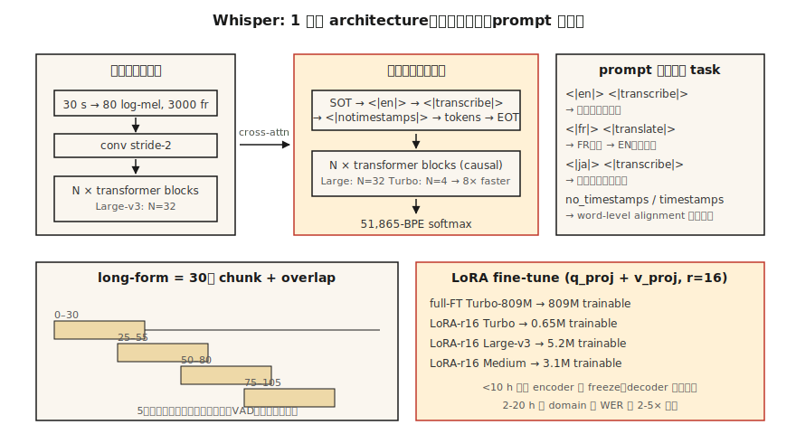

# Whisper — Arquitetura e Ajuste Fino

> Whisper é um transformer encoder-decoder com janela de 30 segundos, treinado em 680k horas de pares áudio-texto multilíngues com supervisão fraca. Uma arquitetura, múltiplas tarefas, robusto em 99 idiomas. O ASR de referência de 2026.

**Tipo:** Construir
**Idiomas:** Python
**Pré-requisitos:** Fase 6 · 04 (ASR), Fase 5 · 10 (Attention), Fase 7 · 05 (Transformer Completo)
**Tempo:** ~75 minutos

## O Problema

Whisper, lançado pela OpenAI em setembro de 2022, foi o primeiro modelo ASR a virar commodity: cola áudio, ganha texto, 99 idiomas, robusto a ruído, roda no laptop. Até 2024 a OpenAI lançou variantes Large-v3 e Turbo; em 2026, Whisper é o baseline padrão para tudo, de transcrição de podcasts a assistentes de voz a legendas do YouTube.

Mas Whisper não é uma pipeline que você pode tratar como caixa-preta pra sempre. Shift de domínio mata ele — jargão técnico, sotaques, substantivos próprios, clips curtos, silêncio. Você precisa saber:

1. O que ele realmente é por dentro.
2. Como passar áudio chunked, streaming ou formato longo corretamente.
3. Quando e como fazer ajuste fino.

## O Conceito



**Arquitetura.** Transformer encoder-decoder padrão.

- Entrada: eespecificaçãotrograma log-mel de 30 segundos, 80 mels, hop de 10 ms → 3000 frames. Clips menores são preenchidos com zeros, maiores são fatiados.
- Encoder: conv-downsample (stride 2) + `N` blocos transformer. Para Large-v3: 32 camadas, dim 1280, 20 heads.
- Decoder: `N` blocos transformer com self-attn causal + cross-attn para saída do encoder. Mesmo tamanho que o encoder.
- Saída: tokens BPE sobre vocab de 51.865 tokens.

Large-v3 tem 1,55B params. Turbo usa decoder de 4 camadas (de 32), cortando latência 8× com penalidade de WER <1%.

**O formato de prompt.** Whisper é um modelo multitarefa guiado por tokens eespecificaçãoiais no prompt do decoder:

```
<|startoftranscript|><|en|><|transcribe|><|notimestamps|> Hello world.
```

- `<|en|>` — tag de idioma; força comportamento tradução-vs-transcrição.
- `<|transcribe|>` ou `<|translate|>` — traduzir saída em inglês de qualquer idioma, ou literal.
- `<|notimestamps|>` — pular timestamps no nível de palavra (mais rápido).

O prompt é o que permite um modelo fazer muitas tarefas. Troque `<|en|>` por `<|fr|>` e ele transcreve francês.

**Janela de 30 segundos.** Tudo é fixado em 30 segundos. Clips maiores precisam de chunking; menores são preenchidos. Janelas não são transmitidas nativamente — é por isso que existem WhisperX, Whisper-Streaming e faster-whisper.

**Normalização log-mel.** `(log_mel - mean) / std` onde as estatísticas vêm do corpus de treino do Whisper. Você *precisa* usar o pré-processamento do Whisper (`whisper.audio.log_mel_especificaçãotrogram`), não `librosa.feature.melespecificaçãotrogram`.

### Variantes em 2026

| Variante | Params | Latência (A100) | WER (LibriSpeech-clean) |
|----------|--------|-----------------|------------------------|
| Tiny | 39M | 1× tempo real | 5,4% |
| Base | 74M | 1× | 4,1% |
| Small | 244M | 1× | 3,0% |
| Medium | 769M | 1× | 2,7% |
| Large-v3 | 1,55B | 2× | 1,8% |
| Large-v3-turbo | 809M | 8× | 1,58% |
| Whisper-Streaming (2024) | 1,55B | streaming | 2,0% |

### Ajuste fino

Workflow canônico em 2026:

1. Colete 10–100 horas de áudio do domínio alvo com transcrições alinhadas.
2. Rode `transformers.Seq2SeqTrainer` com callback `generate_with_loss`.
3. Eficiente em parâmetros: LoRA em `q_proj`, `k_proj`, `v_proj` das camadas de attention reduz memória de GPU 4× com custo de WER <0,3.
4. Congele o encoder se tiver <10 horas. Ajuste apenas o decoder.
5. Use o tokenizer e formato de prompt do próprio Whisper; nunca troque tokenizers.

Resultados da comunidade: ajuste fino do Medium em 20 horas de ditado médico reduz WER de 12% para 4,5% em vocabulário médico. Ajuste fino do Turbo em 4 horas de islandês reduz WER de 18% para 6%.

## Construa

### Passo 1: rode o Whisper out-of-the-box

```python
import whisper
model = whisper.load_model("large-v3-turbo")
result = model.transcribe(
    "clip.wav",
    language="en",
    task="transcribe",
    temperature=0.0,
    condition_on_previous_text=False,
)
print(result["text"])
for seg in result["segments"]:
    print(f"[{seg['start']:.2f}–{seg['end']:.2f}] {seg['text']}")
```

Defaults importantes que você deve sempre sobrescrever: `temperature=0.0` (cadeia de reserva de sampling), `condition_on_previous_text=False` (previne alucinação em cascata), e `no_speech_threshold=0.6` (detecção de silêncio).

### Passo 2: formato longo chunked

```python
import whisperx
model = whisperx.load_model("large-v3-turbo", device="cuda", compute_type="float16")
segments = model.transcribe("1hour.mp3", batch_size=16, chunk_size=30)
```

WhisperX adiciona (1) gate VAD Silero, (2) alinhamento no nível de palavra via wav2vec 2.0, (3) diarização via `pyannote.audio`. O cavalo de batalha de transcrição em produção em 2026.

### Passo 3: ajuste fino com LoRA

```python
from transformers import WhisperForConditionalGeneration, WhisperProcessor
from peft import LoraConfig, get_peft_model

model = WhisperForConditionalGeneration.from_pretrained("openai/whisper-large-v3-turbo")
lora = LoraConfig(
    r=16, lora_alpha=32, target_modules=["q_proj", "v_proj"],
    lora_dropout=0.1, bias="none", task_type="SEQ_2_SEQ_LM",
)
model = get_peft_model(model, lora)
# model.print_trainable_parameters()  -> ~3M treináveis / 809M total
```

Depois o loop padrão do Trainer. Checkpoint a cada 1000 steps. Avalie com WER no conjunto de validação.

### Passo 4: inespecificaçãoione o que cada camada aprende

```python
with torch.inference_mode():
    out = model.generate(
        input_features=features,
        return_dict_in_generate=True,
        output_attentions=True,
    )
# out.cross_attentions: layer × head × step × src_len
```

Visualize com um heatmap — você verá alinhamento diagonal à medida que os steps do decoder escaneiam os frames do encoder. Essa diagonal é a noção de timestamps do Whisper.

## Use

A pilha de 2026:

| Situação | Escolha |
|----------|---------|
| Inglês geral, offline | Large-v3-turbo via `whisperx` |
| Mobile / edge | Whisper-Tiny quantizado (int8) ou Moonshine |
| Formato longo multilíngue | Large-v3 via `whisperx` + diarização |
| Idioma de baixo recurso | Ajuste fino de Medium ou Turbo com LoRA |
| Streaming (latência 2 s) | Whisper-Streaming ou Parakeet-TDT |
| Timestamps no nível de palavra | WhisperX (alinhamento forçado via wav2vec 2.0) |

`faster-whisper` (backend CTranslate2) é o runtime de inferência CPU+GPU mais rápido em 2026 — 4× mais rápido que o vanilla com saída idêntica.

## Armadilhas que ainda aparecem em 2026

- **Texto alucinado em silêncio.** Whisper treinado em legendas inclui "Thanks for watching!", "Subscribe!", letras de música. Sempre use VAD como gate antes de chamar.
- **Cascata de `condition_on_previous_text`.** Uma alucinação contamina janelas seguintes. Defina `False` a menos que precise de fluidez entre chunks.
- **Padding de clips curtos.** Um clipe de 2 segundos preenchido para 30 segundos pode alucinar no silêncio restante. Use `pad=False` ou gate VAD.
- **Estatísticas mel erradas.** Usar mels do librosa em vez das do Whisper produz saída quase-aleatória. Use `whisper.audio.log_mel_especificaçãotrogram`.

## Entregue

Salve como `outputs/skill-whisper-tuner.md`. Projete uma pipeline de ajuste fino ou inferência do Whisper para um domínio.

## Exercícios

1. **Fácil.** Execute `code/main.py`. Tokeniza um prompt estilo Whisper, computa limites de formato decodificado e imprime o cronograma de chunks para um clipe de 10 minutos.
2. **Médio.** Instale `faster-whisper`, transcreva um podcast de 10 minutos, compare WER com transcrição humana. Tente `language="auto"` vs `language="en"` forçado.
3. **Difícil.** Usando HF `datasets`, escolha um idioma que o Whisper tem dificuldade (ex. urdu), ajuste fino Medium com LoRA por 2 épocas em 2 horas e reporte o delta de WER.

## Termos Chave

| Termo | O que a gente diz | O que significa de verdade |
|-------|-------------------|---------------------------|
| Janela de 30 s | Limite do Whisper | Cap rígido de entrada; audios maiores são fatiados. |
| SOT | Início de transcrição | `<\|startoftranscript\|>` inicia o prompt do decoder. |
| Token de timestamp | Alinhamento temporal | Cada offset de 0,02 s é um token eespecificaçãoial no vocab de 51k. |
| Turbo | Variante rápida | 4 camadas decoder, 8× mais rápido, regressão <1% WER. |
| WhisperX | Wrapper formato longo | VAD + Whisper + alinhamento wav2vec + diarização. |
| Ajuste fino LoRA | Tuning eficiente | Adaptadores de baixo-rank em attention; treina ~0,3% dos params. |
| Alucinação | Falha silenciosa | Whisper produz inglês fluente a partir de ruído/silêncio. |

## Leitura Adicional

- [Radford et al. (2022). Whisper paper](https://arxiv.org/abs/2212.04356) — arquitetura e receita de treino originais.
- [OpenAI (2024). Whisper Large-v3-turbo release](https://github.com/openai/whisper/discussions/2363) — decoder de 4 camadas, aceleração 8×.
- [Bain et al. (2023). WhisperX](https://arxiv.org/abs/2303.00747) — formato longo, alinhado a palavras, diarizado.
- [Systran — faster-whisper repo](https://github.com/SYSTRAN/faster-whisper) — baseado em CTranslate2, 4× mais rápido.
- [HuggingFace — Whisper fine-tune tutorial](https://huggingface.co/blog/fine-tune-whisper) — walkthrough canônico de LoRA / full-FT.
