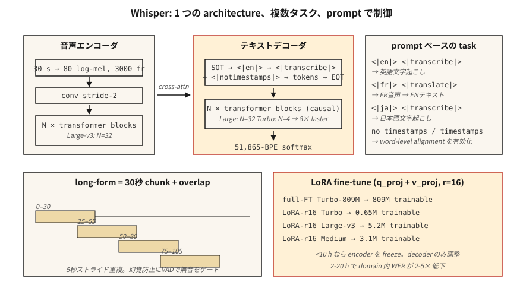

# Whisper——架构与微调

> Whisper 是一个 30 秒窗口的 Transformer 编码器-解码器，在 68 万小时的多语言弱监督音频-文本对上进行训练。单一架构、多任务、覆盖 99 种语言且鲁棒性强。2026 年的参考 ASR。

**类型：** 动手构建
**语言：** Python
**前置知识：** 阶段 6 · 04（ASR），阶段 5 · 10（注意力机制），阶段 7 · 05（完整 Transformer）
**时间：** ~75 分钟

## 问题

Whisper 由 OpenAI 于 2022 年 9 月发布，是第一个作为商品级产品推出的 ASR 模型：粘贴音频、获取文本、99 种语言、对噪声鲁棒、在笔记本上即可运行。到 2024 年，OpenAI 已发布 Large-v3 和 Turbo 变体；到 2026 年，Whisper 已成为从播客转录到语音助手再到 YouTube 字幕等一切任务的默认基线。

但 Whisper 不是一个可以永远当黑盒处理的流水线。领域迁移会使其失效——技术术语、说话者口音、专有名词、短片段、静默。你需要了解：

1. 它内部到底是什么。
2. 如何正确地输入分块、流式或长音频。
3. 何时以及如何微调。

## 概念



**架构。** 标准 Transformer 编码器-解码器。

- 输入：30 秒的对数 Mel 频谱图，80 个 Mel，10 ms 帧移 → 3000 帧。更短的片段补零，更长的片段分块。
- 编码器：卷积降采样（步长 2）+ `N` 个 Transformer 块。Large-v3：32 层，1280 维，20 头。
- 解码器：`N` 个 Transformer 块，包含因果自注意力和对编码器输出的交叉注意力。大小与编码器相同。
- 输出：51,865 个 token 词汇表上的 BPE token。

Large-v3 有 15.5 亿参数。Turbo 使用 4 层解码器（原为 32 层），延迟降低 8 倍，WER 损失不到 1%。

**提示格式。** Whisper 是一个多任务模型，通过解码器提示中的特殊 token 来引导：

```
<|startoftranscript|><|en|><|transcribe|><|notimestamps|> Hello world.<|endoftext|>
```

- `<|en|>`——语言标签；强制翻译 vs 转录行为。
- `<|transcribe|>` 或 `<|translate|>`——将任意语言输入翻译为英文输出，或逐字转录。
- `<|notimestamps|>`——跳过词级时间戳（更快）。

提示让一个模型能够执行多种任务。将 `<|en|>` 改为 `<|fr|>` 即可转录法语。

**30 秒窗口。** 所有内容都固定在 30 秒。更长的片段需要分块；更短的片段需要填充。窗口本身不支持流式——这就是 WhisperX、Whisper-Streaming 和 faster-whisper 存在的原因。

**对数 Mel 归一化。** `(log_mel - mean) / std`，其中统计量来自 Whisper 自己的训练语料。你*必须*使用 Whisper 的预处理（`whisper.audio.log_mel_spectrogram`），而不是 `librosa.feature.melspectrogram`。

### 2026 年的变体

| 变体 | 参数量 | 延迟（A100） | WER（LibriSpeech-clean） |
|---------|--------|----------------|------------------------|
| Tiny | 39M | 1 倍实时 | 5.4% |
| Base | 74M | 1 倍 | 4.1% |
| Small | 244M | 1 倍 | 3.0% |
| Medium | 769M | 1 倍 | 2.7% |
| Large-v3 | 1.55B | 2 倍 | 1.8% |
| Large-v3-turbo | 809M | 8 倍 | 1.58% |
| Whisper-Streaming (2024) | 1.55B | 流式 | 2.0% |

### 微调

2026 年的标准工作流程：

1. 收集 10–100 小时的目标领域音频，配对齐的转录文本。
2. 使用带 `generate_with_loss` 回调的 `transformers.Seq2SeqTrainer` 运行。
3. 参数高效微调：在注意力层的 `q_proj`、`k_proj`、`v_proj` 上使用 LoRA，GPU 内存减少 4 倍，WER 损失 <0.3。
4. 如果少于 10 小时数据，冻结编码器。仅微调解码器。
5. 使用 Whisper 自己的 tokenizer 和提示格式；绝不更换 tokenizer。

社区成果：在 20 小时医疗听写数据上微调 Medium，医学词汇上的 WER 从 12% 降至 4.5%。在 4 小时冰岛语数据上微调 Turbo，WER 从 18% 降至 6%。

## 动手实现

### 第 1 步：开箱即用 Whisper

```python
import whisper
model = whisper.load_model("large-v3-turbo")
result = model.transcribe(
    "clip.wav",
    language="en",
    task="transcribe",
    temperature=0.0,
    condition_on_previous_text=False,  # 防止失控重复
)
print(result["text"])
for seg in result["segments"]:
    print(f"[{seg['start']:.2f}–{seg['end']:.2f}] {seg['text']}")
```

你应该始终覆盖的关键默认值：`temperature=0.0`（采样默认使用 0.0 → 0.2 → 0.4 的回退链）、`condition_on_previous_text=False`（防止级联幻觉问题）和 `no_speech_threshold=0.6`（静默检测）。

### 第 2 步：长篇分块

```python
# whisperx 是 2026 年带词级时间戳的长篇转录参考方案
import whisperx
model = whisperx.load_model("large-v3-turbo", device="cuda", compute_type="float16")
segments = model.transcribe("1hour.mp3", batch_size=16, chunk_size=30)
```

WhisperX 新增了 (1) Silero VAD 门控、(2) 通过 wav2vec 2.0 的单词级对齐、(3) 通过 `pyannote.audio` 的说话人分离。2026 年生产级转录的主力工具。

### 第 3 步：使用 LoRA 微调

```python
from transformers import WhisperForConditionalGeneration, WhisperProcessor
from peft import LoraConfig, get_peft_model

model = WhisperForConditionalGeneration.from_pretrained("openai/whisper-large-v3-turbo")
lora = LoraConfig(
    r=16, lora_alpha=32, target_modules=["q_proj", "v_proj"],
    lora_dropout=0.1, bias="none", task_type="SEQ_2_SEQ_LM",
)
model = get_peft_model(model, lora)
# model.print_trainable_parameters()  -> ~3M 可训练 / 809M 总量
```

然后使用标准 Trainer 循环。每 1000 步检查一次。在验证集上用 WER 评估。

### 第 4 步：检查每层的学习内容

```python
# 在解码时获取交叉注意力权重，查看解码器关注什么
with torch.inference_mode():
    out = model.generate(
        input_features=features,
        return_dict_in_generate=True,
        output_attentions=True,
    )
# out.cross_attentions: layer × head × step × src_len
```

用热力图可视化——你会看到解码器步进扫描编码器帧时的对角线对齐。这条对角线就是 Whisper 的词时间戳概念。

## 使用建议

2026 年技术栈：

| 场景 | 选择 |
|-----------|------|
| 通用英语、离线 | 通过 `whisperx` 使用 Large-v3-turbo |
| 移动端 / 边缘设备 | Whisper-Tiny 量化版（int8）或 Moonshine |
| 多语言长篇 | 通过 `whisperx` + 说话人分离使用 Large-v3 |
| 低资源语言 | 使用 LoRA 微调 Medium 或 Turbo |
| 流式（2 秒延迟） | Whisper-Streaming 或 Parakeet-TDT |
| 词级时间戳 | WhisperX（通过 wav2vec 2.0 强制对齐） |

`faster-whisper`（CTranslate2 后端）是 2026 年最快的 CPU+GPU 推理运行时——比原版快 4 倍，输出完全相同。

## 2026 年仍然常见的陷阱

- **静默时产生幻觉文本。** Whisper 在字幕数据上训练，包含"Thanks for watching!"、"Subscribe!"、歌词。调用前务必使用 VAD 门控。
- **`condition_on_previous_text` 级联。** 一次幻觉会污染后续窗口。除非需要跨块流畅度，否则设置为 `False`。
- **短片段填充。** 2 秒片段填充到 30 秒可能在尾部静默处产生幻觉。使用 `pad=False` 或 VAD 门控。
- **错误的 Mel 统计量。** 使用 librosa 的 Mel 而非 Whisper 的 Mel 会产生接近随机的结果。使用 `whisper.audio.log_mel_spectrogram`。

## 交付物

保存为 `outputs/skill-whisper-tuner.md`。针对给定领域设计 Whisper 微调或推理流水线。

## 练习

1. **简单。** 运行 `code/main.py`。它 tokenize 一个 Whisper 风格的提示，计算解码后的形状预算，并打印 10 分钟片段的分块调度。
2. **中等。** 安装 `faster-whisper`，转录一段 10 分钟的播客，与人工转录稿比较 WER。尝试 `language="auto"` 与强制 `language="en"` 的对比。
3. **困难。** 使用 HF `datasets`，选择一个 Whisper 处理不佳的语言（如乌尔都语），用 LoRA 在 2 小时数据上微调 Medium 两个 epoch，并报告 WER 差值。

## 关键词汇

| 术语 | 通常说法 | 实际含义 |
|------|-----------------|-----------------------|
| 30 秒窗口 | Whisper 的限制 | 硬输入上限；更长的音频需要分块。 |
| SOT | 转录开始 | `<|startoftranscript|>` 启动解码器提示。 |
| Timestamps token | 时间对齐 | 每 0.02 秒偏移在 51k 词汇表中是一个特殊 token。 |
| Turbo | 快速变体 | 4 层解码器，8 倍速度，<1% WER 退化。 |
| WhisperX | 长篇封装 | VAD + Whisper + wav2vec 对齐 + 说话人分离。 |
| LoRA fine-tune | 高效微调 | 为注意力添加低秩适配器；训练约 0.3% 的参数。 |
| Hallucination | 静默失败 | Whisper 从噪声/静默中产生流利英语。 |

## 延伸阅读

- [Radford et al. (2022). Whisper paper](https://arxiv.org/abs/2212.04356)——原始架构和训练方案。
- [OpenAI (2024). Whisper Large-v3-turbo release](https://github.com/openai/whisper/discussions/2363)——4 层解码器，8 倍加速。
- [Bain et al. (2023). WhisperX](https://arxiv.org/abs/2303.00747)——长篇、词级对齐、说话人分离。
- [Systran——faster-whisper repo](https://github.com/SYSTRAN/faster-whisper)——CTranslate2 后端，4 倍加速。
- [HuggingFace——Whisper fine-tune tutorial](https://huggingface.co/blog/fine-tune-whisper)——标准的 LoRA / 全量微调教程。
