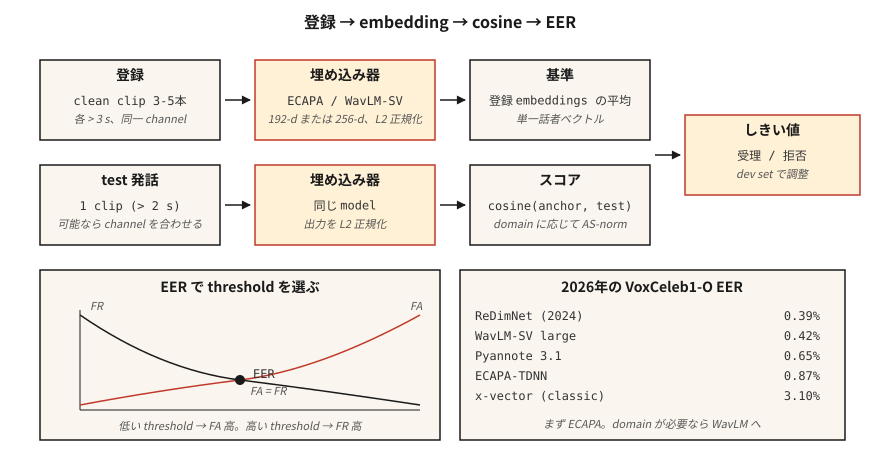

# Konuşmacı Tanıma ve Doğrulama

> ASR "Ne dediler?" diye sorar. Konuşmacı tanıma "Bunu kim söyledi?" diye sorar. Matematik aynı görünüyor - embedding artı kosinüs - ancak her üretim kararı tek bir EER numarasına bağlı.

**Tür:** Yapım
**Diller:** Python
**Önkoşullar:** Aşama 6 · 02 (Spektrogramlar ve Mel), Aşama 5 · 22 (Embedding Modelleri)
**Süre:** ~45 dakika

## Sorun

Bir kullanıcı bir parola söylüyor. Şunu bilmek istiyorsunuz: iddia ettikleri kişi bu mu (*doğrulama*, 1:1) yoksa kayıt bankanızdaki ilk kişi mi (*kimlik*, 1:N)? Veya ikisi de — bu bilinmeyen bir konuşmacı mı (*açık set*)?

2018 öncesi: GMM-UBM + i-vektörler. Makul EER ancak kanal değişimi (telefon vs dizüstü bilgisayar) ve duygu açısından hassastır. 2018–2022: x-vektörler (açısal kenar boşluğuyla eğitilmiş TDNN omurgası). 2022+: ECAPA-TDNN ve WavLM-büyük embedding'ler. 2026 yılına gelindiğinde bu alanda üç model ve bir ölçüm hakim olacak.

Ölçü **EER** — Eşit Hata Oranıdır. Karar eşiğinizi Yanlış Kabul Oranı = Yanlış Reddetme Oranı olacak şekilde ayarlayın. Geçiş EER'dir. Her makalede, her skor tablosunda, her satın alma çağrısında kullanılır.

## Konsept



**Boru hattı.** Kayıt: hedef konuşmacının 5-30 saniyesini kaydedin; sabit boyutlu bir embedding (ECAPA-TDNN için 192-d, WavLM-large için 256-d) hesaplayın. Doğrulama: embedding test ifadesini alın; kosinüs benzerliğini hesaplayın; bir eşikle karşılaştırın.

**ECAPA-TDNN (2020, 2026'da hala baskın).** Vurgulanan Kanal Dikkati, Yayılma ve Toplama - Zaman Gecikmesi Neural Network. Sıkıştırma-uyarma, çok kafalı dikkat havuzu ve ardından 192-d'ye kadar doğrusal bir katman içeren 1D dönüşüm blokları. Additive Angular Margin kaybı (AAM-softmax) ile VoxCeleb 1+2 (2.700 hoparlör, 1,1 milyon ifade) eğitimi aldı.

**WavLM-SV (2022+).** AAM kaybıyla önceden eğitilmiş WavLM büyük SSL omurgasına ince ayar yapın. Daha yüksek kalite ancak daha yavaş — 300+ MB ve 15 MB.

**x-vektörü (taban çizgisi).** TDNN + istatistik havuzu. Klasik; CPU/edge'de hala kullanışlıdır.

**AAM-softmax.** Açısal alanda ilave marj `m` ile standart softmax: Doğru sınıf için `cos(θ + m)`. Sınıflar arası açısal ayrımı zorlar. Tipik `m=0.2`, ölçek `s=30`.

### Puanlama

- Kayıt ve test embedding'ler arasındaki **kosinüs**. Eşik bazlı karar.
- **PLDA (Olasılıksal LDA).** embedding'leri aynı konuşmacının farklı konuşmacıya karşı kapalı form olasılık oranına sahip olduğu gizli bir alana projelendirin. +%10–20 EER azaltımı için kosinüsün üstüne eklenir. Standart 2020 öncesi; artık yalnızca kapalı set kurulumlarında kullanılıyor.
- **Puan normalleştirme.** `S-norm` veya `AS-norm`: her puanı bir grup sahte ortalama ve standarta göre normalleştirin. Alanlar arası değerlendirme için gereklidir.

### Bilmeniz gereken sayılar (2026)

| Modeli | VoxCeleb1-O EER | Parametreler | Verim (A100) |
|-------|-----------------|--------|-------------------|
| x-vektörü (klasik) | %3,10 | 5 milyon | 400×RT |
| ECAPA-TDNN | %0,87 | 15M | 200×RT |
| WavLM-SV büyük | %0,42 | 316 milyon | 20×RT |
| Pyannote 3.1 segmentasyonu + embedding | %0,65 | 6 milyon | 100×RT |
| ReDimNet (2024) | %0,39 | 24 milyon | 100×RT |

### Günlükleştirme

Çok hoparlörlü bir klipte "Kim ne zaman konuştu". İşlem hattı: VAD → bölüm → her bölümü yerleştir → küme (toplayıcı veya spektral) → düzgün sınırlar. Modern yığın: `pyannote.audio` 3.1, hoparlör segmentasyonunu + embedding + kümelemeyi tek bir çağrının arkasında birleştirir. AMI'de 2026 SOTA DER ~%15'tir (2022'deki %23'ten düşüş).

## İnşa Et

### Adım 1: MFCC istatistiklerinden embedding oyuncak

```python
def embed_mfcc_stats(signal, sr):
    frames = featurize_mfcc(signal, sr, n_mfcc=13)
    mean = [sum(f[i] for f in frames) / len(frames) for i in range(13)]
    std = [
        math.sqrt(sum((f[i] - mean[i]) ** 2 for f in frames) / len(frames))
        for i in range(13)
    ]
    return mean + std  # 26-d
```

Bir mil kadar SOTA değil - yalnızca öğretim için. `code/main.py` bunu sentetik hoparlör verilerine ilişkin bir kavram kanıtı olarak kullanır.

### Adım 2: kosinüs benzerliği + eşik

```python
def cosine(a, b):
    dot = sum(x * y for x, y in zip(a, b))
    na = math.sqrt(sum(x * x for x in a))
    nb = math.sqrt(sum(x * x for x in b))
    return dot / (na * nb) if na and nb else 0.0

def verify(enroll, test, threshold=0.75):
    return cosine(enroll, test) >= threshold
```

### Adım 3: Benzerlik çiftlerinden EER

```python
def eer(same_scores, diff_scores):
    thresholds = sorted(set(same_scores + diff_scores))
    best = (1.0, 1.0, 0.0)  # (fa, fr, threshold)
    for t in thresholds:
        fr = sum(1 for s in same_scores if s < t) / len(same_scores)
        fa = sum(1 for s in diff_scores if s >= t) / len(diff_scores)
        if abs(fa - fr) < abs(best[0] - best[1]):
            best = (fa, fr, t)
    return (best[0] + best[1]) / 2, best[2]
```

Döndürür (eer, eşik_at_eer). Her ikisini de bildirin.

### Adım 4: SpeechBrain ile üretim

```python
from speechbrain.pretrained import EncoderClassifier

clf = EncoderClassifier.from_hparams(source="speechbrain/spkrec-ecapa-voxceleb")

# enroll: average the embeddings of 3-5 clean samples
enroll = torch.stack([clf.encode_batch(load(x)) for x in enrollment_clips]).mean(0)
# verify
score = clf.similarity(enroll, clf.encode_batch(load("test.wav"))).item()
verdict = score > 0.25   # ECAPA typical threshold; tune on your data
```

### Adım 5: pyannote ile günlük tutun

```python
from pyannote.audio import Pipeline

pipe = Pipeline.from_pretrained("pyannote/speaker-diarization-3.1")
diarization = pipe("meeting.wav", num_speakers=None)
for turn, _, speaker in diarization.itertracks(yield_label=True):
    print(f"{turn.start:.1f}–{turn.end:.1f}  {speaker}")
```

## Kullan onu

2026 yığını:

| Durum | Seç |
|-----------|------|
| Kapalı set 1:1 doğrulama, kenar | ECAPA-TDNN + kosinüs eşiği |
| Açık küme doğrulaması, bulut | WavLM-SV + AS normu |
| Günlük tutma (toplantılar, podcast'ler) | `pyannote/speaker-diarization-3.1` |
| Sahteciliği önleme (tekrar oynatma / derin sahte algılama) | AASIST veya RawNet2 |
| Küçük gömülü (KWS + kayıt) | Titanet-Küçük (NeMo) |

## Tuzaklar

- **Kanal uyumsuzluğu.** VoxCeleb (web videosu) ≠ telefon görüşmesi sesi üzerinde eğitilen model. Her zaman hedef kanalda değerlendirme yapın.
- **Kısa ifadeler.** EER, test sesinin 3 saniyesinin altında keskin bir şekilde düşer.
- **Gürültülü kayıt.** Gürültülü bir kayıt haber sunucusunu zehirler. ≥3 temiz numune ve ortalama kullanın.
- **Koşullar genelinde sabit eşik.** Eşiği her zaman hedef etki alanından uzatılmış bir geliştirici setine göre ayarlayın.
- **Normalleştirilmemiş embedding'lerde kosinüs.** Önce L2-normalleştirme; aksi halde büyüklük hakimdir.

## Gönderin

`outputs/skill-speaker-verifier.md` olarak kaydedin. Seçim modeli, kayıt protokolü, eşik ayarlama planı ve dolandırıcılık önlemleri.

## Egzersizler

1. **Kolay.** `code/main.py`'yi çalıştırın. Sentetik "hoparlörler" (farklı ton profilleri) oluşturur, kaydolur, 100 çiftlik bir deneme listesine EER'yi hesaplar.
2. **Orta.** 30 VoxCeleb1 konuşmasında SpeechBrain ECAPA'yı kullanın (her biri 5 hoparlör × 6). EER'yi kosinüs ve PLDA ile hesaplayın.
3. **Zor.** `pyannote.audio` ile tam kaydı oluşturun → günlük tutun → işlem hattını doğrulayın. AMI geliştirme setinde DER'yi değerlendirin.

## Anahtar Terimler

| Dönem | İnsanlar ne diyor | Aslında ne anlama geliyor |
|------|-----------------|-----------------------|
| EER | Başlık metriği | Yanlış Kabul = Yanlış Reddetme eşiği. |
| Doğrulama | 1:1 | "Bu Alice mi?" |
| Kimlik | 1:K | "Kim konuşuyor?" |
| Açık set | Bilinmeyen mümkün | Test seti kayıtlı olmayan konuşmacılar içerebilir. |
| Kayıt | Kaydediliyor | Bir konuşmacının referansı embedding hesaplanıyor. |
| AAM-softmax | Kayıp | İlave açısal kenar boşluğuna sahip Softmax; küme ayrılmasını zorlar. |
| PLDA | Klasik puanlama | Olasılıksal LDA; embedding'lerin üstünde olasılık oranı puanlaması. |
| DER | Günlükleştirme metriği | Günlükleştirme Hata Oranı — kaçırılan + yanlış alarm + karışıklık. |

## Daha Fazla Okuma

- [Snyder ve ark. (2018). X-Vectors: Konuşmacı Tanıma için Sağlam DNN Embedding'ler](https://www.danielpovey.com/files/2018_icassp_xvectors.pdf) — klasik derin embedding kağıdı.
- [Desplanques ve diğerleri. (2020). ECAPA-TDNN](https://arxiv.org/abs/2005.07143) — 2020–2026'nın baskın mimarisi.
- [Chen ve ark. (2022). WavLM: Tam Yığın Konuşma İşleme için Büyük Ölçekli Kendi Kendini Denetleyen Ön Eğitim](https://arxiv.org/abs/2110.13900) — SV ve günlük oluşturma için SSL omurgası.
- [Bredin ve ark. (2023). pyannote.audio 3.1](https://github.com/pyannote/pyannote-audio) — üretim günlüğü + embedding yığını.
- [VoxCeleb sıralama tablosu (2026'da güncellendi)](https://www.robots.ox.ac.uk/~vgg/data/voxceleb/) — modeller genelinde mevcut EER sıralamaları.
