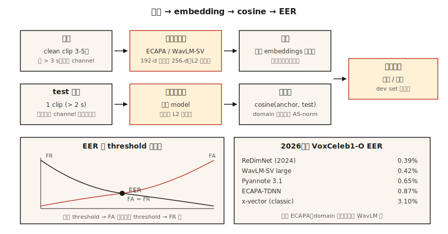

# 说话者识别与验证

> ASB问“他们说了什么？“说话者识别问“谁说的？“数学看起来是一样的--嵌入加cos--但每个生产决策都取决于一个EER数。

** 类型：** 构建
** 语言：** Python
** 先决条件：** 阶段6 · 02（光谱图和梅尔）、阶段5 · 22（嵌入模型）
** 时间：** ~45分钟

## 问题

用户说出密码短语。您想知道：这是他们声称的人（* 验证 *，1：1），还是您注册银行中的第一个人（* 身份 *，1：N）？或者两者都不是-这是一个未知的扬声器（*open-set*）吗？

2018年之前：GMM-UBM + i-vector。合理的EER，但对渠道转变（手机与笔记本电脑）和情绪脆弱。2018-2022：x-vector（用角裕度训练的TDNN主干网）。2022+：ECAPA-TDNN和WavLM大型嵌入。到2026年，该领域将由三种模型和一种指标主导。

指标是 **EER** -等错误率。将您的决策阈值设置为“假接受率”=“假接受率”。交叉是EER。适用于每份报纸、每份排行榜、每次采购电话。

## 概念



** 管道。**注册：记录目标说话者的5-30秒;计算固定维嵌入（ECAPA-TDNN为192-d，WavLM-large为256-d）。验证：获取测试话语嵌入;计算cos相似度;与阈值进行比较。

**ECAPA-TDNN（2020年，2026年仍占主导地位）。**强调渠道注意力、传播和聚集-延时神经网络。具有挤压激励、多头注意力集中的1D conv块，然后是线性层至192-d。接受过VoxCeleb 1+2（2，700名发言者，110万次话语）培训，具有相加角裕度损失（AAM-softmax）。

**WavLM-SV（2022+）。**对预训练的WavLM大型SSL主干网进行微调，并出现AAM丢失。质量更高但速度更慢- 300+ MB vs 15 MB。

** x-载体（基线）。** TDNN +统计数据池。经典;在中央处理器/边缘仍然有用。

**AAM-softmax。**标准softmax，在角空间中添加了余量“m”：“cos（θ + m）”用于正确的类别。强制类之间的角度分离。典型的“m=0.2”，规模“s=30”。

### 评分

- 注册和测试嵌入之间的 ** cos *。基于利益的决定。
- **PLDA（概率LDA）。**项目嵌入到潜在空间中，同一说话者与不同说话者具有封闭形式的似然比。添加到cos之上，EER降低+10-20%。标准2020年之前;现在仅在封闭设置中使用。
- ** 分数正常化。**“S-norm”或“AS-norm”：对照一组冒名顶替者平均值和stds对每个分数进行标准化。对于跨域评估至关重要。

### 你应该知道的数字（2026）

| 模型 | VoxCeleb 1-O EER | Params | 产量（A100） |
|-------|-----------------|--------|-------------------|
| x-vector（经典） | 3.10% | 5 M | 400 x RT |
| ECAPA-TDNN | 0.87% | 15米 | 200 x RT |
| WavLM-SV大 | 0.42% | 316 M | 20倍RT |
| Pyannote 3.1分段+嵌入 | 0.65% | 6 M | 100 x RT |
| ReDimNet（2024） | 0.39% | 24 M | 100 x RT |

### Diarization

多扬声器剪辑中的“谁在何时说话”。流水线：VAR →片段→嵌入每个片段→集群（聚集或光谱）→平滑边界。现代堆栈：' pyannote.audio ' 3.1，将扬声器分割+嵌入+集群捆绑在一个呼叫后面。2026年AMI的SOTA BER约为15%（低于2022年的23%）。

## 建设党

### 第1步：根据MFCC统计数据嵌入玩具

```python
def embed_mfcc_stats(signal, sr):
    frames = featurize_mfcc(signal, sr, n_mfcc=13)
    mean = [sum(f[i] for f in frames) / len(frames) for i in range(13)]
    std = [
        math.sqrt(sum((f[i] - mean[i]) ** 2 for f in frames) / len(frames))
        for i in range(13)
    ]
    return mean + std  # 26-d
```

不是SOTA一英里-只用于教学。“code/main.py”将其用作合成扬声器数据的概念验证。

### 第2步：cos相似度+阈值

```python
def cosine(a, b):
    dot = sum(x * y for x, y in zip(a, b))
    na = math.sqrt(sum(x * x for x in a))
    nb = math.sqrt(sum(x * x for x in b))
    return dot / (na * nb) if na and nb else 0.0

def verify(enroll, test, threshold=0.75):
    return cosine(enroll, test) >= threshold
```

### 第3步：来自相似性对的EER

```python
def eer(same_scores, diff_scores):
    thresholds = sorted(set(same_scores + diff_scores))
    best = (1.0, 1.0, 0.0)  # (fa, fr, threshold)
    for t in thresholds:
        fr = sum(1 for s in same_scores if s < t) / len(same_scores)
        fa = sum(1 for s in diff_scores if s >= t) / len(diff_scores)
        if abs(fa - fr) < abs(best[0] - best[1]):
            best = (fa, fr, t)
    return (best[0] + best[1]) / 2, best[2]
```

返回（eer，threshold_at_eer）。两者都报告。

### 第4步：使用SpeechBrain制作

```python
from speechbrain.pretrained import EncoderClassifier

clf = EncoderClassifier.from_hparams(source="speechbrain/spkrec-ecapa-voxceleb")

# enroll: average the embeddings of 3-5 clean samples
enroll = torch.stack([clf.encode_batch(load(x)) for x in enrollment_clips]).mean(0)
# verify
score = clf.similarity(enroll, clf.encode_batch(load("test.wav"))).item()
verdict = score > 0.25   # ECAPA typical threshold; tune on your data
```

### 第5步：用pyannote写日记

```python
from pyannote.audio import Pipeline

pipe = Pipeline.from_pretrained("pyannote/speaker-diarization-3.1")
diarization = pipe("meeting.wav", num_speakers=None)
for turn, _, speaker in diarization.itertracks(yield_label=True):
    print(f"{turn.start:.1f}–{turn.end:.1f}  {speaker}")
```

## 使用它

2026年堆栈：

| 情况 | 接 |
|-----------|------|
| 封闭集1：1验证，边缘 | ECAPA-TDNN + cos阈值 |
| 开放集验证，云 | WavLM-SV + AS-norm |
| 日记化（会议、播客） | ' pyannote/speer-dialification-3.1 ' |
| 反欺骗（重播/ Deepfake检测） | AASIST或RawNet 2 |
| 微型嵌入式（KWS +注册） | Titanet-Small（NeMo） |

## 陷阱

- ** 频道不匹配。**在VoxCeleb（网络视频）上训练的模型语音通话音频。始终在目标频道上进行评估。
- ** 简短的话语。** EER在测试音频的3秒以下急剧下降。
- ** 报名有噪音。**一声喧闹的报名毒害了主播。使用至少3个清洁样本并平均值。
- ** 跨条件固定阈值。**始终调整来自目标域的已退出开发集的阈值。
- ** 非规范化嵌入上的Cosine。** L2-首先正常化;否则幅度占主导地位。

## 把它运

另存为“输出/skill-speaker-verifier.md”。挑选模型、注册协议、阈值调整计划和欺诈保障措施。

## 演习

1. ** 简单。**运行'代码/main.py '。构建合成“扬声器”（不同的音调配置文件）、注册、在100对试用列表上计算EER。
2. ** 中等。**对30个VoxCeleb 1话语使用SpeechBrain EAPA（5个说话者x每个6个）。用cos与PLDA计算EER。
3. ** 很难。**使用`pyannote.audio`构建完整的注册→日志化→验证管道。评估AMI开发集上的DER。

## 关键术语

| Term | 别人怎么说 | 它实际上意味着什么 |
|------|-----------------|-----------------------|
| EER | 标题指标 | 阈值，其中假接受=假拒绝。 |
| 验证 | 1：1 | “这是爱丽丝吗？" |
| 识别 | 1：N | “谁在说话？" |
| 开集 | 未知的可能性 | 测试集可以包含未注册的发言者。 |
| 招生 | 注册 | 计算说话者的参考嵌入。 |
| AAM-softmax | 损失 | Softmax具有附加角裕度;强制集群分离。 |
| PLDA | 经典评分 | 概率LDA;嵌入之上的似然比评分。 |
| DER | Diarization度量 | 日志错误率-未命中+误报+混淆。 |

## 进一步阅读

- [斯奈德等人（2018）。X-载体：用于说话者识别的稳健DNN嵌入]（https：//www.Danielpovey.com/files/2018_icassp_xvectors.pdf）-经典深度嵌入论文。
- [Desplanques等人（2020）。ECAPA-TDNN]（https：//arxiv.org/abs/2005.07143）-主导架构2020-2026。
- [Chen等人（2022）。WavLM：全栈语音处理的大规模自我监督预训练]（https：//arxiv.org/ab/2110.13900）-SV和dialized的SSL主干网。
- [Bredin等人（2023）。pyannote.audio 3.1]（https：//github.com/pyannote/pyannote-audio）-生产日记化+嵌入堆栈。
- [VoxCeleb排行榜（2026年更新）]（https：//www.robots.ox.ac.uk/voxvgg/data/voxceleb/）-当前各型号的EER排名。
