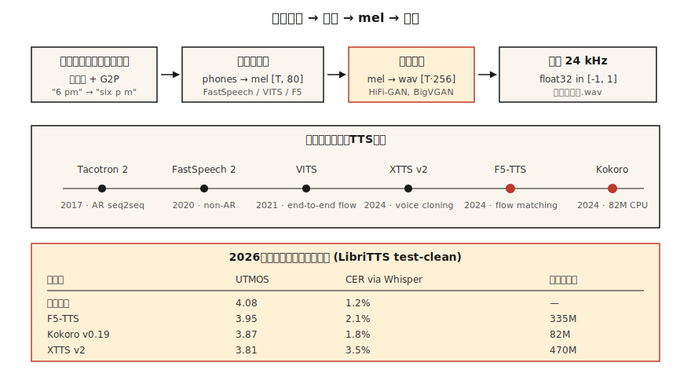

# Text-to-Speech (TTS) - Tacotron から F5 と Kokoro まで

> ASR は音声をテキストに戻します。TTS はテキストを音声に戻します。2026 年のスタックは 3 部構成です。text → tokens、tokens → mel、mel → waveform。それぞれに、ノート PC に収まるデフォルトモデルがあります。

**種類:** Build
**言語:** Python
**前提:** Phase 6 · 02 (Spectrograms & Mel), Phase 5 · 09 (Seq2Seq), Phase 7 · 05 (Full Transformer)
**時間:** 約 75 分

## 問題

文字列があります: "Please remind me to water the plants at 6 pm." 必要なのは、自然に聞こえ、正しい prosody (休止、強勢) を持ち、"plants" を正しい母音で発音し、live voice assistant のために CPU 上で 300 ms 未満で動く 3 秒の音声クリップです。さらに voice を差し替え、code-switched input ("remind me at 6 pm, daijoubu?") を扱い、名前の発音で失敗しない必要があります。

現代の TTS pipelines は次のような構成です。

1. **Text frontend。** テキストを正規化し (dates, numbers, emails)、phonemes または subword tokens に変換し、prosody features を予測します。
2. **Acoustic model。** Text → mel spectrogram。Tacotron 2 (2017)、FastSpeech 2 (2020)、VITS (2021)、F5-TTS (2024)、Kokoro (2024)。
3. **Vocoder。** Mel → waveform。WaveNet (2016)、WaveRNN、HiFi-GAN (2020)、BigVGAN (2022)、2024 年以降の neural codec vocoders。

2026 年には、end-to-end diffusion と flow-matching models によって acoustic + vocoder の境界は曖昧になっています。それでも、デバッグのための 3 部構成という mental model は有効です。

## コンセプト



**Tacotron 2 (2017)。** Seq2seq: char-embedding → BiLSTM encoder → location-sensitive attention → autoregressive LSTM decoder が mel frames を出力します。遅く (AR)、長文で不安定です。今でも baseline として引用されます。

**FastSpeech 2 (2020)。** Non-autoregressive。Duration predictor が各 phoneme に割り当てる mel frames 数を出力します。1-pass で、Tacotron より 10 倍高速です。自然さはやや落ちます (monotonic alignment) が、広く本番利用されています。

**VITS (2021)。** encoder + flow-based duration + HiFi-GAN vocoder を variational inference で end-to-end に同時学習します。高品質な単一モデルです。2022-2024 年の open-source TTS を支配しました。派生には YourTTS (multi-speaker zero-shot)、XTTS v2 (2024, Coqui) があります。

**F5-TTS (2024)。** flow matching 上の diffusion transformer。自然な prosody と、5 秒の reference audio による zero-shot voice cloning が特徴です。2026 年の open-source TTS leaderboard 上位です。335M params。

**Kokoro (2024)。** 小型 (82M)、CPU 実行可能、real-time 用 English TTS として最高クラスです。Closed-vocabulary English-only、apache-2.0。

**OpenAI TTS-1-HD、ElevenLabs v2.5、Google Chirp-3。** 商用の最先端です。ElevenLabs v2.5 の emotion tags ("[whispered]", "[laughing]") と character voices は、2026 年の audiobook production を支配しています。

### Vocoder の進化

| Era | Vocoder | Latency | Quality |
|-----|---------|---------|---------|
| 2016 | WaveNet | offline only | SOTA at release |
| 2018 | WaveRNN | ~realtime | good |
| 2020 | HiFi-GAN | 100× realtime | near-human |
| 2022 | BigVGAN | 50× realtime | generalizes across speakers/langs |
| 2024 | SNAC, DAC (neural codecs) | integrated with AR models | discrete tokens, bit-efficient |

2026 年には、ほとんどの "TTS" モデルが text から waveform まで end-to-end です。mel spectrogram は内部表現になっています。

### 評価

- **MOS (Mean Opinion Score)。** 1-5 の尺度で、crowd-sourced です。今でも gold standard ですが、とても時間がかかります。
- **CMOS (Comparative MOS)。** A-vs-B preference。annotation あたりの confidence intervals が狭くなります。
- **UTMOS, DNSMOS。** Reference-free neural MOS predictors。leaderboards で使われます。
- **CER (Character Error Rate) via ASR。** TTS output を Whisper に通し、input text に対する CER を計算します。intelligibility の proxy です。
- **SECS (Speaker Embedding Cosine Similarity)。** Voice-cloning quality の指標です。

LibriTTS test-clean における 2026 年の数値:

| Model | UTMOS | CER (via Whisper) | Size |
|-------|-------|-------------------|------|
| Ground truth | 4.08 | 1.2% | - |
| F5-TTS | 3.95 | 2.1% | 335M |
| XTTS v2 | 3.81 | 3.5% | 470M |
| VITS | 3.62 | 3.1% | 25M |
| Kokoro v0.19 | 3.87 | 1.8% | 82M |
| Parler-TTS Large | 3.76 | 2.8% | 2.3B |

## 作ってみる

### Step 1: 入力を phonemize する

```python
from phonemizer import phonemize
ph = phonemize("Hello world", language="en-us", backend="espeak")
# 'həloʊ wɜːld'
```

phonemes は普遍的な橋渡しです。VITS レベル未満の品質のものに raw text を直接入れるのは避けてください。

### Step 2: Kokoro を実行する (2026 年の CPU デフォルト)

```python
from kokoro import KPipeline
tts = KPipeline(lang_code="a")  # "a" = American English
audio, sr = tts("Please remind me to water the plants at 6 pm.", voice="af_bella")
# audio: float32 tensor, sr=24000
```

offline で動き、単一ファイル、82M params です。

### Step 3: voice cloning 付きで F5-TTS を実行する

```python
from f5_tts.api import F5TTS
tts = F5TTS()
wav = tts.infer(
    ref_file="my_voice_5s.wav",
    ref_text="The quick brown fox jumps over the lazy dog.",
    gen_text="Please remind me to water the plants.",
)
```

5 秒の reference clip とその transcript を渡します。F5 は prosody と timbre を clone します。

### Step 4: HiFi-GAN vocoder を scratch から作る

tutorial script に収めるには大きすぎますが、形は次の通りです。

```python
class HiFiGAN(nn.Module):
    def __init__(self, mel_channels=80, upsample_rates=[8, 8, 2, 2]):
        super().__init__()
        # 4 upsample blocks, total 256x to go from mel-rate to audio-rate
        ...
    def forward(self, mel):
        return self.blocks(mel)  # -> waveform
```

学習は adversarial (短い windows 上の discriminator) + mel-spectrogram reconstruction loss + feature-matching loss です。これはすでにコモディティ化しているので、`hifi-gan` repo や nvidia-NeMo の pretrained checkpoints を使ってください。

### Step 5: 完全な pipeline (pseudocode)

```python
text = "Please remind me at 6 pm."
phones = phonemize(text)
mel = acoustic_model(phones, speaker=alice)      # [T, 80]
wav = vocoder(mel)                                # [T * 256]
soundfile.write("out.wav", wav, 24000)
```

## 使いどころ

2026 年のスタック:

| Situation | Pick |
|-----------|------|
| Real-time English voice assistant | Kokoro (CPU) or XTTS v2 (GPU) |
| Voice cloning from 5 s reference | F5-TTS |
| Commercial character voices | ElevenLabs v2.5 |
| Audiobook narration | ElevenLabs v2.5 or XTTS v2 + fine-tune |
| Low-resource language | Train VITS on 5-20 h target-lang data |
| Expressive / emotion tags | ElevenLabs v2.5 or StyleTTS 2 fine-tune |

2026 年時点の open-source leader は、**品質なら F5-TTS、効率なら Kokoro** です。Tacotron を選ぶのは、歴史研究をしている場合だけで十分です。

## 落とし穴

- **Text normalizer がない。** "Dr. Smith" は "Doctor" か "Drive" か？ "2026" は "twenty twenty six" か "two zero two six" か？ phonemizer の前に正規化してください。
- **OOV proper nouns。** "Ghumare" → "ghyu-mair" になるかもしれません。unknown tokens 用に fallback grapheme-to-phoneme model を出荷してください。
- **Clipping。** Vocoder output はめったに clip しませんが、inference 時の mel scaling mismatch があると ±1.0 を超えることがあります。必ず `np.clip(wav, -1, 1)` します。
- **Sample-rate mismatch。** Kokoro は 24 kHz を出力します。下流 pipeline が 16 kHz を期待するなら、resample してください。しないと aliasing が起きます。

## 提出物

`outputs/skill-tts-designer.md` として保存してください。指定された voice、latency、language target に対する TTS pipeline を設計します。

## 演習

1. **Easy.** `code/main.py` を実行してください。toy vocab から phoneme dictionary を作り、phoneme ごとの duration を見積もり、偽の "mel" schedule を出力します。
2. **Medium.** Kokoro をインストールし、同じ文を voice `af_bella` と `am_adam` で合成してください。audio durations と主観品質を比較します。
3. **Hard.** 自分の 5 秒の reference clip を録音してください。F5-TTS で clone します。reference と cloned output の SECS を報告してください。

## 重要用語

| Term | よく言われる意味 | 実際の意味 |
|------|-----------------|------------|
| Phoneme | 音の単位 | 抽象的な音クラス。English では 39 個 (ARPABet)。 |
| Duration predictor | 各 phoneme の長さ | Non-AR model output。phoneme あたりの integer frames。 |
| Vocoder | Mel → waveform | mel-spec から raw samples へ写像する neural net。 |
| HiFi-GAN | 標準 vocoder | GAN-based。2020-2024 年に主流。 |
| MOS | 主観品質 | human raters による 1-5 の mean opinion score。 |
| SECS | Voice-clone metric | target と output の speaker embedding 間 cosine similarity。 |
| F5-TTS | 2024 open-source SOTA | Flow-matching diffusion。zero-shot cloning。 |
| Kokoro | CPU English leader | 82M-param model、Apache 2.0。 |

## 参考資料

- [Shen et al. (2017). Tacotron 2](https://arxiv.org/abs/1712.05884) - seq2seq baseline。
- [Kim, Kong, Son (2021). VITS](https://arxiv.org/abs/2106.06103) - end-to-end flow-based。
- [Chen et al. (2024). F5-TTS](https://arxiv.org/abs/2410.06885) - 現在の open-source SOTA。
- [Kong, Kim, Bae (2020). HiFi-GAN](https://arxiv.org/abs/2010.05646) - 2026 年も出荷される vocoder。
- [Kokoro-82M on HuggingFace](https://huggingface.co/hexgrad/Kokoro-82M) - 2024 年の CPU-friendly English TTS。
